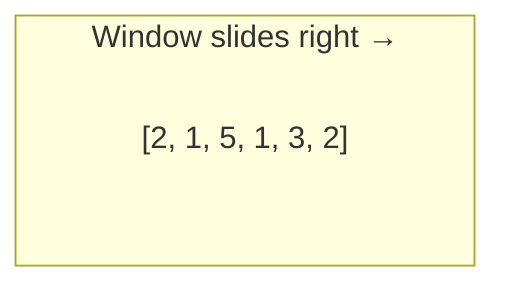

# Sliding Window

The sliding window pattern replaces brute-force nested loops with a single pass by maintaining a "window" over a contiguous portion of the input. If brute force checks all O(n²) subarrays, sliding window does it in O(n).

## Core Intuition

Imagine looking at an array through a window that can slide, expand, and contract. Instead of recomputing everything from scratch when the window moves, you **incrementally update** — add the new element entering the window and remove the element leaving it.



**Two types of sliding window:**

| Type | Window Size | When to Use |
|---|---|---|
| Fixed-size | Constant K | "Subarray of size K with max sum" |
| Variable-size | Grows/shrinks | "Smallest subarray with sum ≥ target" |

## When to Use Sliding Window

**Identification signals:**
- "Contiguous subarray" or "contiguous substring"
- "Maximum/minimum sum of size K"
- "Longest/shortest substring with condition"
- "At most K distinct" or "exactly K distinct"
- Input is linear (array/string), not a tree or graph

**NOT sliding window when:**
- Elements don't need to be contiguous (→ subsequence / DP)
- Order doesn't matter (→ sorting / hash set)
- The condition can't be maintained incrementally

> **Key question:** Can I express the problem as "find a contiguous segment that satisfies some property"? If yes, think sliding window.

## Fixed-Size Window Template

For problems like "maximum sum subarray of size K":

1. Build the first window of size K
2. Slide: add the right element, remove the left element
3. Track your answer at each step

```cpp
int maxSumSubarray(vector<int>& nums, int k) {
    int windowSum = 0;
    for (int i = 0; i < k; i++) {
        windowSum += nums[i];
    }
    int maxSum = windowSum;
    for (int i = k; i < nums.size(); i++) {
        windowSum += nums[i] - nums[i - k];
        maxSum = max(maxSum, windowSum);
    }
    return maxSum;
}
```

```java
int maxSumSubarray(int[] nums, int k) {
    int windowSum = 0;
    for (int i = 0; i < k; i++) {
        windowSum += nums[i];
    }
    int maxSum = windowSum;
    for (int i = k; i < nums.length; i++) {
        windowSum += nums[i] - nums[i - k];
        maxSum = Math.max(maxSum, windowSum);
    }
    return maxSum;
}
```

```typescript
function maxSumSubarray(nums: number[], k: number): number {
    let windowSum = 0;
    for (let i = 0; i < k; i++) windowSum += nums[i];
    let maxSum = windowSum;
    for (let i = k; i < nums.length; i++) {
        windowSum += nums[i] - nums[i - k];
        maxSum = Math.max(maxSum, windowSum);
    }
    return maxSum;
}
```

```python
def max_sum_subarray(nums: list[int], k: int) -> int:
    window_sum = sum(nums[:k])
    max_sum = window_sum
    for i in range(k, len(nums)):
        window_sum += nums[i] - nums[i - k]
        max_sum = max(max_sum, window_sum)
    return max_sum
```

```go
func maxSumSubarray(nums []int, k int) int {
    windowSum := 0
    for i := 0; i < k; i++ {
        windowSum += nums[i]
    }
    maxSum := windowSum
    for i := k; i < len(nums); i++ {
        windowSum += nums[i] - nums[i-k]
        if windowSum > maxSum {
            maxSum = windowSum
        }
    }
    return maxSum
}
```

**Time:** O(n) — **Space:** O(1)

## Variable-Size Window Template

For problems like "smallest subarray with sum ≥ S" or "longest substring without repeating characters":

1. Expand `right` to grow the window
2. When the window violates the constraint, shrink from `left`
3. Update answer at the valid state

```cpp
// Template: longest substring with at most K distinct characters
int longestWithKDistinct(string& s, int k) {
    unordered_map<char, int> freq;
    int left = 0, maxLen = 0;

    for (int right = 0; right < s.size(); right++) {
        freq[s[right]]++;

        while (freq.size() > k) {
            freq[s[left]]--;
            if (freq[s[left]] == 0) freq.erase(s[left]);
            left++;
        }

        maxLen = max(maxLen, right - left + 1);
    }
    return maxLen;
}
```

```java
int longestWithKDistinct(String s, int k) {
    Map<Character, Integer> freq = new HashMap<>();
    int left = 0, maxLen = 0;

    for (int right = 0; right < s.length(); right++) {
        freq.merge(s.charAt(right), 1, Integer::sum);

        while (freq.size() > k) {
            char c = s.charAt(left);
            freq.merge(c, -1, Integer::sum);
            if (freq.get(c) == 0) freq.remove(c);
            left++;
        }

        maxLen = Math.max(maxLen, right - left + 1);
    }
    return maxLen;
}
```

```typescript
function longestWithKDistinct(s: string, k: number): number {
    const freq = new Map<string, number>();
    let left = 0, maxLen = 0;

    for (let right = 0; right < s.length; right++) {
        freq.set(s[right], (freq.get(s[right]) ?? 0) + 1);

        while (freq.size > k) {
            const c = s[left];
            freq.set(c, freq.get(c)! - 1);
            if (freq.get(c) === 0) freq.delete(c);
            left++;
        }

        maxLen = Math.max(maxLen, right - left + 1);
    }
    return maxLen;
}
```

```python
def longest_with_k_distinct(s: str, k: int) -> int:
    freq = {}
    left = 0
    max_len = 0

    for right in range(len(s)):
        freq[s[right]] = freq.get(s[right], 0) + 1

        while len(freq) > k:
            freq[s[left]] -= 1
            if freq[s[left]] == 0:
                del freq[s[left]]
            left += 1

        max_len = max(max_len, right - left + 1)
    return max_len
```

```go
func longestWithKDistinct(s string, k int) int {
    freq := map[byte]int{}
    left, maxLen := 0, 0

    for right := 0; right < len(s); right++ {
        freq[s[right]]++

        for len(freq) > k {
            freq[s[left]]--
            if freq[s[left]] == 0 {
                delete(freq, s[left])
            }
            left++
        }

        if right-left+1 > maxLen {
            maxLen = right - left + 1
        }
    }
    return maxLen
}
```

## The Shrinking Decision

The hardest part of a variable window problem is knowing **when** and **how** to shrink:

| Goal | When to Shrink | Update Answer |
|---|---|---|
| **Longest** valid window | When window becomes invalid | After shrinking (window is valid) |
| **Shortest** valid window | While window is valid | Before shrinking |
| **Exact** count | Transform to "at most K" - "at most K-1" | — |

### The "Exactly K" Trick

"Exactly K distinct" is hard to window directly. Instead:

$$\text{exactly}(K) = \text{atMost}(K) - \text{atMost}(K - 1)$$

This works because `atMost(K)` counts all subarrays with ≤ K distinct characters, and subtracting `atMost(K-1)` removes those with < K.

## Common Tricks

### 1. Frequency map as window state

Keep a hash map tracking element counts inside the window. When an element's count drops to 0, remove it from the map — the map size then gives the count of distinct elements.

### 2. "Valid window" counter

For problems like "find all anagrams," maintain a counter of how many characters are fully matched. This avoids comparing entire frequency arrays at each step.

```cpp
// Count how many chars are "matched" between window and target
int matches = 0;
// When adding a char to window:
if (++windowFreq[c] == targetFreq[c]) matches++;
// When removing a char from window:
if (windowFreq[c]-- == targetFreq[c]) matches--;
// Window is valid when: matches == numDistinctCharsInTarget
```

### 3. Sliding window maximum/minimum

Combine sliding window with a **monotonic deque** to track the max/min in O(1) per step.

## Common Pitfalls

1. **Forgetting to shrink** — The left pointer must move, or your "window" is just a growing substring.
2. **Off-by-one in window size** — Window length is `right - left + 1`, not `right - left`.
3. **Updating answer at wrong time** — For "longest," update after ensuring validity. For "shortest," update while valid before shrinking.
4. **Not handling empty window** — Check that `left ≤ right` before accessing elements.
5. **Using sliding window on non-positive arrays** — The shrinking logic assumes the window property is monotonic. With negative numbers, adding elements can decrease the sum, breaking the monotonicity. Use prefix sum + hash map instead.

## Complexity Analysis

| Type | Time | Space |
|---|---|---|
| Fixed window | O(n) | O(1) |
| Variable window (simple) | O(n) | O(1) |
| Variable window (hash map) | O(n) | O(k) where k = distinct elements |
| Brute force comparison | O(n²) or O(n³) | — |

> **Why is variable window O(n)?** Each element enters the window at most once (via `right++`) and leaves at most once (via `left++`). Total pointer moves ≤ 2n.

## Interview Problem Map

| Problem | Window Type | State |
|---|---|---|
| Max sum subarray of size K | Fixed | Running sum |
| Longest substring without repeating | Variable | HashSet |
| Minimum window substring | Variable | Two frequency maps |
| Longest substring with at most K distinct | Variable | HashMap + size |
| Find all anagrams | Fixed | Frequency array + match count |
| Sliding window maximum | Fixed | Monotonic deque |
| Minimum size subarray sum | Variable | Running sum |
| Fruit into baskets | Variable | HashMap (= at most 2 distinct) |
