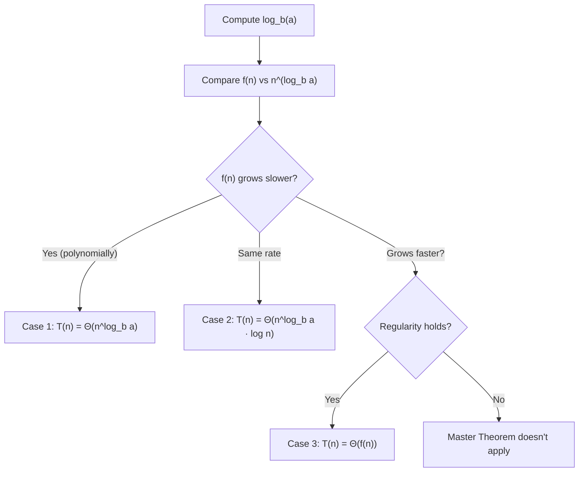

# Master Theorem

The Master Theorem gives a closed-form solution to recurrences of the form:

> **T(n) = a · T(n/b) + f(n)**

where a ≥ 1, b > 1 are constants, and f(n) is an asymptotically positive function.

**Interpretation:**
- a = number of subproblems
- n/b = size of each subproblem  
- f(n) = cost to **divide** and **combine**

---

## The Three Cases

The critical quantity is n^(log_b(a)) — this is the "work done by the recursion tree leaves."

Compare f(n) against n^(log_b(a)):

### Case 1: Recursion Dominates

> **f(n) = O(n^(log_b(a) - ε)) for some ε > 0**

The combine step is cheaper than the leaf work. The bottom of the tree dominates.

> **T(n) = Θ(n^(log_b(a)))**

### Case 2: Work Is Balanced

> **f(n) = Θ(n^(log_b(a)) · log^k n) for k ≥ 0**

Every level does the same total work. The log factor accumulates over all levels.

> **T(n) = Θ(n^(log_b(a)) · log^(k+1) n)**

The most common form is k = 0: f(n) = Θ(n^(log_b(a))) → T(n) = Θ(n^(log_b(a)) log n).

### Case 3: Combine Dominates

> **f(n) = Ω(n^(log_b(a) + ε)) for some ε > 0**

**Plus regularity condition:** a · f(n/b) ≤ c · f(n) for some c < 1 and large n.

The top of the tree (combine step) dominates.

> **T(n) = Θ(f(n))**

---

## Decision Flowchart

---

## Quick Reference: Common Recurrences

| Algorithm | a | b | f(n) | log_b(a) | Case | Result |
|---|---|---|---|---|---|---|
| Binary Search | 1 | 2 | O(1) | 0 | Case 1 | O(log n) |
| Merge Sort | 2 | 2 | O(n) | 1 | Case 2 | O(n log n) |
| Quick Sort (avg) | 2 | 2 | O(n) | 1 | Case 2 | O(n log n) |
| Binary Tree DFS | 2 | 2 | O(1) | 1 | Case 1 | O(n) |
| Strassen | 7 | 2 | O(n^2) | 2.807 | Case 1 | O(n^(2.807)) |
| Naive Matrix Multiply | 8 | 2 | O(n^2) | 3 | Case 1 | O(n^3) |
| QuickSelect (avg) | 1 | 4/3 | O(n) | ~0 | Case 3 | O(n) |
| Karatsuba Multiply | 3 | 2 | O(n) | 1.585 | Case 1 | O(n^(1.585)) |

---

## Worked Examples

### Example 1: Merge Sort — T(n) = 2T(n/2) + n

a=2, b=2, f(n) = n

n^(log_b(a)) = n^(log_2 2) = n^1 = n

f(n) = n = Θ(n^1) = Θ(n^(log_b(a))) → **Case 2** (k=0)

> **T(n) = Θ(n log n)**

---

### Example 2: Binary Search — T(n) = T(n/2) + 1

a=1, b=2, f(n) = 1 = O(1)

n^(log_2 1) = n^0 = 1

f(n) = O(1) = O(n^(0)) = O(n^(log_b(a))) → **Case 2** (k=0, since f(n) = Θ(n^0) = Θ(1))

> **T(n) = Θ(log n)**

---

### Example 3: Strassen's Algorithm — T(n) = 7T(n/2) + n^2

a=7, b=2, f(n) = n^2

n^(log_2 7) ≈ n^(2.807)

f(n) = n^2 = O(n^(2.807 - 0.807)) → **Case 1**

> **T(n) = Θ(n^(log_2 7)) ≈ Θ(n^(2.807))**

This beats naive matrix multiplication (O(n^3)) — the entire point of Strassen's algorithm.

---

### Example 4: Unbalanced Recursion — T(n) = 3T(n/4) + n log n

a=3, b=4, f(n) = n log n

n^(log_4 3) = n^(0.792)

f(n) = n log n = Ω(n^(0.792 + ε)) for small ε → check **Case 3**

Regularity: 3 · (n/4) log(n/4) ≤ (3/4) · n log n ✓ for large n

> **T(n) = Θ(n log n)**

---

### Example 5: Master Theorem Doesn't Apply — T(n) = 2T(n/2) + n log n

a=2, b=2, n^(log_2 2) = n

f(n) = n log n. Is f(n) = Ω(n^(1+ε)) for some ε > 0?

No — n log n grows slower than n^(1+ε) for any ε > 0.

Is f(n) = Θ(n log^k n) for some k? Yes, k=1.

This is **Case 2** with k=1:

> **T(n) = Θ(n log^2 n)**

---

## When the Master Theorem Doesn't Apply

| Situation | Example | Use instead |
|---|---|---|
| f(n) is not polynomially comparable | T(n) = 2T(n/2) + n/log n | Akra-Bazzi method |
| Subproblems have different sizes | T(n) = T(n/3) + T(2n/3) + n | Recursion tree method |
| a < 1 (fewer than 1 subproblem) | Not applicable | Direct analysis |
| Non-uniform split | T(n) = T(n-1) + O(1) (linear recursion) | Substitution method |

---

## The Recursion Tree Method (When Master Theorem Fails)

For T(n) = T(n/3) + T(2n/3) + cn:

- Level 0: cn work
- Level 1: c(n/3) + c(2n/3) = cn work
- Level 2: cn work again
- ...
- Depth: log_3/2 n (longest branch is 2/3 each level)

Total: O(n log n)

---

## Substitution Method

Guess the form, verify by induction.

**Example:** T(n) = 2T(n/2) + n

Guess T(n) ≤ cn log n.

Assume T(n/2) ≤ c(n/2)log(n/2).

Then T(n) ≤ 2 · c(n/2)log(n/2) + n = cn(log n - 1) + n = cnlog n + (1-c)n

For c ≥ 1: T(n) ≤ cn log n ✓

---

## Interview Tips

1. **Memorize the big three:** Binary search → O(log n), Merge sort → O(n log n), Tree DFS → O(n).
2. **State the recurrence first** before jumping to complexity — it shows structured thinking.
3. **log_b(a) is the crossover point** — calculate it to determine which case applies.
4. **Case 2 is most common in interviews** — all the "do O(n) work per level across O(log n) levels" algorithms land here.
5. **When in doubt, use the recursion tree** — draw 3-4 levels, find the per-level cost, multiply by depth.
