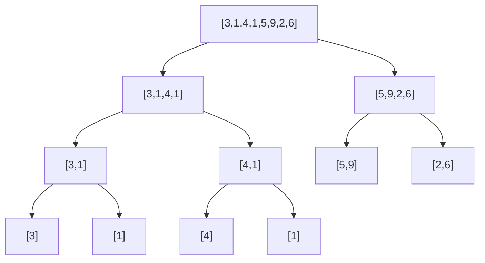

# Divide and Conquer

Divide and Conquer is one of the most powerful algorithmic paradigms. The idea is deceptively simple: **break the problem into smaller subproblems, solve each independently, then combine the results**.

Almost every O(n log n) algorithm you know — merge sort, quick sort, fast Fourier transform — is divide and conquer at its core.

---

## The Three-Phase Structure

Every divide-and-conquer algorithm follows this skeleton:

```
solve(problem):
    if problem is small enough:
        return base_case(problem)       // CONQUER directly

    left, right = divide(problem)       // DIVIDE
    leftResult  = solve(left)           // CONQUER (recurse)
    rightResult = solve(right)          // CONQUER (recurse)
    return combine(leftResult, rightResult)  // COMBINE
```

| Phase | What happens | Example (Merge Sort) |
|---|---|---|
| **Divide** | Split into subproblems | Split array at midpoint |
| **Conquer** | Recursively solve each | Sort left half, sort right half |
| **Combine** | Merge results | Merge two sorted halves |

The recursion creates a **binary tree of subproblems**. The depth is O(log n) if we split roughly in half each time, giving the characteristic O(n log n) complexity.



---

## When to Use Divide and Conquer

| Signal | Example |
|---|---|
| Problem naturally splits into independent subproblems | Merge sort, matrix multiply |
| Answer can be built from answers to halves | Maximum subarray, count inversions |
| Sorted structure allows binary splitting | Binary search, median of two sorted arrays |
| Need to sort or partially sort | Quick sort, QuickSelect |
| Problem has optimal substructure AND subproblems are independent | D&C vs DP: independence is the key |

**D&C vs DP distinction:** Both exploit optimal substructure. The difference is **independence**:
- D&C subproblems are independent → no memoization needed
- DP subproblems overlap → memoization/tabulation is essential

---

## Identifying D&C Problems

Ask these questions:

1. **Can I split the input in half (or any fraction)?** If splitting doesn't reduce the problem, D&C won't help.
2. **Can I solve each half independently?** If the halves need each other's results to be computed, think DP instead.
3. **Can I combine the two halves' answers efficiently?** If combining costs O(n), total is O(n log n). If it costs O(n²), you haven't gained anything.
4. **Does the answer span the two halves?** The "cross" case (answer involves elements from both halves) is often where D&C adds value.

---

## Core Patterns

### Pattern 1: Split at Midpoint, Merge Results

Used when the combination of two sorted/processed halves is cheap.

- Merge Sort: split → sort halves → O(n) merge
- Count Inversions: split → count halves → count cross-inversions during merge
- Closest Pair of Points: split by x-coordinate → recurse → O(n) strip merge

### Pattern 2: Binary Search on Answer

Not just "find the element" — binary search on any monotonic function.

- "Is there a valid arrangement with max distance at least X?" — binary search on X
- Median of Two Sorted Arrays — binary search on the partition position

### Pattern 3: QuickSelect / Partition-Based

Pick a pivot, partition, recurse only into the relevant side.

- Quick Sort: partition → recurse both sides
- QuickSelect: partition → recurse only the side containing k-th element
- Expected O(n), worst O(n²)

### Pattern 4: Divide but Don't Conquer Both

Sometimes you only recurse into one half (O(log n) total), like binary search.

---

## Recurrence Relations

The running time of a D&C algorithm is described by a recurrence:

> **T(n) = a · T(n/b) + f(n)**

where:
- a = number of subproblems
- b = factor by which input shrinks
- f(n) = cost of divide + combine steps

| Algorithm | Recurrence | Solution |
|---|---|---|
| Binary Search | T(n) = T(n/2) + O(1) | O(log n) |
| Merge Sort | T(n) = 2T(n/2) + O(n) | O(n log n) |
| Quick Sort (avg) | T(n) = 2T(n/2) + O(n) | O(n log n) |
| Strassen Matrix Multiply | T(n) = 7T(n/2) + O(n^2) | O(n^{2.807}) |
| Binary Tree Traversal | T(n) = 2T(n/2) + O(1) | O(n) |

---

## The Combine Step is Often the Hard Part

The divide step is almost always trivial (find midpoint). The conquer step is just recursion. The **combine step** is where the algorithmic insight lives.

| Problem | Combine insight |
|---|---|
| Merge Sort | Two-pointer merge in O(n) |
| Count Inversions | Count cross-inversions during merge |
| Maximum Subarray | `max(leftMax, rightMax, leftSuffix + rightPrefix)` |
| Closest Pair | Strip search for cross-boundary pairs |

---

## Template: Standard D&C

```cpp
// Generic D&C template
ResultType solve(vector<int>& arr, int lo, int hi) {
    if (lo == hi) return base_case(arr[lo]);    // single element

    int mid = lo + (hi - lo) / 2;
    ResultType left  = solve(arr, lo, mid);
    ResultType right = solve(arr, mid + 1, hi);
    return combine(left, right, arr, lo, mid, hi);
}
```

**Always use `mid = lo + (hi - lo) / 2`**, not `(lo + hi) / 2` — the latter overflows for large indices in languages with fixed-size integers.

---

## Template: Merge Sort Skeleton

```
mergeSort(arr, lo, hi):
    if lo >= hi: return

    mid = lo + (hi - lo) / 2
    mergeSort(arr, lo, mid)
    mergeSort(arr, mid+1, hi)
    merge(arr, lo, mid, hi)     // O(n) combine

merge(arr, lo, mid, hi):
    copy arr[lo..hi] to temp
    i = lo, j = mid+1, k = lo
    while i <= mid and j <= hi:
        if temp[i] <= temp[j]: arr[k++] = temp[i++]
        else:                  arr[k++] = temp[j++]
    copy remaining
```

---

## Template: QuickSelect Skeleton

```
quickSelect(arr, lo, hi, k):
    if lo == hi: return arr[lo]

    pivot = partition(arr, lo, hi)   // in-place partition

    if k == pivot:   return arr[k]
    elif k < pivot:  return quickSelect(arr, lo, pivot-1, k)
    else:            return quickSelect(arr, pivot+1, hi, k)
```

---

## Complexity Analysis Framework

To analyze any D&C algorithm:

1. Write the recurrence: T(n) = aT(n/b) + f(n)
2. Apply the Master Theorem (see `master-theorem.md`)
3. Verify the combine step's complexity is what you think

---

## Common Pitfalls

1. **Midpoint overflow:** `(lo + hi) / 2` overflows when both are large. Always use `lo + (hi - lo) / 2`.
2. **Off-by-one in merge:** Defining `mid` consistently — does `mid` belong to the left half or right half? Pick one and stick to it.
3. **Extra allocation on every level:** Allocating a new array in merge adds O(n log n) space instead of O(n). Reuse a single temp buffer.
4. **Forgetting the cross case:** Maximum subarray D&C is incorrect if you forget to compute the max crossing subarray.
5. **QuickSort worst case:** Sorted arrays with naive pivot → O(n²). Always randomize or use median-of-three.
6. **Assuming D&C when subproblems overlap:** Fibonacci naively with D&C is O(2^n). The subproblems aren't independent → needs DP.

---

## D&C vs Greedy vs DP

| Dimension | D&C | Greedy | DP |
|---|---|---|---|
| Subproblem independence | Required | N/A (single path) | Overlapping OK |
| Optimal substructure | Required | Required | Required |
| Decision style | Split + combine | Commit locally | Consider all |
| Typical complexity | O(n log n) | O(n) or O(n log n) | O(n²) or O(n·k) |
| Space | O(log n) stack | O(1) | O(n) to O(n²) |

---

## Classic D&C Problems Reference

| Problem | D&C approach | Complexity |
|---|---|---|
| Merge Sort | Split + merge | O(n log n) |
| Quick Sort | Partition + recurse | O(n log n) avg |
| Binary Search | Discard half each step | O(log n) |
| Count Inversions | Augmented merge sort | O(n log n) |
| Maximum Subarray | Crossing subarray combine | O(n log n) |
| Kth Largest (QuickSelect) | Partition-based recursion | O(n) avg |
| Median of Two Sorted Arrays | Binary search on partition | O(log(min(m,n))) |
| Closest Pair of Points | Strip merge after split | O(n log n) |
| Strassen Matrix Multiply | 7 subproblems of size n/2 | O(n^2.807) |
