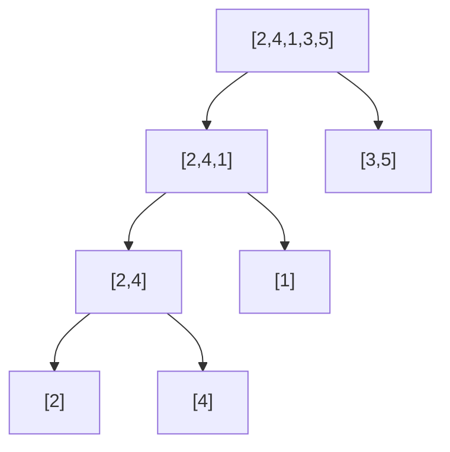

# Count Inversions

| | |
|---|---|
| **Difficulty** | Hard (variant: Medium) |
| **LeetCode** | [315. Count of Smaller Numbers After Self](https://leetcode.com/problems/count-of-smaller-numbers-after-self/) — variant |
| **Classic Problem** | Count inversions in array (CSES, GFG, competitive programming) |
| **Tags** | Divide and Conquer, Merge Sort, Array |

## Problem Statement

An **inversion** is a pair of indices `(i, j)` where `i < j` but `arr[i] > arr[j]`. Count the total number of inversions in an array.

```
Input:  [2, 4, 1, 3, 5]
Output: 3
Pairs: (2,1), (4,1), (4,3)
```

The inversion count measures "how far from sorted" an array is. A sorted array has 0 inversions; a reverse-sorted array has n*(n-1)/2.

---

## Intuition

**Brute force** checks every pair (i, j): O(n²). For n = 10⁵, that's 10¹⁰ operations — too slow.

**D&C insight:** During merge sort's merge step, when we pick an element from the **right** half over one from the **left** half, that element from the right half forms an inversion with **every remaining element in the left half**.

Why? At the merge step, left half is `arr[lo..mid]` and right half is `arr[mid+1..hi]`, both already sorted. If `right[j] < left[i]`, then `right[j]` is smaller than *all* of `left[i], left[i+1], ..., left[mid]` — that's `(mid - i + 1)` inversions at once.

Counting them takes O(1) per such event → O(n log n) total.



---

## Approach 1: Brute Force

Check every pair `(i, j)` with `i < j`.

```cpp
long long countInversionsBrute(vector<int>& arr) {
    long long count = 0;
    int n = arr.size();
    for (int i = 0; i < n; i++)
        for (int j = i + 1; j < n; j++)
            if (arr[i] > arr[j]) count++;
    return count;
}
```

```java
long countInversionsBrute(int[] arr) {
    long count = 0;
    int n = arr.length;
    for (int i = 0; i < n; i++)
        for (int j = i + 1; j < n; j++)
            if (arr[i] > arr[j]) count++;
    return count;
}
```

```typescript
function countInversionsBrute(arr: number[]): number {
    let count = 0;
    for (let i = 0; i < arr.length; i++)
        for (let j = i + 1; j < arr.length; j++)
            if (arr[i] > arr[j]) count++;
    return count;
}
```

```python
def count_inversions_brute(arr: list[int]) -> int:
    count = 0
    n = len(arr)
    for i in range(n):
        for j in range(i + 1, n):
            if arr[i] > arr[j]:
                count += 1
    return count
```

```go
func countInversionsBrute(arr []int) int64 {
    var count int64
    n := len(arr)
    for i := 0; i < n; i++ {
        for j := i + 1; j < n; j++ {
            if arr[i] > arr[j] { count++ }
        }
    }
    return count
}
```

**Time:** O(n²) — **Space:** O(1)

---

## Approach 2: Merge Sort with Inversion Count (Optimal)

Augment merge sort: when choosing `right[j]` over `left[i]` during merge, add `(mid - i + 1)` to the count — the number of left-half elements remaining that are greater than `right[j]`.

The key: both halves are already sorted at merge time, so all remaining left elements are greater.

```cpp
long long mergeCount(vector<int>& arr, int lo, int mid, int hi, vector<int>& tmp) {
    for (int i = lo; i <= hi; i++) tmp[i] = arr[i];
    int i = lo, j = mid + 1, k = lo;
    long long inv = 0;
    while (i <= mid && j <= hi) {
        if (tmp[i] <= tmp[j]) {
            arr[k++] = tmp[i++];
        } else {
            inv += (mid - i + 1);  // all remaining left elements > tmp[j]
            arr[k++] = tmp[j++];
        }
    }
    while (i <= mid) arr[k++] = tmp[i++];
    while (j <= hi)  arr[k++] = tmp[j++];
    return inv;
}

long long sortAndCount(vector<int>& arr, int lo, int hi, vector<int>& tmp) {
    if (lo >= hi) return 0;
    int mid = lo + (hi - lo) / 2;
    long long inv = 0;
    inv += sortAndCount(arr, lo, mid, tmp);
    inv += sortAndCount(arr, mid + 1, hi, tmp);
    inv += mergeCount(arr, lo, mid, hi, tmp);
    return inv;
}

long long countInversions(vector<int>& arr) {
    vector<int> tmp(arr.size());
    return sortAndCount(arr, 0, (int)arr.size() - 1, tmp);
}
```

```java
long mergeCount(int[] arr, int lo, int mid, int hi, int[] tmp) {
    for (int i = lo; i <= hi; i++) tmp[i] = arr[i];
    int i = lo, j = mid + 1, k = lo;
    long inv = 0;
    while (i <= mid && j <= hi) {
        if (tmp[i] <= tmp[j]) {
            arr[k++] = tmp[i++];
        } else {
            inv += (mid - i + 1);
            arr[k++] = tmp[j++];
        }
    }
    while (i <= mid) arr[k++] = tmp[i++];
    while (j <= hi)  arr[k++] = tmp[j++];
    return inv;
}

long sortAndCount(int[] arr, int lo, int hi, int[] tmp) {
    if (lo >= hi) return 0;
    int mid = lo + (hi - lo) / 2;
    long inv = sortAndCount(arr, lo, mid, tmp)
             + sortAndCount(arr, mid + 1, hi, tmp)
             + mergeCount(arr, lo, mid, hi, tmp);
    return inv;
}

long countInversions(int[] arr) {
    return sortAndCount(arr, 0, arr.length - 1, new int[arr.length]);
}
```

```typescript
function countInversions(arr: number[]): number {
    const tmp = new Array(arr.length);
    return sortAndCount(arr, 0, arr.length - 1, tmp);
}

function sortAndCount(arr: number[], lo: number, hi: number, tmp: number[]): number {
    if (lo >= hi) return 0;
    const mid = lo + ((hi - lo) >> 1);
    return sortAndCount(arr, lo, mid, tmp)
         + sortAndCount(arr, mid + 1, hi, tmp)
         + mergeCount(arr, lo, mid, hi, tmp);
}

function mergeCount(arr: number[], lo: number, mid: number, hi: number, tmp: number[]): number {
    for (let i = lo; i <= hi; i++) tmp[i] = arr[i];
    let i = lo, j = mid + 1, k = lo, inv = 0;
    while (i <= mid && j <= hi) {
        if (tmp[i] <= tmp[j]) arr[k++] = tmp[i++];
        else { inv += mid - i + 1; arr[k++] = tmp[j++]; }
    }
    while (i <= mid) arr[k++] = tmp[i++];
    while (j <= hi)  arr[k++] = tmp[j++];
    return inv;
}
```

```python
def count_inversions(arr: list[int]) -> int:
    tmp = [0] * len(arr)
    return sort_and_count(arr, 0, len(arr) - 1, tmp)

def sort_and_count(arr: list[int], lo: int, hi: int, tmp: list[int]) -> int:
    if lo >= hi:
        return 0
    mid = lo + (hi - lo) // 2
    inv  = sort_and_count(arr, lo, mid, tmp)
    inv += sort_and_count(arr, mid + 1, hi, tmp)
    inv += merge_count(arr, lo, mid, hi, tmp)
    return inv

def merge_count(arr: list[int], lo: int, mid: int, hi: int, tmp: list[int]) -> int:
    tmp[lo:hi+1] = arr[lo:hi+1]
    i, j, k, inv = lo, mid + 1, lo, 0
    while i <= mid and j <= hi:
        if tmp[i] <= tmp[j]:
            arr[k] = tmp[i]; i += 1
        else:
            inv += mid - i + 1   # all remaining left elements > tmp[j]
            arr[k] = tmp[j]; j += 1
        k += 1
    while i <= mid: arr[k] = tmp[i]; k += 1; i += 1
    while j <= hi:  arr[k] = tmp[j]; k += 1; j += 1
    return inv
```

```go
func countInversions(arr []int) int64 {
    tmp := make([]int, len(arr))
    return sortAndCount(arr, 0, len(arr)-1, tmp)
}

func sortAndCount(arr []int, lo, hi int, tmp []int) int64 {
    if lo >= hi { return 0 }
    mid := lo + (hi-lo)/2
    inv := sortAndCount(arr, lo, mid, tmp)
    inv += sortAndCount(arr, mid+1, hi, tmp)
    inv += mergeCount(arr, lo, mid, hi, tmp)
    return inv
}

func mergeCount(arr []int, lo, mid, hi int, tmp []int) int64 {
    copy(tmp[lo:hi+1], arr[lo:hi+1])
    i, j, k := lo, mid+1, lo
    var inv int64
    for i <= mid && j <= hi {
        if tmp[i] <= tmp[j] { arr[k] = tmp[i]; i++ } else {
            inv += int64(mid - i + 1)
            arr[k] = tmp[j]; j++
        }
        k++
    }
    for i <= mid { arr[k] = tmp[i]; i++; k++ }
    for j <= hi  { arr[k] = tmp[j]; j++; k++ }
    return inv
}
```

**Time:** O(n log n) — **Space:** O(n)

---

## Dry Run

`arr = [2, 4, 1, 3, 5]`

**Merge `[2,4]` with `[1]`:**
- `tmp[i]=2 > tmp[j]=1` → inv += `(1 - 0 + 1) = 2` (both 2 and 4 are > 1)
- Result: `[1, 2, 4]`, inversions so far: 2

**Merge `[1,2,4]` with `[3,5]`:**
- `1 ≤ 3` → take 1
- `2 ≤ 3` → take 2
- `4 > 3` → inv += `(2 - 2 + 1) = 1` (only 4 remains > 3)
- `4 ≤ 5` → take 4
- take 5
- Result: `[1, 2, 3, 4, 5]`, inversions: 3

**Total: 3** ✓  
Pairs: (2,1), (4,1), (4,3)

---

## Complexity

| Approach | Time | Space |
|---|---|---|
| Brute Force | O(n²) | O(1) |
| Merge Sort + Count | O(n log n) | O(n) |

---

## Key Interview Insights

- **The key insight:** During merge, when we pick from the right half, the number of "remaining left" elements counts as inversions simultaneously — this is why O(1) per merge event gives O(n log n) total.
- **Use `long long` / `long` for count** — maximum inversions for n=10⁵ is ~5×10⁹, which overflows `int`.
- **The array is modified** (sorted) as a side effect. If you need the original, clone it first.
- **LeetCode 315 (Count of Smaller Numbers After Self)** is a harder variant: count inversions per element, not globally. Solution is similar but tracks per-element counts.
- **Merge sort inversion counting is stable** — ties go to the left half first, so equal elements don't create spurious inversions.
- This problem appears in competitive programming (CSES: "Counting Inversions") and is a common D&C showcase in FAANG interviews.
