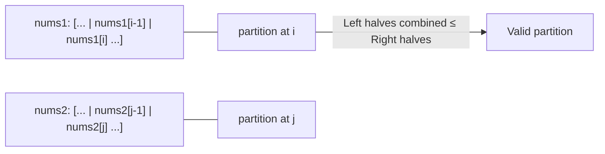

# Median of Two Sorted Arrays

| | |
|---|---|
| **Difficulty** | Hard |
| **LeetCode** | [4. Median of Two Sorted Arrays](https://leetcode.com/problems/median-of-two-sorted-arrays/) |
| **Tags** | Divide and Conquer, Binary Search, Array |

## Problem Statement

Given two sorted arrays `nums1` and `nums2` of sizes `m` and `n`, return the **median** of the two sorted arrays. The overall run time complexity must be O(log(m + n)).

**Example 1:**
```
nums1 = [1, 3], nums2 = [2]
Output: 2.0    (merged: [1,2,3], median = 2)
```

**Example 2:**
```
nums1 = [1, 2], nums2 = [3, 4]
Output: 2.5    (merged: [1,2,3,4], median = (2+3)/2 = 2.5)
```

---

## Intuition

**What does the median mean for two merged arrays?** The median splits the combined `m + n` elements into two equal halves. Everything in the left half is ≤ everything in the right half.

We need a **partition** of `nums1` and `nums2` such that:
- Left halves combined have `(m + n + 1) / 2` elements
- `max(left1, left2) <= min(right1, right2)`

Once we find the right partition of `nums1` (call it `i` — take first `i` elements from `nums1`), the partition of `nums2` is determined: `j = half - i`. Then we just check the boundary condition.

Binary search on `i` (the partition point in the smaller array) gives O(log(min(m, n))).

**Key insight:** Always binary search on the *smaller* array to minimize iterations. If `nums1` is larger, swap them.

---

## Approach 1: Merge and Find Median

Merge both arrays and find the middle element(s).

```cpp
double findMedianSortedArrays(vector<int>& nums1, vector<int>& nums2) {
    vector<int> merged;
    int i = 0, j = 0;
    while (i < (int)nums1.size() && j < (int)nums2.size())
        merged.push_back(nums1[i] <= nums2[j] ? nums1[i++] : nums2[j++]);
    while (i < (int)nums1.size()) merged.push_back(nums1[i++]);
    while (j < (int)nums2.size()) merged.push_back(nums2[j++]);
    int n = merged.size();
    return n % 2 == 1
        ? (double)merged[n / 2]
        : (merged[n / 2 - 1] + merged[n / 2]) / 2.0;
}
```

```java
double findMedianSortedArrays(int[] nums1, int[] nums2) {
    int m = nums1.length, n = nums2.length;
    int[] merged = new int[m + n];
    int i = 0, j = 0, k = 0;
    while (i < m && j < n)
        merged[k++] = nums1[i] <= nums2[j] ? nums1[i++] : nums2[j++];
    while (i < m) merged[k++] = nums1[i++];
    while (j < n) merged[k++] = nums2[j++];
    int total = m + n;
    return total % 2 == 1
        ? merged[total / 2]
        : (merged[total / 2 - 1] + merged[total / 2]) / 2.0;
}
```

```typescript
function findMedianSortedArrays(nums1: number[], nums2: number[]): number {
    const merged: number[] = [];
    let i = 0, j = 0;
    while (i < nums1.length && j < nums2.length)
        merged.push(nums1[i] <= nums2[j] ? nums1[i++] : nums2[j++]);
    while (i < nums1.length) merged.push(nums1[i++]);
    while (j < nums2.length) merged.push(nums2[j++]);
    const n = merged.length;
    return n % 2 === 1
        ? merged[Math.floor(n / 2)]
        : (merged[n / 2 - 1] + merged[n / 2]) / 2;
}
```

```python
def find_median_sorted_arrays(nums1: list[int], nums2: list[int]) -> float:
    merged, i, j = [], 0, 0
    while i < len(nums1) and j < len(nums2):
        if nums1[i] <= nums2[j]:
            merged.append(nums1[i]); i += 1
        else:
            merged.append(nums2[j]); j += 1
    merged.extend(nums1[i:])
    merged.extend(nums2[j:])
    n = len(merged)
    return merged[n // 2] if n % 2 == 1 else (merged[n // 2 - 1] + merged[n // 2]) / 2.0
```

```go
func findMedianSortedArrays(nums1 []int, nums2 []int) float64 {
    merged := make([]int, 0, len(nums1)+len(nums2))
    i, j := 0, 0
    for i < len(nums1) && j < len(nums2) {
        if nums1[i] <= nums2[j] { merged = append(merged, nums1[i]); i++ } else { merged = append(merged, nums2[j]); j++ }
    }
    merged = append(merged, nums1[i:]...)
    merged = append(merged, nums2[j:]...)
    n := len(merged)
    if n%2 == 1 { return float64(merged[n/2]) }
    return float64(merged[n/2-1]+merged[n/2]) / 2.0
}
```

**Time:** O(m + n) — **Space:** O(m + n)

---

## Approach 2: Binary Search on Partition (Optimal)

We binary search on the partition point `i` in `nums1` (smaller array). The partition in `nums2` is `j = half - i`. We need:

```
max(nums1[i-1], nums2[j-1])  <=  min(nums1[i], nums2[j])
```

- If `nums1[i-1] > nums2[j]` → `i` is too large → move left
- If `nums2[j-1] > nums1[i]` → `i` is too small → move right
- Otherwise → found the right partition

Handle boundary with `INT_MIN`/`INT_MAX` when partitions are at the edges.



```cpp
double findMedianSortedArrays(vector<int>& nums1, vector<int>& nums2) {
    // Ensure nums1 is the smaller array
    if (nums1.size() > nums2.size()) return findMedianSortedArrays(nums2, nums1);

    int m = nums1.size(), n = nums2.size();
    int half = (m + n + 1) / 2;
    int lo = 0, hi = m;

    while (lo <= hi) {
        int i = lo + (hi - lo) / 2;    // partition nums1 at i
        int j = half - i;               // partition nums2 at j

        int left1  = (i > 0) ? nums1[i - 1] : INT_MIN;
        int right1 = (i < m) ? nums1[i]     : INT_MAX;
        int left2  = (j > 0) ? nums2[j - 1] : INT_MIN;
        int right2 = (j < n) ? nums2[j]     : INT_MAX;

        if (left1 <= right2 && left2 <= right1) {
            // Found valid partition
            int maxLeft  = max(left1, left2);
            int minRight = min(right1, right2);
            if ((m + n) % 2 == 1) return maxLeft;
            return (maxLeft + minRight) / 2.0;
        } else if (left1 > right2) {
            hi = i - 1;   // i too large
        } else {
            lo = i + 1;   // i too small
        }
    }
    return 0.0; // unreachable
}
```

```java
double findMedianSortedArrays(int[] nums1, int[] nums2) {
    if (nums1.length > nums2.length) return findMedianSortedArrays(nums2, nums1);

    int m = nums1.length, n = nums2.length;
    int half = (m + n + 1) / 2;
    int lo = 0, hi = m;

    while (lo <= hi) {
        int i = lo + (hi - lo) / 2;
        int j = half - i;

        int left1  = (i > 0) ? nums1[i - 1] : Integer.MIN_VALUE;
        int right1 = (i < m) ? nums1[i]     : Integer.MAX_VALUE;
        int left2  = (j > 0) ? nums2[j - 1] : Integer.MIN_VALUE;
        int right2 = (j < n) ? nums2[j]     : Integer.MAX_VALUE;

        if (left1 <= right2 && left2 <= right1) {
            int maxLeft  = Math.max(left1, left2);
            int minRight = Math.min(right1, right2);
            if ((m + n) % 2 == 1) return maxLeft;
            return (maxLeft + minRight) / 2.0;
        } else if (left1 > right2) {
            hi = i - 1;
        } else {
            lo = i + 1;
        }
    }
    return 0.0;
}
```

```typescript
function findMedianSortedArrays(nums1: number[], nums2: number[]): number {
    if (nums1.length > nums2.length) return findMedianSortedArrays(nums2, nums1);

    const m = nums1.length, n = nums2.length;
    const half = Math.floor((m + n + 1) / 2);
    let lo = 0, hi = m;

    while (lo <= hi) {
        const i = lo + ((hi - lo) >> 1);
        const j = half - i;

        const left1  = i > 0 ? nums1[i - 1] : -Infinity;
        const right1 = i < m ? nums1[i]     :  Infinity;
        const left2  = j > 0 ? nums2[j - 1] : -Infinity;
        const right2 = j < n ? nums2[j]     :  Infinity;

        if (left1 <= right2 && left2 <= right1) {
            const maxLeft  = Math.max(left1, left2);
            const minRight = Math.min(right1, right2);
            return (m + n) % 2 === 1 ? maxLeft : (maxLeft + minRight) / 2;
        } else if (left1 > right2) {
            hi = i - 1;
        } else {
            lo = i + 1;
        }
    }
    return 0;
}
```

```python
def find_median_sorted_arrays(nums1: list[int], nums2: list[int]) -> float:
    # Always binary search on the smaller array
    if len(nums1) > len(nums2):
        return find_median_sorted_arrays(nums2, nums1)

    m, n = len(nums1), len(nums2)
    half = (m + n + 1) // 2
    lo, hi = 0, m

    while lo <= hi:
        i = lo + (hi - lo) // 2    # partition nums1: take first i elements
        j = half - i               # partition nums2: take first j elements

        left1  = nums1[i - 1] if i > 0 else float('-inf')
        right1 = nums1[i]     if i < m else float('inf')
        left2  = nums2[j - 1] if j > 0 else float('-inf')
        right2 = nums2[j]     if j < n else float('inf')

        if left1 <= right2 and left2 <= right1:
            max_left  = max(left1, left2)
            min_right = min(right1, right2)
            if (m + n) % 2 == 1:
                return float(max_left)
            return (max_left + min_right) / 2.0
        elif left1 > right2:
            hi = i - 1    # i too large, move left
        else:
            lo = i + 1    # i too small, move right

    return 0.0
```

```go
func findMedianSortedArrays(nums1 []int, nums2 []int) float64 {
    if len(nums1) > len(nums2) {
        return findMedianSortedArrays(nums2, nums1)
    }
    m, n := len(nums1), len(nums2)
    half := (m + n + 1) / 2
    lo, hi := 0, m

    for lo <= hi {
        i := lo + (hi-lo)/2
        j := half - i

        left1, right1, left2, right2 := -(1<<31), 1<<31-1, -(1<<31), 1<<31-1
        if i > 0 { left1  = nums1[i-1] }
        if i < m { right1 = nums1[i] }
        if j > 0 { left2  = nums2[j-1] }
        if j < n { right2 = nums2[j] }

        if left1 <= right2 && left2 <= right1 {
            maxLeft := left1; if left2 > maxLeft { maxLeft = left2 }
            if (m+n)%2 == 1 { return float64(maxLeft) }
            minRight := right1; if right2 < minRight { minRight = right2 }
            return float64(maxLeft+minRight) / 2.0
        } else if left1 > right2 {
            hi = i - 1
        } else {
            lo = i + 1
        }
    }
    return 0.0
}
```

**Time:** O(log(min(m, n))) — **Space:** O(1)

---

## Dry Run

`nums1 = [1, 3]` (m=2), `nums2 = [2]` (n=1)

`half = (2+1+1)/2 = 2`, binary search on nums1, `lo=0, hi=2`

**Iteration 1:** `i=1, j=2-1=1`
- `left1 = nums1[0] = 1`
- `right1 = nums1[1] = 3`
- `left2 = nums2[0] = 2`
- `right2 = INF` (j=1=n)

Check: `left1(1) <= right2(INF)` ✓ and `left2(2) <= right1(3)` ✓ → valid partition

`maxLeft = max(1, 2) = 2`, `minRight = min(3, INF) = 3`

`(m+n) = 3`, odd → return `maxLeft = 2.0` ✓

---

`nums1 = [1, 2]` (m=2), `nums2 = [3, 4]` (n=2)

`half = (2+2+1)/2 = 2`

**i=1, j=1:**
- `left1=1, right1=2, left2=3, right2=4`
- `left2(3) > right1(2)` → i too small → `lo=2`

**i=2, j=0:**
- `left1=2, right1=INF, left2=MIN_INF, right2=3`
- `left1(2) <= right2(3)` ✓ and `left2(-INF) <= right1(INF)` ✓

`maxLeft = max(2, -INF) = 2`, `minRight = min(INF, 3) = 3`

Even → `(2+3)/2 = 2.5` ✓

---

## Complexity

| Approach | Time | Space |
|---|---|---|
| Merge + median | O(m + n) | O(m + n) |
| Binary search on partition | O(log(min(m, n))) | O(1) |

---

## Key Interview Insights

- **Always binary search on the smaller array** — this ensures at most O(log(min(m,n))) iterations, and `j = half - i` always stays non-negative.
- **The boundary sentinels** (`INT_MIN`/`INT_MAX` or `-∞`/`+∞`) handle edge cases where the partition is at the very start or end of an array.
- **`half = (m + n + 1) / 2` with integer division** handles both odd and even total lengths: for odd, the left half has one more element; the median is `maxLeft`.
- **What to binary search on:** We're not searching for a value in the array, but for the correct *partition index* `i`. This is the key D&C / binary search insight.
- **Why is the partition valid when `left1 <= right2 && left2 <= right1`?** It guarantees every element in the left halves is ≤ every element in the right halves, since both arrays are sorted.
- This problem is rated Hard because of the non-obvious mapping from "find median" to "find partition" — but the binary search itself is straightforward once the connection is made.
- **Common mistake:** Forgetting to swap arrays when `m > n`, leading to negative `j` values.
