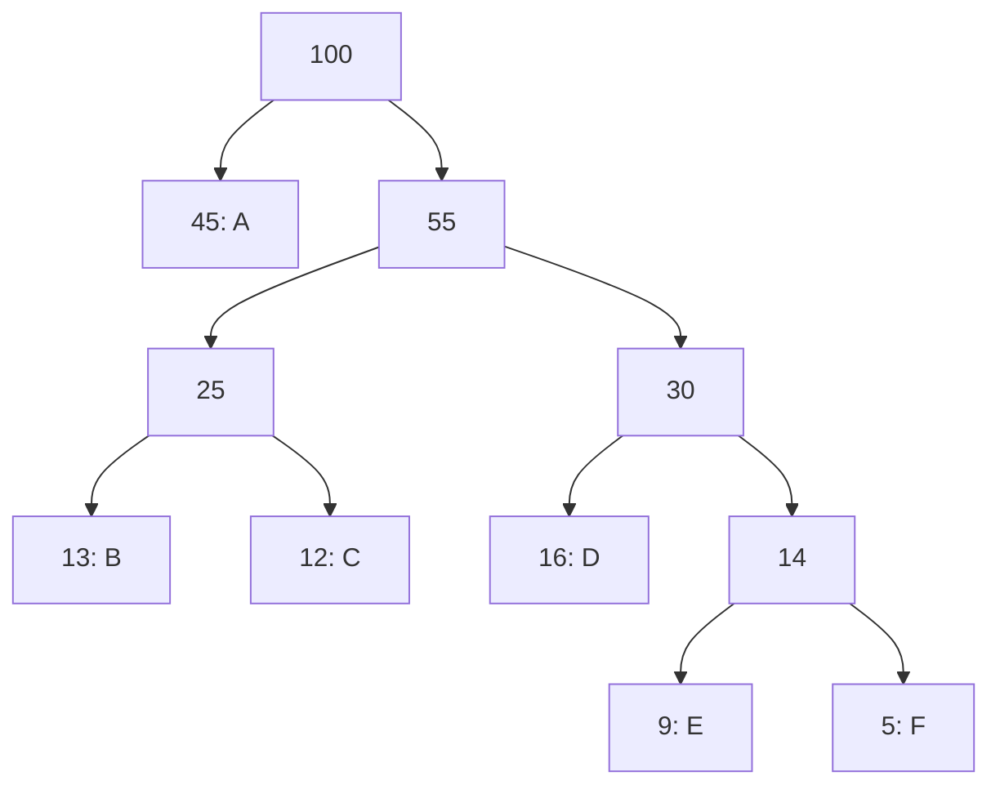

# Huffman Coding

Huffman coding is the textbook proof that greedy algorithms can achieve provably optimal solutions. It assigns variable-length binary codes to characters so that more frequent characters get shorter codes, minimizing total encoded length.

---

## The Problem

Given characters with frequencies, assign binary codes such that:
1. No code is a **prefix** of another (prefix-free → unambiguous decoding)
2. **Total encoded length is minimized**

**Example frequencies:**

| Char | Freq | Fixed 3-bit | Huffman code |
|---|---|---|---|
| A | 45 | 000 | `0` |
| B | 13 | 001 | `101` |
| C | 12 | 010 | `100` |
| D | 16 | 011 | `111` |
| E | 9  | 100 | `1101` |
| F | 5  | 101 | `1100` |

Fixed encoding: `3 × 100 = 300` bits. Huffman: `1×45 + 3×13 + 3×12 + 3×16 + 4×9 + 4×5 = 224` bits. **~25% savings.**

---

## Core Insight

Build a binary tree **bottom-up** using a min-heap:

1. Create a leaf node for each character weighted by frequency
2. Repeatedly extract the two nodes with the **smallest** frequencies
3. Merge them into a new internal node whose frequency = sum of children
4. Reinsert the merged node
5. Repeat until one root remains

The path from root to a leaf is that character's code. Frequent characters bubble up to shorter paths.



A = `0`, D = `111`, B = `101`, C = `100`, E = `1101`, F = `1100`

---

## Algorithm Walkthrough

```
Build min-heap of (freq, leaf) for each character

while heap.size > 1:
    left  = heap.extractMin()
    right = heap.extractMin()
    merged = Node(freq = left.freq + right.freq, left, right)
    heap.insert(merged)

DFS on root:
    go left  → append '0'
    go right → append '1'
    hit leaf → record code
```

**Time:** O(n log n) — n−1 merges, each O(log n) heap operation  
**Space:** O(n) — heap + tree nodes

---

## Implementation

```cpp
#include <queue>
#include <unordered_map>
using namespace std;

struct HNode {
    char ch;
    int freq;
    HNode *left, *right;
    HNode(char c, int f) : ch(c), freq(f), left(nullptr), right(nullptr) {}
    HNode(int f, HNode* l, HNode* r) : ch('\0'), freq(f), left(l), right(r) {}
};

struct Cmp { bool operator()(HNode* a, HNode* b) { return a->freq > b->freq; } };

void buildCodes(HNode* node, const string& code, unordered_map<char,string>& out) {
    if (!node) return;
    if (!node->left && !node->right) { out[node->ch] = code.empty() ? "0" : code; return; }
    buildCodes(node->left,  code + "0", out);
    buildCodes(node->right, code + "1", out);
}

unordered_map<char,string> huffman(unordered_map<char,int>& freq) {
    priority_queue<HNode*, vector<HNode*>, Cmp> pq;
    for (auto& [ch, f] : freq) pq.push(new HNode(ch, f));
    while (pq.size() > 1) {
        HNode* l = pq.top(); pq.pop();
        HNode* r = pq.top(); pq.pop();
        pq.push(new HNode(l->freq + r->freq, l, r));
    }
    unordered_map<char,string> codes;
    buildCodes(pq.top(), "", codes);
    return codes;
}
```

```java
import java.util.*;

class HNode implements Comparable<HNode> {
    char ch; int freq; HNode left, right;
    HNode(char c, int f)              { ch = c; freq = f; }
    HNode(int f, HNode l, HNode r)    { freq = f; left = l; right = r; }
    public int compareTo(HNode o)     { return this.freq - o.freq; }
}

Map<Character, String> huffman(Map<Character, Integer> freq) {
    PriorityQueue<HNode> pq = new PriorityQueue<>();
    for (var e : freq.entrySet()) pq.offer(new HNode(e.getKey(), e.getValue()));
    while (pq.size() > 1) {
        HNode l = pq.poll(), r = pq.poll();
        pq.offer(new HNode(l.freq + r.freq, l, r));
    }
    Map<Character, String> codes = new HashMap<>();
    buildCodes(pq.poll(), "", codes);
    return codes;
}

void buildCodes(HNode node, String code, Map<Character, String> codes) {
    if (node == null) return;
    if (node.left == null && node.right == null) {
        codes.put(node.ch, code.isEmpty() ? "0" : code);
        return;
    }
    buildCodes(node.left,  code + "0", codes);
    buildCodes(node.right, code + "1", codes);
}
```

```typescript
class HNode {
    ch: string; freq: number;
    left: HNode | null = null; right: HNode | null = null;
    constructor(ch: string, freq: number) { this.ch = ch; this.freq = freq; }
}

function huffman(freq: Map<string, number>): Map<string, string> {
    // Array-based min-heap (sorted insertion for clarity)
    let nodes: HNode[] = [];
    for (const [ch, f] of freq) nodes.push(new HNode(ch, f));
    nodes.sort((a, b) => a.freq - b.freq);

    while (nodes.length > 1) {
        const l = nodes.shift()!;
        const r = nodes.shift()!;
        const merged = new HNode('', l.freq + r.freq);
        merged.left = l; merged.right = r;
        let i = nodes.findIndex(n => n.freq > merged.freq);
        if (i === -1) i = nodes.length;
        nodes.splice(i, 0, merged);
    }

    const codes = new Map<string, string>();
    buildCodes(nodes[0], '', codes);
    return codes;
}

function buildCodes(node: HNode | null, code: string, codes: Map<string, string>): void {
    if (!node) return;
    if (!node.left && !node.right) { codes.set(node.ch, code || '0'); return; }
    buildCodes(node.left,  code + '0', codes);
    buildCodes(node.right, code + '1', codes);
}
```

```python
import heapq

def huffman(freq: dict[str, int]) -> dict[str, str]:
    # heap entries: (frequency, id, left_id, right_id)
    # leaf: (freq, id, char, None)
    counter = 0
    nodes: dict[int, object] = {}

    heap: list[tuple] = []
    for ch, f in freq.items():
        nodes[counter] = ch   # leaf
        heapq.heappush(heap, (f, counter))
        counter += 1

    while len(heap) > 1:
        f1, id1 = heapq.heappop(heap)
        f2, id2 = heapq.heappop(heap)
        nodes[counter] = (id1, id2)
        heapq.heappush(heap, (f1 + f2, counter))
        counter += 1

    codes: dict[str, str] = {}
    def dfs(node_id: int, code: str) -> None:
        val = nodes[node_id]
        if isinstance(val, str):          # leaf
            codes[val] = code or '0'
        else:
            dfs(val[0], code + '0')
            dfs(val[1], code + '1')

    if heap:
        dfs(heap[0][1], '')
    return codes
```

```go
import "container/heap"

type HNode struct {
    ch          rune
    freq        int
    left, right *HNode
}

type HHeap []*HNode
func (h HHeap) Len() int            { return len(h) }
func (h HHeap) Less(i, j int) bool  { return h[i].freq < h[j].freq }
func (h HHeap) Swap(i, j int)       { h[i], h[j] = h[j], h[i] }
func (h *HHeap) Push(x any)         { *h = append(*h, x.(*HNode)) }
func (h *HHeap) Pop() any           { old := *h; n := len(old); x := old[n-1]; *h = old[:n-1]; return x }

func buildCodes(node *HNode, code string, codes map[rune]string) {
    if node == nil { return }
    if node.left == nil && node.right == nil {
        if code == "" { code = "0" }
        codes[node.ch] = code
        return
    }
    buildCodes(node.left,  code+"0", codes)
    buildCodes(node.right, code+"1", codes)
}

func huffman(freq map[rune]int) map[rune]string {
    h := &HHeap{}
    for ch, f := range freq {
        heap.Push(h, &HNode{ch: ch, freq: f})
    }
    heap.Init(h)
    for h.Len() > 1 {
        l := heap.Pop(h).(*HNode)
        r := heap.Pop(h).(*HNode)
        heap.Push(h, &HNode{freq: l.freq + r.freq, left: l, right: r})
    }
    codes := map[rune]string{}
    buildCodes(heap.Pop(h).(*HNode), "", codes)
    return codes
}
```

**Time:** O(n log n) — **Space:** O(n)

---

## Why Greedy Is Optimal Here

**Exchange argument:** Suppose symbols $a$ and $b$ have the lowest frequencies. In any optimal tree, the two deepest leaves (longest codes) can always be swapped for $a$ and $b$ without increasing total cost — because making lower-frequency symbols deeper can only help. Therefore, $a$ and $b$ belong at the deepest level, which means they should be merged first.

---

## Interview Applications

Huffman itself is rare in interviews, but its **min-heap greedy pattern** appears everywhere:

| Problem | Connection to Huffman |
|---|---|
| Connect Ropes / LC 1167 | Exact Huffman: always merge two cheapest |
| Reorganize String (LC 767) | Most-frequent first using heap |
| Task Scheduler (LC 621) | Most-frequent first; count idle slots |
| Top K Frequent Elements (LC 347) | Heap on frequencies |
| K Closest Points (LC 973) | Min-heap on distances |
| Kth Largest Element (LC 215) | Heap of size k |

---

## Connect Ropes — The Purest Application

Given rope lengths, repeatedly connect the two shortest ropes. Cost = sum of lengths joined each time. Minimize total cost.

This is exactly the Huffman merge sequence.

```cpp
int connectRopes(vector<int>& ropes) {
    priority_queue<int, vector<int>, greater<int>> pq(ropes.begin(), ropes.end());
    int total = 0;
    while (pq.size() > 1) {
        int a = pq.top(); pq.pop();
        int b = pq.top(); pq.pop();
        total += a + b;
        pq.push(a + b);
    }
    return total;
}
```

```java
int connectRopes(int[] ropes) {
    PriorityQueue<Integer> pq = new PriorityQueue<>();
    for (int r : ropes) pq.offer(r);
    int total = 0;
    while (pq.size() > 1) {
        int a = pq.poll(), b = pq.poll();
        total += a + b;
        pq.offer(a + b);
    }
    return total;
}
```

```typescript
function connectRopes(ropes: number[]): number {
    ropes.sort((a, b) => a - b);
    let total = 0;
    while (ropes.length > 1) {
        ropes.sort((a, b) => a - b); // re-sort after insert (use real min-heap in prod)
        const a = ropes.shift()!;
        const b = ropes.shift()!;
        total += a + b;
        ropes.push(a + b);
    }
    return total;
}
```

```python
import heapq

def connect_ropes(ropes: list[int]) -> int:
    heapq.heapify(ropes)
    total = 0
    while len(ropes) > 1:
        a = heapq.heappop(ropes)
        b = heapq.heappop(ropes)
        total += a + b
        heapq.heappush(ropes, a + b)
    return total
```

```go
func connectRopes(ropes []int) int {
    h := &IntMinHeap{}
    for _, r := range ropes { heap.Push(h, r) }
    heap.Init(h)
    total := 0
    for h.Len() > 1 {
        a := heap.Pop(h).(int)
        b := heap.Pop(h).(int)
        total += a + b
        heap.Push(h, a+b)
    }
    return total
}
```

**Time:** O(n log n) — **Space:** O(n)

---

## Key Takeaways

1. **Huffman's greedy choice:** Always merge two *least-frequent* nodes — provably optimal via exchange argument
2. **The pattern:** Process cheapest/smallest first → use a min-heap
3. **Prefix-free codes** map to binary tree paths — code length = leaf depth
4. **Connection to information theory:** Huffman achieves expected code length within 1 bit of Shannon entropy
5. **In interviews:** Recognize the "always merge smallest two" structure — it's Huffman in disguise
