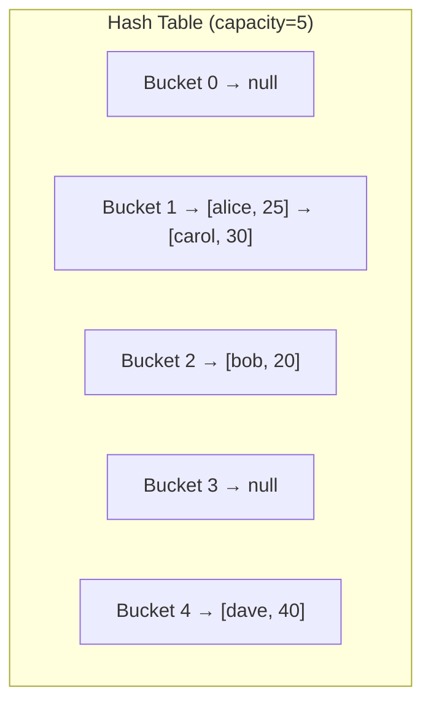

# Collision Resolution

A **collision** occurs when two different keys hash to the same bucket index. Since any hash function can produce the same output for different inputs, every hash table must handle collisions. The collision resolution strategy determines the hash table's real-world performance.

Understanding this is valuable for:
- Answering "how does a hash map work internally?"
- Understanding worst-case O(n) behavior
- System design interviews (choosing the right data store)

## Why Collisions Happen

For a hash table with capacity `m` and `n` keys, the expected number of collisions starts rising significantly when `n > m * load_factor`. Most implementations resize (rehash) when `load_factor > 0.75`.

Even with a perfect hash function and low load factor, by the **Birthday Paradox**, collisions become probable once you have ~√m elements. This is why no hash table can guarantee O(1) in the absolute worst case — but a good implementation makes worst case essentially impossible.

## Strategy 1: Separate Chaining

Each bucket holds a **linked list** (or other container) of all elements that hash to that bucket.



**alice** and **carol** both hashed to bucket 1 — they form a chain.

### Lookup in Chaining

```
get("carol"):
1. hash("carol") % 5 → 1
2. Walk bucket[1]'s chain:
   - "alice" ≠ "carol", skip
   - "carol" == "carol" → return 30
```

### Complexity with Chaining

| | Average (uniform hash) | Worst (all same bucket) |
|---|---|---|
| `get` / `put` / `remove` | O(1 + α) | O(n) |
| Space | O(n + m) | O(n + m) |

Where `α = n/m` is the **load factor**. With `α ≤ 0.75`, average operations stay O(1).

**Used by:** Java `HashMap`, Python `dict` (modern CPython uses a different scheme but chaining conceptually), most standard library implementations.

## Strategy 2: Open Addressing

No chains — all elements live **inside the array** itself. On a collision, probe (search) for the next available slot.

### Linear Probing

On collision at index `h`, try `h+1`, `h+2`, ... (wrapping around).

```
Insert "alice" → hash % 5 = 1 → bucket[1] empty → store at 1
Insert "carol" → hash % 5 = 1 → bucket[1] full → try 2 → store at 2
Insert "eve"   → hash % 5 = 2 → bucket[2] full → try 3 → store at 3
```

**Problem: Primary clustering** — runs of occupied slots form, causing future insertions to probe through the entire cluster.

### Quadratic Probing

On collision at `h`, try `h + 1²`, `h + 2²`, `h + 3²`, ...

Reduces primary clustering but can miss slots (not guaranteed to probe all buckets unless table size is prime or power of 2).

### Double Hashing

On collision at `h`, try `h + i × h2(key)` for i = 1, 2, 3... where `h2` is a second hash function.

Best distribution of all open addressing methods. No clustering.

### Deletion in Open Addressing

Deleting an element creates a "hole" that breaks probe chains. You must use a **tombstone** marker instead of simply emptying the slot.

```
State before: [_, alice, carol, eve, _]
               0     1      2    3   4
Delete "carol" (index 2):
  Wrong:  [_, alice,  _  , eve, _]  ← get("eve") would stop at the gap!
  Correct:[_, alice, DEL , eve, _]  ← tombstone; search continues past DEL
```

### Complexity with Open Addressing

| | Average (α < 0.5) | Worst |
|---|---|---|
| `get` / `put` | O(1) | O(n) |
| Space | O(m) — no extra lists | O(m) |

Better cache performance than chaining (all data in one array, no pointer chasing), but degrades quickly as load factor approaches 1.

**Used by:** Python `set` and `dict` (compact table with open addressing), C++ `std::unordered_map` uses chaining.

## Strategy 3: Robin Hood Hashing

A refinement of open addressing. When inserting an element that must probe forward, it "steals" from richer slots — if the current probe element has traveled *fewer* slots from its ideal position than the inserting element, the inserting element displaces it.

This bounds the maximum probe distance and makes performance more uniform (reduces variance, not average).

**Used by:** Rust's `HashMap`, some high-performance databases.

## Rehashing

When the load factor exceeds a threshold, the table **doubles its capacity** and re-inserts all elements with new hash indices.

| Event | Action | Cost |
|---|---|---|
| Load factor > threshold (usually 0.75) | Double capacity, rehash all | O(n) — amortized O(1) per insert |
| Load factor < threshold (usually 0.25) | Halve capacity (some implementations) | O(n) — amortized O(1) per remove |

The amortized O(1) analysis: starting from empty, to insert n elements, you rehash at sizes 1, 2, 4, 8, ..., n. Total work is `1 + 2 + 4 + ... + n ≈ 2n` = O(n) for n insertions = O(1) each.

## Hash Functions

A good hash function produces **uniform distribution** — keys spread evenly across buckets.

### Integer Keys

```
hash(k) = k % m          // simple but clusters on non-prime m
hash(k) = (a*k + b) % p % m  // universal hashing (a,b random, p prime)
```

### String Keys

```
// Polynomial rolling hash
hash("abc") = 'a'*31² + 'b'*31¹ + 'c'*31⁰  mod m
```

This is essentially what Java's `String.hashCode()` computes (with base 31).

### Anti-hash-attack: Random Salt

Adversarial inputs can be crafted to force all keys to the same bucket, degrading to O(n²). Modern language runtimes add **random salt** to hash functions (changed per process run) to prevent this:

- Python 3.3+: PYTHONHASHSEED randomization
- Java: `HashMap` uses a secondary hash function to scramble `hashCode()` output
- Rust: uses SipHash (cryptographic, resistant to DoS)

## Interview Quick Reference

| Question | Answer |
|---|---|
| "Why is HashMap O(1) average?" | Uniform hash function distributes keys evenly, so each bucket has ~1 element on average |
| "When is HashMap O(n) worst case?" | All keys hash to the same bucket (adversarial input or degenerate hash function) |
| "HashMap vs TreeMap?" | HashMap: O(1) ops, no order. TreeMap: O(log n) ops, sorted keys |
| "Why load factor 0.75?" | Balances time (low collisions with more space) vs space (fewer empty buckets) |
| "What happens on resize?" | All entries are re-inserted with new indices — O(n) but amortized O(1) |
| "Why not use array index as hash?" | Keys may not be integers, or may be large integers — need mapping to bounded range |

## Java `HashMap` Specifics

Java's `HashMap` uses **separate chaining**, but with a twist: when a bucket's chain length exceeds **8**, it converts the chain into a **red-black tree** (O(log n) per bucket, O(log n) worst case instead of O(n)).

```
Bucket chain length ≤ 8  → linked list   (O(n) bucket worst case)
Bucket chain length > 8  → red-black tree (O(log n) bucket worst case)
```

This is why Java's `HashMap` is more robust against degenerate inputs than naive implementations.

## Python `dict` Specifics

Python uses **open addressing with compact tables**. The probe sequence is not purely linear — it uses:

```python
# Simplified probe sequence
slot = hash(key) % size
# On collision:
slot = (5 * slot + 1 + perturbation) % size
perturbation >>= 5
```

This pseudorandom sequence visits all slots for power-of-2 table sizes, avoiding clustering better than pure linear probing.

