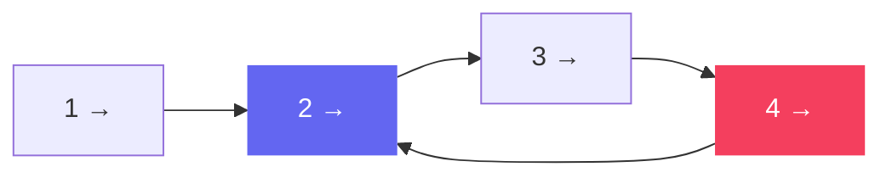
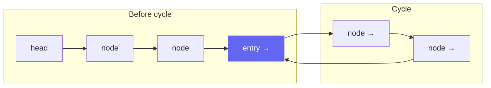

# Circular Linked List

In a circular linked list, the **tail node points back to some earlier node** instead of `null`. This can be intentional (ring buffer, round-robin scheduler) or a bug introduced by incorrect pointer manipulation.



The node marked in purple is the **cycle entry point**. The tail loops back to it.

## Types

| Type | Description |
|---|---|
| Full cycle | Tail points back to head |
| Partial cycle | Tail points to an intermediate node |

In interviews, "circular linked list" almost always means **detect/find a cycle** — not necessarily that the tail points to head.

## Cycle Detection: Floyd's Algorithm

Floyd's Cycle Detection (also called the **tortoise and hare** algorithm) is the canonical O(1) space solution.

**Phase 1 — Detect:** Move `slow` one step, `fast` two steps. If they meet, a cycle exists.

**Phase 2 — Find entry:** Reset `slow` to `head`, keep `fast` at meeting point. Move both one step at a time. Where they meet is the cycle entry.



**Why phase 2 works (the math):**

Let:
- $F$ = distance from head to cycle entry
- $C$ = cycle length
- $a$ = distance from entry to meeting point

When slow and fast meet:
- Slow traveled: $F + a$
- Fast traveled: $F + a + nC$ (went around the cycle $n$ times more)
- Fast = 2 × slow: $2(F + a) = F + a + nC$
- Therefore: $F = nC - a$

So after the meeting, if we move one pointer from head and another from the meeting point, they both reach the entry at the same time.

### Phase 1: Detect cycle

```cpp
bool hasCycle(ListNode* head) {
    ListNode* slow = head;
    ListNode* fast = head;
    while (fast != nullptr && fast->next != nullptr) {
        slow = slow->next;
        fast = fast->next->next;
        if (slow == fast) return true;
    }
    return false;
}
```

```java
boolean hasCycle(ListNode head) {
    ListNode slow = head, fast = head;
    while (fast != null && fast.next != null) {
        slow = slow.next;
        fast = fast.next.next;
        if (slow == fast) return true;
    }
    return false;
}
```

```typescript
function hasCycle(head: ListNode | null): boolean {
    let slow = head, fast = head;
    while (fast !== null && fast.next !== null) {
        slow = slow!.next;
        fast = fast.next.next;
        if (slow === fast) return true;
    }
    return false;
}
```

```python
def has_cycle(head: ListNode | None) -> bool:
    slow = fast = head
    while fast and fast.next:
        slow = slow.next
        fast = fast.next.next
        if slow is fast:
            return True
    return False
```

```go
func hasCycle(head *ListNode) bool {
    slow, fast := head, head
    for fast != nil && fast.Next != nil {
        slow = slow.Next
        fast = fast.Next.Next
        if slow == fast {
            return true
        }
    }
    return false
}
```

### Phase 2: Find cycle entry

```cpp
ListNode* detectCycle(ListNode* head) {
    ListNode* slow = head;
    ListNode* fast = head;

    while (fast != nullptr && fast->next != nullptr) {
        slow = slow->next;
        fast = fast->next->next;
        if (slow == fast) {
            // Phase 2
            slow = head;
            while (slow != fast) {
                slow = slow->next;
                fast = fast->next;
            }
            return slow;
        }
    }
    return nullptr;
}
```

```java
ListNode detectCycle(ListNode head) {
    ListNode slow = head, fast = head;

    while (fast != null && fast.next != null) {
        slow = slow.next;
        fast = fast.next.next;
        if (slow == fast) {
            slow = head;
            while (slow != fast) {
                slow = slow.next;
                fast = fast.next;
            }
            return slow;
        }
    }
    return null;
}
```

```typescript
function detectCycle(head: ListNode | null): ListNode | null {
    let slow = head, fast = head;

    while (fast !== null && fast.next !== null) {
        slow = slow!.next;
        fast = fast.next.next;
        if (slow === fast) {
            slow = head;
            while (slow !== fast) {
                slow = slow!.next;
                fast = fast!.next;
            }
            return slow;
        }
    }
    return null;
}
```

```python
def detect_cycle(head: ListNode | None) -> ListNode | None:
    slow = fast = head
    while fast and fast.next:
        slow = slow.next
        fast = fast.next.next
        if slow is fast:
            slow = head
            while slow is not fast:
                slow = slow.next
                fast = fast.next
            return slow
    return None
```

```go
func detectCycle(head *ListNode) *ListNode {
    slow, fast := head, head

    for fast != nil && fast.Next != nil {
        slow = slow.Next
        fast = fast.Next.Next
        if slow == fast {
            slow = head
            for slow != fast {
                slow = slow.Next
                fast = fast.Next
            }
            return slow
        }
    }
    return nil
}
```

**Time:** O(n) — **Space:** O(1)

## Alternative: Hash Set Detection

Simpler to understand but uses O(n) space.

```cpp
bool hasCycle(ListNode* head) {
    unordered_set<ListNode*> seen;
    while (head != nullptr) {
        if (seen.count(head)) return true;
        seen.insert(head);
        head = head->next;
    }
    return false;
}
```

```java
boolean hasCycle(ListNode head) {
    Set<ListNode> seen = new HashSet<>();
    while (head != null) {
        if (!seen.add(head)) return true;
        head = head.next;
    }
    return false;
}
```

```typescript
function hasCycle(head: ListNode | null): boolean {
    const seen = new Set<ListNode>();
    while (head !== null) {
        if (seen.has(head)) return true;
        seen.add(head);
        head = head.next;
    }
    return false;
}
```

```python
def has_cycle(head: ListNode | None) -> bool:
    seen = set()
    while head:
        if id(head) in seen:
            return True
        seen.add(id(head))
        head = head.next
    return False
```

```go
func hasCycle(head *ListNode) bool {
    seen := map[*ListNode]bool{}
    for head != nil {
        if seen[head] {
            return true
        }
        seen[head] = true
        head = head.Next
    }
    return false
}
```

**Time:** O(n) — **Space:** O(n)

## Cycle Length

After Floyd's phase 1 (slow == fast), keep slow fixed and move fast until they meet again, counting steps:

```python
# After detecting meeting point
length = 1
fast = fast.next
while slow != fast:
    fast = fast.next
    length += 1
```

## Key Interview Insights

- **Floyd's algorithm needs the `fast != null && fast.next != null` guard** — without it you get a null pointer exception on acyclic lists.
- **`slow is fast` (Python)** — use identity comparison, not equality (`==`), to check if two pointers point to the **same object**.
- **Find Duplicate Number (LC 287)** uses Floyd's cycle detection on an array treated as a linked list. Array values are "next pointers". See that problem for the full application.
- **Intentional circular lists** (ring buffers, round-robin) are common in systems design but rare in coding interviews. The interview focus is almost always detection/removal.

