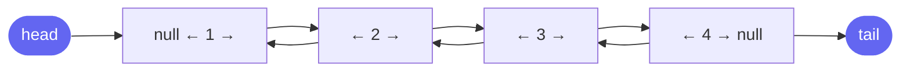

# Doubly Linked List

A doubly linked list (DLL) extends a singly linked list with a **`prev` pointer** on each node. This enables O(1) deletion when you have a reference to a node, and bidirectional traversal.



## Node Definition

```cpp
struct ListNode {
    int val;
    ListNode* prev;
    ListNode* next;
    ListNode(int x) : val(x), prev(nullptr), next(nullptr) {}
};
```

```java
class ListNode {
    int val;
    ListNode prev, next;
    ListNode(int x) { val = x; }
}
```

```typescript
class ListNode {
    val: number;
    prev: ListNode | null = null;
    next: ListNode | null = null;
    constructor(val: number) { this.val = val; }
}
```

```python
class ListNode:
    def __init__(self, val: int):
        self.val = val
        self.prev = None
        self.next = None
```

```go
type ListNode struct {
    Val  int
    Prev *ListNode
    Next *ListNode
}
```

## Singly vs Doubly

| Operation | Singly | Doubly |
|---|---|---|
| Delete node (given reference) | O(n) — need to find prev | O(1) — have prev directly |
| Insert before a node | O(n) | O(1) |
| Traverse backwards | O(n) — must restart | O(n) from tail |
| Space per node | One pointer | Two pointers |
| Implementation complexity | Simple | More pointer updates |

> **When to use DLL:** When you need O(1) deletion given a node reference. The canonical interview application is **LRU Cache** — you need to remove an arbitrary node from the middle of the list in O(1).

## Core Operations

### Insert at Head — O(1)

```cpp
void insertHead(ListNode*& head, int val) {
    ListNode* node = new ListNode(val);
    node->next = head;
    if (head) head->prev = node;
    head = node;
}
```

```java
ListNode insertHead(ListNode head, int val) {
    ListNode node = new ListNode(val);
    node.next = head;
    if (head != null) head.prev = node;
    return node;
}
```

```typescript
function insertHead(head: ListNode | null, val: number): ListNode {
    const node = new ListNode(val);
    node.next = head;
    if (head !== null) head.prev = node;
    return node;
}
```

```python
def insert_head(head: ListNode | None, val: int) -> ListNode:
    node = ListNode(val)
    node.next = head
    if head:
        head.prev = node
    return node
```

```go
func insertHead(head *ListNode, val int) *ListNode {
    node := &ListNode{Val: val, Next: head}
    if head != nil {
        head.Prev = node
    }
    return node
}
```

### Delete a Node in O(1)

Given a direct reference to a node (no need to traverse), unlinking requires updating just four pointers:

```cpp
void deleteNode(ListNode*& head, ListNode* node) {
    if (node->prev) {
        node->prev->next = node->next;
    } else {
        head = node->next; // deleting head
    }
    if (node->next) {
        node->next->prev = node->prev;
    }
}
```

```java
ListNode deleteNode(ListNode head, ListNode node) {
    if (node.prev != null) {
        node.prev.next = node.next;
    } else {
        head = node.next; // deleting head
    }
    if (node.next != null) {
        node.next.prev = node.prev;
    }
    return head;
}
```

```typescript
function deleteNode(head: ListNode | null, node: ListNode): ListNode | null {
    if (node.prev !== null) {
        node.prev.next = node.next;
    } else {
        head = node.next;
    }
    if (node.next !== null) {
        node.next.prev = node.prev;
    }
    return head;
}
```

```python
def delete_node(head: ListNode | None, node: ListNode) -> ListNode | None:
    if node.prev:
        node.prev.next = node.next
    else:
        head = node.next
    if node.next:
        node.next.prev = node.prev
    return head
```

```go
func deleteNode(head *ListNode, node *ListNode) *ListNode {
    if node.Prev != nil {
        node.Prev.Next = node.Next
    } else {
        head = node.Next
    }
    if node.Next != nil {
        node.Next.Prev = node.Prev
    }
    return head
}
```

## The Sentinel (Dummy Head + Tail) Pattern

The canonical DLL implementation for interviews uses **two sentinel nodes** — a dummy head and dummy tail. This removes all boundary checks:

```
[dummy_head] ↔ [node1] ↔ [node2] ↔ ... ↔ [dummy_tail]
```

Insert/delete operations always have valid `prev` and `next` pointers — no null checks needed.

```cpp
class DLL {
    ListNode* dummyHead;
    ListNode* dummyTail;

public:
    DLL() {
        dummyHead = new ListNode(0);
        dummyTail = new ListNode(0);
        dummyHead->next = dummyTail;
        dummyTail->prev = dummyHead;
    }

    void insertFront(ListNode* node) {
        node->next = dummyHead->next;
        node->prev = dummyHead;
        dummyHead->next->prev = node;
        dummyHead->next = node;
    }

    void remove(ListNode* node) {
        node->prev->next = node->next;
        node->next->prev = node->prev;
    }

    ListNode* removeLast() {
        ListNode* last = dummyTail->prev;
        remove(last);
        return last;
    }
};
```

```java
class DLL {
    ListNode dummyHead, dummyTail;

    DLL() {
        dummyHead = new ListNode(0);
        dummyTail = new ListNode(0);
        dummyHead.next = dummyTail;
        dummyTail.prev = dummyHead;
    }

    void insertFront(ListNode node) {
        node.next = dummyHead.next;
        node.prev = dummyHead;
        dummyHead.next.prev = node;
        dummyHead.next = node;
    }

    void remove(ListNode node) {
        node.prev.next = node.next;
        node.next.prev = node.prev;
    }

    ListNode removeLast() {
        ListNode last = dummyTail.prev;
        remove(last);
        return last;
    }
}
```

```typescript
class DLL {
    dummyHead: ListNode;
    dummyTail: ListNode;

    constructor() {
        this.dummyHead = new ListNode(0);
        this.dummyTail = new ListNode(0);
        this.dummyHead.next = this.dummyTail;
        this.dummyTail.prev = this.dummyHead;
    }

    insertFront(node: ListNode): void {
        node.next = this.dummyHead.next;
        node.prev = this.dummyHead;
        this.dummyHead.next!.prev = node;
        this.dummyHead.next = node;
    }

    remove(node: ListNode): void {
        node.prev!.next = node.next;
        node.next!.prev = node.prev;
    }

    removeLast(): ListNode {
        const last = this.dummyTail.prev!;
        this.remove(last);
        return last;
    }
}
```

```python
class DLL:
    def __init__(self):
        self.dummy_head = ListNode(0)
        self.dummy_tail = ListNode(0)
        self.dummy_head.next = self.dummy_tail
        self.dummy_tail.prev = self.dummy_head

    def insert_front(self, node: ListNode) -> None:
        node.next = self.dummy_head.next
        node.prev = self.dummy_head
        self.dummy_head.next.prev = node
        self.dummy_head.next = node

    def remove(self, node: ListNode) -> None:
        node.prev.next = node.next
        node.next.prev = node.prev

    def remove_last(self) -> ListNode:
        last = self.dummy_tail.prev
        self.remove(last)
        return last
```

```go
type DLL struct {
    dummyHead *ListNode
    dummyTail *ListNode
}

func NewDLL() *DLL {
    head := &ListNode{}
    tail := &ListNode{}
    head.Next = tail
    tail.Prev = head
    return &DLL{dummyHead: head, dummyTail: tail}
}

func (d *DLL) InsertFront(node *ListNode) {
    node.Next = d.dummyHead.Next
    node.Prev = d.dummyHead
    d.dummyHead.Next.Prev = node
    d.dummyHead.Next = node
}

func (d *DLL) Remove(node *ListNode) {
    node.Prev.Next = node.Next
    node.Next.Prev = node.Prev
}

func (d *DLL) RemoveLast() *ListNode {
    last := d.dummyTail.Prev
    d.Remove(last)
    return last
}
```

## Common Interview Application: LRU Cache

The LRU Cache problem is the primary reason you need to know DLLs in interviews. It combines a **HashMap** (for O(1) lookup) with a **DLL** (for O(1) promotion and eviction):

- **Get:** Look up node in map, move to front of DLL (most recently used)
- **Put:** Insert at front, evict from back if over capacity

This is covered in depth in the [LRU Cache problem](problems/lru-cache).

## Edge Cases

- **Updating all four pointers** on insert — missing one leaves a dangling reference
- **Deleting head or tail** — sentinel pattern eliminates this entirely
- **Single node list** — `dummyHead.next == dummyTail.prev == node`

