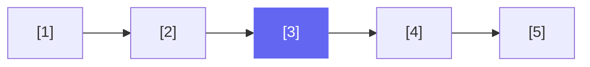

# Fast & Slow Pointers

The fast & slow pointer pattern (also called **tortoise and hare**) uses two pointers that move at different speeds through a linked list. This exploits the mathematical relationship between their positions to answer structural questions about the list in **O(n) time, O(1) space**.

## Core Intuition

If two runners start at the same point on a circular track and one runs twice as fast, they will **always meet**. This simple insight solves cycle detection. Extending the math gives us the cycle entry point, middle node, and k-th from end node.

## Speed Configurations

| Configuration | Slow | Fast | Use Case |
|---|---|---|---|
| 1× and 2× | +1 | +2 | Cycle detection, middle, entry |
| 1× and 1× (different starts) | head | k ahead | K-th from end |

## Pattern 1: Find Middle Node

Move fast two steps for every one step slow. When fast reaches the end, slow is at the middle.



For a list of length 5, slow stops at node 3 (index 2). For even lengths, slow stops at the **second** of the two middle nodes.

```cpp
ListNode* findMiddle(ListNode* head) {
    ListNode* slow = head;
    ListNode* fast = head;
    while (fast != nullptr && fast->next != nullptr) {
        slow = slow->next;
        fast = fast->next->next;
    }
    return slow;
}
```

```java
ListNode findMiddle(ListNode head) {
    ListNode slow = head, fast = head;
    while (fast != null && fast.next != null) {
        slow = slow.next;
        fast = fast.next.next;
    }
    return slow;
}
```

```typescript
function findMiddle(head: ListNode | null): ListNode | null {
    let slow = head, fast = head;
    while (fast !== null && fast.next !== null) {
        slow = slow!.next;
        fast = fast.next.next;
    }
    return slow;
}
```

```python
def find_middle(head: ListNode | None) -> ListNode | None:
    slow = fast = head
    while fast and fast.next:
        slow = slow.next
        fast = fast.next.next
    return slow
```

```go
func findMiddle(head *ListNode) *ListNode {
    slow, fast := head, head
    for fast != nil && fast.Next != nil {
        slow = slow.Next
        fast = fast.Next.Next
    }
    return slow
}
```

**Why `fast != null && fast.next != null`?** For even-length lists, `fast.next` reaches null before `fast`. Both guards are needed.

**Even vs Odd length behavior:**

| List | Length | slow stops at |
|---|---|---|
| 1 → 2 → 3 | 3 (odd) | node 2 (true middle) |
| 1 → 2 → 3 → 4 | 4 (even) | node 3 (second middle) |
| 1 → 2 → 3 → 4 → 5 | 5 (odd) | node 3 (true middle) |

If you want the **first** middle for even-length lists, stop when `fast.next.next == null`:

```python
# First middle for even-length lists
while fast.next and fast.next.next:
    slow = slow.next
    fast = fast.next.next
```

## Pattern 2: Detect Cycle

If there's a cycle, fast will lap slow and they will meet inside it.

```cpp
bool hasCycle(ListNode* head) {
    ListNode* slow = head;
    ListNode* fast = head;
    while (fast != nullptr && fast->next != nullptr) {
        slow = slow->next;
        fast = fast->next->next;
        if (slow == fast) return true;
    }
    return false;
}
```

```java
boolean hasCycle(ListNode head) {
    ListNode slow = head, fast = head;
    while (fast != null && fast.next != null) {
        slow = slow.next;
        fast = fast.next.next;
        if (slow == fast) return true;
    }
    return false;
}
```

```typescript
function hasCycle(head: ListNode | null): boolean {
    let slow = head, fast = head;
    while (fast !== null && fast.next !== null) {
        slow = slow!.next;
        fast = fast.next.next;
        if (slow === fast) return true;
    }
    return false;
}
```

```python
def has_cycle(head: ListNode | None) -> bool:
    slow = fast = head
    while fast and fast.next:
        slow = slow.next
        fast = fast.next.next
        if slow is fast:
            return True
    return False
```

```go
func hasCycle(head *ListNode) bool {
    slow, fast := head, head
    for fast != nil && fast.Next != nil {
        slow = slow.Next
        fast = fast.Next.Next
        if slow == fast {
            return true
        }
    }
    return false
}
```

## Pattern 3: Find Cycle Entry

After phase 1 (slow == fast), reset slow to head. Move both one step. They meet at the entry.

See [Circular Linked List](../circular-linked-list) for the mathematical proof and full code.

## Pattern 4: K-th Node from End

Move fast `k` steps ahead first. Then move both one step at a time. When fast reaches null, slow is at the k-th from end.

```cpp
ListNode* kthFromEnd(ListNode* head, int k) {
    ListNode* slow = head;
    ListNode* fast = head;
    // Move fast k steps ahead
    for (int i = 0; i < k; i++) {
        if (fast == nullptr) return nullptr; // k > length
        fast = fast->next;
    }
    // Move both until fast reaches end
    while (fast != nullptr) {
        slow = slow->next;
        fast = fast->next;
    }
    return slow;
}
```

```java
ListNode kthFromEnd(ListNode head, int k) {
    ListNode slow = head, fast = head;
    for (int i = 0; i < k; i++) {
        if (fast == null) return null;
        fast = fast.next;
    }
    while (fast != null) {
        slow = slow.next;
        fast = fast.next;
    }
    return slow;
}
```

```typescript
function kthFromEnd(head: ListNode | null, k: number): ListNode | null {
    let slow = head, fast = head;
    for (let i = 0; i < k; i++) {
        if (fast === null) return null;
        fast = fast.next;
    }
    while (fast !== null) {
        slow = slow!.next;
        fast = fast.next;
    }
    return slow;
}
```

```python
def kth_from_end(head: ListNode | None, k: int) -> ListNode | None:
    slow = fast = head
    for _ in range(k):
        if not fast:
            return None
        fast = fast.next
    while fast:
        slow = slow.next
        fast = fast.next
    return slow
```

```go
func kthFromEnd(head *ListNode, k int) *ListNode {
    slow, fast := head, head
    for i := 0; i < k; i++ {
        if fast == nil {
            return nil
        }
        fast = fast.Next
    }
    for fast != nil {
        slow = slow.Next
        fast = fast.Next
    }
    return slow
}
```

**Dry Run:** List = `1 → 2 → 3 → 4 → 5`, k = 2

- Fast advances 2 steps: fast at node 3
- Both advance: slow=2, fast=4 → slow=3, fast=5 → slow=4, fast=null
- Return slow → node 4 (2nd from end) ✓

## Pattern 5: Palindrome Check

The fast & slow pattern is the key step in palindrome linked list detection:
1. Find the middle using fast/slow
2. Reverse the second half
3. Compare both halves
4. (Optionally restore the list)

## When to Reach for Fast & Slow

**Identification signals:**
- "Middle of the list" with O(1) space
- "Does a cycle exist?"
- "Find where the cycle starts"
- "K-th from the end" (without knowing length)
- "Palindrome linked list"
- "Reorder list" (combines middle + reverse + merge)

## Common Pitfalls

1. **Checking `fast == slow` before advancing** — you'd immediately return true on the first iteration since both start at head. Always advance first, then check.
2. **Missing `fast.next` null guard** — for even-length acyclic lists, `fast.next.next` would crash.
3. **Wrong middle for even-length lists** — know whether your problem needs the first or second middle node.
4. **Not using identity comparison** — in Python, use `is` not `==` to compare node references.
5. **Modifying the list during traversal** — if you reverse one half, don't lose the reference to the other half.

## Complexity

| Problem | Time | Space |
|---|---|---|
| Find middle | O(n) | O(1) |
| Detect cycle | O(n) | O(1) |
| Find cycle entry | O(n) | O(1) |
| Kth from end | O(n) | O(1) |
| Palindrome check | O(n) | O(1) |

