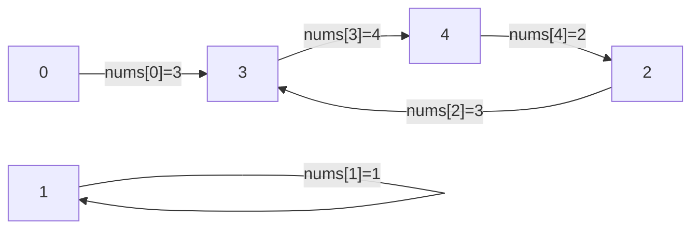

# Find the Duplicate Number

| | |
|---|---|
| **Difficulty** | Medium |
| **LeetCode** | [287. Find the Duplicate Number](https://leetcode.com/problems/find-the-duplicate-number/) |
| **Tags** | Array, Two Pointers, Bit Manipulation |

## Problem Statement

Given an array of integers `nums` containing `n + 1` integers where each integer is in the range `[1, n]`, there is only one repeated number — find it.

**Constraints:** Must not modify the array. Must use O(1) extra space (for the optimal solution). Only one duplicate exists (but may appear more than twice).

## Intuition

The key observation: since values are in range `[1, n]` and indices are `[0, n]`, we can treat the array as a **linked list** where `nums[i]` is the "next pointer" from index `i`. Because there's a duplicate value, two indices point to the same next index — creating a **cycle**. The duplicate number is the cycle entry point.

This reduces to LC 142: Find cycle entry using Floyd's algorithm.



`nums = [3, 1, 3, 4, 2]` → cycle entry is 3 (the duplicate).

## Approach 1: Hash Set

Simple but uses O(n) space — useful to explain the constraint violation first.

```cpp
class Solution {
public:
    int findDuplicate(vector<int>& nums) {
        unordered_set<int> seen;
        for (int n : nums) {
            if (seen.count(n)) return n;
            seen.insert(n);
        }
        return -1;
    }
};
```

```java
class Solution {
    public int findDuplicate(int[] nums) {
        Set<Integer> seen = new HashSet<>();
        for (int n : nums) {
            if (!seen.add(n)) return n;
        }
        return -1;
    }
}
```

```typescript
function findDuplicate(nums: number[]): number {
    const seen = new Set<number>();
    for (const n of nums) {
        if (seen.has(n)) return n;
        seen.add(n);
    }
    return -1;
}
```

```python
class Solution:
    def findDuplicate(self, nums: list[int]) -> int:
        seen = set()
        for n in nums:
            if n in seen:
                return n
            seen.add(n)
        return -1
```

```go
func findDuplicate(nums []int) int {
    seen := map[int]bool{}
    for _, n := range nums {
        if seen[n] { return n }
        seen[n] = true
    }
    return -1
}
```

**Time:** O(n) — **Space:** O(n)

## Approach 2: Floyd's Cycle Detection (Optimal)

Treat `nums[i]` as the next pointer from index `i`. Phase 1 finds the meeting point inside the cycle. Phase 2 finds the entry (the duplicate).

```cpp
class Solution {
public:
    int findDuplicate(vector<int>& nums) {
        // Phase 1: Find intersection point
        int slow = nums[0];
        int fast = nums[nums[0]];
        while (slow != fast) {
            slow = nums[slow];
            fast = nums[nums[fast]];
        }

        // Phase 2: Find cycle entry (the duplicate)
        slow = 0;
        while (slow != fast) {
            slow = nums[slow];
            fast = nums[fast];
        }
        return slow;
    }
};
```

```java
class Solution {
    public int findDuplicate(int[] nums) {
        int slow = nums[0];
        int fast = nums[nums[0]];
        while (slow != fast) {
            slow = nums[slow];
            fast = nums[nums[fast]];
        }

        slow = 0;
        while (slow != fast) {
            slow = nums[slow];
            fast = nums[fast];
        }
        return slow;
    }
}
```

```typescript
function findDuplicate(nums: number[]): number {
    let slow = nums[0];
    let fast = nums[nums[0]];
    while (slow !== fast) {
        slow = nums[slow];
        fast = nums[nums[fast]];
    }

    slow = 0;
    while (slow !== fast) {
        slow = nums[slow];
        fast = nums[fast];
    }
    return slow;
}
```

```python
class Solution:
    def findDuplicate(self, nums: list[int]) -> int:
        slow = nums[0]
        fast = nums[nums[0]]
        while slow != fast:
            slow = nums[slow]
            fast = nums[nums[fast]]

        slow = 0
        while slow != fast:
            slow = nums[slow]
            fast = nums[fast]
        return slow
```

```go
func findDuplicate(nums []int) int {
    slow := nums[0]
    fast := nums[nums[0]]
    for slow != fast {
        slow = nums[slow]
        fast = nums[nums[fast]]
    }

    slow = 0
    for slow != fast {
        slow = nums[slow]
        fast = nums[fast]
    }
    return slow
}
```

**Time:** O(n) — **Space:** O(1)

## Dry Run

`nums = [3, 1, 3, 4, 2]`, indices 0–4:

**Linked list:** `0 → 3 → 4 → 2 → 3 (cycle back)`

| Step | slow | fast |
|---|---|---|
| Start | nums[0]=3 | nums[nums[0]]=nums[3]=4 |
| 1 | nums[3]=4 | nums[nums[4]]=nums[2]=3 |
| 2 | nums[4]=2 | nums[nums[3]]=nums[4]=2 |

`slow == fast == 2` → meeting point found.

**Phase 2:** reset slow to 0:

| Step | slow | fast |
|---|---|---|
| Start | 0 | 2 |
| 1 | nums[0]=3 | nums[2]=3 |

`slow == fast == 3` → **duplicate is 3** ✓

## Key Interview Insights

- **This problem disguises as an array problem** but the optimal solution is Floyd's on an implicit graph. Recognizing this mapping is the entire insight.
- **Why index 0 as the entry?** Values are in `[1, n]`, so index 0 has no value pointing to it — it's the guaranteed start node outside the cycle.
- **Phase 1 initialization differs from standard Floyd's:** start `fast` at `nums[nums[0]]` (two hops from 0) rather than both at 0, to avoid a false meeting at the start.
- **Why does phase 2 reset to index 0 (not to the array start)?** In the linked list model, index 0 is the head. After the cycle entry is found, one pointer resets to the head and both advance together.

