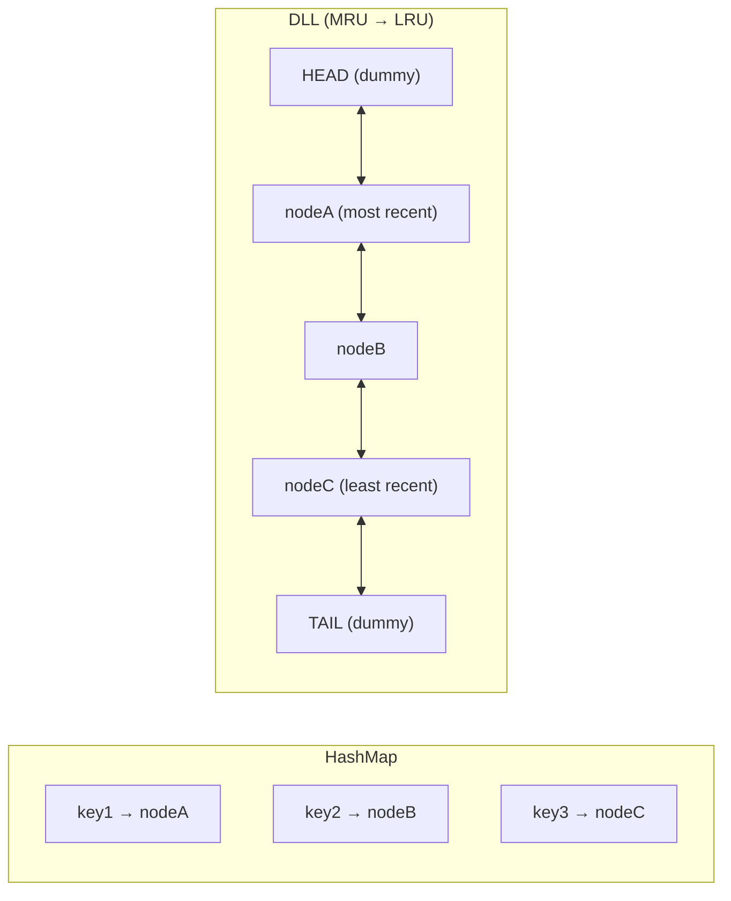

# LRU Cache

| | |
|---|---|
| **Difficulty** | Medium |
| **LeetCode** | [146. LRU Cache](https://leetcode.com/problems/lru-cache/) |
| **Tags** | Hash Table, Linked List, Design |

## Problem Statement

Design a data structure that follows the **Least Recently Used (LRU)** cache eviction policy.

Implement `LRUCache`:
- `LRUCache(int capacity)` — initialize with positive capacity
- `int get(int key)` — return the value if key exists, else -1. **Marks the key as recently used.**
- `void put(int key, int value)` — insert or update the key. **Marks it as recently used.** If capacity is exceeded, evict the least recently used key.

Both operations must run in **O(1)** average time.

## Intuition

We need two things simultaneously:
1. **O(1) lookup** → hash map
2. **O(1) ordering by recency** → doubly linked list (DLL)

The DLL maintains order from **most recent (head)** to **least recent (tail)**. The hash map maps each key to its DLL node. On every access or insert, we move the node to the head. On eviction, we remove from the tail.

**Sentinel nodes** (dummy head and dummy tail) eliminate edge cases for inserting and removing at boundaries.



## Implementation

```cpp
class LRUCache {
    struct Node {
        int key, val;
        Node* prev;
        Node* next;
        Node(int k, int v) : key(k), val(v), prev(nullptr), next(nullptr) {}
    };

    int cap;
    unordered_map<int, Node*> map;
    Node* head; // dummy (most recent)
    Node* tail; // dummy (least recent)

    void remove(Node* node) {
        node->prev->next = node->next;
        node->next->prev = node->prev;
    }

    void insertFront(Node* node) {
        node->next = head->next;
        node->prev = head;
        head->next->prev = node;
        head->next = node;
    }

public:
    LRUCache(int capacity) : cap(capacity) {
        head = new Node(0, 0);
        tail = new Node(0, 0);
        head->next = tail;
        tail->prev = head;
    }

    int get(int key) {
        if (!map.count(key)) return -1;
        Node* node = map[key];
        remove(node);
        insertFront(node);
        return node->val;
    }

    void put(int key, int value) {
        if (map.count(key)) {
            remove(map[key]);
            delete map[key];
        } else if ((int)map.size() == cap) {
            Node* lru = tail->prev;
            remove(lru);
            map.erase(lru->key);
            delete lru;
        }
        Node* node = new Node(key, value);
        insertFront(node);
        map[key] = node;
    }
};
```

```java
class LRUCache {
    private class Node {
        int key, val;
        Node prev, next;
        Node(int k, int v) { key = k; val = v; }
    }

    private int cap;
    private Map<Integer, Node> map = new HashMap<>();
    private Node head = new Node(0, 0); // dummy MRU
    private Node tail = new Node(0, 0); // dummy LRU

    public LRUCache(int capacity) {
        cap = capacity;
        head.next = tail;
        tail.prev = head;
    }

    private void remove(Node node) {
        node.prev.next = node.next;
        node.next.prev = node.prev;
    }

    private void insertFront(Node node) {
        node.next = head.next;
        node.prev = head;
        head.next.prev = node;
        head.next = node;
    }

    public int get(int key) {
        if (!map.containsKey(key)) return -1;
        Node node = map.get(key);
        remove(node);
        insertFront(node);
        return node.val;
    }

    public void put(int key, int value) {
        if (map.containsKey(key)) {
            remove(map.get(key));
        } else if (map.size() == cap) {
            Node lru = tail.prev;
            remove(lru);
            map.remove(lru.key);
        }
        Node node = new Node(key, value);
        insertFront(node);
        map.put(key, node);
    }
}
```

```typescript
class LRUCache {
    private cap: number;
    private map: Map<number, { key: number; val: number; prev: any; next: any }>;
    private head: { key: number; val: number; prev: any; next: any };
    private tail: { key: number; val: number; prev: any; next: any };

    constructor(capacity: number) {
        this.cap = capacity;
        this.map = new Map();
        this.head = { key: 0, val: 0, prev: null, next: null };
        this.tail = { key: 0, val: 0, prev: null, next: null };
        this.head.next = this.tail;
        this.tail.prev = this.head;
    }

    private remove(node: any): void {
        node.prev.next = node.next;
        node.next.prev = node.prev;
    }

    private insertFront(node: any): void {
        node.next = this.head.next;
        node.prev = this.head;
        this.head.next.prev = node;
        this.head.next = node;
    }

    get(key: number): number {
        if (!this.map.has(key)) return -1;
        const node = this.map.get(key)!;
        this.remove(node);
        this.insertFront(node);
        return node.val;
    }

    put(key: number, value: number): void {
        if (this.map.has(key)) {
            this.remove(this.map.get(key)!);
        } else if (this.map.size === this.cap) {
            const lru = this.tail.prev;
            this.remove(lru);
            this.map.delete(lru.key);
        }
        const node = { key, val: value, prev: null, next: null };
        this.insertFront(node);
        this.map.set(key, node);
    }
}
```

```python
class LRUCache:
    class _Node:
        def __init__(self, key=0, val=0):
            self.key = key
            self.val = val
            self.prev = None
            self.next = None

    def __init__(self, capacity: int):
        self.cap = capacity
        self.cache: dict[int, LRUCache._Node] = {}
        self.head = self._Node()  # dummy MRU
        self.tail = self._Node()  # dummy LRU
        self.head.next = self.tail
        self.tail.prev = self.head

    def _remove(self, node):
        node.prev.next = node.next
        node.next.prev = node.prev

    def _insert_front(self, node):
        node.next = self.head.next
        node.prev = self.head
        self.head.next.prev = node
        self.head.next = node

    def get(self, key: int) -> int:
        if key not in self.cache:
            return -1
        node = self.cache[key]
        self._remove(node)
        self._insert_front(node)
        return node.val

    def put(self, key: int, value: int) -> None:
        if key in self.cache:
            self._remove(self.cache[key])
        elif len(self.cache) == self.cap:
            lru = self.tail.prev
            self._remove(lru)
            del self.cache[lru.key]
        node = self._Node(key, value)
        self._insert_front(node)
        self.cache[key] = node
```

```go
type LRUNode struct {
    key, val   int
    prev, next *LRUNode
}

type LRUCache struct {
    cap        int
    cache      map[int]*LRUNode
    head, tail *LRUNode
}

func Constructor(capacity int) LRUCache {
    head := &LRUNode{}
    tail := &LRUNode{}
    head.next = tail
    tail.prev = head
    return LRUCache{
        cap:   capacity,
        cache: make(map[int]*LRUNode),
        head:  head,
        tail:  tail,
    }
}

func (c *LRUCache) remove(node *LRUNode) {
    node.prev.next = node.next
    node.next.prev = node.prev
}

func (c *LRUCache) insertFront(node *LRUNode) {
    node.next = c.head.next
    node.prev = c.head
    c.head.next.prev = node
    c.head.next = node
}

func (c *LRUCache) Get(key int) int {
    node, ok := c.cache[key]
    if !ok { return -1 }
    c.remove(node)
    c.insertFront(node)
    return node.val
}

func (c *LRUCache) Put(key int, value int) {
    if node, ok := c.cache[key]; ok {
        c.remove(node)
    } else if len(c.cache) == c.cap {
        lru := c.tail.prev
        c.remove(lru)
        delete(c.cache, lru.key)
    }
    node := &LRUNode{key: key, val: value}
    c.insertFront(node)
    c.cache[key] = node
}
```

**Time:** O(1) get and put — **Space:** O(capacity)

## Key Interview Insights

- **Why doubly linked list?** DLL supports O(1) removal of any node (given a pointer) because you can update both the predecessor and successor without traversal. A singly linked list would require O(n) to find the predecessor.
- **Why sentinel nodes?** Dummy head and tail eliminate the boundary checks for inserting at the front or removing from the back. `insertFront` and `remove` become uniform 4-line operations.
- **Store the key in the node.** When evicting the LRU node (`tail.prev`), you must delete it from the hash map. Without the key stored in the node, you'd have no way to identify which map entry to remove.
- **Python's `OrderedDict`** provides a built-in LRU cache implementation (`move_to_end`, `popitem(last=False)`), but interviewers expect you to implement from scratch.
- **LFU vs LRU:** LRU evicts the least *recently* used. LFU evicts the least *frequently* used. LFU (LC 460) is significantly harder.

