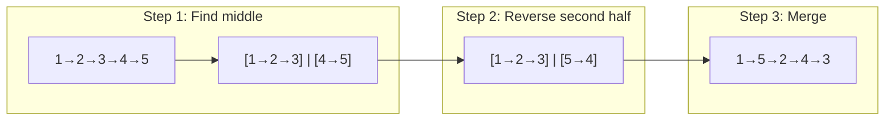

# Reorder List

| | |
|---|---|
| **Difficulty** | Medium |
| **LeetCode** | [143. Reorder List](https://leetcode.com/problems/reorder-list/) |
| **Tags** | Linked List, Two Pointers |

## Problem Statement

Given a linked list `L0 → L1 → ... → Ln-1 → Ln`, reorder it in-place to:

`L0 → Ln → L1 → Ln-1 → L2 → Ln-2 → ...`

Do not change node values — only rearrange the nodes.

## Intuition

This problem is a composition of three classic linked list operations:

1. **Find the middle** — split the list into two halves
2. **Reverse the second half** — so we can interleave from both ends
3. **Merge the two halves** — alternate: one from first half, one from reversed second half

Each step alone is a solved problem. Recognizing this decomposition is the key insight.



## Approach: Three Steps In-Place

```cpp
class Solution {
public:
    void reorderList(ListNode* head) {
        if (!head || !head->next) return;

        // Step 1: Find middle
        ListNode* slow = head;
        ListNode* fast = head;
        while (fast->next != nullptr && fast->next->next != nullptr) {
            slow = slow->next;
            fast = fast->next->next;
        }

        // Step 2: Reverse second half
        ListNode* secondHalf = slow->next;
        slow->next = nullptr; // cut the list
        ListNode* prev = nullptr;
        while (secondHalf != nullptr) {
            ListNode* next = secondHalf->next;
            secondHalf->next = prev;
            prev = secondHalf;
            secondHalf = next;
        }
        ListNode* reversed = prev;

        // Step 3: Merge
        ListNode* first = head;
        ListNode* second = reversed;
        while (second != nullptr) {
            ListNode* fn = first->next;
            ListNode* sn = second->next;
            first->next = second;
            second->next = fn;
            first = fn;
            second = sn;
        }
    }
};
```

```java
class Solution {
    public void reorderList(ListNode head) {
        if (head == null || head.next == null) return;

        // Step 1: Find middle
        ListNode slow = head, fast = head;
        while (fast.next != null && fast.next.next != null) {
            slow = slow.next;
            fast = fast.next.next;
        }

        // Step 2: Reverse second half
        ListNode secondHalf = slow.next;
        slow.next = null;
        ListNode prev = null;
        while (secondHalf != null) {
            ListNode next = secondHalf.next;
            secondHalf.next = prev;
            prev = secondHalf;
            secondHalf = next;
        }

        // Step 3: Merge
        ListNode first = head, second = prev;
        while (second != null) {
            ListNode fn = first.next;
            ListNode sn = second.next;
            first.next = second;
            second.next = fn;
            first = fn;
            second = sn;
        }
    }
}
```

```typescript
function reorderList(head: ListNode | null): void {
    if (!head || !head.next) return;

    // Step 1: Find middle
    let slow: ListNode = head, fast: ListNode = head;
    while (fast.next !== null && fast.next.next !== null) {
        slow = slow.next!;
        fast = fast.next.next;
    }

    // Step 2: Reverse second half
    let secondHalf: ListNode | null = slow.next;
    slow.next = null;
    let prev: ListNode | null = null;
    while (secondHalf !== null) {
        const next = secondHalf.next;
        secondHalf.next = prev;
        prev = secondHalf;
        secondHalf = next;
    }

    // Step 3: Merge
    let first: ListNode | null = head, second: ListNode | null = prev;
    while (second !== null) {
        const fn = first!.next;
        const sn = second.next;
        first!.next = second;
        second.next = fn;
        first = fn;
        second = sn;
    }
}
```

```python
class Solution:
    def reorderList(self, head: ListNode | None) -> None:
        if not head or not head.next:
            return

        # Step 1: Find middle
        slow, fast = head, head
        while fast.next and fast.next.next:
            slow = slow.next
            fast = fast.next.next

        # Step 2: Reverse second half
        second_half = slow.next
        slow.next = None
        prev = None
        curr = second_half
        while curr:
            nxt = curr.next
            curr.next = prev
            prev = curr
            curr = nxt

        # Step 3: Merge
        first, second = head, prev
        while second:
            fn, sn = first.next, second.next
            first.next = second
            second.next = fn
            first, second = fn, sn
```

```go
func reorderList(head *ListNode) {
    if head == nil || head.Next == nil {
        return
    }

    // Step 1: Find middle
    slow, fast := head, head
    for fast.Next != nil && fast.Next.Next != nil {
        slow = slow.Next
        fast = fast.Next.Next
    }

    // Step 2: Reverse second half
    secondHalf := slow.Next
    slow.Next = nil
    var prev *ListNode
    for secondHalf != nil {
        next := secondHalf.Next
        secondHalf.Next = prev
        prev = secondHalf
        secondHalf = next
    }

    // Step 3: Merge
    first, second := head, prev
    for second != nil {
        fn := first.Next
        sn := second.Next
        first.Next = second
        second.Next = fn
        first = fn
        second = sn
    }
}
```

**Time:** O(n) — **Space:** O(1)

## Dry Run

Input: `1 → 2 → 3 → 4 → 5`

**Step 1 — Find middle** (stop when `fast.next.next == null`):

Slow stops at node 3 (first middle for odd list — note we use `fast.next && fast.next.next` to get the *first* middle here, giving us the longer first half).

**Step 2 — Reverse `[4 → 5]`:** becomes `[5 → 4]`

**Step 3 — Merge `[1 → 2 → 3]` with `[5 → 4]`:**

| Iteration | first | second | fn | sn | Result |
|---|---|---|---|---|---|
| 1 | 1 | 5 | 2 | 4 | 1 → 5 → 2... |
| 2 | 2 | 4 | 3 | null | 1 → 5 → 2 → 4 → 3 |

Result: `1 → 5 → 2 → 4 → 3` ✓

## Key Interview Insights

- **Why find the first middle?** Using `fast.next && fast.next.next` gives the first of two middles in even-length lists, making the first half longer or equal. This ensures the merge step terminates cleanly when the second pointer runs out.
- **Cut the list** — `slow.next = null` before reversing is critical. Without it, you get a cycle when reversing.
- **The merge terminates on `second`** — when the second half is exhausted, the remaining first-half tail is already in place.
- **This is a showcase problem** — interviewers love it because it combines three fundamental operations. Walk through each step explicitly.

