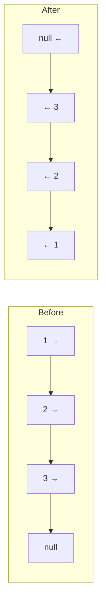

# Reverse a Linked List

| | |
|---|---|
| **Difficulty** | Easy |
| **LeetCode** | [206. Reverse Linked List](https://leetcode.com/problems/reverse-linked-list/) |
| **Tags** | Linked List, Recursion |

## Problem Statement

Given the head of a singly linked list, reverse the list and return the reversed list's head.

## Intuition

To reverse a linked list, we need to flip every `next` pointer so it points backwards. The key challenge is maintaining a reference to the previous node, since a singly linked list has no `prev` pointer.

## Approach 1: Iterative (Optimal)

Use three pointers: `prev` (starts null), `curr` (starts at head), `next` (saves the next before overwriting).

At each step:
1. Save `curr.next` in `next`
2. Point `curr.next` to `prev`
3. Advance `prev` to `curr`
4. Advance `curr` to `next`



```cpp
class Solution {
public:
    ListNode* reverseList(ListNode* head) {
        ListNode* prev = nullptr;
        ListNode* curr = head;
        while (curr != nullptr) {
            ListNode* next = curr->next;
            curr->next = prev;
            prev = curr;
            curr = next;
        }
        return prev;
    }
};
```

```java
class Solution {
    public ListNode reverseList(ListNode head) {
        ListNode prev = null, curr = head;
        while (curr != null) {
            ListNode next = curr.next;
            curr.next = prev;
            prev = curr;
            curr = next;
        }
        return prev;
    }
}
```

```typescript
function reverseList(head: ListNode | null): ListNode | null {
    let prev: ListNode | null = null;
    let curr = head;
    while (curr !== null) {
        const next = curr.next;
        curr.next = prev;
        prev = curr;
        curr = next;
    }
    return prev;
}
```

```python
class Solution:
    def reverseList(self, head: ListNode | None) -> ListNode | None:
        prev, curr = None, head
        while curr:
            nxt = curr.next
            curr.next = prev
            prev = curr
            curr = nxt
        return prev
```

```go
func reverseList(head *ListNode) *ListNode {
    var prev *ListNode
    curr := head
    for curr != nil {
        next := curr.Next
        curr.Next = prev
        prev = curr
        curr = next
    }
    return prev
}
```

**Time:** O(n) — **Space:** O(1)

## Approach 2: Recursive

Recurse to the end of the list, then rewire pointers on the way back.

The key insight: `head.next.next = head` makes the next node point back to the current one. Then set `head.next = null` to avoid a cycle.

```cpp
class Solution {
public:
    ListNode* reverseList(ListNode* head) {
        if (head == nullptr || head->next == nullptr) return head;
        ListNode* newHead = reverseList(head->next);
        head->next->next = head;
        head->next = nullptr;
        return newHead;
    }
};
```

```java
class Solution {
    public ListNode reverseList(ListNode head) {
        if (head == null || head.next == null) return head;
        ListNode newHead = reverseList(head.next);
        head.next.next = head;
        head.next = null;
        return newHead;
    }
}
```

```typescript
function reverseList(head: ListNode | null): ListNode | null {
    if (head === null || head.next === null) return head;
    const newHead = reverseList(head.next);
    head.next.next = head;
    head.next = null;
    return newHead;
}
```

```python
class Solution:
    def reverseList(self, head: ListNode | None) -> ListNode | None:
        if not head or not head.next:
            return head
        new_head = self.reverseList(head.next)
        head.next.next = head
        head.next = None
        return new_head
```

```go
func reverseList(head *ListNode) *ListNode {
    if head == nil || head.Next == nil {
        return head
    }
    newHead := reverseList(head.Next)
    head.Next.Next = head
    head.Next = nil
    return newHead
}
```

**Time:** O(n) — **Space:** O(n) call stack

## Dry Run (Iterative)

List: `1 → 2 → 3 → null`

| Step | prev | curr | next | Action |
|---|---|---|---|---|
| Start | null | 1 | — | — |
| 1 | null | 1 | 2 | 1.next = null |
| 2 | 1 | 2 | 3 | 2.next = 1 |
| 3 | 2 | 3 | null | 3.next = 2 |
| End | 3 | null | — | return prev=3 |

Result: `3 → 2 → 1 → null` ✓

## Key Interview Insights

- **The iterative approach is preferred.** It's O(1) space and avoids stack overflow for very long lists.
- **`return prev` not `return curr`** — when the loop ends, `curr` is null and `prev` is the new head.
- **Reverse a sublist (LC 92):** Fix the boundaries, reverse the middle portion, reconnect. Requires careful pointer bookkeeping.
- **Recursive approach is elegant** for interviews if you can explain the invariant: "the sublist starting at head.next is already reversed; I just need to append head to its end."
- This reversal is a **building block** used in: Reorder List, Palindrome Linked List, K-Group Reversal.

