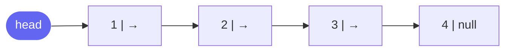

# Singly Linked List

A singly linked list is a sequence of **nodes** where each node holds a value and a **pointer to the next node**. Unlike arrays, nodes live anywhere in memory — there is no contiguous allocation, so no random access.



## Node Definition

```cpp
struct ListNode {
    int val;
    ListNode* next;
    ListNode(int x) : val(x), next(nullptr) {}
};
```

```java
class ListNode {
    int val;
    ListNode next;
    ListNode(int x) { val = x; }
}
```

```typescript
class ListNode {
    val: number;
    next: ListNode | null;
    constructor(val: number) {
        this.val = val;
        this.next = null;
    }
}
```

```python
class ListNode:
    def __init__(self, val: int):
        self.val = val
        self.next = None
```

```go
type ListNode struct {
    Val  int
    Next *ListNode
}
```

## Core Properties

| Property | Value |
|---|---|
| Access by index | O(n) |
| Insert at head | O(1) |
| Insert at tail (with tail pointer) | O(1) |
| Insert at arbitrary position | O(n) |
| Delete at head | O(1) |
| Delete by value | O(n) |
| Search | O(n) |
| Space | O(n) |

> **Key tradeoff vs arrays:** Linked lists offer O(1) insert/delete at the head, but O(n) random access. Arrays are O(1) for access but O(n) for arbitrary insert/delete. Choose based on access patterns.

## Fundamental Operations

### Traversal

Always use a `curr` pointer — never modify `head` directly.

```cpp
void traverse(ListNode* head) {
    ListNode* curr = head;
    while (curr != nullptr) {
        // process curr->val
        curr = curr->next;
    }
}
```

```java
void traverse(ListNode head) {
    ListNode curr = head;
    while (curr != null) {
        // process curr.val
        curr = curr.next;
    }
}
```

```typescript
function traverse(head: ListNode | null): void {
    let curr = head;
    while (curr !== null) {
        // process curr.val
        curr = curr.next;
    }
}
```

```python
def traverse(head: ListNode | None) -> None:
    curr = head
    while curr:
        # process curr.val
        curr = curr.next
```

```go
func traverse(head *ListNode) {
    for curr := head; curr != nil; curr = curr.Next {
        // process curr.Val
    }
}
```

### Insert at Head — O(1)

```cpp
ListNode* insertHead(ListNode* head, int val) {
    ListNode* node = new ListNode(val);
    node->next = head;
    return node;
}
```

```java
ListNode insertHead(ListNode head, int val) {
    ListNode node = new ListNode(val);
    node.next = head;
    return node;
}
```

```typescript
function insertHead(head: ListNode | null, val: number): ListNode {
    const node = new ListNode(val);
    node.next = head;
    return node;
}
```

```python
def insert_head(head: ListNode | None, val: int) -> ListNode:
    node = ListNode(val)
    node.next = head
    return node
```

```go
func insertHead(head *ListNode, val int) *ListNode {
    node := &ListNode{Val: val, Next: head}
    return node
}
```

### Delete a Node by Value — O(n)

The **dummy head** trick eliminates the special case of deleting the first node:

```cpp
ListNode* deleteVal(ListNode* head, int val) {
    ListNode dummy(0);
    dummy.next = head;
    ListNode* prev = &dummy;

    while (prev->next != nullptr) {
        if (prev->next->val == val) {
            prev->next = prev->next->next;
            return dummy.next;
        }
        prev = prev->next;
    }
    return dummy.next;
}
```

```java
ListNode deleteVal(ListNode head, int val) {
    ListNode dummy = new ListNode(0);
    dummy.next = head;
    ListNode prev = dummy;

    while (prev.next != null) {
        if (prev.next.val == val) {
            prev.next = prev.next.next;
            return dummy.next;
        }
        prev = prev.next;
    }
    return dummy.next;
}
```

```typescript
function deleteVal(head: ListNode | null, val: number): ListNode | null {
    const dummy = new ListNode(0);
    dummy.next = head;
    let prev: ListNode = dummy;

    while (prev.next !== null) {
        if (prev.next.val === val) {
            prev.next = prev.next.next;
            return dummy.next;
        }
        prev = prev.next;
    }
    return dummy.next;
}
```

```python
def delete_val(head: ListNode | None, val: int) -> ListNode | None:
    dummy = ListNode(0)
    dummy.next = head
    prev = dummy

    while prev.next:
        if prev.next.val == val:
            prev.next = prev.next.next
            return dummy.next
        prev = prev.next

    return dummy.next
```

```go
func deleteVal(head *ListNode, val int) *ListNode {
    dummy := &ListNode{Next: head}
    prev := dummy

    for prev.Next != nil {
        if prev.Next.Val == val {
            prev.Next = prev.Next.Next
            return dummy.Next
        }
        prev = prev.Next
    }
    return dummy.Next
}
```

### Reverse a Linked List — O(n)

The most fundamental linked-list operation. Three pointers: `prev`, `curr`, `next`.

```cpp
ListNode* reverse(ListNode* head) {
    ListNode* prev = nullptr;
    ListNode* curr = head;
    while (curr != nullptr) {
        ListNode* next = curr->next;
        curr->next = prev;
        prev = curr;
        curr = next;
    }
    return prev;
}
```

```java
ListNode reverse(ListNode head) {
    ListNode prev = null, curr = head;
    while (curr != null) {
        ListNode next = curr.next;
        curr.next = prev;
        prev = curr;
        curr = next;
    }
    return prev;
}
```

```typescript
function reverse(head: ListNode | null): ListNode | null {
    let prev: ListNode | null = null;
    let curr = head;
    while (curr !== null) {
        const next = curr.next;
        curr.next = prev;
        prev = curr;
        curr = next;
    }
    return prev;
}
```

```python
def reverse(head: ListNode | None) -> ListNode | None:
    prev, curr = None, head
    while curr:
        nxt = curr.next
        curr.next = prev
        prev = curr
        curr = nxt
    return prev
```

```go
func reverse(head *ListNode) *ListNode {
    var prev *ListNode
    curr := head
    for curr != nil {
        next := curr.Next
        curr.Next = prev
        prev = curr
        curr = next
    }
    return prev
}
```

## The Dummy Head Pattern

The dummy (sentinel) node is the most important linked-list coding pattern. It gives `prev` a valid starting position before the real head, eliminating edge-case handling for the first node.

**Always use dummy head when:** inserting/deleting from positions that might include the head.

```
dummy → [1] → [2] → [3] → null
  ↑
prev starts here — works uniformly for all positions
```

## Finding the Middle Node

Two approaches:

**Count then traverse** — O(n) two passes.

**Fast & Slow pointers** — O(n) single pass.

```cpp
ListNode* middleNode(ListNode* head) {
    ListNode* slow = head;
    ListNode* fast = head;
    while (fast != nullptr && fast->next != nullptr) {
        slow = slow->next;
        fast = fast->next->next;
    }
    return slow; // for even-length: returns second middle
}
```

```java
ListNode middleNode(ListNode head) {
    ListNode slow = head, fast = head;
    while (fast != null && fast.next != null) {
        slow = slow.next;
        fast = fast.next.next;
    }
    return slow;
}
```

```typescript
function middleNode(head: ListNode | null): ListNode | null {
    let slow = head, fast = head;
    while (fast !== null && fast.next !== null) {
        slow = slow!.next;
        fast = fast.next.next;
    }
    return slow;
}
```

```python
def middle_node(head: ListNode | None) -> ListNode | None:
    slow = fast = head
    while fast and fast.next:
        slow = slow.next
        fast = fast.next.next
    return slow
```

```go
func middleNode(head *ListNode) *ListNode {
    slow, fast := head, head
    for fast != nil && fast.Next != nil {
        slow = slow.Next
        fast = fast.Next.Next
    }
    return slow
}
```

## Edge Cases Checklist

- **Empty list** (`head == null`) — most operations must handle this first
- **Single node** — reversal, deletion, middle all behave differently
- **Two nodes** — often the smallest meaningful non-trivial case
- **Cycle** — `fast.next.next` will infinite loop; detect first
- **Modifying head** — always return the new head; use dummy or update carefully

## Common Interview Patterns

| Pattern | Use Case | Key Problems |
|---|---|---|
| Dummy head | Insert/delete near head | Remove Nth Node, Merge Two Lists |
| Fast & slow pointers | Cycle, middle, kth from end | Detect Cycle, Reorder List |
| Reverse in-place | Palindrome, group reversal | Reverse LL, Reorder List |
| Two-pointer merge | Combine sorted lists | Merge Two/K Sorted |
| Hash map for nodes | Clone with extra pointers | Copy List Random Pointer |
| Runner technique | Reorder, interleave | Reorder List |

