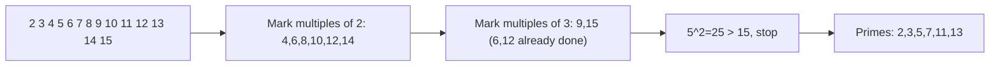

# Prime Sieve

A **prime** is a number greater than 1 that has no divisors other than 1 and itself. Finding primes is a core skill — it appears in number theory problems, factorization, and combinatorics.

The naive approach — testing each number individually — is too slow when you need all primes up to a large `n`. The **Sieve of Eratosthenes** finds all primes up to `n` in O(n log log n) time.

---

## Naive Primality Test

To check if a single number `n` is prime: test divisibility by all integers from 2 to sqrt(n). If any divide `n`, it's composite.

**Why sqrt(n)?** If `n = a * b` and `a > sqrt(n)`, then `b < sqrt(n)` — so we'd have already found `b`. Every composite number has at least one factor ≤ its square root.

```cpp
bool isPrime(int n) {
    if (n < 2) return false;
    for (int i = 2; (long long)i * i <= n; i++)
        if (n % i == 0) return false;
    return true;
}
```

```java
boolean isPrime(int n) {
    if (n < 2) return false;
    for (int i = 2; (long)i * i <= n; i++)
        if (n % i == 0) return false;
    return true;
}
```

```typescript
function isPrime(n: number): boolean {
    if (n < 2) return false;
    for (let i = 2; i * i <= n; i++)
        if (n % i === 0) return false;
    return true;
}
```

```python
def is_prime(n: int) -> bool:
    if n < 2: return False
    i = 2
    while i * i <= n:
        if n % i == 0: return False
        i += 1
    return True
```

```go
func isPrime(n int) bool {
    if n < 2 { return false }
    for i := 2; i*i <= n; i++ {
        if n%i == 0 { return false }
    }
    return true
}
```

**Time:** O(sqrt(n)) per number — **Space:** O(1)

---

## Sieve of Eratosthenes

To find **all primes up to n** at once. The algorithm:

1. Start with all numbers 2..n marked as prime (true).
2. For each prime `p` starting from 2, mark all multiples of `p` (starting from `p*p`) as composite.
3. Remaining marked numbers are prime.

**Why start at `p*p`?** All smaller multiples of `p` (i.e., `2*p, 3*p, ..., (p-1)*p`) have already been marked by smaller primes.



```cpp
vector<bool> sieve(int n) {
    vector<bool> is_prime(n + 1, true);
    is_prime[0] = is_prime[1] = false;
    for (int p = 2; (long long)p * p <= n; p++) {
        if (is_prime[p]) {
            for (int mul = p * p; mul <= n; mul += p)
                is_prime[mul] = false;
        }
    }
    return is_prime;
}
```

```java
boolean[] sieve(int n) {
    boolean[] isPrime = new boolean[n + 1];
    Arrays.fill(isPrime, true);
    isPrime[0] = isPrime[1] = false;
    for (int p = 2; (long)p * p <= n; p++) {
        if (isPrime[p]) {
            for (int mul = p * p; mul <= n; mul += p)
                isPrime[mul] = false;
        }
    }
    return isPrime;
}
```

```typescript
function sieve(n: number): boolean[] {
    const isPrime = new Array(n + 1).fill(true);
    isPrime[0] = isPrime[1] = false;
    for (let p = 2; p * p <= n; p++) {
        if (isPrime[p]) {
            for (let mul = p * p; mul <= n; mul += p)
                isPrime[mul] = false;
        }
    }
    return isPrime;
}
```

```python
def sieve(n: int) -> list[bool]:
    is_prime = [True] * (n + 1)
    is_prime[0] = is_prime[1] = False
    p = 2
    while p * p <= n:
        if is_prime[p]:
            for mul in range(p * p, n + 1, p):
                is_prime[mul] = False
        p += 1
    return is_prime
```

```go
func sieve(n int) []bool {
    isPrime := make([]bool, n+1)
    for i := range isPrime { isPrime[i] = true }
    isPrime[0], isPrime[1] = false, false
    for p := 2; p*p <= n; p++ {
        if isPrime[p] {
            for mul := p * p; mul <= n; mul += p {
                isPrime[mul] = false
            }
        }
    }
    return isPrime
}
```

**Time:** O(n log log n) — **Space:** O(n)

---

## Collecting the Primes

After sieving, collect all primes into a list:

```cpp
vector<int> getPrimes(int n) {
    auto is_prime = sieve(n);
    vector<int> primes;
    for (int i = 2; i <= n; i++)
        if (is_prime[i]) primes.push_back(i);
    return primes;
}
```

```java
List<Integer> getPrimes(int n) {
    boolean[] isPrime = sieve(n);
    List<Integer> primes = new ArrayList<>();
    for (int i = 2; i <= n; i++)
        if (isPrime[i]) primes.add(i);
    return primes;
}
```

```typescript
function getPrimes(n: number): number[] {
    return sieve(n).map((v, i) => v ? i : -1).filter(i => i > 1);
}
```

```python
def get_primes(n: int) -> list[int]:
    is_prime = sieve(n)
    return [i for i in range(2, n + 1) if is_prime[i]]
```

```go
func getPrimes(n int) []int {
    isPrime := sieve(n)
    primes := []int{}
    for i := 2; i <= n; i++ {
        if isPrime[i] { primes = append(primes, i) }
    }
    return primes
}
```

---

## Smallest Prime Factor (SPF) Sieve

A powerful variant: for each number, precompute its **smallest prime factor**. This enables O(log n) prime factorization of any number.

```cpp
vector<int> smallestPrimeFactor(int n) {
    vector<int> spf(n + 1);
    iota(spf.begin(), spf.end(), 0);   // spf[i] = i initially
    for (int p = 2; (long long)p * p <= n; p++) {
        if (spf[p] == p) {   // p is prime
            for (int mul = p * p; mul <= n; mul += p)
                if (spf[mul] == mul) spf[mul] = p;
        }
    }
    return spf;
}

// Factorize n in O(log n) using SPF
vector<int> factorize(int n, vector<int>& spf) {
    vector<int> factors;
    while (n > 1) { factors.push_back(spf[n]); n /= spf[n]; }
    return factors;
}
```

```java
int[] smallestPrimeFactor(int n) {
    int[] spf = new int[n + 1];
    for (int i = 0; i <= n; i++) spf[i] = i;
    for (int p = 2; (long)p * p <= n; p++) {
        if (spf[p] == p) {
            for (int mul = p * p; mul <= n; mul += p)
                if (spf[mul] == mul) spf[mul] = p;
        }
    }
    return spf;
}
```

```typescript
function smallestPrimeFactor(n: number): number[] {
    const spf = Array.from({length: n + 1}, (_, i) => i);
    for (let p = 2; p * p <= n; p++) {
        if (spf[p] === p) {
            for (let mul = p * p; mul <= n; mul += p)
                if (spf[mul] === mul) spf[mul] = p;
        }
    }
    return spf;
}
```

```python
def smallest_prime_factor(n: int) -> list[int]:
    spf = list(range(n + 1))
    p = 2
    while p * p <= n:
        if spf[p] == p:  # p is prime
            for mul in range(p * p, n + 1, p):
                if spf[mul] == mul:
                    spf[mul] = p
        p += 1
    return spf
```

```go
func smallestPrimeFactor(n int) []int {
    spf := make([]int, n+1)
    for i := range spf { spf[i] = i }
    for p := 2; p*p <= n; p++ {
        if spf[p] == p {
            for mul := p * p; mul <= n; mul += p {
                if spf[mul] == mul { spf[mul] = p }
            }
        }
    }
    return spf
}
```

---

## Complexity Comparison

| Method | Time | Space | Use When |
|---|---|---|---|
| Naive primality test | O(sqrt(n)) per number | O(1) | Single number |
| Sieve of Eratosthenes | O(n log log n) | O(n) | All primes up to n |
| SPF sieve | O(n log log n) | O(n) | Repeated factorization |

---

## Interview Identification Signals

- "Count primes up to n" → Sieve of Eratosthenes
- "Find prime factors of many numbers" → SPF sieve
- "Is n prime?" (single check) → Naive O(sqrt n) test
- "nth prime" → Sieve with buffer (estimate: n-th prime ≈ n * ln n)
- Divisor counting / sum of divisors → SPF sieve enables O(log n) factorization

---

## Pitfalls

1. **Sieve with `p * p` overflow:** If `p` is `int` and close to sqrt(INT_MAX), `p * p` overflows. Cast to `long long` before the comparison: `(long long)p * p <= n`.
2. **Off by one:** The sieve array must be size `n + 1` to include `n` itself.
3. **Forgetting 0 and 1 are not prime:** Always explicitly set `is_prime[0] = is_prime[1] = false`.
4. **Sieve for large n (> 10^7):** Memory becomes a bottleneck. Use a `bitset` or a segmented sieve.
5. **Segmented sieve for very large ranges:** When the range [L, R] is large but R - L is small (e.g., R - L ≤ 10^6), use a segmented sieve with the standard sieve up to sqrt(R).
