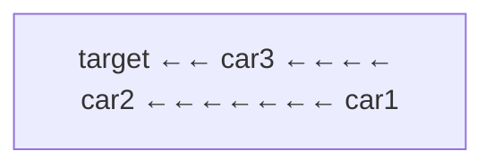

# Car Fleet

| | |
|---|---|
| **Difficulty** | Medium |
| **LeetCode** | [853. Car Fleet](https://leetcode.com/problems/car-fleet/) |
| **Tags** | Array, Stack, Sorting |

## Problem Statement

There are `n` cars heading to the same destination at position `target`. You are given two arrays `position` (car positions) and `speed` (car speeds), both of length `n`.

A car can never pass another car. If a faster car catches up to a slower car, they form a **fleet** and travel at the slower car's speed.

Return the number of car fleets that arrive at the destination.

## Intuition

**Key observation:** A faster car behind a slower car will always catch up and form a fleet. A car that arrives *before* the car ahead of it (without catching up) will form its own fleet.

**Model it with time to target:** For each car, compute `time = (target - position) / speed`. If a car behind has a shorter time (arrives earlier), it will catch up to the car ahead — they merge into one fleet. If it has a longer time, it can never catch up — it forms a separate fleet.

**Sort by position descending** (process from closest to target backwards). Maintain a stack of fleet times. If the current car's time exceeds the stack's top, it can't catch the fleet ahead — it becomes a new fleet.



Processing right to left. If `time[car1] <= time[car2]`, car1 merges into car2's fleet.

## Approach 1: Sort + Stack

```cpp
class Solution {
public:
    int carFleet(int target, vector<int>& position, vector<int>& speed) {
        int n = position.size();
        vector<pair<int,int>> cars(n);
        for (int i = 0; i < n; i++) cars[i] = {position[i], speed[i]};
        sort(cars.rbegin(), cars.rend()); // sort by position descending

        stack<double> st;
        for (auto& [pos, spd] : cars) {
            double time = (double)(target - pos) / spd;
            if (st.empty() || time > st.top()) {
                st.push(time); // new fleet
            }
            // else: merges with the fleet ahead (same arrival time or earlier)
        }
        return st.size();
    }
};
```

```java
class Solution {
    public int carFleet(int target, int[] position, int[] speed) {
        int n = position.length;
        Integer[] indices = new Integer[n];
        for (int i = 0; i < n; i++) indices[i] = i;
        // Sort indices by position descending
        Arrays.sort(indices, (a, b) -> position[b] - position[a]);

        Deque<Double> stack = new ArrayDeque<>();
        for (int i : indices) {
            double time = (double)(target - position[i]) / speed[i];
            if (stack.isEmpty() || time > stack.peek()) {
                stack.push(time);
            }
        }
        return stack.size();
    }
}
```

```typescript
function carFleet(target: number, position: number[], speed: number[]): number {
    const n = position.length;
    const cars = position.map((p, i) => [p, speed[i]]);
    cars.sort((a, b) => b[0] - a[0]); // sort by position descending

    const stack: number[] = [];
    for (const [pos, spd] of cars) {
        const time = (target - pos) / spd;
        if (stack.length === 0 || time > stack[stack.length - 1]) {
            stack.push(time);
        }
    }
    return stack.length;
}
```

```python
class Solution:
    def carFleet(self, target: int, position: list[int], speed: list[int]) -> int:
        pairs = sorted(zip(position, speed), reverse=True)  # sort by position desc

        stack = []
        for pos, spd in pairs:
            time = (target - pos) / spd
            if not stack or time > stack[-1]:
                stack.append(time)
            # else: merges with fleet ahead

        return len(stack)
```

```go
func carFleet(target int, position []int, speed []int) int {
    n := len(position)
    type car struct{ pos, spd int }
    cars := make([]car, n)
    for i := range cars { cars[i] = car{position[i], speed[i]} }
    sort.Slice(cars, func(i, j int) bool { return cars[i].pos > cars[j].pos })

    stack := []float64{}
    for _, c := range cars {
        time := float64(target-c.pos) / float64(c.spd)
        if len(stack) == 0 || time > stack[len(stack)-1] {
            stack = append(stack, time)
        }
    }
    return len(stack)
}
```

**Time:** O(n log n) — sorting dominates.
**Space:** O(n) — stack and sort space.

## Approach 2: No Stack — Count Directly

Since we only care about fleet count (not the stack itself), we can track the max time seen so far:

```cpp
class Solution {
public:
    int carFleet(int target, vector<int>& position, vector<int>& speed) {
        int n = position.size();
        vector<pair<int,int>> cars(n);
        for (int i = 0; i < n; i++) cars[i] = {position[i], speed[i]};
        sort(cars.rbegin(), cars.rend());

        int fleets = 0;
        double maxTime = 0;
        for (auto& [pos, spd] : cars) {
            double time = (double)(target - pos) / spd;
            if (time > maxTime) {
                maxTime = time;
                fleets++;
            }
        }
        return fleets;
    }
};
```

```java
class Solution {
    public int carFleet(int target, int[] position, int[] speed) {
        int n = position.length;
        double[][] cars = new double[n][2];
        for (int i = 0; i < n; i++) cars[i] = new double[]{position[i], speed[i]};
        Arrays.sort(cars, (a, b) -> Double.compare(b[0], a[0]));

        int fleets = 0;
        double maxTime = 0;
        for (double[] car : cars) {
            double time = (target - car[0]) / car[1];
            if (time > maxTime) { maxTime = time; fleets++; }
        }
        return fleets;
    }
}
```

```typescript
function carFleet(target: number, position: number[], speed: number[]): number {
    const cars = position.map((p, i) => [p, speed[i]]);
    cars.sort((a, b) => b[0] - a[0]);

    let fleets = 0, maxTime = 0;
    for (const [pos, spd] of cars) {
        const time = (target - pos) / spd;
        if (time > maxTime) { maxTime = time; fleets++; }
    }
    return fleets;
}
```

```python
class Solution:
    def carFleet(self, target: int, position: list[int], speed: list[int]) -> int:
        pairs = sorted(zip(position, speed), reverse=True)
        fleets = 0
        max_time = 0
        for pos, spd in pairs:
            time = (target - pos) / spd
            if time > max_time:
                max_time = time
                fleets += 1
        return fleets
```

```go
func carFleet(target int, position []int, speed []int) int {
    n := len(position)
    type car struct{ pos, spd int }
    cars := make([]car, n)
    for i := range cars { cars[i] = car{position[i], speed[i]} }
    sort.Slice(cars, func(i, j int) bool { return cars[i].pos > cars[j].pos })

    fleets, maxTime := 0, 0.0
    for _, c := range cars {
        time := float64(target-c.pos) / float64(c.spd)
        if time > maxTime { maxTime = time; fleets++ }
    }
    return fleets
}
```

**Time:** O(n log n) — **Space:** O(n) for sort, O(1) extra.

## Dry Run

`target=12, position=[10,8,0,5,3], speed=[2,4,1,1,3]`

Sort by position descending: `[(10,2),(8,4),(5,1),(3,3),(0,1)]`

| pos | spd | time to target | New fleet? |
|---|---|---|---|
| 10 | 2 | (12-10)/2 = **1.0** | Yes (stack empty) |
| 8 | 4 | (12-8)/4 = **1.0** | No (1.0 ≤ 1.0, merges) |
| 5 | 1 | (12-5)/1 = **7.0** | Yes (7.0 > 1.0) |
| 3 | 3 | (12-3)/3 = **3.0** | No (3.0 ≤ 7.0, merges) |
| 0 | 1 | (12-0)/1 = **12.0** | Yes (12.0 > 7.0) |

Fleets: **3** ✓

## Key Interview Insights

- **Float comparison:** `time > stack.top()` — because we sorted by position descending, we're checking if the current car (further back) arrives *later* (can't catch up) vs the fleet ahead.
- **Equal times merge:** If `time == stack.top()`, they arrive simultaneously — same fleet. The `>` (not `>=`) condition handles this correctly.
- **The stack approach makes the logic explicit** — each entry on the stack is a distinct fleet. The simpler `maxTime` approach has the same complexity but is less intuitive.
- **Why sort descending?** We process from the car closest to the target backwards. A car can only be "blocked" by a car ahead of it (smaller distance to target).

