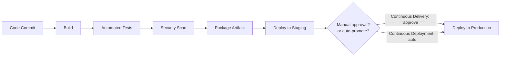
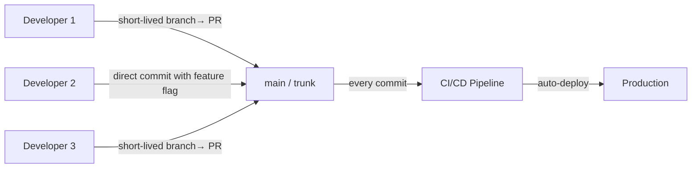

# Fundamentals

CI/CD is the engineering practice that turns a code commit into a running production deployment automatically and reliably. Teams without it spend enormous energy on manual releases that are stressful, infrequent, and error-prone. Teams with it deploy dozens of times a day with confidence. The pipeline is not overhead — it is the mechanism that makes software delivery safe.

---

## CI vs CD: Getting the Definitions Right

The terms are often used loosely. Here are precise definitions:

**Continuous Integration (CI):** every developer commit is automatically built, tested, and validated against the main branch. The goal is to catch integration problems early — before they accumulate into painful merge conflicts and broken builds.

**Continuous Delivery (CD):** every passing build is automatically prepared for release to any environment. Deployments to production require a human approval step, but the software is always in a deployable state.

**Continuous Deployment (CD):** every passing build is automatically deployed to production without human intervention. Used by companies with extremely high test coverage and feature flag infrastructure.



---

## Pipeline Stages

A well-designed pipeline moves from fast, cheap feedback to slow, expensive validation:

| Stage | What happens | Target time |
|---|---|---|
| **Source** | Trigger on push/merge; check out code | Seconds |
| **Build** | Compile, lint, static analysis | 1–2 minutes |
| **Unit tests** | Fast isolated tests; fail early if broken | 1–5 minutes |
| **Scan** | Dependency vulnerabilities, SAST, secret detection | 1–3 minutes |
| **Package** | Build Docker image; push to registry with immutable tag | 1–2 minutes |
| **Integration tests** | Tests against real databases, queues, downstream services | 5–15 minutes |
| **Deploy staging** | Deploy to staging with production-like config | Minutes |
| **Smoke tests / E2E** | Verify critical paths in staging | 5–10 minutes |
| **Deploy production** | Rolling deploy with health checks | Minutes |

> **The fast feedback principle:** fail early. Run linting and unit tests before building the Docker image. There is no value in building a 3-minute Docker image just to discover a compilation error that 30-second linting would have caught.

---

## Why CI/CD Actually Matters

**Velocity:** teams with automated pipelines deploy more frequently. More deployments means smaller changesets per deployment, which means smaller blast radius when something goes wrong.

**Reproducibility:** the pipeline is the only way to deploy. No one deploys from their laptop with local environment variables that "happened to work." Every production build is traceable to an exact commit.

**Confidence:** automated test suites catch regressions before they reach users. A deployment without tests is a hope. A deployment with tests is a statement.

**Rollback speed:** when a deployment causes problems, rolling back is a one-click pipeline trigger, not a manual undeploy/redeploy sequence.

---

## Branching Strategies

### GitFlow

GitFlow uses long-lived branches for each stage of development:

```
main          ← production-ready code
develop       ← integration branch
feature/*     ← new features (branched from develop)
release/*     ← release preparation (branched from develop, merged to main + develop)
hotfix/*      ← urgent production fixes (branched from main)
```

**When to use:** teams with scheduled release cycles, multiple versions in production, or compliance requirements that need explicit release approval steps.

**Downside:** long-lived branches accumulate merge debt. Integrating a two-week feature branch into develop is always painful.

### Trunk-Based Development

Everyone commits directly to `main` (or to very short-lived feature branches, merged within a day or two). Features are hidden behind **feature flags** until ready, not behind long-lived branches.



**When to use:** teams practising continuous deployment, high-trust codebases with strong test coverage, and teams that want to eliminate merge conflict overhead.

---

## Versioning and Artifacts

### Semantic versioning

`MAJOR.MINOR.PATCH` (e.g., `2.4.1`):
- **MAJOR:** breaking changes — callers must update
- **MINOR:** new features, backward-compatible
- **PATCH:** bug fixes, backward-compatible

### Immutable artifact tagging

Every artifact should be tagged with a unique, immutable identifier so you can always trace a running artifact back to its exact source commit:

```bash
# Tag with git SHA (recommended for CI)
IMAGE_TAG=$(git rev-parse --short HEAD)
docker build -t myapp:${IMAGE_TAG} .
docker push 123.dkr.ecr.us-east-1.amazonaws.com/myapp:${IMAGE_TAG}

# Also tag with semver for releases
docker tag myapp:${IMAGE_TAG} myapp:v2.4.1
```

> **Never deploy `latest` in production.** `latest` is a mutable pointer. It can silently change between a build and the next deployment. Use the git SHA or a semver tag so every deployment is precisely reproducible.

### Artifact repositories

| Artifact type | Tool |
|---|---|
| Docker images | Amazon ECR, Docker Hub, GitHub Container Registry, Harbor |
| Maven / Gradle JARs | Nexus, Artifactory, GitHub Packages, AWS CodeArtifact |
| npm packages | Nexus, Artifactory, GitHub Packages |
| Helm charts | OCI registries, ChartMuseum, GitHub Pages |
