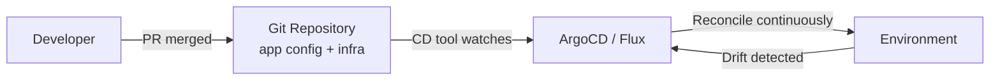
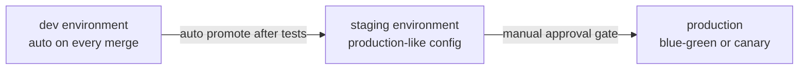

# Patterns

The mechanics of pipelines are straightforward. The patterns — how you structure deployments, manage environments, and recover from failures — are where teams differentiate themselves. This page covers the deployment and promotion patterns that appear in mature CI/CD organisations.

---

## GitOps

GitOps is a model where the **Git repository is the single source of truth** for both application code and infrastructure configuration. Any change to the running environment must go through Git — there are no manual `kubectl apply` or `terraform apply` commands in production.



### Push model vs Pull model

| | Push model (traditional CD) | Pull model (GitOps) |
|---|---|---|
| **Who applies changes** | CI pipeline pushes to environment | Agent in environment pulls from Git |
| **Credentials** | Pipeline needs deploy credentials | Agent has cluster-local credentials only |
| **Drift correction** | Manual or on next deploy | Automatic (reconciliation loop) |
| **Audit trail** | Pipeline logs | Git history (every change is a commit) |
| **Rollback** | Re-run pipeline with old artifact | `git revert` the commit |

**Pros of GitOps:**
- Every change is a pull request — peer-reviewed, auditable, revertible
- Manual changes to the cluster are detected as drift and corrected automatically
- Disaster recovery is `git clone` + point the agent at the repo

**Cons of GitOps:**
- Secret management requires extra work (Sealed Secrets, External Secrets Operator)
- Debugging a failed sync requires understanding both Git and the CD tool
- Teams unfamiliar with GitOps find the mental model unintuitive at first

---

## Deployment Strategies in Pipelines

### Rolling update

The default for most web applications. New pods replace old pods incrementally. Zero-downtime when `maxUnavailable: 0` and readiness probes are configured correctly.

```yaml
# GitHub Actions step: trigger rolling update
- name: Deploy
  run: |
    kubectl set image deployment/api \
      api=123.dkr.ecr.us-east-1.amazonaws.com/api:${{ github.sha }}
    kubectl rollout status deployment/api --timeout=5m
```

### Blue-green deployment

Two complete environments run simultaneously. Traffic switches atomically between them:

```bash
# Pipeline: deploy to inactive environment, run smoke tests, then switch
NEW_VERSION="green"  # or blue, determined by which is currently inactive

# Deploy new version to inactive environment
kubectl set image deployment/api-${NEW_VERSION} \
  api=myapp:$CI_COMMIT_SHA

# Run smoke tests against the new environment
curl https://green-internal.example.com/health

# Switch production traffic (atomic)
kubectl patch service api-service \
  -p "{\"spec\":{\"selector\":{\"version\":\"${NEW_VERSION}\"}}}"
```

### Canary with metrics-gated promotion

A canary deployment routes a small percentage of real production traffic to the new version. Promotion happens only if error rate and latency stay within thresholds:

```yaml
# Argo Rollouts canary strategy
apiVersion: argoproj.io/v1alpha1
kind: Rollout
spec:
  strategy:
    canary:
      steps:
        - setWeight: 10       # 10% of traffic to canary
        - pause: {duration: 5m}
        - analysis:           # check metrics before proceeding
            templates:
              - templateName: error-rate-analysis
        - setWeight: 50
        - pause: {duration: 5m}
        - setWeight: 100
```

---

## Rollback Strategies

**The golden rule:** rollback should be faster than the original deployment. If it is not, your rollback strategy needs work.

### Automated rollback on metrics

```yaml
# Argo Rollouts: auto-abort if error rate exceeds 5%
apiVersion: argoproj.io/v1alpha1
kind: AnalysisTemplate
metadata:
  name: error-rate-analysis
spec:
  metrics:
    - name: error-rate
      interval: 1m
      failureLimit: 3
      provider:
        prometheus:
          address: http://prometheus:9090
          query: |
            sum(rate(http_requests_total{status=~"5.."}[1m]))
            /
            sum(rate(http_requests_total[1m])) * 100
      successCondition: result[0] < 5.0
```

### Kubernetes rollback

```bash
# Undo the last Deployment rollout
kubectl rollout undo deployment/api

# Rollback to a specific revision
kubectl rollout history deployment/api
kubectl rollout undo deployment/api --to-revision=3
```

### Helm rollback

```bash
helm history my-release              # list all revisions
helm rollback my-release 3          # rollback to revision 3
helm rollback my-release            # rollback to previous revision
```

### git revert vs rollback

A `git revert` creates a new commit that undoes a previous one — the history is preserved. A redeployment from the reverted commit is reproducible and auditable. Prefer `git revert` over `git reset` (which rewrites history and is dangerous on shared branches).

---

## Multi-Environment Promotion

A production deployment should not come from a developer's branch. It should travel through environments in sequence, validated at each stage:



### Environment-specific config with Helm values

```
chart/
  values.yaml              # base defaults
  values-dev.yaml          # dev overrides
  values-staging.yaml      # staging overrides
  values-production.yaml   # production overrides
```

```yaml
# values-production.yaml
replicaCount: 10
resources:
  limits:
    cpu: 1000m
    memory: 1Gi
logging:
  level: WARN
```

```bash
# Deploy to production with production values
helm upgrade --install my-release ./chart \
  -f values-production.yaml \
  --set image.tag=${GIT_SHA}
```

### Infrastructure parity

Staging should mirror production as closely as possible. Differences between staging and production are where bugs hide. Common parity failures:
- Staging uses a smaller database (misses memory-related bugs)
- Staging has different security groups (networking bugs only appear in production)
- Staging uses a different Kubernetes version (API behaviour differences)

> Treat staging configuration drift as a bug to fix, not an acceptable cost to accept.
