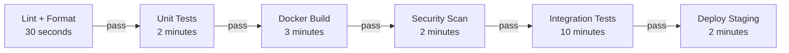

# Production Patterns

A well-designed pipeline is an engineering asset. A poorly designed pipeline is a bottleneck that slows every developer on the team. This page covers the design principles and operational patterns that make the difference between a pipeline people trust and one people wait for.

---

## Pipeline Design

### The fast feedback principle

The most important pipeline design decision is **stage ordering**. Cheap, fast checks should gate expensive, slow ones:



Do not build a 3-minute Docker image before running unit tests. A test failure that unit tests would have caught in 30 seconds should not wait 4 minutes to be discovered.

### Parallelism

Run independent jobs in parallel to reduce wall-clock pipeline time:

```yaml
# GitHub Actions: parallel jobs
jobs:
  unit-tests:
    runs-on: ubuntu-latest
    steps:
      - run: ./mvnw test

  lint:
    runs-on: ubuntu-latest
    steps:
      - run: ./mvnw checkstyle:check

  security-scan:
    runs-on: ubuntu-latest
    steps:
      - uses: aquasecurity/trivy-action@master

  # Only runs when all three above pass
  build-and-push:
    needs: [unit-tests, lint, security-scan]
    runs-on: ubuntu-latest
    steps:
      - run: docker build -t myapp:${{ github.sha }} .
```

### Caching

Re-downloading dependencies on every pipeline run is the single largest source of avoidable pipeline latency.

```yaml
# Maven dependency cache
- uses: actions/cache@v4
  with:
    path: ~/.m2/repository
    key: ${{ runner.os }}-maven-${{ hashFiles('**/pom.xml') }}
    restore-keys: |
      ${{ runner.os }}-maven-

# Docker layer cache with GitHub Actions cache
- uses: docker/setup-buildx-action@v3

- uses: docker/build-push-action@v5
  with:
    cache-from: type=gha
    cache-to: type=gha,mode=max
    push: true
    tags: myapp:${{ github.sha }}
```

### Flaky test isolation

Flaky tests — tests that fail intermittently without code changes — erode trust in the pipeline. When developers see a red build, they check if it is "just a flaky test" instead of investigating immediately. Treat flakiness as a P1 bug:

```yaml
# Retry tests up to 2 times before failing (Maven Surefire)
./mvnw test -Dsurefire.rerunFailingTestsCount=2

# Quarantine flaky tests with a tag, run them separately
@Tag("flaky")
public class FlakyIntegrationTest { ... }
```

---

## Notifications

### What to notify and when

Too many notifications train people to ignore them. Too few mean problems go unnoticed. The right balance:

| Event | Notify | Channel |
|---|---|---|
| Build fails on `main` | Yes — immediately | Slack `#dev-alerts` + commit author |
| Build fails on a feature branch | No | Author sees it in PR checks |
| Production deployment completes | Yes | Slack `#deployments` |
| Security scan finds CRITICAL | Yes | Slack `#security` + email |
| Scheduled job fails | Yes | On-call rotation |

### Slack notifications in GitHub Actions

```yaml
- name: Notify Slack on failure
  if: failure() && github.ref == 'refs/heads/main'
  uses: slackapi/slack-github-action@v1
  with:
    channel-id: 'dev-alerts'
    payload: |
      {
        "text": ":red_circle: Build failed on main",
        "attachments": [{
          "color": "danger",
          "fields": [
            {"title": "Repository", "value": "${{ github.repository }}"},
            {"title": "Commit", "value": "${{ github.sha }}"},
            {"title": "Author", "value": "${{ github.actor }}"},
            {"title": "URL", "value": "${{ github.server_url }}/${{ github.repository }}/actions/runs/${{ github.run_id }}"}
          ]
        }]
      }
  env:
    SLACK_BOT_TOKEN: ${{ secrets.SLACK_BOT_TOKEN }}
```

### Build status badges

```markdown

```

Add to `README.md`. A green badge builds confidence. A long-red badge signals a broken team process that needs fixing.

---

## Self-Hosted Runners

GitHub-hosted and GitLab.com runners are convenient but have limitations:
- They cannot access private network resources (internal Kubernetes clusters, private registries, on-premise databases)
- They have fixed resource specs (2 vCPU, 7 GB RAM on GitHub-hosted)
- At high scale, the per-minute pricing becomes expensive compared to dedicated infrastructure

### When to use self-hosted runners

| Reason | Example |
|---|---|
| **Private network access** | Deploy to EKS in a private VPC without public endpoint |
| **Custom hardware** | GPU-accelerated ML model training |
| **Cost at scale** | 10,000+ minutes/month where $0.008/min adds up |
| **Compliance** | Build must not run on external infrastructure |

### Ephemeral runners on Kubernetes

Static self-hosted runners accumulate state between jobs (cached credentials, leftover build artifacts, modified file permissions). **Ephemeral runners** — one runner per job, destroyed after the job completes — are more secure and more reproducible:

```yaml
# actions-runner-controller on Kubernetes
apiVersion: actions.summerwind.dev/v1alpha1
kind: RunnerDeployment
metadata:
  name: github-runner
spec:
  template:
    spec:
      repository: myorg/myrepo
      labels:
        - self-hosted
        - k8s
      serviceAccountName: github-runner-sa
```

```yaml
# Reference in workflow
runs-on: [self-hosted, k8s]
```

Each job gets a fresh pod. When the job completes, the pod is deleted. No state leaks between jobs.

### Runner security hardening

- Run runners in isolated namespaces with restrictive NetworkPolicies
- Use IRSA or Workload Identity for cloud credentials — never static keys
- Never run self-hosted runners on public repositories (untrusted PRs can execute arbitrary code)
- Audit runner permissions regularly — runners should have the minimum IAM permissions needed
