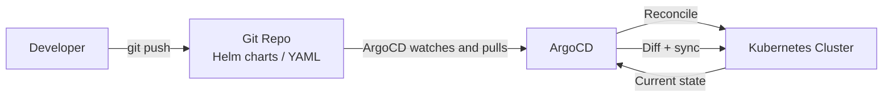

# Tools

The CI/CD tool landscape is large, but most teams settle on one CI system (GitHub Actions or GitLab CI for most new projects; Jenkins for legacy) and one CD system (ArgoCD or Flux for Kubernetes). This page covers the four most common tools in real-world use.

---

## GitHub Actions

GitHub Actions is the CI/CD system built into GitHub. Workflows are YAML files in `.github/workflows/`. Every push, PR, or scheduled event can trigger a workflow.

### Core concepts

- **Workflow** — a YAML file defining the automation. Multiple workflows can run in parallel.
- **Job** — a unit of work that runs on a single runner. Jobs in the same workflow run in parallel by default.
- **Step** — a single task within a job: run a shell command or invoke a reusable Action.
- **Runner** — the VM that executes the job. GitHub provides Ubuntu, Windows, and macOS runners.
- **Action** — a reusable step from the Actions Marketplace (e.g., `actions/checkout`, `docker/build-push-action`).

```yaml
# .github/workflows/ci.yml
name: Build and Deploy

on:
  push:
    branches: [main]
  pull_request:
    branches: [main]

jobs:
  test:
    runs-on: ubuntu-latest
    steps:
      - uses: actions/checkout@v4

      - name: Set up JDK 21
        uses: actions/setup-java@v4
        with:
          java-version: '21'
          distribution: 'temurin'
          cache: maven

      - name: Run tests
        run: ./mvnw verify

      - name: Upload test results
        if: always()
        uses: actions/upload-artifact@v4
        with:
          name: test-results
          path: target/surefire-reports/

  build-and-push:
    needs: test
    runs-on: ubuntu-latest
    if: github.ref == 'refs/heads/main'
    permissions:
      id-token: write   # needed for OIDC
      contents: read
    steps:
      - uses: actions/checkout@v4

      - name: Configure AWS credentials via OIDC (no static keys!)
        uses: aws-actions/configure-aws-credentials@v4
        with:
          role-to-assume: arn:aws:iam::123456789:role/github-actions-deploy
          aws-region: us-east-1

      - name: Build and push to ECR
        uses: docker/build-push-action@v5
        with:
          push: true
          tags: 123456789.dkr.ecr.us-east-1.amazonaws.com/myapp:${{ github.sha }}
```

### Matrix builds

```yaml
strategy:
  matrix:
    java: [17, 21]
    os: [ubuntu-latest, windows-latest]

runs-on: ${{ matrix.os }}
steps:
  - uses: actions/setup-java@v4
    with:
      java-version: ${{ matrix.java }}
```

### Reusable workflows

```yaml
# .github/workflows/deploy.yml
on:
  workflow_call:
    inputs:
      environment:
        required: true
        type: string

jobs:
  deploy:
    environment: ${{ inputs.environment }}
    runs-on: ubuntu-latest
    steps:
      - run: echo "Deploying to ${{ inputs.environment }}"

# Caller workflow:
- uses: ./.github/workflows/deploy.yml
  with:
    environment: production
```

---

## GitLab CI

GitLab CI is defined in `.gitlab-ci.yml` at the root of the repository. It is tightly integrated with GitLab's merge requests, environments, and deployment tracking.

```yaml
# .gitlab-ci.yml
stages:
  - test
  - build
  - deploy

variables:
  IMAGE_TAG: $CI_REGISTRY_IMAGE:$CI_COMMIT_SHORT_SHA

test:
  stage: test
  image: eclipse-temurin:21-jdk
  script:
    - ./mvnw verify
  artifacts:
    when: always
    reports:
      junit: target/surefire-reports/*.xml
    expire_in: 1 week
  cache:
    key: $CI_COMMIT_REF_SLUG
    paths:
      - .m2/repository

build:
  stage: build
  needs: [test]     # DAG: run as soon as test passes, not waiting for all stage jobs
  script:
    - docker build -t $IMAGE_TAG .
    - docker push $IMAGE_TAG
  only:
    - main

deploy-production:
  stage: deploy
  needs: [build]
  environment:
    name: production
    url: https://api.example.com
  script:
    - kubectl set image deployment/api api=$IMAGE_TAG
  when: manual    # requires human approval
  only:
    - main
```

### GitLab CI vs GitHub Actions

| | GitHub Actions | GitLab CI |
|---|---|---|
| **Hosting** | GitHub.com or GitHub Enterprise | GitLab.com, self-hosted, or GitLab Dedicated |
| **Config file** | `.github/workflows/*.yml` | `.gitlab-ci.yml` |
| **Pipeline model** | Jobs in stages OR DAG with `needs` | Stages OR DAG with `needs` |
| **Environments** | Environments with protection rules | Environments with deployment tracking |
| **Registry** | GitHub Container Registry (GHCR) | GitLab Container Registry built-in |
| **Self-hosted runners** | GitHub Actions Runners | GitLab Runners (same concept) |
| **Best for** | GitHub-hosted code, open-source | Self-hosted, enterprise, GitLab DevOps platform |

---

## Jenkins

Jenkins is the veteran CI/CD server. It has been the dominant tool for over a decade and remains in enormous numbers of enterprise environments. Modern Jenkins uses **declarative pipelines** defined in a `Jenkinsfile`:

```groovy
// Jenkinsfile
pipeline {
    agent any

    stages {
        stage('Test') {
            steps {
                sh './mvnw verify'
            }
            post {
                always {
                    junit 'target/surefire-reports/*.xml'
                }
            }
        }

        stage('Build') {
            when { branch 'main' }
            steps {
                sh """
                    docker build -t myapp:${GIT_COMMIT} .
                    docker push ${REGISTRY}/myapp:${GIT_COMMIT}
                """
            }
        }

        stage('Deploy') {
            when { branch 'main' }
            steps {
                input message: 'Deploy to production?'
                sh 'kubectl set image deployment/api api=${REGISTRY}/myapp:${GIT_COMMIT}'
            }
        }
    }
}
```

**Why teams move away from Jenkins:** Jenkins is powerful but operationally expensive. You manage the Jenkins server, plugins, agents, and all their updates. Plugin compatibility breaks with every major upgrade. GitHub Actions and GitLab CI eliminate this overhead entirely. The typical migration: replace Jenkins with GitHub Actions for CI, and ArgoCD for CD.

---

## ArgoCD

ArgoCD is a **GitOps continuous delivery tool for Kubernetes**. Instead of a pipeline pushing deployments (the traditional push model), ArgoCD watches a Git repository and continuously reconciles the cluster state to match the repository.



### App-of-Apps pattern

One ArgoCD Application manages a directory of ArgoCD Application manifests — bootstrapping the entire cluster from a single Git repository:

```yaml
# Root application pointing to apps/ directory
apiVersion: argoproj.io/v1alpha1
kind: Application
metadata:
  name: root-app
  namespace: argocd
spec:
  project: default
  source:
    repoURL: https://github.com/myorg/gitops
    targetRevision: main
    path: apps/
  destination:
    server: https://kubernetes.default.svc
    namespace: argocd
  syncPolicy:
    automated:
      prune: true      # delete resources removed from Git
      selfHeal: true   # revert manual changes to the cluster
```

```bash
# Install ArgoCD
kubectl create namespace argocd
kubectl apply -n argocd -f https://raw.githubusercontent.com/argoproj/argo-cd/stable/manifests/install.yaml

# Access the UI
kubectl port-forward svc/argocd-server -n argocd 8080:443

# Get initial admin password
argocd admin initial-password -n argocd
```

### ArgoCD vs Flux

Both implement GitOps for Kubernetes. Key differences:
- **ArgoCD** has a richer UI and application model; better for teams that want visibility
- **Flux** is more lightweight and GitOps-native; better for infrastructure-as-code purists
- **ArgoCD** supports multiple clusters from a single control plane natively
- **Flux** uses native Kubernetes CRDs more extensively; less opinionated UI
