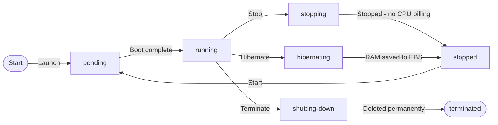
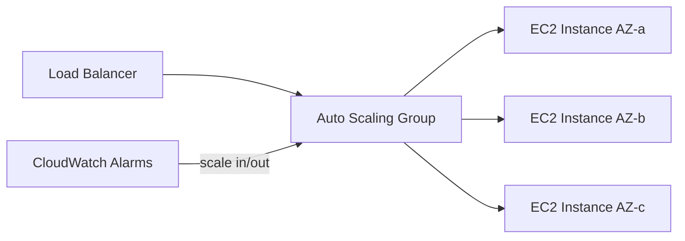
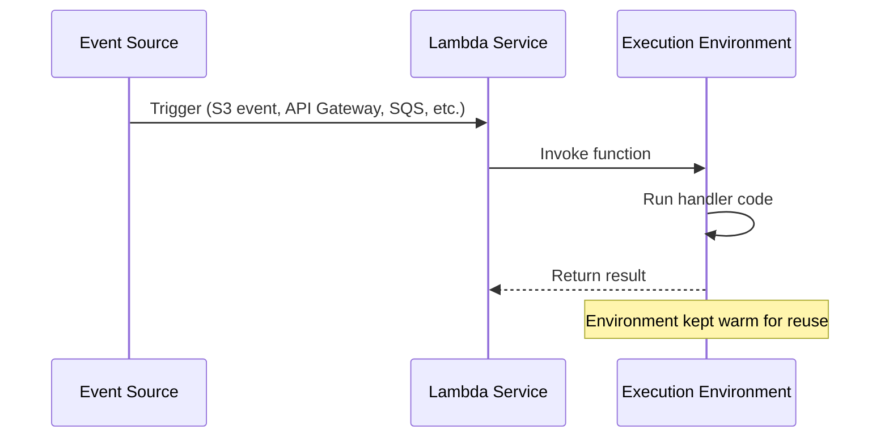
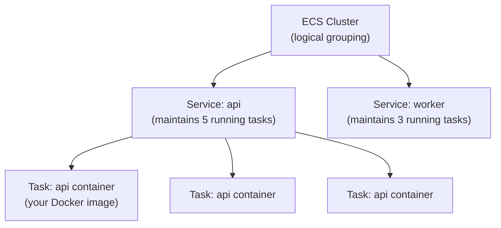

# Compute

Compute is where your code actually runs. AWS offers a spectrum from raw virtual machines you control completely (EC2), to event-driven functions where you never think about servers (Lambda), to managed container platforms in between (ECS, Fargate, EKS). Choosing the right compute layer for a given workload is one of the most consequential architectural decisions you will make — it affects cost, scalability, operational burden, and deployment speed.

---

## EC2 — Elastic Compute Cloud

EC2 is the original AWS service. You rent a virtual machine, choose the operating system, install your software, and pay by the second. Nothing is abstracted away — you have full root access, full network control, and full responsibility for what runs on it.

### Instance families

AWS offers over 400 instance types organised into families optimised for different workloads:

| Family | Optimised for | Example instances | Typical use cases |
|---|---|---|---|
| **General Purpose** (M, T) | Balanced CPU/memory ratio | `m7g.xlarge`, `t3.medium` | Web servers, small databases, dev environments |
| **Compute Optimised** (C) | High CPU-to-memory ratio | `c7g.2xlarge`, `c6i.4xlarge` | CPU-intensive apps, batch processing, media encoding |
| **Memory Optimised** (R, X, z) | High memory-to-CPU ratio | `r7g.4xlarge`, `x2iedn.xlarge` | In-memory databases, real-time analytics, SAP HANA |
| **Storage Optimised** (I, D, H) | High local disk I/O | `i4i.xlarge`, `d3en.xlarge` | Data warehouses, distributed file systems, Hadoop |
| **Accelerated Computing** (P, G, Inf, Trn) | GPU / custom silicon | `p4d.24xlarge`, `g5.xlarge` | ML training, GPU rendering, HPC |

> **Graviton instances** (marked with `g` suffix — `m7g`, `c7g`, `r7g`) run on AWS's own ARM-based processors. They typically deliver 40% better price/performance than equivalent x86 instances. If your software runs on ARM (most modern JVM, Go, Python, Node.js, and native Linux apps do), Graviton is usually the right default.

### AMIs: the base for every instance

An **Amazon Machine Image (AMI)** is a snapshot template containing the OS, root volume, and pre-installed software. You launch instances from AMIs. AWS provides Amazon Linux 2023, Ubuntu, Windows Server, and others. You can create your own "golden AMI" with your application pre-installed — this makes scaling faster because new instances do not need to install software on boot.

### User data: bootstrap scripts

User data runs a shell script once on first boot, letting you configure instances without baking a custom AMI:

```bash
#!/bin/bash
dnf update -y
dnf install -y java-21-amazon-corretto
systemctl enable --now myapp
```

### Instance metadata service

Every EC2 instance can query its own metadata at a local endpoint — instance ID, AMI ID, current IAM role credentials, and more. IMDSv2 (instance metadata service version 2) is the secure default requiring a session token:

```bash
# Get IAM role credentials without hardcoding any keys
TOKEN=$(curl -sX PUT "http://169.254.169.254/latest/api/token" \
  -H "X-aws-ec2-metadata-token-ttl-seconds: 21600")
curl -s http://169.254.169.254/latest/meta-data/iam/security-credentials/ \
  -H "X-aws-ec2-metadata-token: $TOKEN"
```

### Placement groups

By default, AWS spreads your instances across physical hardware to minimise correlated failures. Placement groups override this:

| Type | Behaviour | Use when |
|---|---|---|
| **Cluster** | Pack instances close together on same rack | HPC, ML training — need 10/25 Gbps network between nodes |
| **Spread** | Force instances onto different hardware | Small critical groups (max 7 per AZ) — prevent correlated failures |
| **Partition** | Spread across logical partitions (separate hardware racks) | Large distributed systems (Cassandra, HDFS, Kafka) |

### EC2 lifecycle



A **stopped** instance does not incur EC2 charges but you still pay for attached EBS volumes. A **terminated** instance is gone permanently. Hibernate saves RAM contents to disk and restores them on restart — useful for long-running processes with expensive initialisation.

---

## Auto Scaling Groups

A standalone EC2 instance is a single point of failure. Auto Scaling Groups (ASGs) manage a fleet of instances that scales up when demand rises and scales down when it falls — automatically.



### Launch templates

A **launch template** defines what each new instance in the group looks like: AMI, instance type, key pair, security groups, user data, and IAM role. Launch templates replaced launch configurations and support versioning.

```bash
aws ec2 create-launch-template \
  --launch-template-name web-server-template \
  --launch-template-data '{
    "ImageId": "ami-0123456789abcdef0",
    "InstanceType": "m7g.xlarge",
    "IamInstanceProfile": {"Name": "WebServerRole"},
    "UserData": "IyEvYmluL2Jhc2gK..."
  }'
```

### Scaling policies

| Policy type | How it works | Best for |
|---|---|---|
| **Target tracking** | Maintains a target metric (e.g., keep CPU at 60%) | Most production web workloads — simplest to configure |
| **Step scaling** | Add/remove specific capacity when alarms breach thresholds | When you need fine-grained response to metric changes |
| **Scheduled** | Scale on a cron schedule | Predictable traffic patterns — scale up before business hours |
| **Predictive** | ML-based forecast — scales ahead of expected spikes | High-traffic sites with regular weekly/daily patterns |

### Lifecycle hooks

Lifecycle hooks let you inject custom actions into the scale-in and scale-out lifecycle — for example, drain connections before termination, or register a new instance in your service discovery before it starts receiving traffic.

---

## Lambda — Serverless Functions

Lambda flips the compute model entirely. You write a function, upload it, and Lambda runs it in response to events. There are no servers to manage, no OS to patch, no capacity to plan. You pay only for the compute time your code actually uses, billed in 1ms increments.

### The execution model



Lambda maintains a pool of warm execution environments. When your function is invoked, Lambda reuses an existing warm environment if available (fast, sub-millisecond overhead) or creates a new one (cold start, slower).

### Cold starts: the honest explanation

A cold start happens when Lambda needs to create a new execution environment. It involves downloading your function package, starting the runtime (JVM, Node.js, Python, etc.), and running your initialisation code. For Java Spring Boot this can be 5–15 seconds. For Python or Node.js it is typically 100–500ms.

**Mitigation strategies:**
- **Provisioned concurrency** — keep N environments pre-warmed at all times (costs money even when idle)
- **Snap Start** (Java only) — pre-initialises the JVM snapshot so cold starts drop to ~1s
- Use lightweight runtimes (Python, Node.js) for latency-sensitive functions
- Keep initialisation code minimal — move heavy operations outside the handler

```java
// Lambda handler — Spring Boot with SnapStart
@SpringBootApplication
public class LambdaApplication implements RequestHandler<APIGatewayProxyRequestEvent, APIGatewayProxyResponseEvent> {

    // Spring context initialised ONCE, before handler is called
    // With SnapStart this snapshot is saved and restored on cold start
    private static final ApplicationContext context =
        SpringApplication.run(LambdaApplication.class);

    @Override
    public APIGatewayProxyResponseEvent handleRequest(
            APIGatewayProxyRequestEvent event, Context ctx) {
        return context.getBean(ApiHandler.class).handle(event);
    }
}
```

### Lambda limits

| Limit | Value |
|---|---|
| Maximum execution timeout | 15 minutes |
| Memory | 128 MB to 10 GB |
| CPU | Proportional to memory (1 vCPU at 1,769 MB) |
| Ephemeral `/tmp` storage | 512 MB to 10 GB |
| Deployment package size | 50 MB zipped, 250 MB unzipped |
| Concurrent executions (default) | 1,000 per account per region (can be raised) |

### Lambda vs Azure Functions vs Cloud Functions

All three follow the same event-driven model. Key differences:

| | AWS Lambda | Azure Functions | GCP Cloud Functions |
|---|---|---|---|
| **Cold start (Java)** | 5–15s (SnapStart: ~1s) | Similar | Similar |
| **Max timeout** | 15 min | 10 min (Consumption), unlimited (Premium) | 9 min (1st gen), 60 min (2nd gen) |
| **Pricing** | Per 1ms + per request | Per execution + GB-seconds | Per 100ms + per request |
| **Container support** | Deploy container images | Yes (Azure Container Apps) | Cloud Run (separate product) |

---

## ECS and Fargate — Managed Containers

If Lambda is too constrained (timeout, memory, or runtime) but EC2 is too much overhead, ECS (Elastic Container Service) with Fargate sits in between. You define containers, and AWS runs them.

### The ECS model



- **Task definition** — the blueprint: which container image, how much CPU/memory, environment variables, port mappings, logging configuration
- **Task** — a running instance of a task definition (equivalent to a running container or pod)
- **Service** — maintains N running tasks, replaces failed ones, integrates with load balancers

### Fargate vs EC2 launch type

| | Fargate | EC2 launch type |
|---|---|---|
| **Server management** | None — AWS provisions compute | You manage the EC2 instances in the cluster |
| **Pricing** | Pay per vCPU and memory per task per second | Pay for EC2 instances regardless of utilisation |
| **Scaling speed** | Slower — provisions new infrastructure | Faster — starts containers on existing instances |
| **Best for** | Small-to-medium workloads, variable traffic, less ops overhead | High-density workloads, GPU containers, cost-optimised at scale |

### IAM roles for tasks

Every ECS task should have its own IAM role (task role) with only the permissions it needs. Never pass AWS credentials as environment variables to containers — use task roles and the container metadata endpoint instead.

```json
{
  "family": "api-task",
  "taskRoleArn": "arn:aws:iam::123456789:role/ApiTaskRole",
  "executionRoleArn": "arn:aws:iam::123456789:role/EcsExecutionRole",
  "networkMode": "awsvpc",
  "requiresCompatibilities": ["FARGATE"],
  "cpu": "512",
  "memory": "1024",
  "containerDefinitions": [{
    "name": "api",
    "image": "123456789.dkr.ecr.us-east-1.amazonaws.com/api:latest",
    "portMappings": [{"containerPort": 8080}],
    "logConfiguration": {
      "logDriver": "awslogs",
      "options": {
        "awslogs-group": "/ecs/api",
        "awslogs-region": "us-east-1",
        "awslogs-stream-prefix": "ecs"
      }
    }
  }]
}
```

---

## EKS — Elastic Kubernetes Service

EKS provides a managed Kubernetes control plane on AWS. It handles the API server, etcd, and controller manager — the complex, stateful components of Kubernetes that are painful to operate. You manage the worker nodes (or use Fargate for serverless pods).

The full EKS deep-dive — node groups, IRSA, VPC CNI, load balancer controller, EKS vs self-hosted — is in the [Kubernetes section](/stack/kubernetes/aws-eks).
