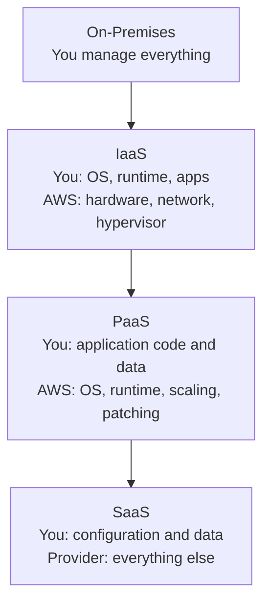
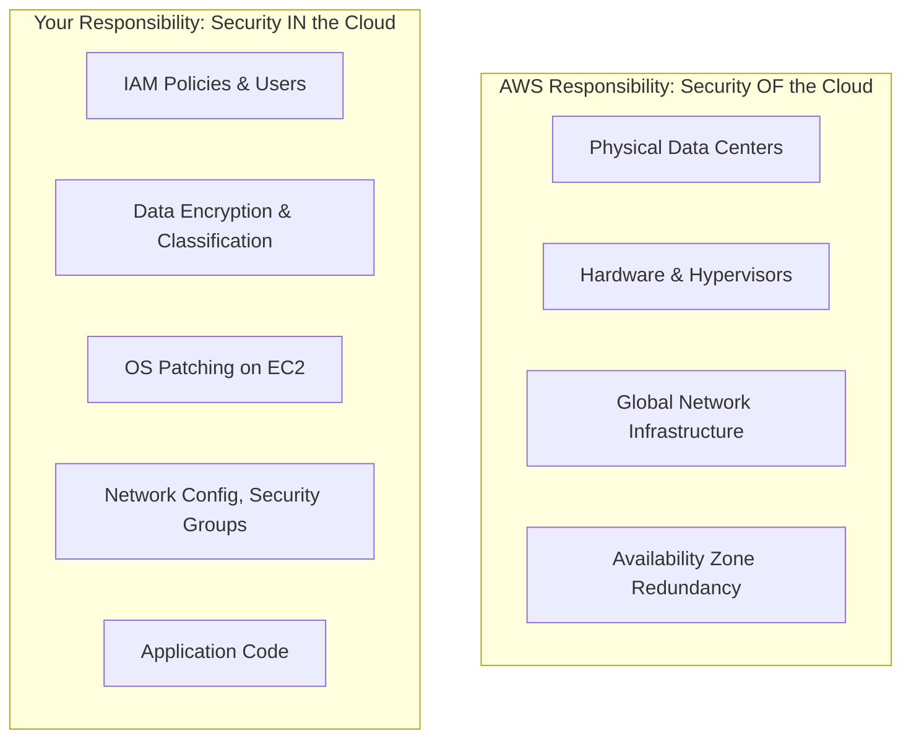
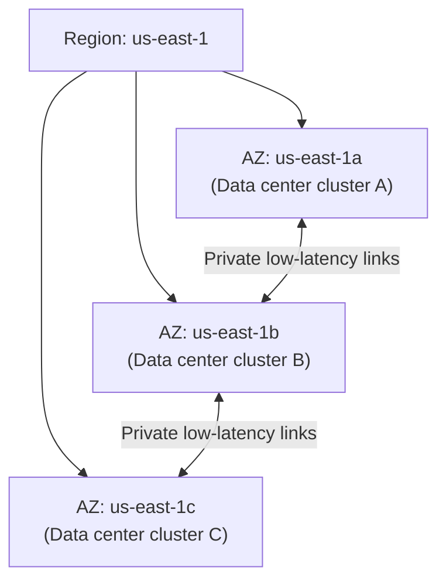

# Core Concepts

Before cloud computing, running a web application meant buying physical servers, racking them in a data center, negotiating power and cooling contracts, and waiting weeks for procurement. If your traffic doubled overnight, you either over-provisioned (wasted money) or under-provisioned (lost customers). Cloud computing broke this model by making infrastructure programmable, elastic, and pay-as-you-go. AWS launched in 2006 with S3 and EC2. Today it runs a significant fraction of the internet, along with Azure and GCP.

Understanding the cloud is not just about knowing which buttons to click in a console. It is about understanding the economic model, the shared responsibility model, and the global infrastructure that makes modern applications possible.

---

## IaaS, PaaS, and SaaS: The Abstraction Ladder

Cloud services are commonly grouped into three models based on how much infrastructure the provider manages versus how much you manage. Think of it as a spectrum from "raw building blocks" to "someone else runs it entirely."



| Model | What you manage | AWS examples | Azure / GCP equivalents |
|---|---|---|---|
| **IaaS** | OS, runtime, middleware, apps | EC2, EBS, VPC | Azure VMs, GCP Compute Engine |
| **PaaS** | Application code and data | Elastic Beanstalk, RDS, Lambda | Azure App Service, GCP App Engine |
| **SaaS** | Data and configuration only | WorkDocs, Chime | Microsoft 365, Google Workspace |

> **Real-world insight:** Most teams use all three simultaneously. EC2 for legacy apps that need OS control, RDS for managed databases, and SaaS for communication. The common mistake is choosing IaaS for everything because it feels familiar — then spending most of engineering time on patching and capacity planning instead of building product.

---

## The Shared Responsibility Model

This is the most important mental model in cloud security, and the most commonly misunderstood. AWS secures the cloud *infrastructure* — physical data centers, hardware, hypervisors, and the global network. You are responsible for securing everything you put *in* the cloud.



The boundary shifts depending on the service model:

| What you run | AWS manages | You manage |
|---|---|---|
| **EC2 (IaaS)** | Hardware, hypervisor, AZ infrastructure | OS patches, security groups, app code, data encryption |
| **RDS (PaaS)** | Hardware, OS, database engine patches | DB configuration, user credentials, encryption, backups policy |
| **Lambda (PaaS)** | Hardware, OS, runtime environment | Function code, IAM permissions, environment variables |
| **S3 (PaaS)** | Hardware, durability, availability | Bucket policies, ACLs, versioning, encryption at rest |

> **The most common breach pattern:** a developer creates an S3 bucket, assumes AWS secures it, and forgets to set bucket policies. The bucket is publicly readable. AWS secured the infrastructure — but the bucket policy was the customer's responsibility. Shared responsibility means you cannot outsource security thinking, only security operations.

---

## AWS Global Infrastructure

AWS runs across a purpose-built global network that it constantly expands. Understanding the hierarchy is essential for designing resilient, low-latency applications.

### Regions

A **Region** is a geographic cluster of data centers — `us-east-1` (Northern Virginia), `eu-west-1` (Ireland), `ap-southeast-1` (Singapore), and so on. AWS has 30+ regions globally. Each region is completely independent — a failure in `us-east-1` does not affect `eu-west-1`.

Choosing a region involves:
- **Latency** to your users — pick the region closest to your primary user base
- **Compliance and data residency** — some regulations require data to stay within specific geographies (GDPR in Europe, data localisation laws in India)
- **Service availability** — not every AWS service is available in every region; `us-east-1` typically gets new services first
- **Cost** — pricing varies by region; `us-east-1` is usually the cheapest

### Availability Zones

Each Region contains multiple **Availability Zones (AZs)** — typically 3 to 6. Each AZ is one or more physically separate data centers with independent power, cooling, and networking, connected to each other with low-latency, high-bandwidth private links.



**Why this matters for you:** deploy your application across multiple AZs so that if one AZ has a power failure, fire, or flooding, your service stays up. This is the foundation of high availability on AWS. Multi-AZ is not optional for production workloads.

### Edge Locations and CloudFront

**Edge locations** are points of presence (PoPs) in cities around the world — AWS has 400+. They serve CloudFront (CDN), Route 53 (DNS), and Shield (DDoS protection). Edge locations reduce latency for end users by caching content geographically close to them.

**Local Zones** are extensions of an AWS Region into metro areas for ultra-low-latency workloads (gaming, live video processing, AR/VR). They bring select AWS services within single-digit milliseconds of large cities.

---

## IAM Fundamentals

AWS Identity and Access Management (IAM) is the authentication and authorisation system for everything on AWS. Every API call — whether from a developer clicking in the console, your application code, or a Lambda function — passes through IAM.

### The four IAM identities

| Identity | What it is | When to use |
|---|---|---|
| **User** | A person or application with permanent credentials (access key or password) | Human developers and CI/CD systems that cannot use roles |
| **Group** | A collection of users sharing the same permissions | Organise permissions for developer teams, ops teams, read-only auditors |
| **Role** | A temporary identity any AWS service, user, or account can assume | EC2 instances, Lambda functions, ECS tasks, cross-account access — **prefer roles over long-term credentials wherever possible** |
| **Service account** | Not an IAM concept — AWS uses roles for service identity | Use IAM roles attached to EC2, Lambda, ECS tasks |

### Policies

Permissions in IAM are expressed as JSON policies. A policy lists actions, resources, and effect (Allow or Deny).

```json
{
  "Version": "2012-10-17",
  "Statement": [
    {
      "Effect": "Allow",
      "Action": [
        "s3:GetObject",
        "s3:PutObject"
      ],
      "Resource": "arn:aws:s3:::my-app-bucket/*"
    },
    {
      "Effect": "Deny",
      "Action": "s3:DeleteObject",
      "Resource": "*"
    }
  ]
}
```

### Least privilege — the only principle that matters

The most important IAM discipline is **least privilege**: grant only the exact permissions needed, on only the exact resources needed. In practice this means:

- Never use `"Resource": "*"` for write or delete actions unless you truly mean it
- Prefer IAM roles over IAM users for applications — roles issue temporary credentials that auto-rotate
- Enable MFA for all human IAM users and especially for the root account
- Rotate and audit access keys regularly; delete any not used in 90 days
- Never embed credentials in application code or commit them to source control — use environment variables, Secrets Manager, or instance roles

### Root account hygiene

The AWS root account has unrestricted access to everything. It cannot be restricted by IAM policies. Treat it like a break-glass credential:
- Enable MFA immediately
- Do not create access keys for root
- Create an IAM admin user for daily use and lock the root credentials away

---

## Cloud Cost Models

One of the most powerful properties of cloud is pay-as-you-go pricing — but it is also where teams routinely get surprised by unexpected bills. Understanding the pricing models helps you architect cost-efficiently from day one.

### On-Demand

Pay for compute or storage by the hour or second, with no commitment. Most expensive per unit, maximum flexibility.

**Use when:** unpredictable workloads, new applications where usage patterns are unknown, short-lived environments.

### Reserved Instances and Savings Plans

Commit to a certain level of usage for 1 or 3 years in exchange for significant discounts (40–75% off On-Demand).

| Option | Flexibility | Discount |
|---|---|---|
| **Standard Reserved Instance** | Locked to instance type, region, and OS | Up to 72% off |
| **Convertible Reserved Instance** | Can exchange for different instance type | Up to 66% off |
| **Compute Savings Plan** | Applies to any EC2, Fargate, or Lambda usage | Up to 66% off |
| **EC2 Instance Savings Plan** | Instance family + region only | Up to 72% off |

**Use when:** stable, predictable production workloads that run continuously. A `m5.xlarge` running 24/7 as your web server is a perfect Reserved Instance candidate.

### Spot Instances

Purchase unused EC2 capacity at 70–90% discount. AWS can reclaim with 2 minutes' notice.

**Use when:** batch jobs, distributed computing, ML training, any fault-tolerant stateless workload that can resume from checkpoint.

### Comparing to Azure and GCP

| Cost model | AWS | Azure | GCP |
|---|---|---|---|
| **Pay-as-you-go** | On-Demand | Pay-as-you-go | On-Demand |
| **Commitment discount** | Reserved Instances, Savings Plans | Reserved VM instances, Azure Savings Plan | Committed Use Discounts (1 or 3 yr) |
| **Spot / preemptible** | Spot Instances | Spot VMs | Preemptible VMs / Spot VMs |
| **Sustained use** | None | None | **Automatic sustained use discount** — GCP unique; pricing drops automatically as monthly usage increases |

> **GCP's automatic sustained use discount** is worth noting: GCP automatically discounts instances that run more than 25% of the month — no commitment needed. AWS requires a reservation commitment for equivalent savings. If your workload is steady but you prefer flexibility, GCP's model can be surprisingly competitive.
