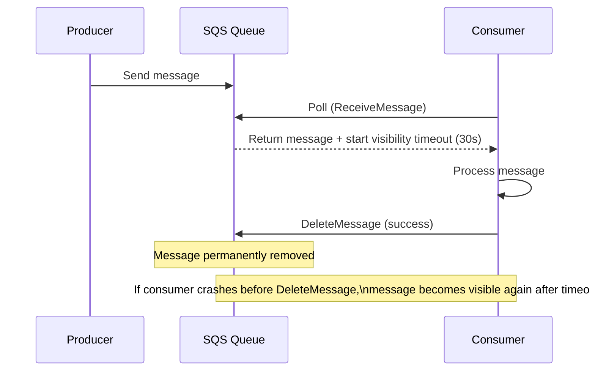
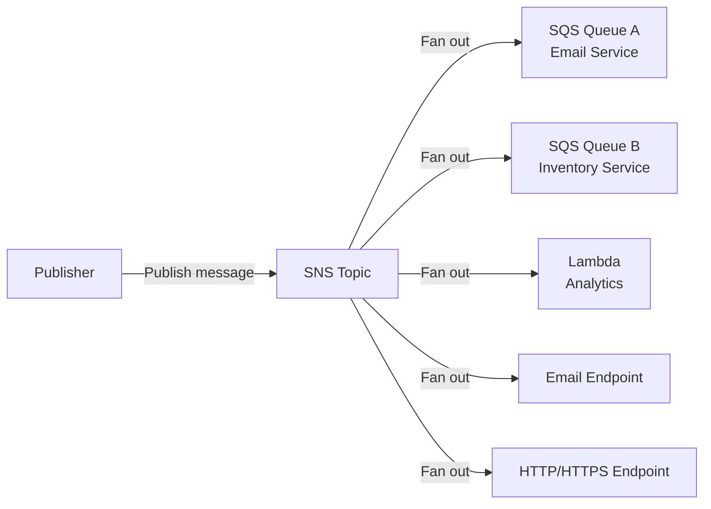

# Messaging

Decoupling services with asynchronous messaging is one of the most reliable techniques for building resilient distributed systems. Instead of Service A calling Service B synchronously and failing when B is slow or down, A drops a message into a queue and moves on. B processes it when ready. The system keeps working even when individual components are degraded.

AWS provides three distinct managed messaging services for different patterns: SQS for queues, SNS for fan-out pub/sub, and Kinesis for high-throughput event streaming.

---

## SQS — Simple Queue Service

SQS is the simplest managed queue on AWS. Producers send messages to a queue; consumers poll and process them. AWS manages durability, scaling, and message delivery — you manage the application logic.

### Standard vs FIFO queues

| | Standard Queue | FIFO Queue |
|---|---|---|
| **Throughput** | Nearly unlimited | 3,000 msg/sec with batching, 300 without |
| **Ordering** | Best-effort (messages may arrive out of order) | Strictly ordered within a message group |
| **Delivery** | At-least-once (rare duplicates possible) | Exactly-once processing |
| **Deduplication** | None | By deduplication ID (5-min window) |
| **Best for** | High-throughput tasks where ordering does not matter | Financial transactions, order processing, anything that must not be processed twice |

```bash
# Create a FIFO queue
aws sqs create-queue \
  --queue-name orders.fifo \
  --attributes '{
    "FifoQueue": "true",
    "ContentBasedDeduplication": "true",
    "VisibilityTimeout": "30"
  }'

# Send a message with a message group (for ordering)
aws sqs send-message \
  --queue-url https://sqs.us-east-1.amazonaws.com/123/orders.fifo \
  --message-body '{"orderId":"99","amount":150}' \
  --message-group-id "customer-42" \
  --message-deduplication-id "order-99-2026-06-20"
```

### Visibility timeout — the core SQS mechanism

When a consumer polls a message, SQS does not delete it immediately. Instead it becomes **invisible** to other consumers for the **visibility timeout** period (default 30 seconds). If the consumer processes and deletes it within this window, done. If the consumer crashes, the timeout expires and the message becomes visible again for another consumer to retry.



### Dead-letter queues (DLQ)

A DLQ is a separate queue that receives messages that fail processing too many times. Configure a **redrive policy** on the source queue:

```bash
# Create DLQ first
aws sqs create-queue --queue-name orders-dlq

# Set redrive policy: after 3 failed attempts, move to DLQ
aws sqs set-queue-attributes \
  --queue-url https://sqs.us-east-1.amazonaws.com/123/orders \
  --attributes '{
    "RedrivePolicy": "{\"deadLetterTargetArn\":\"arn:aws:sqs:us-east-1:123:orders-dlq\",\"maxReceiveCount\":\"3\"}"
  }'
```

Messages in the DLQ do not disappear — they sit there for investigation. Alert on DLQ depth to detect processing failures quickly.

### Long polling

By default, SQS uses short polling — each `ReceiveMessage` call returns immediately even if the queue is empty (wasting API calls and adding cost). Long polling waits up to 20 seconds for a message to arrive:

```bash
aws sqs receive-message \
  --queue-url https://sqs.us-east-1.amazonaws.com/123/orders \
  --wait-time-seconds 20 \      # long polling
  --max-number-of-messages 10   # up to 10 per call
```

Always use long polling in production. It reduces empty API responses by ~90%, lowering cost and reducing unnecessary load.

---

## SNS — Simple Notification Service

SNS is a managed pub/sub service. Publishers push messages to a **topic**; all subscribers receive the message simultaneously. SNS does not store messages — it is a fan-out mechanism, not a queue.



### SNS + SQS: the durable fan-out pattern

SNS alone delivers at-most-once. If a subscriber is down when a message arrives, it misses it. The standard production pattern is SNS → SQS: SNS fans out to multiple SQS queues, each queue buffers for its own consumer group independently.

```bash
# Create topic
aws sns create-topic --name order-events

# Subscribe SQS queues (each service gets its own queue)
aws sns subscribe \
  --topic-arn arn:aws:sns:us-east-1:123:order-events \
  --protocol sqs \
  --notification-endpoint arn:aws:sqs:us-east-1:123:email-service-queue

aws sns subscribe \
  --topic-arn arn:aws:sns:us-east-1:123:order-events \
  --protocol sqs \
  --notification-endpoint arn:aws:sqs:us-east-1:123:inventory-service-queue
```

Now `order-events` publishes once → both services receive it independently → each processes at their own pace with retry semantics.

### SQS vs Azure Service Bus vs GCP Pub/Sub

| | SQS | Azure Service Bus | GCP Pub/Sub |
|---|---|---|---|
| **Model** | Queue | Queue and topics/subscriptions | Topic with subscriptions |
| **FIFO** | Yes (FIFO queues) | Yes (sessions) | No (best-effort ordering) |
| **Exactly-once** | FIFO only | Yes | At-least-once |
| **Max message size** | 256 KB | 256 KB (Standard), 100 MB (Premium) | 10 MB |
| **Retention** | Up to 14 days | Up to 14 days | Up to 7 days (configurable longer) |
| **Fan-out** | Via SNS | Via topics | Native (one topic, many subscriptions) |

---

## Kinesis — Event Streaming

SQS and SNS are great for task queues and notifications, but they are not designed for high-throughput real-time event streaming at millions of events per second. Kinesis is.

### Kinesis Data Streams vs Kinesis Data Firehose

| | Kinesis Data Streams | Kinesis Data Firehose |
|---|---|---|
| **Latency** | Real-time (70ms typical) | Near-real-time (60s–900s buffering) |
| **Consumer** | Your application (custom) | Managed delivery to S3, Redshift, OpenSearch, Splunk |
| **Replay** | Yes — retain for 1–365 days | No |
| **Processing** | You write the consumer code | Fully managed |
| **Best for** | Real-time processing, custom logic, event sourcing | Data lake ingestion, analytics pipelines, log delivery |

### Kinesis Data Streams: shards and capacity

A Kinesis stream is divided into **shards**. Each shard provides:
- **1 MB/sec** ingest or 1,000 records/sec (whichever is lower)
- **2 MB/sec** read per consumer

```bash
# Create a stream with 4 shards
aws kinesis create-stream \
  --stream-name user-events \
  --shard-count 4

# Put a record (partition key determines shard assignment)
aws kinesis put-record \
  --stream-name user-events \
  --data '{"userId":"42","event":"purchase","amount":99.99}' \
  --partition-key "user-42"
```

Records with the same partition key always go to the same shard — enabling per-key ordering (like Kafka partition keys).

### Enhanced fan-out

Standard consumers share the 2 MB/sec read limit per shard across all consumers. **Enhanced fan-out** gives each registered consumer its own dedicated 2 MB/sec read bandwidth:

```bash
aws kinesis register-stream-consumer \
  --stream-arn arn:aws:kinesis:us-east-1:123:stream/user-events \
  --consumer-name analytics-consumer
```

Use enhanced fan-out when multiple independent consumers need to read the same stream simultaneously at high throughput.

### Kinesis vs Azure Event Hubs vs GCP Pub/Sub

| | Kinesis Data Streams | Azure Event Hubs | GCP Pub/Sub |
|---|---|---|---|
| **Throughput unit** | Shard (1 MB/s in, 2 MB/s out) | Throughput Unit (1 MB/s in, 2 MB/s out) | Automatic, no provisioning |
| **Replay** | 1–365 days | 1–90 days | 10 minutes to 7 days |
| **Kafka compatible** | No | Yes — Event Hubs has a Kafka endpoint | No |
| **Serverless mode** | Yes (On-Demand) | Yes (Serverless tier) | Yes (always serverless) |

---

## MSK — Managed Streaming for Kafka

MSK provides a managed Apache Kafka cluster on AWS. It is the right choice when you need Kafka's rich semantics — consumer groups, replay, compaction, and the Kafka ecosystem (Kafka Streams, Kafka Connect, Schema Registry) — without operating Kafka yourself.

The full MSK deep-dive is in the [Kafka section](/stack/kafka/aws-msk).
