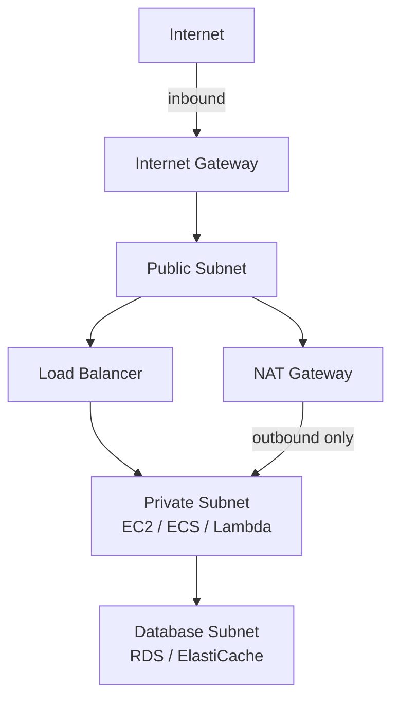
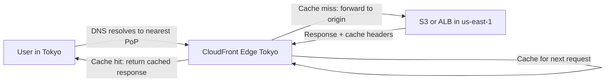

# Networking

Networking is the glue that connects every other piece of your AWS architecture. Done well, it is invisible — traffic flows, services talk to each other, users get fast responses. Done poorly, you get security breaches, mysterious timeouts, and traffic routing that makes no sense. This page covers the five networking building blocks you interact with on every production deployment.

---

## VPC — Virtual Private Cloud

A VPC is your own logically isolated network inside AWS. When you launch an EC2 instance, an RDS database, or an ECS container, it runs inside a VPC. You control the IP address ranges, routing, and access rules.

### CIDR planning

Every VPC has a primary CIDR block (e.g., `10.0.0.0/16` = 65,536 addresses). You subdivide this into subnets — one per use case per AZ. Plan your CIDR carefully up front; changing it later is painful.

A typical production VPC layout for three AZs:

```
VPC: 10.0.0.0/16

Public subnets (for load balancers, NAT gateways, bastion hosts):
  10.0.1.0/24  — us-east-1a
  10.0.2.0/24  — us-east-1b
  10.0.3.0/24  — us-east-1c

Private subnets (for EC2, ECS, Lambda, RDS):
  10.0.10.0/24 — us-east-1a
  10.0.11.0/24 — us-east-1b
  10.0.12.0/24 — us-east-1c

Database subnets (isolated, no internet egress):
  10.0.20.0/24 — us-east-1a
  10.0.21.0/24 — us-east-1b
  10.0.22.0/24 — us-east-1c
```

### Public vs private subnets

The distinction is whether the subnet has a route to the **Internet Gateway (IGW)**:

- **Public subnet:** has a route `0.0.0.0/0 → internet-gateway`. Resources here can receive inbound traffic from the internet (if they have a public IP) and reach out directly.
- **Private subnet:** no route to the IGW. Resources here cannot receive inbound internet traffic. Outbound internet access goes through a **NAT Gateway** in a public subnet.



> **NAT Gateway vs NAT instance:** NAT Gateway is managed by AWS — no patching, no sizing, automatic scaling. NAT instance is a self-managed EC2 instance running NAT software — cheaper for very low outbound traffic but painful to operate. Use NAT Gateway for anything production.

### VPC peering and Transit Gateway

**VPC peering** connects two VPCs (in the same or different accounts/regions) so their resources can communicate over private IPs. The catch: peering is not transitive. If A peers with B and B peers with C, A cannot talk to C through B.

**Transit Gateway** is a managed network hub that acts as a router for multiple VPCs, on-premises networks, and VPN connections. It scales up to thousands of VPC attachments. For architectures with more than 3–4 VPCs, Transit Gateway is almost always the better choice.

### VPC endpoints

VPC endpoints let resources in a private subnet reach AWS services (S3, DynamoDB, Secrets Manager, etc.) without traffic leaving AWS's network and without needing a NAT Gateway. There are two types:

- **Gateway endpoint** — S3 and DynamoDB only; free; routes through the routing table
- **Interface endpoint (PrivateLink)** — most other AWS services; creates an ENI with a private IP in your subnet; small hourly cost

---

## Load Balancers — ALB, NLB, and CLB

AWS offers three load balancer types. Most teams use ALB for HTTP workloads and NLB for everything else. CLB is legacy — avoid it for new deployments.

### Application Load Balancer (ALB)

ALB operates at Layer 7 (HTTP/HTTPS). It can inspect request content and route based on:
- **Path-based routing:** `/api/*` → service-a, `/web/*` → service-b
- **Host-based routing:** `api.example.com` → api-target-group, `admin.example.com` → admin-target-group
- **Header/query string matching:** route specific cookies or user-agent values

```bash
# Create an ALB
aws elbv2 create-load-balancer \
  --name prod-alb \
  --subnets subnet-public-1a subnet-public-1b subnet-public-1c \
  --security-groups sg-alb \
  --scheme internet-facing \
  --type application

# Add a HTTPS listener with certificate
aws elbv2 create-listener \
  --load-balancer-arn arn:aws:elasticloadbalancing:... \
  --protocol HTTPS --port 443 \
  --certificates CertificateArn=arn:aws:acm:... \
  --default-actions Type=forward,TargetGroupArn=arn:aws:elasticloadbalancing:...
```

ALBs also integrate natively with **AWS WAF** (Web Application Firewall) to block SQL injection, XSS, and rate-limit abuse at the edge.

### Network Load Balancer (NLB)

NLB operates at Layer 4 (TCP/UDP/TLS). It passes traffic through to targets with minimal processing — sub-millisecond latency at millions of requests per second. Use NLB when:
- You need TCP pass-through (e.g., database proxies, gRPC, WebSockets at extreme scale)
- You need a static IP (NLBs get Elastic IPs; ALBs do not)
- You need to handle non-HTTP protocols

| | ALB | NLB |
|---|---|---|
| **Layer** | 7 (HTTP/HTTPS/WebSocket/HTTP2/gRPC) | 4 (TCP/UDP/TLS) |
| **Routing** | Content-based (path, host, headers) | IP + port only |
| **Latency** | Low | Ultra-low |
| **Static IP** | No | Yes |
| **WAF integration** | Yes | No |
| **Best for** | Microservices, web apps, REST APIs | Low-latency TCP, non-HTTP protocols |

**Azure/GCP equivalents:** Azure Application Gateway (ALB-equivalent), Azure Load Balancer (NLB-equivalent); GCP Application Load Balancer, GCP Network Load Balancer.

---

## Route 53 — DNS and Traffic Management

Route 53 is AWS's managed DNS and traffic management service. It answers DNS queries for your domain, performs health checks, and can intelligently route traffic based on latency, geography, or failover state.

### Record types

```bash
# A record — maps hostname to IPv4
aws route53 change-resource-record-sets --hosted-zone-id Z123 --change-batch '{
  "Changes": [{"Action":"UPSERT","ResourceRecordSet":{
    "Name":"api.example.com","Type":"A","TTL":60,
    "ResourceRecords":[{"Value":"54.1.2.3"}]
  }}]}'

# CNAME — alias to another hostname
# ALIAS — AWS-specific; like CNAME but works at zone apex and is free
# MX — mail server records
# TXT — verification records (SPF, DKIM, domain verification)
```

### Routing policies

| Policy | How it works | Use when |
|---|---|---|
| **Simple** | Returns one or more values round-robin | Single resource, no health checks needed |
| **Weighted** | Route X% to one endpoint, Y% to another | Canary deployments, A/B testing |
| **Latency** | Route to the region with lowest latency for the client | Global app with multiple region deployments |
| **Failover** | Active/passive — route to secondary if primary health check fails | Disaster recovery |
| **Geolocation** | Route based on where the request originates | Compliance, content localisation |
| **Geoproximity** | Route to closest resource with configurable bias | Fine-grained traffic shifting between regions |
| **Multi-value** | Return up to 8 healthy values | Simple load distribution with health checks |

**Azure/GCP equivalents:** Azure DNS + Azure Traffic Manager (routing policies); GCP Cloud DNS + GCP Cloud Load Balancing (anycast global routing).

---

## CloudFront — CDN and Edge Delivery

CloudFront is AWS's content delivery network (CDN). It caches content at 400+ edge locations worldwide, reducing latency for end users and offloading origin servers.



### Distributions and behaviors

A **distribution** is a CloudFront configuration tied to a domain name. Within a distribution, **behaviors** define which origin handles which URL patterns:

```
/api/*          → forwards to ALB (dynamic, low TTL)
/static/*       → serves from S3 (static assets, long TTL)
/images/*       → serves from S3 with image optimization
default (/)     → serves index.html from S3 for SPA
```

### Cache policies and TTL

```bash
# Managed cache policy: CachingOptimized
# Good default for static assets — respects Cache-Control headers
aws cloudfront create-distribution --distribution-config '{
  "DefaultCacheBehavior": {
    "CachePolicyId": "658327ea-f89d-4fab-a63d-7e88639e58f6",
    "ViewerProtocolPolicy": "redirect-to-https",
    "TargetOriginId": "S3Origin"
  }
}'
```

### Lambda@Edge

Lambda@Edge lets you run code at CloudFront edge locations to manipulate requests or responses — add security headers, implement A/B testing, perform authentication at the edge, or redirect users based on geography. It runs your code within milliseconds of the user, before or after the cache.

**Azure/GCP equivalents:** Azure CDN (Verizon/Akamai backends), Azure Front Door (global load balancer + CDN + WAF); GCP Cloud CDN, GCP Media CDN.

---

## Direct Connect and VPN — Hybrid Connectivity

Most companies have on-premises data centers or offices that need to communicate with AWS resources. Two options exist: encrypted internet tunnels (VPN) or dedicated private links (Direct Connect).

### Site-to-Site VPN

An encrypted IPSec tunnel over the public internet between your data center or office and a **Virtual Private Gateway** (VGW) attached to your VPC.

```bash
# Create a Customer Gateway (your on-premises router)
aws ec2 create-customer-gateway \
  --type ipsec.1 \
  --public-ip 203.0.113.1 \
  --bgp-asn 65000

# Create VPN connection
aws ec2 create-vpn-connection \
  --type ipsec.1 \
  --customer-gateway-id cgw-xxxx \
  --vpn-gateway-id vgw-xxxx
```

- **Setup time:** minutes to hours
- **Throughput:** up to 1.25 Gbps per tunnel (use multiple tunnels for more)
- **Latency:** dependent on public internet — variable
- **Cost:** ~$0.05/hour per VPN connection + data transfer

### AWS Direct Connect

A dedicated private network connection from your data center to AWS, bypassing the public internet entirely. AWS partners (co-location providers, ISPs) provide the physical cross-connect.

| | Site-to-Site VPN | Direct Connect |
|---|---|---|
| **Setup time** | Minutes | Weeks to months |
| **Bandwidth** | Up to 1.25 Gbps | 50 Mbps to 100 Gbps |
| **Latency** | Variable (internet) | Consistent, low |
| **Reliability** | Internet-dependent | SLA-backed |
| **Cost** | Low monthly fee | High (port fee + partner fee + data transfer) |
| **Best for** | Backup path, low-volume, quick setup | Production data pipelines, compliance requirements, consistent latency |

> **Best practice:** use Direct Connect as the primary path and a Site-to-Site VPN as an automatic failover backup. This gives you dedicated bandwidth under normal conditions and internet fallback if the physical connection fails.

**Azure/GCP equivalents:** Azure ExpressRoute (Direct Connect equivalent), GCP Cloud Interconnect (Dedicated and Partner options).
