# Observability

You cannot improve what you cannot see. Observability — the ability to understand your system's internal state by looking at its external outputs — is what separates teams that find problems before users do from teams that learn about outages from Twitter. On AWS, CloudWatch is the central nervous system for metrics and logs, and X-Ray is the distributed tracing layer that connects the dots across services.

---

## CloudWatch

CloudWatch is AWS's monitoring and observability service. It collects metrics from virtually every AWS resource automatically, stores logs from your applications, evaluates alarm conditions, and triggers automated actions.

### Metrics: namespaces, dimensions, and statistics

Every metric in CloudWatch lives in a **namespace** (e.g., `AWS/EC2`, `AWS/RDS`, `AWS/Lambda`, or your own custom namespace). Each metric is identified by its name plus a set of **dimensions** — key-value pairs that identify the specific resource.

```bash
# Get CPU utilisation for a specific EC2 instance
aws cloudwatch get-metric-statistics \
  --namespace AWS/EC2 \
  --metric-name CPUUtilization \
  --dimensions Name=InstanceId,Value=i-0123456789abcdef0 \
  --start-time 2026-06-20T08:00:00Z \
  --end-time 2026-06-20T10:00:00Z \
  --period 300 \
  --statistics Average,Maximum

# Publish a custom metric from your application
aws cloudwatch put-metric-data \
  --namespace MyApp/Orders \
  --metric-name OrderProcessingTime \
  --value 145 \
  --unit Milliseconds \
  --dimensions Environment=production,Service=order-processor
```

### Alarms

A CloudWatch alarm watches a single metric over a time window and triggers an action when the metric breaches a threshold. Actions include Auto Scaling policies, SNS notifications (which can page on-call via PagerDuty), and Lambda functions.

```bash
# Alert when p99 Lambda duration exceeds 2 seconds
aws cloudwatch put-metric-alarm \
  --alarm-name lambda-high-p99-latency \
  --alarm-description "Lambda p99 duration over 2s" \
  --namespace AWS/Lambda \
  --metric-name Duration \
  --dimensions Name=FunctionName,Value=order-processor \
  --statistic p99 \
  --period 60 \
  --threshold 2000 \
  --comparison-operator GreaterThanThreshold \
  --evaluation-periods 3 \
  --alarm-actions arn:aws:sns:us-east-1:123:ops-alerts \
  --treat-missing-data notBreaching
```

**Composite alarms** combine multiple alarms with AND/OR logic — fire only when both high latency AND high error rate are true simultaneously, reducing alert noise from correlated signals.

### CloudWatch Logs

Applications, services, and AWS resources stream logs to CloudWatch **log groups**. Each log group contains **log streams** (one per instance, Lambda execution environment, or container task).

```bash
# Tail recent logs from a Lambda function
aws logs tail /aws/lambda/order-processor --follow

# Filter log events
aws logs filter-log-events \
  --log-group-name /aws/lambda/order-processor \
  --filter-pattern '{ $.level = "ERROR" }' \
  --start-time $(date -d '1 hour ago' +%s000)
```

**Metric filters** extract numeric values from log messages and publish them as CloudWatch metrics — turning unstructured log data into actionable signals:

```bash
# Create a metric filter to count ERROR log lines
aws logs put-metric-filter \
  --log-group-name /aws/lambda/order-processor \
  --filter-name ErrorCount \
  --filter-pattern "[timestamp, requestId, level=ERROR, ...]" \
  --metric-transformations \
    metricName=ErrorCount,metricNamespace=MyApp/Lambda,metricValue=1
```

### CloudWatch Logs Insights

Logs Insights is a query engine for CloudWatch logs. It lets you run SQL-like queries across billions of log events in seconds — invaluable for incident investigation.

```sql
-- Find the slowest 10 requests in the last hour
fields @timestamp, requestId, duration
| filter duration > 1000
| sort duration desc
| limit 10

-- Count errors by error message
fields @message
| filter level = "ERROR"
| parse @message "Exception: *" as errorMsg
| stats count(*) as errorCount by errorMsg
| sort errorCount desc
```

### CloudWatch Dashboards

Dashboards give you a real-time view of your system across multiple metrics, log queries, and alarms on a single screen. Build one per service, one for each on-call rotation, and a business-facing dashboard for product metrics.

### CloudWatch vs Azure Monitor vs GCP Cloud Monitoring

All three collect metrics and logs from managed services automatically. Key differences:
- **Azure Monitor** uses a more unified data model where logs and metrics are both queryable in the same KQL query language — CloudWatch keeps them separate
- **GCP Cloud Monitoring** uses Workspaces to aggregate monitoring from multiple projects, with strong out-of-box Kubernetes monitoring
- **Pricing:** CloudWatch charges for custom metrics, API calls, and log storage; Azure Monitor charges for data ingestion; GCP Cloud Monitoring has a free tier for GCP metrics

---

## X-Ray — Distributed Tracing

CloudWatch shows you what is slow. X-Ray shows you *why* — by tracing a request through every service it touches and visualising the timing breakdown.

### The distributed tracing problem

In a microservices system, a single user request might touch an API Gateway, Lambda function, three internal services, an RDS database, and two external HTTP calls. When a request is slow, you need to know which hop is responsible. Logs tell you what each service did; tracing tells you how they fit together temporally.

```mermaid
gantt
    title Request trace: 820ms total
    dateFormat  x
    axisFormat  %L ms
    section API Gateway
    Overhead           :0, 15
    section Lambda (cold start avoided)
    Init               :15, 45
    section Order Service
    Validate           :45, 65
    section Database
    Query (RDS)        :65, 590
    section Payment Service
    External API call  :590, 800
    section Response
    Serialize          :800, 820
```



In this example, the RDS query (525ms) and external payment API call (210ms) are the bottlenecks — not the Lambda function or API Gateway. Without tracing, you would not know where to start optimising.

### X-Ray concepts

- **Trace** — the end-to-end journey of a single request through your system
- **Segment** — one service's contribution to the trace (e.g., your Lambda function)
- **Subsegment** — a unit of work within a segment (e.g., a specific database query within the Lambda)
- **Annotation** — key-value metadata indexed for filtering (e.g., `userId`, `orderId`)
- **Metadata** — non-indexed data attached to a segment (too large or not needed for filtering)

### Instrumenting a Spring Boot service

```java
// Add aws-xray-recorder-sdk-spring dependency

@Configuration
public class XRayConfig {
    @Bean
    public Filter TracingFilter() {
        return new AWSXRayServletFilter("order-service");
    }
}

// X-Ray automatically creates a segment for each incoming HTTP request
// For outbound calls, wrap with subsegments:
public Order placeOrder(OrderRequest request) {
    return AWSXRay.createSubsegment("validate-inventory", subsegment -> {
        subsegment.putAnnotation("orderId", request.getOrderId());
        return inventoryService.validate(request);
    });
}
```

### Service map

X-Ray's service map visualises how services connect and highlights latency and error rates on each connection — the fastest way to identify which service is causing degradation during an incident.

```bash
# Get the service map for the last hour
aws xray get-service-graph \
  --start-time $(date -d '1 hour ago' +%s) \
  --end-time $(date +%s)
```

### Sampling

Tracing every request would generate enormous cost and data volume. X-Ray uses sampling rules to trace a representative subset:

```bash
# Default: 1 request/second + 5% of remaining
# Custom: trace 10% of /api/orders requests
aws xray create-sampling-rule --sampling-rule '{
  "RuleName": "OrdersEndpoint",
  "Priority": 1,
  "FixedRate": 0.1,
  "ReservoirSize": 5,
  "ServiceName": "order-service",
  "ServiceType": "*",
  "URLPath": "/api/orders*",
  "HTTPMethod": "*",
  "ResourceARN": "*",
  "Host": "*",
  "Version": 1
}'
```

### X-Ray vs OpenTelemetry

AWS is moving toward **OpenTelemetry (OTel)** as the standard instrumentation API. The AWS Distro for OpenTelemetry (ADOT) lets you collect traces in the OTel format and export them to X-Ray, Jaeger, Zipkin, or any compatible backend. This means your instrumentation code is not vendor-locked even if you send traces to X-Ray today.

```java
// OpenTelemetry — same instrumentation works with X-Ray, Jaeger, or Zipkin
@Autowired Tracer tracer;

Span span = tracer.spanBuilder("validate-inventory")
    .setAttribute("orderId", request.getOrderId())
    .startSpan();
try (Scope scope = span.makeCurrent()) {
    return inventoryService.validate(request);
} finally {
    span.end();
}
```

**Azure/GCP equivalents:** Azure Application Insights (integrated APM with tracing, logs, and metrics in one product), GCP Cloud Trace (distributed tracing) + GCP Cloud Profiler.
