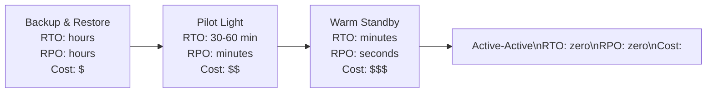

# Production Patterns

Getting an application running on AWS is straightforward. Getting it to run *well* — reliably at scale, cost-efficiently, securely, and maintainably — requires deliberate architectural thinking. AWS distilled decades of cloud operational experience into the Well-Architected Framework, and this page covers the production-level patterns every team should apply.

---

## The AWS Well-Architected Framework

The Well-Architected Framework (WAF) is a structured way to evaluate your architecture against six pillars. It is not a checklist — it is a set of design questions and trade-offs. Use the AWS Well-Architected Tool in the console to run formal reviews against your workloads.

### 1. Operational Excellence

*Can you run and monitor systems to deliver business value and continually improve supporting processes and procedures?*

Key questions:
- Do you use Infrastructure as Code? (If not, your infrastructure is undocumented and unrepeatable)
- Do you have runbooks for common operational events?
- Do you do post-incident reviews (blameless post-mortems)?
- Can you make small, reversible changes frequently? (Feature flags, blue/green deployments)

### 2. Security

*Can you protect information, systems, and assets while delivering business value through risk assessments and mitigation strategies?*

Key questions:
- Are all humans using MFA? Is the root account locked?
- Do you follow least-privilege IAM? Are there wildcard `*` resource ARNs in production?
- Is data encrypted at rest and in transit everywhere?
- Do you have GuardDuty, Config, and CloudTrail enabled in all accounts and regions?
- Are you using Secrets Manager for all credentials? (No hardcoded passwords anywhere)

### 3. Reliability

*Can you recover from infrastructure or service failures and dynamically acquire computing resources to meet demand?*

Key questions:
- Is your application deployed across multiple AZs?
- Have you tested failover? (Have you ever actually *proved* your Multi-AZ RDS fails over correctly?)
- Do you have automated health checks that remove unhealthy instances from load balancers?
- What is your RTO/RPO? Does your architecture actually meet it?
- Do you use exponential backoff with jitter for retries to prevent thundering herd?

### 4. Performance Efficiency

*Can you use computing resources efficiently to meet system requirements and maintain efficiency as demand changes?*

Key questions:
- Are you using the right instance type for the workload? (Are memory-optimised instances running CPU-bound tasks?)
- Are you using Graviton (ARM) instances where possible?
- Is your caching strategy effective? (ElastiCache hit rate above 90%?)
- Are you using CloudFront for static assets?

### 5. Cost Optimisation

*Can you avoid unnecessary costs?*

Key questions:
- Are unused resources cleaned up automatically? (Orphaned EBS volumes, unattached Elastic IPs, idle RDS instances)
- Are stable workloads covered by Savings Plans or Reserved Instances?
- Is S3 lifecycle configured to move old objects to cheaper storage classes?
- Are you tracking cost per service, team, or product with cost allocation tags?

### 6. Sustainability

*Can you minimise environmental impacts of running cloud workloads?*

Key questions:
- Are you using managed services where possible instead of EC2? (Lambda, Fargate, RDS use AWS's economies of scale more efficiently)
- Are development environments shut down outside business hours?
- Are you rightsizing instances rather than running over-provisioned instances 24/7?

---

## Multi-Region and Disaster Recovery

No region is immune to failure. AWS has experienced region-wide incidents, and the teams that designed for it kept serving users while others went dark. Designing for multi-region is not just about paranoia — it is about meeting SLAs.

### RTO and RPO — the two DR metrics

**RTO (Recovery Time Objective):** How long can you tolerate being down? "We can tolerate 4 hours of downtime" means your RTO is 4 hours.

**RPO (Recovery Point Objective):** How much data can you afford to lose? "We can lose up to 15 minutes of data" means your RPO is 15 minutes.

These two numbers determine the complexity and cost of your DR strategy:

### DR strategies (cheapest to most expensive)



**Backup and Restore:** S3 cross-region replication + RDS automated backup copies to DR region. On disaster, restore from backup. Cheapest — but recovery takes hours.

**Pilot Light:** Core infrastructure runs at minimum scale in the DR region (RDS Multi-Region replica, minimal EC2 or Lambda). On disaster, scale up quickly. Recovery in 30–60 minutes.

**Warm Standby:** Full copy of the production stack running at reduced capacity in DR region. On disaster, scale up traffic. Recovery in minutes.

**Active-Active:** Traffic runs in both regions simultaneously. On disaster, Route 53 health checks redirect traffic to the healthy region in seconds. No RTO. Most expensive — you are paying for double infrastructure.

### Implementing failover with Route 53

```bash
# Create health check for primary region
aws route53 create-health-check \
  --caller-reference $(date +%s) \
  --health-check-config '{
    "Type": "HTTPS",
    "FullyQualifiedDomainName": "api-us-east-1.example.com",
    "Port": 443,
    "ResourcePath": "/health",
    "FailureThreshold": 3,
    "RequestInterval": 10
  }'

# Primary record — active
aws route53 change-resource-record-sets --hosted-zone-id Z123 --change-batch '{
  "Changes": [{"Action":"UPSERT","ResourceRecordSet":{
    "Name":"api.example.com","Type":"A","SetIdentifier":"primary",
    "Failover":"PRIMARY","TTL":30,
    "ResourceRecords":[{"Value":"us-east-1-alb-ip"}],
    "HealthCheckId":"hc-primary-id"
  }}]}'

# Secondary record — passive, activated when primary health check fails
aws route53 change-resource-record-sets --hosted-zone-id Z123 --change-batch '{
  "Changes": [{"Action":"UPSERT","ResourceRecordSet":{
    "Name":"api.example.com","Type":"A","SetIdentifier":"secondary",
    "Failover":"SECONDARY","TTL":30,
    "ResourceRecords":[{"Value":"us-west-2-alb-ip"}]
  }}]}'
```

### Data replication across regions

| Data store | Replication option | Notes |
|---|---|---|
| **RDS / Aurora** | Read replica promotion | Aurora Global Database for <1s lag |
| **DynamoDB** | Global Tables | Active-active, multi-region reads and writes |
| **S3** | Cross-Region Replication | Near-real-time, one-way or bidirectional |
| **ElastiCache** | Global Datastore | Active-passive, <500ms lag |
| **Kinesis** | No built-in — use Lambda or Firehose to mirror | Custom solution |

> **Test your DR plan.** A DR plan that has never been executed is a hypothesis, not a plan. Run game days — deliberately fail a region or AZ in a staging environment and time your recovery. You will find gaps.

---

## Cost Optimisation

Cloud bills have a habit of growing quietly and then shocking you at month-end. Cost optimisation is an ongoing discipline, not a one-time exercise.

### Compute: Savings Plans and Spot

**Compute Savings Plans** give you 40–66% discount on EC2, Lambda, and Fargate in exchange for committing to a dollar-per-hour spend for 1 or 3 years. They are more flexible than Reserved Instances — they apply to any instance type, size, region, or OS.

```bash
# View Savings Plan recommendations
aws savingsplans describe-savings-plans-offering-rates \
  --savings-plans-offering-filters '[{"name":"savingsPlanType","values":["Compute"]}]'

# Purchase a $10/hour Compute Savings Plan for 1 year
aws savingsplans create-savings-plan \
  --savings-plan-offering-id <offering-id> \
  --commitment 10.00 \
  --term-duration-in-years 1
```

Use **Spot Instances** for fault-tolerant batch workloads (ML training, data processing, CI/CD runners). Configure **Spot interruption handling** — your application must checkpoint work and handle the 2-minute warning gracefully.

### Storage lifecycle policies

Object storage costs grow continuously if you never move or delete old data. Set lifecycle rules for every S3 bucket:

```json
{
  "Rules": [{
    "ID": "intelligent-tiering",
    "Status": "Enabled",
    "Filter": {},
    "Transitions": [{
      "Days": 0,
      "StorageClass": "INTELLIGENT_TIERING"
    }]
  }]
}
```

For logs and build artifacts, use explicit transitions: `STANDARD_IA` after 30 days, `GLACIER` after 90, delete after 365.

### AWS Cost Explorer and Budgets

Cost Explorer visualises your spend by service, region, account, and tag over time. Enable it and review weekly.

```bash
# Set a budget alert at $1000/month
aws budgets create-budget \
  --account-id 123456789012 \
  --budget '{
    "BudgetName": "monthly-aws-spend",
    "BudgetLimit": {"Amount": "1000", "Unit": "USD"},
    "TimeUnit": "MONTHLY",
    "BudgetType": "COST"
  }' \
  --notifications-with-subscribers '[{
    "Notification": {
      "NotificationType": "ACTUAL",
      "ComparisonOperator": "GREATER_THAN",
      "Threshold": 80,
      "ThresholdType": "PERCENTAGE"
    },
    "Subscribers": [{"SubscriptionType":"EMAIL","Address":"ops@example.com"}]
  }]'
```

**AWS Compute Optimizer** analyses EC2, Lambda, and ECS usage patterns and recommends rightsizing — often finding 30–50% savings on over-provisioned instances.

---

## Infrastructure as Code

If you are clicking through the AWS Console to provision resources, you are accumulating operational debt. Infrastructure as Code (IaC) makes your infrastructure repeatable, reviewable, and version-controlled. **Terraform** is the most widely used IaC tool across AWS, Azure, and GCP.

### Terraform: the core workflow

```hcl
# main.tf

terraform {
  required_providers {
    aws = {
      source  = "hashicorp/aws"
      version = "~> 5.0"
    }
  }
  backend "s3" {
    bucket = "my-terraform-state"
    key    = "prod/terraform.tfstate"
    region = "us-east-1"
  }
}

provider "aws" {
  region = var.aws_region
}

# VPC
module "vpc" {
  source  = "terraform-aws-modules/vpc/aws"
  version = "5.1.0"

  name = "prod-vpc"
  cidr = "10.0.0.0/16"
  azs  = ["us-east-1a", "us-east-1b", "us-east-1c"]

  private_subnets  = ["10.0.10.0/24", "10.0.11.0/24", "10.0.12.0/24"]
  public_subnets   = ["10.0.1.0/24",  "10.0.2.0/24",  "10.0.3.0/24"]

  enable_nat_gateway = true
  single_nat_gateway = false   # one NAT per AZ for HA
}

# RDS
resource "aws_db_instance" "postgres" {
  identifier        = "prod-postgres"
  engine            = "postgres"
  engine_version    = "16.2"
  instance_class    = "db.r7g.xlarge"
  allocated_storage = 100
  storage_type      = "gp3"

  multi_az            = true
  publicly_accessible = false
  skip_final_snapshot = false

  db_subnet_group_name   = aws_db_subnet_group.default.name
  vpc_security_group_ids = [aws_security_group.rds.id]
}
```

```bash
terraform init      # download providers and modules
terraform plan      # preview changes
terraform apply     # apply changes (prompts for confirmation)
terraform destroy   # tear down all managed resources
```

### State management

Terraform tracks what it has created in a **state file** (`terraform.tfstate`). In a team, state must be stored remotely and locked:

- **Remote backend:** S3 bucket with versioning enabled
- **State locking:** DynamoDB table to prevent concurrent applies

### Modules: reusable infrastructure components

Terraform modules let you package infrastructure patterns for reuse:

```hcl
# Use the VPC module across all environments
module "vpc" {
  source  = "./modules/vpc"
  env     = "production"
  cidr    = "10.0.0.0/16"
}
```

### AWS CDK — IaC with real programming languages

AWS Cloud Development Kit (CDK) lets you define infrastructure in TypeScript, Java, Python, or C#. It is compiled to CloudFormation templates. The benefit: real loops, conditionals, and type safety. The downside: AWS-only, and CloudFormation's limitations apply.

```java
// CDK — define an S3 bucket in Java
Bucket bucket = Bucket.Builder.create(this, "DataLake")
    .bucketName("my-data-lake-prod")
    .versioned(true)
    .encryption(BucketEncryption.S3_MANAGED)
    .blockPublicAccess(BlockPublicAccess.BLOCK_ALL)
    .lifecycleRules(List.of(
        LifecycleRule.builder()
            .transitions(List.of(
                Transition.builder()
                    .storageClass(StorageClass.INFREQUENT_ACCESS)
                    .transitionAfter(Duration.days(30))
                    .build()
            ))
            .build()
    ))
    .build();
```

### IaC tool comparison

| | Terraform | AWS CDK | CloudFormation | Azure Bicep / ARM | GCP Deployment Manager |
|---|---|---|---|---|---|
| **Multi-cloud** | Yes | AWS only | AWS only | Azure only | GCP only |
| **Language** | HCL (DSL) | TypeScript, Java, Python, C# | YAML/JSON | Bicep / JSON | Python, YAML |
| **State** | External (S3 + DynamoDB) | CloudFormation manages | CloudFormation managed | Azure managed | GCP managed |
| **Drift detection** | `terraform plan` | CloudFormation drift | CloudFormation drift | — | — |
| **Community** | Largest ecosystem | Growing fast | AWS-native | Azure-native | GCP-native |

> **Recommendation:** Use Terraform if you work across multiple clouds or want the widest hiring market. Use CDK if you are AWS-only and prefer writing real code over YAML/HCL. Avoid CloudFormation's raw YAML for anything complex — CDK generates it for you with less pain.
