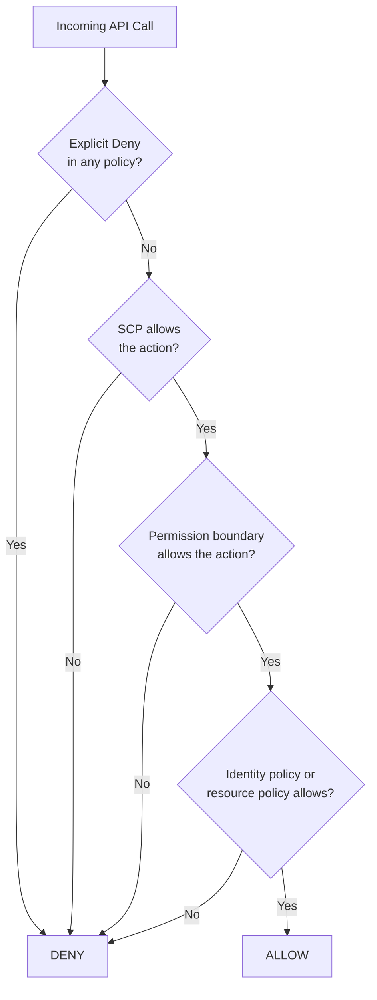
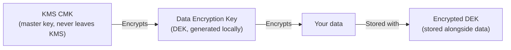

# Security

Security in AWS is not a checklist you complete once — it is a continuous practice woven into every architecture decision. The good news is that AWS provides well-designed primitives: fine-grained access control, managed secret rotation, envelope encryption, and threat detection that would take years to build yourself. The challenge is understanding how they fit together and where the responsibility boundary lies between AWS and you.

---

## IAM Deep Dive

IAM is the foundation of AWS security. Every API call is evaluated against IAM policies before it executes. Understanding how those policies are evaluated is essential to avoid both under-permissioned applications that cannot function and over-permissioned systems that create blast radius.

### Policy types

AWS has six distinct policy types that can affect a principal's permissions:

| Policy type | Attached to | Purpose |
|---|---|---|
| **Identity policy** | IAM user, group, or role | Grant or deny specific permissions to a principal |
| **Resource policy** | S3 bucket, SQS queue, KMS key, etc. | Control who can access a resource from any account |
| **Permission boundary** | IAM user or role | Set the maximum permissions a principal can ever have, regardless of identity policies |
| **Service control policy (SCP)** | AWS Organizations OU or account | Set guardrails across entire accounts — no principal in that account can exceed these limits |
| **Session policy** | Temporary session (assume-role) | Further restrict a role's permissions for one session |
| **ACL** | S3 objects and buckets (legacy) | Legacy cross-account access control — avoid for new designs |

### Policy evaluation logic

When AWS receives a request, it evaluates policies in a specific order. The effective permissions are the intersection of what is allowed — a single explicit Deny anywhere overrides all Allows.



### IAM roles for services — the correct pattern

Never put long-term credentials (access key + secret) inside application code, environment variables, or containers. Instead, attach an IAM role directly to the compute resource:

```bash
# EC2: attach a role at launch
aws ec2 run-instances --iam-instance-profile Name=ApiServerRole ...

# Lambda: the execution role is set in the function config
aws lambda create-function --role arn:aws:iam::123:role/LambdaExecutionRole ...

# ECS: task role (what the container can do) vs execution role (what ECS can do on your behalf)
```

The compute resource automatically receives temporary credentials via the metadata service — they rotate every few hours automatically.

### STS and AssumeRole — cross-account access

`AssumeRole` lets a principal in one account take on an identity in another account. This is the standard pattern for:
- A developer in account A deploying to production in account B
- A central logging account aggregating from many application accounts
- Third-party tools that need limited access to your account

```bash
# In the target account: create a role with a trust policy
# Trust policy allows the source account to assume this role
{
  "Version": "2012-10-17",
  "Statement": [{
    "Effect": "Allow",
    "Principal": {"AWS": "arn:aws:iam::SOURCE-ACCOUNT-ID:root"},
    "Action": "sts:AssumeRole",
    "Condition": {"Bool": {"aws:MultiFactorAuthPresent": "true"}}
  }]
}

# In the source account: assume the role
aws sts assume-role \
  --role-arn arn:aws:iam::TARGET-ACCOUNT:role/DeploymentRole \
  --role-session-name deploy-session-$(date +%s)
```

---

## Secrets Management

Credentials, API keys, database passwords, and certificates should never be in source code, environment variables in plain text, or baked into container images. AWS provides two purpose-built services for secret storage.

### AWS Secrets Manager

Secrets Manager stores arbitrary secret values, rotates them automatically, and integrates with RDS, Redshift, and DocumentDB for automatic database password rotation.

```bash
# Store a secret
aws secretsmanager create-secret \
  --name prod/myapp/db-password \
  --secret-string '{"username":"admin","password":"hunter2"}'

# Retrieve in application code (Java Spring Boot)
# spring.config.import=aws-secretsmanager:prod/myapp/db-password
# Or use AWS SDK directly:
```

```java
SecretsManagerClient client = SecretsManagerClient.builder()
    .region(Region.US_EAST_1)
    .build();

GetSecretValueResponse response = client.getSecretValue(
    GetSecretValueRequest.builder()
        .secretId("prod/myapp/db-password")
        .build()
);
JsonNode secret = objectMapper.readTree(response.secretString());
String password = secret.get("password").asText();
```

**Automatic rotation** — Secrets Manager can rotate RDS passwords on a schedule (every 30 days), updating both the secret and the database user password atomically. The application always fetches the latest version.

### SSM Parameter Store

Parameter Store is a simpler, cheaper alternative for non-secret configuration values and moderately-sensitive secrets.

| | Secrets Manager | Parameter Store |
|---|---|---|
| **Automatic rotation** | Yes (Lambda-based) | No (manual) |
| **Encryption** | Always encrypted (optional KMS CMK) | Standard: free; SecureString: KMS-encrypted |
| **Cost** | ~$0.40/secret/month + API calls | Standard: free; Advanced: $0.05/parameter/month |
| **Cross-account access** | Yes | Limited |
| **Best for** | Database passwords, API keys needing rotation | App config, feature flags, non-sensitive parameters |

**Azure/GCP equivalents:** Azure Key Vault (secrets + certificates + keys), GCP Secret Manager.

---

## KMS and Encryption

AWS Key Management Service manages cryptographic keys. It is the foundation of at-rest encryption across S3, EBS, RDS, DynamoDB, SQS, Kinesis, and virtually every other AWS storage service.

### Symmetric vs asymmetric keys

| | Symmetric CMK | Asymmetric CMK |
|---|---|---|
| **Algorithm** | AES-256 | RSA 2048/3072/4096 or ECC |
| **Operations** | Encrypt/Decrypt (both use same key) | Encrypt with public, decrypt with private — or sign/verify |
| **Use cases** | S3 encryption, EBS encryption, envelope encryption | SSL/TLS certificates, signing JWTs, key exchange |
| **Export** | Cannot export private key | Can share public key |

### Envelope encryption

AWS services do not encrypt your data directly with your KMS key. Instead, they use **envelope encryption**:



1. AWS generates a unique data encryption key (DEK) per object/volume/record
2. The DEK encrypts the actual data locally — fast, no API call per byte
3. KMS encrypts the DEK using your CMK — one API call per object/session
4. The encrypted DEK is stored alongside the encrypted data
5. To decrypt: call KMS to decrypt the DEK, use the DEK to decrypt data

This design means KMS handles keys (the high-security operation), and fast local symmetric encryption handles bulk data. You get both security and performance.

### Key rotation

```bash
# Enable automatic annual rotation for a CMK
aws kms enable-key-rotation --key-id arn:aws:kms:us-east-1:123:key/mrk-xxx

# Check rotation status
aws kms get-key-rotation-status --key-id arn:aws:kms:us-east-1:123:key/mrk-xxx
```

When a key rotates, AWS keeps all previous key versions for decrypting existing data, but new encryptions use the latest version. Rotation happens transparently without re-encrypting existing data.

---

## Network Security

AWS provides four overlapping layers of network security. Understanding when each applies prevents both gaps and confusion.

### Security groups — stateful instance-level firewall

Security groups are virtual firewalls attached to EC2 instances, RDS instances, Lambda functions, and ELBs. They are **stateful** — if you allow inbound on port 443, the corresponding outbound response traffic is automatically allowed.

```bash
# Create a security group for the API tier
aws ec2 create-security-group \
  --group-name api-sg \
  --description "API server security group" \
  --vpc-id vpc-xxxx

# Allow HTTPS from the load balancer's security group only
aws ec2 authorize-security-group-ingress \
  --group-id sg-api \
  --protocol tcp \
  --port 8080 \
  --source-group sg-alb   # reference SG, not IP range

# Allow outbound to RDS only
aws ec2 authorize-security-group-egress \
  --group-id sg-api \
  --protocol tcp \
  --port 5432 \
  --destination-group sg-rds
```

The most important pattern: **reference security groups by ID, not by IP range**. When your ALB scales or your IP changes, the rule automatically applies to the new IPs.

### NACLs — stateless subnet-level firewall

Network ACLs are evaluated at the subnet level, before traffic reaches any instance. They are **stateless** — you must explicitly allow both inbound and outbound for a connection to work.

| | Security Groups | NACLs |
|---|---|---|
| **Level** | Instance / ENI | Subnet |
| **Stateful** | Yes — return traffic allowed automatically | No — must allow both directions |
| **Allow/Deny** | Allow rules only | Both Allow and Deny |
| **Evaluation** | All rules evaluated together | Rules evaluated in order by rule number |
| **Default** | Deny all inbound, allow all outbound | Allow all (default NACL) |
| **Best for** | Primary security control for all resources | Broad subnet-level blocks (e.g., block entire IP ranges) |

> **Practical rule:** security groups for everything. NACLs only when you need explicit Deny rules (security groups cannot deny, only allow) or when you want subnet-level protection as a secondary layer.

### AWS WAF — Web Application Firewall

WAF is attached to ALBs, CloudFront distributions, or API Gateway. It inspects HTTP requests and applies rules:

```bash
# Create a WAF WebACL with AWS Managed Rules
aws wafv2 create-web-acl \
  --name prod-waf \
  --scope REGIONAL \
  --default-action Allow={} \
  --rules '[
    {
      "Name": "AWSManagedRulesCommonRuleSet",
      "Priority": 1,
      "OverrideAction": {"None": {}},
      "Statement": {
        "ManagedRuleGroupStatement": {
          "VendorName": "AWS",
          "Name": "AWSManagedRulesCommonRuleSet"
        }
      },
      "VisibilityConfig": {
        "SampledRequestsEnabled": true,
        "CloudWatchMetricsEnabled": true,
        "MetricName": "CommonRuleSet"
      }
    }
  ]'
```

AWS Managed Rule groups cover common threats (OWASP Top 10, known bad IPs, SQL injection, XSS) without requiring you to write your own rules.

### AWS Shield and GuardDuty

**Shield Standard** is included free with all AWS accounts — it protects against common Layer 3 and Layer 4 DDoS attacks (SYN floods, UDP reflection) automatically.

**Shield Advanced** ($3,000/month + data transfer) adds protection against large volumetric and application-layer attacks, a dedicated DDoS Response Team, and cost protection (AWS credits your bill for scaling costs caused by a DDoS attack).

**GuardDuty** is a threat detection service that continuously analyses CloudTrail logs, VPC Flow Logs, and DNS logs using ML and threat intelligence feeds. It identifies:
- Unusual API activity (credential compromise, privilege escalation attempts)
- Cryptocurrency mining on EC2
- Communication with known malicious IPs
- Data exfiltration patterns

Enable GuardDuty in every account and region — it costs almost nothing at low activity levels and has no impact on your infrastructure.
