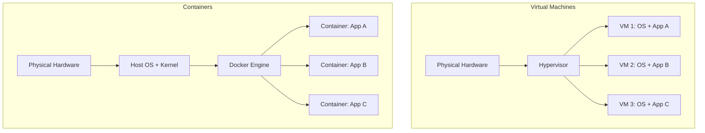
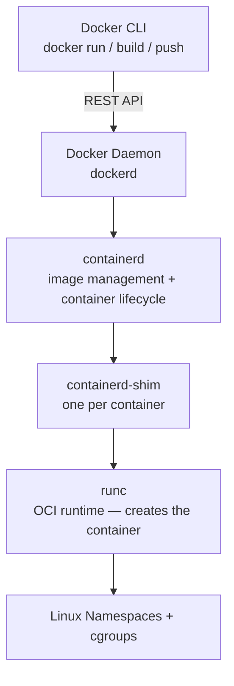
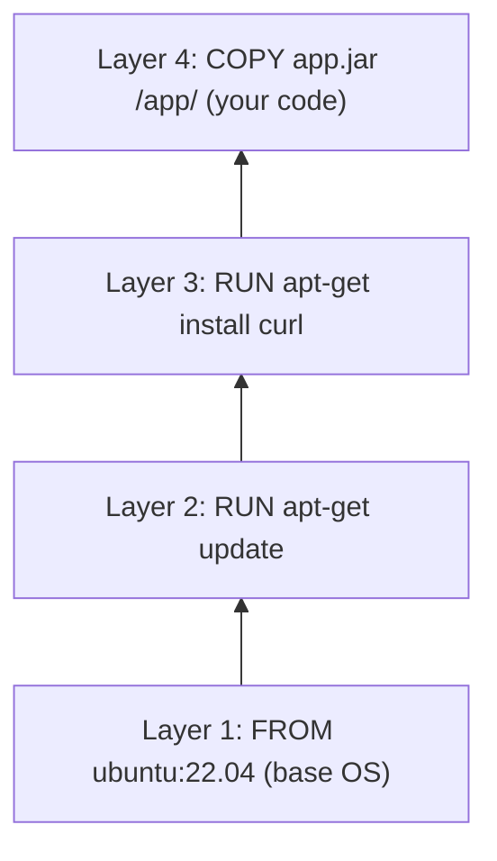
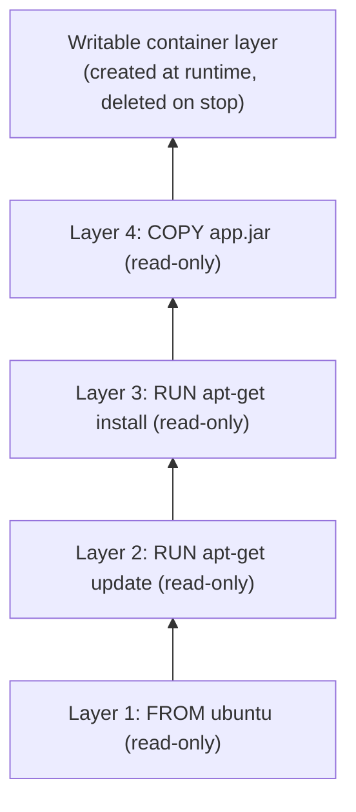

# Fundamentals

Before Docker, shipping software meant shipping an entire machine. You built your application on a developer's MacBook, it broke in staging because the Java version was different, and it broke again in production because the Linux distro was different. The classic "works on my machine" problem was not laziness — it was a genuine infrastructure problem. Docker solved it by making the environment part of the artifact.

---

## VMs vs Containers: Why Containers Won

Virtual machines (VMs) solve the environment problem by virtualising an entire computer — CPU, memory, storage, and network — and running a full operating system inside. Containers take a different approach: they share the host OS kernel and isolate only the user-space process.



| | Virtual Machines | Containers |
|---|---|---|
| **Startup time** | Minutes (full OS boot) | Milliseconds (process start) |
| **Size** | GBs (includes OS) | MBs (app + dependencies only) |
| **Isolation** | Hardware-level (very strong) | OS-level (strong, namespace-based) |
| **Resource overhead** | High (each VM has its own OS) | Low (shared kernel) |
| **Portability** | VM image is hypervisor-specific | Container image runs anywhere Docker runs |
| **Density** | 10s of VMs per host | 100s of containers per host |

Containers won because they are fast to start, small to ship, and cheap to run. A deployment that took minutes with VM provisioning takes seconds with containers.

---

## Docker Architecture

Docker is not a single monolithic program — it is a layered system of components each doing one job well.



**Docker CLI** — the command-line tool you type `docker` into. It is purely a client that talks to the daemon over a REST API (Unix socket or TCP).

**Docker daemon (dockerd)** — the long-running background process. It receives API calls from the CLI, manages images, networks, and volumes, and delegates container execution to containerd.

**containerd** — an industry-standard container runtime that manages the full lifecycle: pulling images, creating container filesystems, starting and stopping containers. Kubernetes uses containerd directly (without Docker daemon) in modern clusters.

**runc** — the low-level OCI-compliant runtime that actually calls Linux kernel APIs to create the container. It sets up namespaces (PID, network, mount, UTS, IPC, user), cgroups (CPU and memory limits), and runs the process.

---

## Image Layers: The Layered Filesystem

A Docker image is not a single blob — it is a stack of read-only layers. Each instruction in a Dockerfile creates one layer.



When you build a new image that only changes layer 4 (your application code), layers 1–3 are reused from cache. This is why **layer ordering matters** — put frequently-changing instructions last.

### Copy-on-write (CoW)

When a container starts, Docker adds a thin **writable layer** on top of the read-only image layers. Any file the container writes goes into this writable layer — the image layers are never modified.



This is why containers start instantly — no copying of the entire image. It is also why container storage is ephemeral: when the container is removed, the writable layer is gone. Use volumes for data you want to persist.

---

## What Happens When You Run `docker run`

Understanding this sequence demystifies most Docker debugging:

1. **Image lookup** — Docker checks if the image exists locally. If not, it pulls from the registry layer by layer.
2. **Create container** — Docker creates a new writable layer on top of the image layers.
3. **Network setup** — Docker attaches the container to the specified network (default: bridge), allocating a virtual ethernet interface and IP address.
4. **Volume mounts** — Named volumes or bind mounts are attached at the specified paths.
5. **Process start** — runc sets up Linux namespaces and cgroups, then executes the container's `CMD` or `ENTRYPOINT` as PID 1.
6. **Output forwarding** — stdout and stderr from PID 1 are captured by Docker and available via `docker logs`.

---

## Registries

A registry stores and distributes Docker images. When you `docker pull nginx:latest`, Docker contacts the registry (Docker Hub by default) and downloads the image layers.

| Registry | Type | Best for |
|---|---|---|
| **Docker Hub** | Public cloud | Open-source images, public sharing |
| **Amazon ECR** | Private cloud (AWS) | Production images in AWS environments — native IAM auth |
| **GitHub Container Registry (GHCR)** | Private cloud | Images tied to GitHub repositories |
| **Google Artifact Registry** | Private cloud (GCP) | GCP workloads |
| **Harbor** | Self-hosted | On-premise, air-gapped, compliance-sensitive environments |

```bash
# Authenticate to ECR
aws ecr get-login-password --region us-east-1 \
  | docker login --username AWS --password-stdin \
    123456789.dkr.ecr.us-east-1.amazonaws.com

# Tag and push
docker tag myapp:latest 123456789.dkr.ecr.us-east-1.amazonaws.com/myapp:2026.06.20
docker push 123456789.dkr.ecr.us-east-1.amazonaws.com/myapp:2026.06.20
```

> **Always use specific tags in production, never `latest`.** `latest` is a mutable pointer — the image it refers to can change at any time, making deployments non-reproducible. Use version tags, git commit SHAs, or date-stamped tags.
