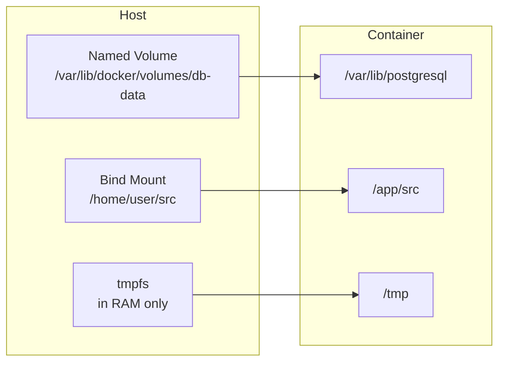

# Working with Docker

Knowing Docker theory is one thing. Actually writing Dockerfiles, debugging builds, wiring up multi-service environments, and shipping lean production images is another. This page is the practical reference for everything you do day-to-day with Docker.

---

## Dockerfile — Every Instruction Explained

A Dockerfile is a sequence of instructions that Docker executes top-to-bottom to build an image. **Each instruction creates a layer** — or reuses a cached one.

```dockerfile
# Base image — always pin to a specific digest or tag
FROM eclipse-temurin:21-jre-jammy

# Set working directory (creates it if it doesn't exist)
WORKDIR /app

# Build-time variable (not available at runtime unless also set in ENV)
ARG JAR_FILE=target/app.jar

# Environment variable (available at build time AND runtime)
ENV JAVA_OPTS="-Xmx512m -Xms256m"

# Copy build artifact — COPY is preferred over ADD for local files
# ADD has extra magic (auto-extract tarballs, remote URLs) that is rarely wanted
COPY ${JAR_FILE} app.jar

# Run as non-root user for security
USER 1000

# Document which port the app listens on (does NOT actually publish it)
EXPOSE 8080

# Health check — Docker uses this to report container health
HEALTHCHECK --interval=30s --timeout=5s --retries=3 \
  CMD curl -f http://localhost:8080/actuator/health || exit 1

# ENTRYPOINT sets the executable — cannot be overridden easily
# CMD sets default arguments — easily overridden at docker run
ENTRYPOINT ["java"]
CMD ["-jar", "app.jar"]
```

### CMD vs ENTRYPOINT

| | ENTRYPOINT | CMD |
|---|---|---|
| **Purpose** | The executable to run | Default arguments for ENTRYPOINT |
| **Override** | `docker run --entrypoint` | `docker run image <args>` |
| **Shell form** | `ENTRYPOINT java -jar app.jar` | Runs via `/bin/sh -c` — signals not forwarded to app |
| **Exec form** | `ENTRYPOINT ["java", "-jar", "app.jar"]` | Runs directly — signals forwarded correctly |

> **Always use exec form (`["...", "..."]`) for ENTRYPOINT and CMD**. Shell form spawns a `/bin/sh` wrapper, which becomes PID 1. When Docker sends SIGTERM to stop the container, the shell intercepts it and your application never receives it — causing hard kills after the stop timeout.

---

## Building Images

### Build cache mechanics

Docker caches each layer. A layer is invalidated (and all subsequent layers rebuild) when:
- The instruction text changes
- For `COPY`/`ADD`: any file in the source changes

This means **instruction order is a performance lever**:

```dockerfile
# BAD: copies all source first — any code change invalidates dependency layer
FROM eclipse-temurin:21-jre-jammy
COPY . .
RUN ./mvnw dependency:resolve
RUN ./mvnw package

# GOOD: copy dependency files first — dependencies cached unless pom.xml changes
FROM eclipse-temurin:21-jdk-jammy AS build
WORKDIR /build
COPY pom.xml .         # only copy what's needed for dependency resolution
COPY .mvn .mvn
RUN ./mvnw dependency:resolve -q    # cached as long as pom.xml doesn't change
COPY src src
RUN ./mvnw package -DskipTests
```

### .dockerignore

`.dockerignore` prevents unnecessary files from being sent to the Docker build context (the directory Docker reads before building):

```
.git
.gitignore
*.md
target/
**/__pycache__
**/*.pyc
node_modules/
.env
.DS_Store
```

Without `.dockerignore`, Docker sends your entire project directory to the daemon on every build — including `node_modules`, `.git` history, and test fixtures. This dramatically slows builds and can accidentally include secrets.

### Build commands

```bash
# Build with a tag
docker build -t myapp:2026.06.20 .

# Build with build args
docker build --build-arg JAR_FILE=target/myapp-1.0.0.jar -t myapp:1.0.0 .

# Build and push to registry in one step (BuildKit)
docker buildx build --platform linux/amd64,linux/arm64 \
  -t myregistry/myapp:latest --push .

# Inspect the layers of a built image
docker history myapp:latest
```

---

## Running Containers

```bash
# Common docker run flags
docker run \
  --name api                         # give the container a name
  --rm                               # auto-delete when stopped
  -d                                 # detached (background) mode
  -p 8080:8080                       # host_port:container_port
  -e SPRING_PROFILES_ACTIVE=prod     # environment variable
  -e DB_PASSWORD="$(aws secretsmanager get-secret-value ...)" \
  -v /data/uploads:/app/uploads      # bind mount
  -v app-data:/var/lib/data          # named volume
  --memory 512m                      # memory limit
  --cpus 0.5                         # CPU limit (0.5 = half a core)
  --restart unless-stopped           # restart policy
  --read-only                        # read-only root filesystem
  --network backend-net              # attach to a custom network
  myapp:2026.06.20
```

### Restart policies

| Policy | Behaviour |
|---|---|
| `no` | Never restart (default) |
| `always` | Always restart, even on manual stop then daemon restart |
| `unless-stopped` | Restart unless explicitly stopped — survives daemon restarts |
| `on-failure[:N]` | Restart only on non-zero exit code, max N times |

---

## Volumes and Bind Mounts

Container filesystems are ephemeral — when a container is removed, all written data is gone. Volumes and bind mounts persist data outside the container lifecycle.



| Type | Location | Managed by | Best for |
|---|---|---|---|
| **Named volume** | `/var/lib/docker/volumes/` | Docker | Database data, persistent app state |
| **Bind mount** | Any host path | You | Development — live code reload, config files |
| **tmpfs** | Host RAM | OS | Sensitive temp files, fast ephemeral data |

```bash
# Create and use a named volume
docker volume create db-data
docker run -v db-data:/var/lib/postgresql/data postgres:16

# Bind mount for development (source changes reflect immediately)
docker run -v $(pwd)/src:/app/src -v $(pwd)/pom.xml:/app/pom.xml myapp-dev
```

---

## Networking

Docker containers communicate over virtual networks. By default, each `docker run` connects to the `bridge` network.

| Network driver | Behaviour | Use when |
|---|---|---|
| **bridge** | Virtual network; containers get private IPs; communicate by IP or name (custom networks only) | Default for single-host container groups |
| **host** | Container shares host network namespace; no port mapping needed | High-performance apps where network overhead matters |
| **overlay** | Multi-host networking for Docker Swarm | Distributed applications across multiple Docker hosts |
| **none** | No network access | Isolated containers with no network needs |

```bash
# Create a custom bridge network (enables DNS by container name)
docker network create backend-net

# Containers on the same custom network can reach each other by name
docker run --network backend-net --name db postgres:16
docker run --network backend-net --name api myapp
# api container can now connect to: jdbc:postgresql://db:5432/mydb
```

> **Container-to-container DNS only works on custom networks**, not the default bridge. Always create a custom network for multi-container applications.

---

## Docker Compose

Docker Compose defines and runs multi-container applications from a single `docker-compose.yml` file.

```yaml
# docker-compose.yml
services:
  db:
    image: postgres:16
    environment:
      POSTGRES_DB: myapp
      POSTGRES_PASSWORD_FILE: /run/secrets/db_password
    volumes:
      - db-data:/var/lib/postgresql/data
    healthcheck:
      test: ["CMD-SHELL", "pg_isready -U postgres"]
      interval: 10s
      timeout: 5s
      retries: 5
    networks:
      - backend

  api:
    build:
      context: .
      dockerfile: Dockerfile
    ports:
      - "8080:8080"
    environment:
      - SPRING_PROFILES_ACTIVE=dev
      - DB_HOST=db
    depends_on:
      db:
        condition: service_healthy   # wait for health check, not just container start
    networks:
      - backend
    restart: unless-stopped

volumes:
  db-data:

networks:
  backend:
```

```bash
# Start all services in detached mode
docker compose up -d

# Rebuild images before starting
docker compose up -d --build

# Scale a service
docker compose up -d --scale api=3

# View logs from all services
docker compose logs -f

# Stop and remove containers (volumes preserved)
docker compose down

# Stop and remove containers AND volumes
docker compose down -v
```

### Override files

Compose supports layering configuration with override files — base config + environment-specific overrides:

```bash
# Development: docker-compose.yml + docker-compose.dev.yml
docker compose -f docker-compose.yml -f docker-compose.dev.yml up

# Production: docker-compose.yml + docker-compose.prod.yml
docker compose -f docker-compose.yml -f docker-compose.prod.yml up
```

---

## Multi-Stage Builds

Multi-stage builds are the most impactful optimisation you can make to production image size. They use multiple `FROM` statements — each stage is independent — and you copy only what you need into the final image.

```dockerfile
# Stage 1: Build (has JDK, Maven, all build tools)
FROM eclipse-temurin:21-jdk-jammy AS build
WORKDIR /build
COPY pom.xml .
COPY .mvn .mvn
RUN ./mvnw dependency:resolve -q
COPY src src
RUN ./mvnw package -DskipTests

# Stage 2: Runtime (only JRE — no build tools, no source, no Maven cache)
FROM eclipse-temurin:21-jre-jammy
WORKDIR /app
COPY --from=build /build/target/app.jar app.jar
USER 1000
EXPOSE 8080
ENTRYPOINT ["java", "-jar", "app.jar"]
```

| Stage | Size |
|---|---|
| Build stage (JDK + Maven + dependencies) | ~500 MB |
| Final image (JRE + jar only) | ~180 MB |

The build stage never makes it into the final image — only the files you explicitly `COPY --from=build` do. This means compiler toolchains, test frameworks, build caches, and development dependencies stay out of production images.
