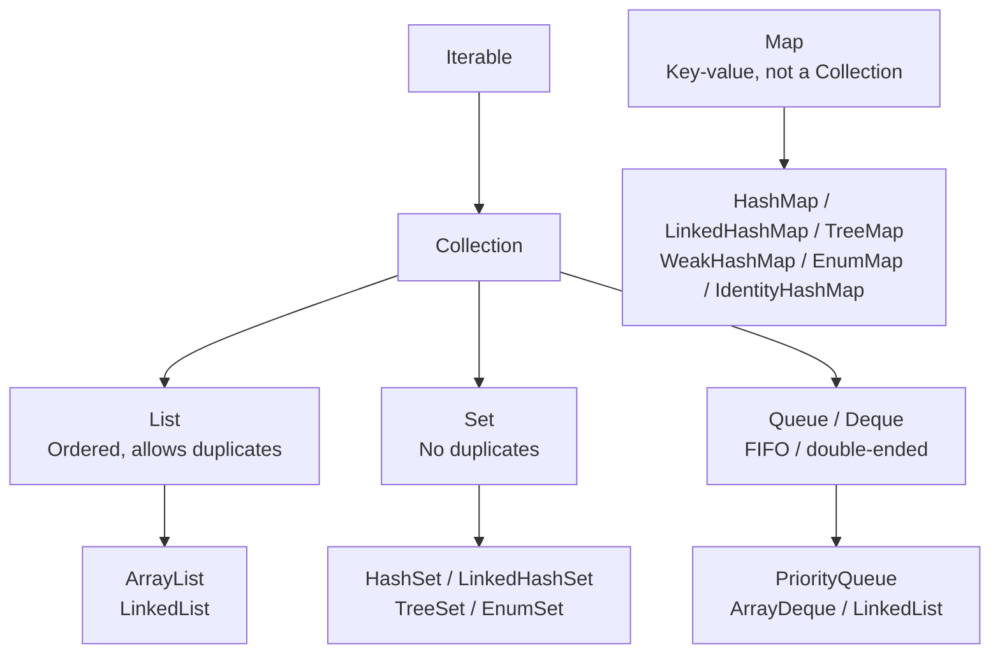

# Collections

The Java Collections Framework provides interfaces and implementations for the most common data structures. Choosing the right collection — and knowing the performance characteristics of each implementation — directly affects correctness and performance.

---

## The Collections Hierarchy



---

## Iterator and Iterable

```java
// Iterable: any class can be used in a for-each loop
public class NumberRange implements Iterable<Integer> {
    private final int start, end;
    public NumberRange(int start, int end) { this.start = start; this.end = end; }

    @Override
    public Iterator<Integer> iterator() {
        return new Iterator<>() {
            int current = start;
            @Override public boolean hasNext() { return current <= end; }
            @Override public Integer next()    { return current++; }
        };
    }
}
for (int n : new NumberRange(1, 5)) System.out.print(n + " ");  // 1 2 3 4 5

// ListIterator: bidirectional traversal + modification during iteration
ListIterator<String> it = list.listIterator();
while (it.hasNext()) {
    String s = it.next();
    if (s.isEmpty()) it.remove();         // safe removal during iteration
    else             it.set(s.toUpperCase()); // replace current element
}
while (it.hasPrevious()) System.out.println(it.previous()); // iterate backwards
```

---

## List

```java
// ArrayList: O(1) random access, O(n) insert/delete in middle
List<String> list = new ArrayList<>(16); // initial capacity hint
list.add("Alice");
list.add(0, "Charlie");          // insert at index — O(n)
list.remove(1);                  // remove by index
list.remove("Alice");            // remove by value
list.set(0, "Bob");              // replace at index
String first = list.get(0);      // O(1) random access
list.subList(1, 3);              // view, not copy — mutations reflect in original
Collections.sort(list);
list.sort(Comparator.reverseOrder());

// Immutable lists (Java 9+)
List<String> immutable = List.of("a", "b", "c");   // no nulls allowed
List<String> mutable   = new ArrayList<>(immutable); // mutable copy

// List.copyOf (Java 10) — unmodifiable, snapshot
List<String> snap = List.copyOf(mutable);  // safe copy

// Converting array ↔ List
String[] arr  = {"x", "y", "z"};
List<String> fromArr = Arrays.asList(arr);   // fixed-size, backed by array (set/get ok, add/remove not)
List<String> real     = new ArrayList<>(Arrays.asList(arr)); // fully mutable
String[] back = list.toArray(new String[0]);  // preferred idiom
```

| | `ArrayList` | `LinkedList` |
|---|---|---|
| `get(i)` | O(1) | O(n) |
| `add(end)` | O(1) amortised | O(1) |
| `add(middle)` | O(n) | O(n) find + O(1) link |
| `remove(middle)` | O(n) | O(n) find + O(1) unlink |
| Memory | Compact array | Node objects (2× pointer overhead) |
| **Prefer** | General purpose | Queue/deque operations only |

---

## Set

```java
// HashSet: O(1) operations, no ordering
Set<String> set = new HashSet<>(List.of("apple", "banana", "apple"));
// {"apple", "banana"} — duplicate removed automatically

// LinkedHashSet: preserves insertion order
Set<String> linked = new LinkedHashSet<>(List.of("banana", "apple", "cherry"));
// iteration: banana, apple, cherry

// TreeSet: sorted by natural order or Comparator — O(log n)
TreeSet<Integer> tree = new TreeSet<>(List.of(5, 2, 8, 1, 9));
tree.first();            // 1
tree.last();             // 9
tree.floor(6);           // 5  (greatest element ≤ 6)
tree.ceiling(6);         // 8  (smallest element ≥ 6)
tree.lower(5);           // 2  (strictly less than 5)
tree.higher(5);          // 8  (strictly greater than 5)
tree.headSet(5);         // {1, 2}       elements < 5
tree.tailSet(5);         // {5, 8, 9}    elements >= 5
tree.subSet(2, 8);       // {2, 5}       2 <= e < 8
tree.pollFirst();        // removes and returns 1
tree.pollLast();         // removes and returns 9

// EnumSet: highly optimised for enums (uses long bitmask internally)
EnumSet<DayOfWeek> weekend = EnumSet.of(DayOfWeek.SATURDAY, DayOfWeek.SUNDAY);
EnumSet<DayOfWeek> weekdays = EnumSet.complementOf(weekend);
EnumSet<DayOfWeek> all      = EnumSet.allOf(DayOfWeek.class);
EnumSet<DayOfWeek> range    = EnumSet.range(DayOfWeek.MONDAY, DayOfWeek.FRIDAY);

// Set operations
Set<String> a = new HashSet<>(Set.of("a", "b", "c"));
Set<String> b = new HashSet<>(Set.of("b", "c", "d"));
Set<String> intersect = new HashSet<>(a); intersect.retainAll(b); // {b, c}
Set<String> union     = new HashSet<>(a); union.addAll(b);         // {a, b, c, d}
Set<String> diff      = new HashSet<>(a); diff.removeAll(b);       // {a}
```

---

## Map

```java
// HashMap: O(1) average — no ordering
Map<String, Integer> map = new HashMap<>();
map.put("Alice", 95);
map.put("Bob", 87);
map.putIfAbsent("Alice", 100);                  // only if key absent
map.getOrDefault("Charlie", 0);                 // 0 if missing
map.merge("Alice", 5, Integer::sum);            // 95 + 5 = 100 — merge with BinaryOperator
map.compute("Bob", (k, v) -> v == null ? 1 : v + 1); // compute new value
map.computeIfAbsent("Dan", k -> expensive(k));  // create if missing
map.computeIfPresent("Bob", (k, v) -> v * 2);  // update only if present
map.replace("Bob", 87, 90);                     // conditional replace: only if current value is 87

// Iteration
for (var entry : map.entrySet()) { System.out.println(entry.getKey() + "=" + entry.getValue()); }
map.forEach((k, v) -> System.out.println(k + "=" + v));
map.keySet().forEach(System.out::println);
map.values().stream().mapToInt(Integer::intValue).sum();

// Immutable map (Java 9+)
Map<String, Integer> cfg = Map.of("timeout", 30, "retries", 3);       // up to 10 entries
Map<String, Integer> big = Map.ofEntries(
    Map.entry("a", 1), Map.entry("b", 2) /*, ... */
);
Map<String, Integer> copy = Map.copyOf(map);   // unmodifiable snapshot

// LinkedHashMap: insertion-order iteration
Map<String, String> ordered = new LinkedHashMap<>();

// LRU cache with LinkedHashMap
Map<String, String> lru = new LinkedHashMap<>(16, 0.75f, true) {
    @Override protected boolean removeEldestEntry(Map.Entry<String, String> eldest) {
        return size() > 100;
    }
};

// TreeMap: sorted by key — O(log n), implements NavigableMap
TreeMap<String, Integer> treeMap = new TreeMap<>(map);
treeMap.firstKey();                  // lexicographically first
treeMap.lastKey();
treeMap.headMap("D");                // keys < "D"
treeMap.tailMap("D");                // keys >= "D"
treeMap.subMap("A", "D");           // "A" <= k < "D"
treeMap.floorKey("C");               // greatest key <= "C"
treeMap.ceilingKey("C");             // smallest key >= "C"

// EnumMap: optimised for enum keys (backed by array)
Map<DayOfWeek, List<Meeting>> schedule = new EnumMap<>(DayOfWeek.class);

// WeakHashMap: keys held by weak references — GC can collect when no other reference
Map<Object, String> cache = new WeakHashMap<>();  // entries disappear when key is GC'd

// IdentityHashMap: uses == instead of .equals() for key comparison
Map<Object, String> identity = new IdentityHashMap<>();
```

| | `HashMap` | `LinkedHashMap` | `TreeMap` | `EnumMap` |
|---|---|---|---|---|
| Order | None | Insertion / access | Sorted | Enum ordinal |
| Performance | O(1) | O(1) | O(log n) | O(1) |
| Null keys | 1 allowed | 1 allowed | No | No |

---

## Queue and Deque

```java
// ArrayDeque: best general-purpose Queue AND Stack (faster than LinkedList)
Deque<String> deque = new ArrayDeque<>();

// Queue API (FIFO)
deque.offer("first");      // add to tail — returns false if full
deque.offer("second");
deque.peek();              // inspect head — null if empty
deque.poll();              // remove head — null if empty

// Stack API (LIFO)
deque.push("a");           // add to head
deque.pop();               // remove from head — throws if empty

// PriorityQueue: min-heap — O(log n) insert, O(log n) remove, O(1) peek
PriorityQueue<Integer> minHeap = new PriorityQueue<>();
PriorityQueue<Integer> maxHeap = new PriorityQueue<>(Comparator.reverseOrder());
PriorityQueue<Task> byPriority = new PriorityQueue<>(
    Comparator.comparingInt(Task::getPriority).thenComparing(Task::getCreatedAt)
);
minHeap.offer(3); minHeap.offer(1); minHeap.offer(2);
minHeap.peek();    // 1 (doesn't remove)
minHeap.poll();    // 1 (removes smallest)

// Blocking queues (covered in Concurrency page)
```

---

## `Collections` Utility Class

```java
List<Integer> nums = new ArrayList<>(List.of(3, 1, 4, 1, 5, 9, 2, 6));

// Sorting and searching
Collections.sort(nums);                           // natural order, in-place
Collections.sort(nums, Comparator.reverseOrder()); // with comparator
Collections.binarySearch(nums, 5);               // requires sorted list; returns index or -(insertion point)-1
Collections.min(nums);                            // 1
Collections.max(nums);                            // 9

// Mutation
Collections.shuffle(nums);                        // random shuffle
Collections.shuffle(nums, new Random(42));        // seeded shuffle for reproducibility
Collections.reverse(nums);                        // reverse in-place
Collections.rotate(nums, 2);                      // shift elements 2 positions right
Collections.swap(nums, 0, 4);                    // swap elements at two indices
Collections.fill(nums, 0);                        // overwrite all with value
Collections.replaceAll(nums, n -> n * 2);         // transform each (Java 8+ on List)

// Queries
Collections.frequency(nums, 1);                  // count occurrences of 1
Collections.disjoint(nums, List.of(10, 20));     // true if no elements in common

// Wrappers
List<Integer>       unmod  = Collections.unmodifiableList(nums);  // read-only view
List<Integer>       synced = Collections.synchronizedList(nums);  // thread-safe view (prefer CopyOnWriteArrayList)
List<Integer>       nCopies = Collections.nCopies(5, 42);         // [42, 42, 42, 42, 42]
Map<String, String> empty   = Collections.emptyMap();             // immutable empty
List<String>        single  = Collections.singletonList("one");   // immutable single-element
```

---

## Comparable vs Comparator

```java
// Comparable: natural ordering defined IN the class
public class Employee implements Comparable<Employee> {
    private String name;
    private int salary;

    @Override
    public int compareTo(Employee other) {
        return this.name.compareTo(other.name); // ascending alphabetical by name
    }
}

// Comparator: external, flexible — many per class
Comparator<Employee> bySalary     = Comparator.comparingInt(Employee::getSalary);
Comparator<Employee> bySalaryDesc = bySalary.reversed();
Comparator<Employee> byDept       = Comparator.comparing(Employee::getDept,
                                        String.CASE_INSENSITIVE_ORDER);
// Chaining: primary sort by dept, secondary by salary descending
Comparator<Employee> compound = byDept.thenComparing(bySalaryDesc);
// Null-safety
Comparator<Employee> nullSafe = Comparator.nullsFirst(bySalary);
Comparator<Employee> nullLast = Comparator.nullsLast(bySalary);

employees.sort(compound);

// Comparator.comparing with key extractor
List<String> byLen = List.of("banana", "apple", "fig");
byLen.stream()
     .sorted(Comparator.comparingInt(String::length)
                       .thenComparing(Comparator.naturalOrder()))
     .forEach(System.out::println);  // fig, apple, banana
```

---

## Streams API

A Stream is a sequence of elements supporting aggregate operations. It is **not** a data structure — it does not store data. Streams are lazy: intermediate operations only run when a terminal operation is called.

```java
// Stream sources
Stream<String>    fromList     = list.stream();
Stream<String>    fromArr      = Arrays.stream(array);
Stream<String>    fromVarargs  = Stream.of("a", "b", "c");
Stream<String>    generated    = Stream.generate(() -> "hello").limit(5);
Stream<Integer>   iterated     = Stream.iterate(0, n -> n + 2).limit(10); // 0,2,4,...
Stream<Integer>   withPred     = Stream.iterate(0, n -> n < 100, n -> n + 3); // Java 9+
Stream<String>    nullable     = Stream.ofNullable(maybeNull); // empty if null (Java 9+)
```

### Intermediate operations (lazy, return a Stream)

```java
List<Order> orders = getOrders();

// filter: keep elements matching predicate
orders.stream().filter(o -> o.getTotal().compareTo(BigDecimal.valueOf(100)) > 0)

// map: transform each element
orders.stream().map(Order::getCustomerId)
orders.stream().map(o -> o.getTotal().doubleValue())

// flatMap: map then flatten one level
orders.stream().flatMap(o -> o.getItems().stream())  // Stream<List<Item>> → Stream<Item>

// distinct: remove duplicates (uses equals/hashCode)
orders.stream().map(Order::getCustomerId).distinct()

// sorted
orders.stream().sorted()  // natural order
orders.stream().sorted(Comparator.comparing(Order::getCreatedAt).reversed())

// peek: side effect without consuming (debugging only)
orders.stream().peek(o -> log.debug("Processing: {}", o.getId()))

// limit and skip (for pagination)
orders.stream().skip(20).limit(20)  // page 2, size 20

// takeWhile / dropWhile (Java 9): for ordered streams
Stream.of(1,2,3,4,5,1,2).takeWhile(n -> n < 4)  // [1,2,3] — stops at 4
Stream.of(1,2,3,4,5).dropWhile(n -> n < 4)       // [4,5]

// mapToInt, mapToLong, mapToDouble: convert to primitive stream
orders.stream().mapToDouble(o -> o.getTotal().doubleValue())
```

### Terminal operations (eager, trigger evaluation)

```java
// collect
List<Order>       toList  = orders.stream().filter(...).collect(Collectors.toList());
List<Order>       toList2 = orders.stream().filter(...).toList(); // Java 16+ (unmodifiable)
Set<String>       toSet   = orders.stream().map(Order::getId).collect(Collectors.toSet());

// Collecting to Map
Map<String, Order> byId = orders.stream()
    .collect(Collectors.toMap(Order::getId, o -> o));
// Handle duplicate keys
Map<String, BigDecimal> totalByCustomer = orders.stream()
    .collect(Collectors.toMap(
        Order::getCustomerId,
        Order::getTotal,
        BigDecimal::add  // merge function for duplicate keys
    ));

// groupingBy
Map<OrderStatus, List<Order>> byStatus = orders.stream()
    .collect(Collectors.groupingBy(Order::getStatus));
Map<OrderStatus, Long> countByStatus = orders.stream()
    .collect(Collectors.groupingBy(Order::getStatus, Collectors.counting()));
Map<String, BigDecimal> revenueByCustomer = orders.stream()
    .collect(Collectors.groupingBy(
        Order::getCustomerId,
        Collectors.mapping(Order::getTotal,
            Collectors.reducing(BigDecimal.ZERO, BigDecimal::add))
    ));

// partitioningBy: always produces Map<Boolean, List<T>>
Map<Boolean, List<Order>> highValue = orders.stream()
    .collect(Collectors.partitioningBy(o -> o.getTotal().compareTo(BigDecimal.valueOf(500)) > 0));
List<Order> expensive = highValue.get(true);
List<Order> cheap     = highValue.get(false);

// joining
String csv  = orders.stream().map(Order::getId).collect(Collectors.joining(", "));
String wrap = orders.stream().map(Order::getId).collect(Collectors.joining(", ", "[", "]"));

// teeing (Java 12): collect into two collectors, then merge results
Map.Entry<Long, BigDecimal> result = orders.stream()
    .collect(Collectors.teeing(
        Collectors.counting(),
        Collectors.mapping(Order::getTotal, Collectors.reducing(BigDecimal.ZERO, BigDecimal::add)),
        Map::entry
    ));

// reduce
BigDecimal total = orders.stream()
    .map(Order::getTotal)
    .reduce(BigDecimal.ZERO, BigDecimal::add);

Optional<Order> maxOrder = orders.stream()
    .max(Comparator.comparing(Order::getTotal));

// count, anyMatch, allMatch, noneMatch, findFirst, findAny
long count    = orders.stream().filter(...).count();
boolean any   = orders.stream().anyMatch(o -> o.getStatus() == PENDING);
boolean all   = orders.stream().allMatch(o -> o.getTotal().compareTo(ZERO) > 0);
boolean none  = orders.stream().noneMatch(o -> o.getStatus() == DELETED);
Optional<Order> first = orders.stream().filter(...).findFirst();
```

### Primitive Streams (avoid boxing overhead)

```java
// IntStream, LongStream, DoubleStream
IntStream.range(0, 10)          // 0..9 (exclusive end)
IntStream.rangeClosed(1, 10)    // 1..10 (inclusive end)
IntStream.of(1, 2, 3, 4, 5)

IntStream nums = orders.stream().mapToInt(o -> o.getItems().size());
int sum = nums.sum();
double avg = nums.average().orElse(0);
IntSummaryStatistics stats = nums.summaryStatistics();
stats.getCount(); stats.getMin(); stats.getMax(); stats.getAverage(); stats.getSum();

// Boxed: convert primitive stream back to object stream
Stream<Integer> boxed = IntStream.range(0, 5).boxed();
```

### Parallel Streams

```java
// Use ONLY when: dataset is large, operation is CPU-bound, stateless, and no shared mutable state
long count = largeList.parallelStream()
    .filter(this::isEligible)  // must be thread-safe and stateless
    .count();

// NEVER: parallel stream with mutable shared state
List<String> shared = new ArrayList<>();  // NOT thread-safe!
list.parallelStream().forEach(shared::add);  // race condition — results undefined

// CORRECT: collect instead
List<String> safe = list.parallelStream()
    .filter(...)
    .collect(Collectors.toList());  // Collectors.toList() is thread-safe
```

---

## SequencedCollection (Java 21)

Java 21 adds `SequencedCollection`, `SequencedSet`, and `SequencedMap` interfaces to formally represent ordered collections with defined first/last elements:

```java
// All List, LinkedHashSet, LinkedHashMap, TreeMap now implement SequencedCollection
SequencedCollection<String> seq = new ArrayList<>(List.of("a", "b", "c"));
seq.getFirst();           // "a"
seq.getLast();            // "c"
seq.addFirst("z");        // prepend
seq.addLast("z");         // append
seq.removeFirst();
seq.removeLast();
seq.reversed();           // reverse-order view

SequencedMap<String, Integer> smap = new LinkedHashMap<>();
smap.firstEntry();        // Map.Entry with first key
smap.lastEntry();
smap.reversed();          // reverse-ordered view of the map
```
