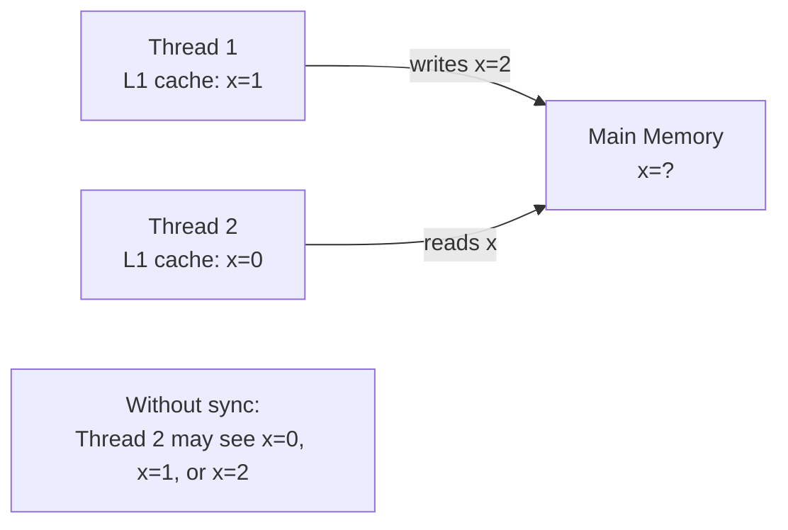
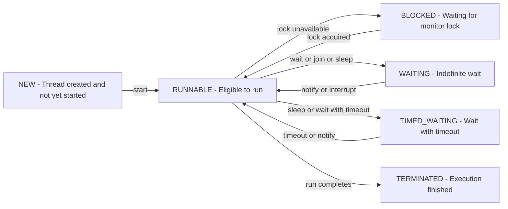

# Concurrency

Concurrency means multiple threads executing simultaneously and sharing memory. Done correctly it enables massive throughput. Done incorrectly it causes race conditions, data corruption, and deadlocks that only appear under production load at 2 AM. This page covers every concurrency primitive from low-level to high-level.

---

## The Java Memory Model (JMM)

The JMM defines what values a thread is permitted to see when it reads a shared variable. Without synchronisation, CPUs cache values in L1/L2 caches and compilers reorder instructions — a thread can read stale data from another thread.



**Happens-before** is the fundamental guarantee: if action A happens-before action B, all memory effects of A are visible to B. Synchronisation establishes happens-before.

---

## Thread Lifecycle



```java
Thread t = new Thread(() -> work(), "worker-1");
System.out.println(t.getState());  // NEW

t.start();
System.out.println(t.getState());  // RUNNABLE (may already be TERMINATED)

// Thread methods
Thread.sleep(1000);              // pause current thread for 1 second (throws InterruptedException)
Thread.yield();                  // hint to scheduler to let other threads run
t.join();                        // wait for t to terminate
t.join(5000);                    // wait at most 5 seconds

// Thread info
Thread current = Thread.currentThread();
current.getName();               // "worker-1"
current.getId();                 // unique long ID
current.getPriority();           // 1–10, default 5 (Thread.NORM_PRIORITY)
current.isVirtual();             // Java 21+: is this a virtual thread?
current.isDaemon();              // daemon threads don't prevent JVM shutdown
t.setDaemon(true);               // must set BEFORE start()
```

---

## Interruption

Interruption is a cooperative mechanism — it sets a flag and throws `InterruptedException` on blocking operations:

```java
public void run() {
    while (!Thread.currentThread().isInterrupted()) {
        try {
            work();
            Thread.sleep(1000);   // throws InterruptedException if interrupted during sleep
        } catch (InterruptedException e) {
            Thread.currentThread().interrupt(); // IMPORTANT: re-set the interrupted flag
            break;                              // then exit the loop cleanly
        }
    }
}

// Interrupt from another thread
t.interrupt();  // sets interrupted flag; throws InterruptedException if t is blocking
```

> **Always restore the interrupted status** when catching `InterruptedException`. Swallowing it silently (`catch (InterruptedException e) {}`) is a common but serious bug — it prevents higher-level code from knowing the thread was interrupted.

---

## `volatile` — Visibility Without Mutual Exclusion

`volatile` guarantees that writes are immediately visible to all threads. It does NOT make compound operations (like `i++`) atomic.

```java
public class Shutdown {
    private volatile boolean running = true;  // without volatile, loop may never see the change

    public void stop()  { running = false; }
    public void start() {
        while (running) { doWork(); }  // reads fresh value from main memory on each iteration
    }
}

// volatile is enough when:
// 1. Only one thread writes, many threads read
// 2. The write is a single, independent assignment (not dependent on old value)

// volatile is NOT enough for:
int counter;
counter++;  // read-modify-write: NOT atomic even with volatile → use AtomicInteger
```

---

## `synchronized` — Mutual Exclusion

`synchronized` guarantees that only one thread executes a block at a time AND creates happens-before.

```java
public class SafeCounter {
    private int count = 0;

    // synchronized method: lock on 'this'
    public synchronized void increment() { count++; }
    public synchronized int get()        { return count; }

    // synchronized block: lock on explicit object (more granular)
    private final Object lock = new Object();
    public void add(int delta) {
        synchronized (lock) {
            count += delta;
        }
    }

    // synchronized static method: lock on the Class object
    public static synchronized void incrementStatic() { ... }
}
```

> **Lock on a private final object, not `this`.** External code can obtain a reference to `this` and synchronise on it, potentially causing deadlocks you cannot control.

---

## `wait` / `notify` / `notifyAll` — Low-Level Coordination

Must be called from inside a `synchronized` block on the same monitor object:

```java
// Bounded buffer (producer-consumer)
public class BoundedBuffer<T> {
    private final Queue<T> queue = new LinkedList<>();
    private final int maxSize;

    public synchronized void put(T item) throws InterruptedException {
        while (queue.size() == maxSize) {
            wait();  // releases lock and waits; re-acquires lock on wake-up
        }
        queue.add(item);
        notifyAll();  // wake all waiting threads
    }

    public synchronized T take() throws InterruptedException {
        while (queue.isEmpty()) {
            wait();
        }
        T item = queue.poll();
        notifyAll();
        return item;
    }
}
```

> **Always use `wait()` inside a `while` loop**, not an `if`. Spurious wake-ups can occur — the loop re-checks the condition before proceeding.

---

## Atomic Classes

```java
AtomicInteger   counter = new AtomicInteger(0);
counter.incrementAndGet();                  // atomic i++, returns new value
counter.getAndIncrement();                  // atomic i++, returns old value
counter.addAndGet(5);                       // atomic i += 5
counter.compareAndSet(10, 20);             // CAS: set 20 only if current == 10; returns boolean
counter.updateAndGet(v -> v * 2);          // apply function atomically

AtomicLong     longCounter = new AtomicLong();
AtomicBoolean  flag        = new AtomicBoolean(false);
AtomicReference<String> ref = new AtomicReference<>("initial");
ref.compareAndSet("initial", "updated");

// LongAdder: better than AtomicLong under high contention (striped counter)
LongAdder hits = new LongAdder();
hits.increment();
hits.add(5);
hits.sum();     // total — approximate under contention

// LongAccumulator: generalised LongAdder
LongAccumulator maxSeen = new LongAccumulator(Long::max, Long.MIN_VALUE);
maxSeen.accumulate(42);
maxSeen.get();
```

---

## `ReentrantLock` and `ReadWriteLock`

```java
ReentrantLock lock = new ReentrantLock(true);  // fair=true: FIFO waiting

lock.lock();
try {
    // critical section
} finally {
    lock.unlock();  // ALWAYS in finally
}

// TryLock — non-blocking
if (lock.tryLock()) {
    try { work(); }
    finally { lock.unlock(); }
} else {
    // failed to acquire — skip or retry
}

// TryLock with timeout
if (lock.tryLock(5, TimeUnit.SECONDS)) {
    try { work(); }
    finally { lock.unlock(); }
} else {
    throw new TimeoutException("Could not acquire lock");
}

// Condition variables (like wait/notify but for ReentrantLock)
Condition notFull  = lock.newCondition();
Condition notEmpty = lock.newCondition();
// Use notFull.await() / notFull.signal() / notFull.signalAll()

// ReadWriteLock: multiple concurrent readers, exclusive writer
ReentrantReadWriteLock rwl = new ReentrantReadWriteLock();
Lock readLock  = rwl.readLock();
Lock writeLock = rwl.writeLock();

// Read operations — many threads can hold read lock simultaneously
readLock.lock();
try { return cache.get(key); }
finally { readLock.unlock(); }

// Write operations — exclusive
writeLock.lock();
try { cache.put(key, value); }
finally { writeLock.unlock(); }

// StampedLock (Java 8): optimistic read
StampedLock sl = new StampedLock();
long stamp = sl.tryOptimisticRead();  // no lock acquired
double currentX = x; double currentY = y;
if (!sl.validate(stamp)) {           // check if a write happened
    stamp = sl.readLock();           // fall back to read lock
    try { currentX = x; currentY = y; }
    finally { sl.unlockRead(stamp); }
}
```

---

## `ThreadLocal`

`ThreadLocal` provides thread-isolated storage — each thread has its own independent copy of the value:

```java
// Request ID stored per-thread (common in web frameworks)
ThreadLocal<String> requestId = ThreadLocal.withInitial(() -> UUID.randomUUID().toString());

requestId.set("req-12345");
String id = requestId.get();
requestId.remove();  // CRITICAL: remove in finally to prevent memory leaks in thread pools

// InheritableThreadLocal: child threads inherit parent's value
InheritableThreadLocal<String> tenantId = new InheritableThreadLocal<>();
```

> **Always call `remove()` in a `finally` block when using `ThreadLocal` with thread pools.** Thread pool threads are reused — without `remove()`, the next request served by the same thread will see the previous request's value.

---

## Synchronisers

### `CountDownLatch` — wait for N events

```java
int workerCount = 5;
CountDownLatch latch = new CountDownLatch(workerCount);

for (int i = 0; i < workerCount; i++) {
    executor.submit(() -> {
        try { doWork(); }
        finally { latch.countDown(); }  // decrement counter
    });
}

latch.await();                           // block until count reaches 0
latch.await(10, TimeUnit.SECONDS);      // with timeout

// Use case: parallel test setup — wait for all services to start
```

### `CyclicBarrier` — synchronise N threads at a point

```java
CyclicBarrier barrier = new CyclicBarrier(3, () -> System.out.println("All ready!"));

Runnable phase = () -> {
    prepareData();
    try {
        barrier.await();   // wait for all 3 threads to reach this point
    } catch (BrokenBarrierException | InterruptedException e) { ... }
    processData();
};
// Unlike CountDownLatch: CyclicBarrier resets after each cycle — can be reused
```

### `Semaphore` — limit concurrent access

```java
Semaphore permits = new Semaphore(10);  // max 10 concurrent operations

permits.acquire();       // decrement permit count (blocks if 0)
try { accessResource(); }
finally { permits.release(); }  // increment permit count

permits.tryAcquire();                     // non-blocking
permits.tryAcquire(5, TimeUnit.SECONDS);  // with timeout
permits.availablePermits();               // current count
```

### `Phaser` — flexible multi-phase barrier

```java
Phaser phaser = new Phaser(3);  // 3 parties

// Each party calls arriveAndAwaitAdvance() to sync at phase boundary
// Phase advances when all parties arrive
// Parties can register/deregister dynamically
```

### `Exchanger` — swap data between two threads

```java
Exchanger<String> exchanger = new Exchanger<>();
// Thread A: String received = exchanger.exchange("message from A");
// Thread B: String received = exchanger.exchange("message from B");
// Both threads get the other's value
```

---

## `ExecutorService` — Thread Pools

```java
// Fixed pool — bounded thread count
ExecutorService fixed = Executors.newFixedThreadPool(
    Runtime.getRuntime().availableProcessors(),
    r -> new Thread(r, "worker-" + idx.incrementAndGet())
);

// Cached pool — expands as needed, idle threads expire after 60s
ExecutorService cached = Executors.newCachedThreadPool();

// Single thread — serial execution with guaranteed ordering
ExecutorService single = Executors.newSingleThreadExecutor();

// Scheduled pool
ScheduledExecutorService scheduler = Executors.newScheduledThreadPool(2);
scheduler.schedule(task, 5, TimeUnit.SECONDS);               // once, after delay
scheduler.scheduleAtFixedRate(task, 0, 30, TimeUnit.SECONDS); // every 30s from start
scheduler.scheduleWithFixedDelay(task, 0, 5, TimeUnit.SECONDS); // 5s after last completion

// Custom pool (production-grade)
ThreadPoolExecutor pool = new ThreadPoolExecutor(
    4,                              // corePoolSize
    16,                             // maximumPoolSize
    60L, TimeUnit.SECONDS,          // keepAliveTime for surplus threads
    new LinkedBlockingQueue<>(1000),// bounded task queue
    new ThreadFactory() {
        private final AtomicInteger n = new AtomicInteger();
        public Thread newThread(Runnable r) {
            return new Thread(r, "order-worker-" + n.incrementAndGet());
        }
    },
    new ThreadPoolExecutor.CallerRunsPolicy()  // backpressure: run in caller if full
);
pool.allowCoreThreadTimeOut(true);  // core threads also expire when idle

// Future: handle individual task results
Future<String> future = pool.submit(() -> fetchData(id));
String data = future.get(10, TimeUnit.SECONDS);  // blocking get with timeout
future.cancel(true);  // interrupt if still running

// Invoke all: run multiple tasks and get all results
List<Callable<String>> tasks = List.of(() -> fetch("A"), () -> fetch("B"));
List<Future<String>> results = pool.invokeAll(tasks);

// Shutdown gracefully
pool.shutdown();
if (!pool.awaitTermination(30, TimeUnit.SECONDS)) {
    pool.shutdownNow();
}
```

---

## `CompletableFuture` — Async Pipelines

```java
// Async execution
CompletableFuture<String> cf = CompletableFuture.supplyAsync(
    () -> fetchOrder(id), pool   // specify executor, don't use common pool for I/O
);

// Transforming
CompletableFuture<Order> enriched = cf
    .thenApply(json -> parseOrder(json))       // sync transform, same thread
    .thenApplyAsync(o -> enrich(o), pool)     // async transform
    .thenCompose(o -> chargePayment(o))       // flatMap: avoids CompletableFuture<CF<>>
    .whenComplete((o, ex) -> audit(o, ex))    // side effect on any outcome
    .exceptionally(ex -> fallbackOrder(ex));  // error recovery

// Parallel fan-out
CompletableFuture<Order>    orderF    = fetchOrder(id);
CompletableFuture<Customer> customerF = fetchCustomer(customerId);

// Wait for both, combine
CompletableFuture<EnrichedOrder> result = orderF.thenCombine(customerF, EnrichedOrder::new);

// Wait for all (no results)
CompletableFuture.allOf(f1, f2, f3).join();

// All results (Java doesn't have a built-in allOf with results)
CompletableFuture<List<String>> allResults = CompletableFuture
    .allOf(f1, f2, f3)
    .thenApply(v -> Stream.of(f1, f2, f3)
                          .map(CompletableFuture::join)
                          .collect(Collectors.toList()));

// First to complete
CompletableFuture<String> fastest = CompletableFuture.anyOf(
    fetchFromRegion("us-east"), fetchFromRegion("eu-west")
).thenApply(obj -> (String) obj);

// Timeout (Java 9+)
cf.orTimeout(5, TimeUnit.SECONDS)
  .exceptionally(e -> e instanceof TimeoutException ? "timeout" : null);
cf.completeOnTimeout("default", 5, TimeUnit.SECONDS);

// Complete manually
CompletableFuture<String> manual = new CompletableFuture<>();
manual.complete("result");
manual.completeExceptionally(new RuntimeException("failed"));
manual.cancel(false);
```

---

## Concurrent Collections

| Standard (not thread-safe) | Thread-safe alternative | Notes                                   |
| -------------------------- | ----------------------- | --------------------------------------- |
| `ArrayList`                | `CopyOnWriteArrayList`  | Reads fast, writes copy the array       |
| `HashSet`                  | `CopyOnWriteArraySet`   | Same as above                           |
| `HashMap`                  | `ConcurrentHashMap`     | Segment-level locking; high concurrency |
| `TreeMap`                  | `ConcurrentSkipListMap` | Sorted, lock-free                       |
| `TreeSet`                  | `ConcurrentSkipListSet` | Sorted, lock-free                       |
| `LinkedList` (queue)       | `ConcurrentLinkedQueue` | Lock-free FIFO                          |
| `ArrayDeque`               | `LinkedBlockingDeque`   | Blocking, optional capacity             |
| `PriorityQueue`            | `PriorityBlockingQueue` | Blocking, unbounded                     |
| `LinkedList` (deque)       | `LinkedBlockingQueue`   | Blocking, optional capacity             |

```java
// ConcurrentHashMap — DO NOT lock on it externally; use atomic operations
ConcurrentHashMap<String, List<Order>> map = new ConcurrentHashMap<>();

// Atomic bulk operations (all take parallelismThreshold)
map.forEach(1, (k, v) -> process(k, v));      // parallel forEach
map.compute("key", (k, v) -> /* update */);   // atomic compute
map.merge("key", newValue, mergeFn);          // atomic merge
map.search(1, (k, v) -> condition(v) ? v : null); // short-circuit search
map.reduce(1, (k, v) -> v.size(), Integer::sum);   // parallel reduce

// BlockingQueue — producer-consumer foundation
BlockingQueue<Order> queue = new LinkedBlockingQueue<>(1000);
queue.put(order);                   // blocks if full
queue.offer(order, 5, SECONDS);    // timeout
Order o = queue.take();             // blocks until available
Order o2 = queue.poll(5, SECONDS); // timeout
```

---

## Fork/Join Framework

For divide-and-conquer algorithms that split a problem into smaller sub-tasks:

```java
// RecursiveTask: returns a value
public class SumTask extends RecursiveTask<Long> {
    private static final int THRESHOLD = 1000;
    private final long[] arr;
    private final int start, end;

    @Override
    protected Long compute() {
        if (end - start <= THRESHOLD) {
            // Base case: small enough to compute directly
            long sum = 0;
            for (int i = start; i < end; i++) sum += arr[i];
            return sum;
        }
        int mid = (start + end) / 2;
        SumTask left  = new SumTask(arr, start, mid);
        SumTask right = new SumTask(arr, mid, end);
        left.fork();                      // submit left to pool
        long rightResult = right.compute(); // compute right in current thread
        long leftResult  = left.join();     // wait for left result
        return leftResult + rightResult;
    }
}

ForkJoinPool pool = ForkJoinPool.commonPool();  // or new ForkJoinPool(4)
long total = pool.invoke(new SumTask(array, 0, array.length));

// RecursiveAction: no return value (for side effects)
// Parallel streams use the common ForkJoinPool internally
```

---

## Deadlock, Livelock, Starvation

**Deadlock**: Thread A holds lock X and waits for Y; Thread B holds Y and waits for X.

```java
// Prevention: always acquire locks in the same consistent order
// BAD: sometimes lock a then b, sometimes b then a
// GOOD: always lock lower id first
Object first  = id1 < id2 ? resource1 : resource2;
Object second = id1 < id2 ? resource2 : resource1;
synchronized (first)  {
synchronized (second) { /* safe */ }}

// Detection: Thread.getState() + thread dump (jstack PID)
// Timeout: tryLock(timeout) — if you can't acquire, abort and retry
```

**Livelock**: Threads keep responding to each other's actions but make no progress (like two people stepping aside simultaneously in a corridor).

**Starvation**: A thread can never get CPU time because higher-priority or more frequent threads always win the lock.

---

## Virtual Threads (Java 21)

Virtual threads are JVM-managed lightweight threads. One virtual thread per task — even for I/O-blocking operations.

```java
// Create virtual threads
Thread vt = Thread.ofVirtual().name("my-vt").start(() -> processRequest());
Thread.startVirtualThread(() -> processRequest()); // convenience

// VirtualThread-per-task executor
try (var executor = Executors.newVirtualThreadPerTaskExecutor()) {
    for (int i = 0; i < 100_000; i++) {
        int idx = i;
        executor.submit(() -> handleRequest(idx));
    }
}  // close() waits for all tasks; uses try-with-resources

// Spring Boot: spring.threads.virtual.enabled: true
// Tomcat creates a virtual thread per HTTP request
```

**Platform thread blocked on I/O**: OS thread paused, cannot do other work.
**Virtual thread blocked on I/O**: JVM parks the virtual thread, OS thread continues serving other virtual threads.

Virtual threads eliminate the need for reactive programming for most I/O-bound workloads while keeping imperative, readable code style.
