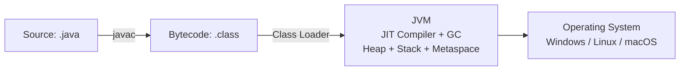
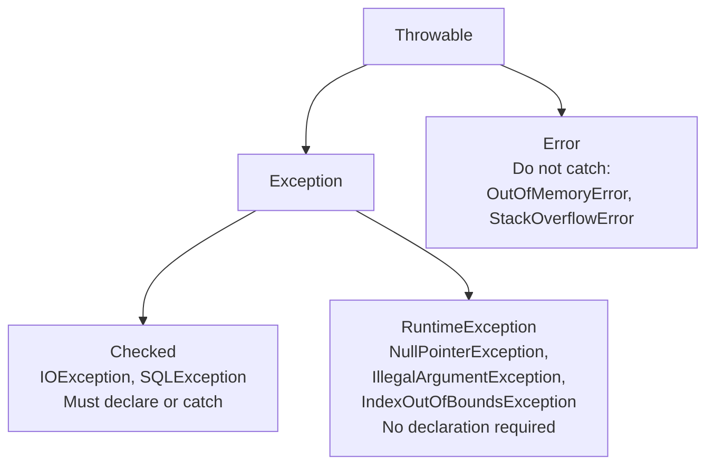

# Fundamentals

Java is a statically typed, class-based, object-oriented language that compiles to bytecode and runs on the Java Virtual Machine (JVM). The "write once, run anywhere" promise means the same compiled bytecode runs on Windows, macOS, Linux, and anywhere else the JVM exists.

---

## The Java Platform



| Component   | What it is                                                        |
| ----------- | ----------------------------------------------------------------- |
| **JDK**     | Java Development Kit — javac compiler + JRE + development tools   |
| **JRE**     | Java Runtime Environment — JVM + standard library                 |
| **JVM**     | Java Virtual Machine — executes bytecode                          |
| **HotSpot** | Oracle's JVM — interprets bytecode first, JIT-compiles hot paths  |
| **GraalVM** | Alternative JVM with ahead-of-time (AOT) native image compilation |

---

## Program Structure

```java
// Package declaration — must match directory structure
package com.example.orders;

// Imports — specific class or wildcard
import java.util.UUID;
import java.util.List;
import java.math.*;       // wildcard — all classes in java.math
import static java.lang.Math.PI;  // static import — use PI directly

// Public class — filename MUST match class name
public class OrderService {

    // main method — entry point for executable programs
    public static void main(String[] args) {
        System.out.println("Hello, Java!");
    }
}
```

- One public class per `.java` file; filename must match the public class name
- `System.out.println` — standard output; `System.err.println` — error output
- `args` — command-line arguments passed to the program

---

## Variables and Data Types

### Primitive types (stack-allocated, no object overhead)

| Type      | Size    | Range                | Literal                             |
| --------- | ------- | -------------------- | ----------------------------------- |
| `byte`    | 1 byte  | -128 to 127          | `42`                                |
| `short`   | 2 bytes | -32,768 to 32,767    | `32000`                             |
| `int`     | 4 bytes | ±2.1 billion         | `42`, `0xFF`, `0b1010`, `1_000_000` |
| `long`    | 8 bytes | ±9.2 × 10^18         | `42L`                               |
| `float`   | 4 bytes | ~7 decimal digits    | `3.14f`                             |
| `double`  | 8 bytes | ~15 decimal digits   | `3.14`                              |
| `char`    | 2 bytes | '\u0000' to '\uffff' | `'A'`, `'\n'`, `'\u0041'`           |
| `boolean` | —       | `true` / `false`     | `true`                              |

> **Never use `float` or `double` for money.** Use `BigDecimal` for exact arithmetic.

### Reference types

Everything that is not a primitive is a reference type — it holds a pointer to an object on the heap. Variables of reference type can be `null`.

```java
String name = "Alice";      // String (immutable, special treatment by JVM)
int[] numbers = {1, 2, 3};  // array reference
Order order = new Order();  // object reference
List<String> list = null;   // null reference — no object allocated
```

### `var` — local variable type inference (Java 10+)

```java
var list  = new ArrayList<String>();  // inferred: ArrayList<String>
var entry = Map.entry("key", 42);     // cleaner than writing the full generic type
for (var item : list) { ... }         // clear from context

// Avoid when the type is not obvious from the RHS
var x = process(data);  // what type? Prefer explicit

// Limitations
var count = 10; // OK
var x; // Compile error: initializer required
var y = null; // Compile error: type cannot be inferred
```

### Autoboxing and unboxing

```java
Integer boxed = 42;         // autoboxing: int → Integer
int unboxed   = boxed;      // unboxing:   Integer → int

// Integer cache (-128 to 127): small integers are cached instances
Integer a = 127; Integer b = 127;  System.out.println(a == b);  // true (same cached object)
Integer c = 128; Integer d = 128;  System.out.println(c == d);  // false (new objects)
// ALWAYS use .equals() to compare Integer/Long/Double values

// Beware NullPointerException from unboxing null
Integer n = null;
int value = n;  // NullPointerException at runtime!
```

### Wrapper Classes

Every primitive type has a corresponding wrapper class.

| Primitive | Wrapper     |
| --------- | ----------- |
| `byte`    | `Byte`      |
| `short`   | `Short`     |
| `int`     | `Integer`   |
| `long`    | `Long`      |
| `float`   | `Float`     |
| `double`  | `Double`    |
| `char`    | `Character` |
| `boolean` | `Boolean`   |

```java
Integer i = Integer.valueOf("42");
int n = Integer.parseInt("42");

Integer.MAX_VALUE;
Double.MIN_VALUE;
Boolean.TRUE;
```

---

## Operators

```java
// Arithmetic
int a = 10 + 3;  // 13
int b = 10 - 3;  // 7
int c = 10 * 3;  // 30
int d = 10 / 3;  // 3  (integer division — truncates)
int e = 10 % 3;  // 1  (modulo / remainder)
double f = 10.0 / 3;  // 3.333... (floating-point division)

// Increment / decrement
int x = 5;
int y = x++;  // y = 5, x = 6 (post-increment: use then increment)
int z = ++x;  // z = 7, x = 7 (pre-increment: increment then use)

// Compound assignment
x += 10;  x -= 3;  x *= 2;  x /= 4;  x %= 3;

// Comparison (always returns boolean)
boolean eq  = (5 == 5);   // true
boolean neq = (5 != 3);   // true
boolean gt  = (5 > 3);    // true
boolean gte = (5 >= 5);   // true

// Logical
boolean and = true && false;   // false (short-circuits: if left is false, right not evaluated)
boolean or  = false || true;   // true  (short-circuits: if left is true, right not evaluated)
boolean not = !true;           // false

// Bitwise (operate on individual bits)
int ba = 0b1010 & 0b1100;  // AND:  0b1000 = 8
int bo = 0b1010 | 0b1100;  // OR:   0b1110 = 14
int bx = 0b1010 ^ 0b1100;  // XOR:  0b0110 = 6
int bn = ~0b1010;            // NOT:  ...11110101 = -11 (two's complement)
int sl = 1 << 3;             // left shift:  1 → 8 (multiply by 2^3)
int sr = 16 >> 2;            // right shift: 16 → 4 (divide by 2^2)
int ur = -1 >>> 1;           // unsigned right shift: fills with 0s from left

// Ternary operator
String result = (score >= 60) ? "Pass" : "Fail";
int max = (a > b) ? a : b;

// instanceof
Object obj = "hello";
boolean isString = obj instanceof String;        // true
if (obj instanceof String s) { /* Java 16+ pattern matching: s is bound */ }
```

---

## Control Flow

### if / else

```java
if (score >= 90) {
    grade = "A";
} else if (score >= 80) {
    grade = "B";
} else if (score >= 70) {
    grade = "C";
} else {
    grade = "F";
}
```

### switch (traditional and expression)

```java
// Traditional switch statement (fall-through unless you use break)
switch (day) {
    case MONDAY:
    case TUESDAY:
        System.out.println("Weekday");
        break;
    case SATURDAY:
    case SUNDAY:
        System.out.println("Weekend");
        break;
    default:
        System.out.println("Other");
}

// Switch expression (Java 14+) — no fall-through, returns a value
String label = switch (status) {
    case PENDING   -> "Awaiting confirmation";
    case CONFIRMED -> "Order confirmed";
    case CANCELLED -> "Order cancelled";
    // Must be exhaustive — all cases covered or have default
};

// Switch expression with yield (for multi-line cases)
int result = switch (operation) {
    case ADD -> a + b;
    case SUBTRACT -> a - b;
    case MULTIPLY -> {
        int product = a * b;
        yield product;  // yield: return from a block in switch expression
    }
};
```

### Loops

```java
// for loop
for (int i = 0; i < 10; i++) {
    System.out.println(i);
}

// Enhanced for (for-each) — iterates any Iterable or array
for (String name : names) {
    System.out.println(name);
}

// while loop — checks condition before each iteration
while (queue.hasNext()) {
    process(queue.poll());
}

// do-while — executes body at least once, then checks condition
do {
    char ch = readChar();
    input.append(ch);
} while (ch != '\n');

// Loop control
outer:
for (int i = 0; i < 5; i++) {
    for (int j = 0; j < 5; j++) {
        if (j == 2) continue;        // skip rest of inner loop body
        if (i == 3) continue outer;  // skip rest of outer loop iteration
        if (i == 4) break outer;     // break out of outer loop entirely
    }
}
```

---

## Arrays

```java
// Declaration and initialization
int[]    nums   = new int[5];           // all zeros
String[] names  = new String[3];        // all null
int[]    primes = {2, 3, 5, 7, 11};    // array literal
int[]    copy   = Arrays.copyOf(primes, primes.length);

// Access and mutation
primes[0] = 2;
int last = primes[primes.length - 1];

// Multi-dimensional (array of arrays)
int[][] matrix = new int[3][4];         // 3 rows, 4 columns
int[][] jagged = {{1, 2}, {3, 4, 5}, {6}};  // rows of different lengths

// Arrays utility class
Arrays.sort(nums);                       // in-place sort
Arrays.sort(names, String::compareToIgnoreCase);  // sort with comparator
int idx = Arrays.binarySearch(nums, 5); // binary search (array must be sorted)
Arrays.fill(nums, 0);                   // fill with value
boolean eq = Arrays.equals(primes, copy); // element-by-element comparison
System.out.println(Arrays.toString(primes)); // "[2, 3, 5, 7, 11]"
int[][] deepCopy = Arrays.copyOf(matrix, matrix.length);
System.out.println(Arrays.deepToString(matrix)); // nested array printing
```

---

## Strings

Strings in Java are **immutable** — once created, they cannot be changed. Every "modification" creates a new `String` object.

```java
// String creation
String s1 = "hello";              // string literal — goes to string pool
String s2 = new String("hello");  // new object on heap (avoid this)
String s3 = "hello";              // same object as s1 from pool

// Reference equality vs value equality
System.out.println(s1 == s3);       // true  (same pooled object)
System.out.println(s1 == s2);       // false (different objects)
System.out.println(s1.equals(s2));  // true  (same content) — ALWAYS use equals()

// Key String methods
String str = "  Hello, World!  ";
str.length()                     // 18
str.trim()                       // "Hello, World!" (removes whitespace)
str.strip()                      // same but Unicode-aware (Java 11+)
str.toLowerCase()                // "  hello, world!  "
str.toUpperCase()                // "  HELLO, WORLD!  "
str.contains("World")            // true
str.startsWith("  H")            // true
str.endsWith("!  ")              // true
str.indexOf("o")                 // 5 (first occurrence)
str.lastIndexOf("o")             // 9
str.substring(2, 7)              // "Hello"
str.replace("World", "Java")     // "  Hello, Java!  "
str.replaceAll("\\s+", " ")      // replace regex pattern
str.split(", ")                  // ["  Hello", "World!  "]
str.charAt(2)                    // 'H'
str.isEmpty()                    // false
str.isBlank()                    // false (Java 11+: true if only whitespace)
str.repeat(2)                    // (Java 11+)
String.valueOf(42)               // "42" — converts primitives to String
"Order %s costs $%.2f".formatted("A1", 29.99)  // Java 15+: "Order A1 costs $29.99"

// String.join and Collectors.joining
String joined = String.join(", ", "Alice", "Bob", "Charlie");  // "Alice, Bob, Charlie"
String csv = names.stream().collect(Collectors.joining(", ", "[", "]")); // "[Alice, Bob, Charlie]"

// char array conversion
char[] chars = str.toCharArray();
String back  = new String(chars);
```

### StringBuilder — mutable string building

```java
// WRONG: repeated String concatenation in a loop creates O(n) objects
String result = "";
for (String s : list) result += s;  // BAD

// RIGHT: StringBuilder is mutable, O(n) total
StringBuilder sb = new StringBuilder();
for (String s : list) sb.append(s);
String result = sb.toString();

// StringBuilder methods
StringBuilder sb = new StringBuilder("Hello");
sb.append(", World");          // "Hello, World"
sb.insert(5, " beautiful");    // "Hello beautiful, World"
sb.delete(5, 15);              // "Hello, World"
sb.reverse();                  // "dlroW ,olleH"
sb.replace(0, 5, "Goodbye");   // "Goodbye ,olleH"
sb.length();                   // current length
sb.charAt(0);                  // 'G'
```

### StringBuffer — thread-safe mutable string building

```java
// StringBuffer: mutable and synchronized (thread-safe)
StringBuffer sb = new StringBuffer("Hello");

sb.append(", World");          // "Hello, World"
sb.insert(5, " beautiful");    // "Hello beautiful, World"
sb.delete(5, 15);              // "Hello, World"
sb.reverse();                  // "dlroW ,olleH"
sb.replace(0, 5, "Goodbye");   // "Goodbye ,olleH"
sb.length();                   // current length
sb.charAt(0);                  // 'G'

// Useful in multi-threaded environments
StringBuffer buffer = new StringBuffer();
buffer.append("A");
buffer.append("B");
System.out.println(buffer);    // "AB"
```

### String vs StringBuilder vs StringBuffer

| Feature                | String                                   | StringBuilder                               | StringBuffer                               |
| ---------------------- | ---------------------------------------- | ------------------------------------------- | ------------------------------------------ |
| Mutability             | Immutable                                | Mutable                                     | Mutable                                    |
| Thread-safe            | N/A (immutable)                          | ❌ No                                       | ✅ Yes (synchronized)                      |
| Performance            | Slow for repeated modifications          | Fastest                                     | Slower than StringBuilder                  |
| Memory Usage           | Creates new object on modification       | Reuses same object                          | Reuses same object                         |
| Synchronization        | N/A                                      | None                                        | Built-in synchronization                   |
| Use Case               | Fixed text, constants, method parameters | String manipulation in single-threaded code | String manipulation in multi-threaded code |
| Concatenation in Loops | ❌ Avoid                                 | ✅ Preferred                                | ✅ Use when thread safety is needed        |
| Example                | `"Hello"`                                | `new StringBuilder()`                       | `new StringBuffer()`                       |

| Operation | String             | StringBuilder | StringBuffer |
| --------- | ------------------ | ------------- | ------------ |
| Append    | Creates new object | In-place      | In-place     |
| Insert    | Creates new object | In-place      | In-place     |
| Delete    | Creates new object | In-place      | In-place     |
| Reverse   | Not available      | ✅            | ✅           |

> **Rule of thumb**
>
> - Use **String** for immutable text values.
> - Use **StringBuilder** for mutable strings in single-threaded code.
> - Use **StringBuffer** only when multiple threads modify the same string object.

---

## Classes and Objects

```java
public class BankAccount {

    // Static field: shared by ALL instances
    private static int totalAccounts = 0;

    // Instance fields: each object has its own copy
    private final String accountNumber;  // final: set once, never changes
    private String owner;
    private double balance;

    // Static initializer: runs once when class is loaded
    static {
        System.out.println("BankAccount class loaded");
    }

    // Constructor — same name as class, no return type
    public BankAccount(String owner, double initialBalance) {
        this.accountNumber = generateAccountNumber();  // this = current object
        this.owner = owner;
        this.balance = initialBalance;
        totalAccounts++;
    }

    // No-arg constructor
    public BankAccount(String owner) {
        this(owner, 0.0);  // delegate to another constructor using this(...)
    }

    // Static method: no access to instance fields (no `this`)
    public static int getTotalAccounts() { return totalAccounts; }

    // Instance methods
    public void deposit(double amount) {
        if (amount <= 0) throw new IllegalArgumentException("Amount must be positive");
        this.balance += amount;
    }

    public boolean withdraw(double amount) {
        if (amount > balance) return false;
        balance -= amount;
        return true;
    }

    // Getters (no setters for final fields)
    public String getAccountNumber() { return accountNumber; }
    public String getOwner()         { return owner; }
    public double getBalance()       { return balance; }

    @Override
    public String toString() {
        return "BankAccount{number=%s, owner=%s, balance=%.2f}"
            .formatted(accountNumber, owner, balance);
    }
}
```

### Access modifiers

| Modifier                        | Same class | Same package | Subclass | Anywhere |
| ------------------------------- | ---------- | ------------ | -------- | -------- |
| `public`                        | ✓          | ✓            | ✓        | ✓        |
| `protected`                     | ✓          | ✓            | ✓        | ✗        |
| _(package-private, no keyword)_ | ✓          | ✓            | ✗        | ✗        |
| `private`                       | ✓          | ✗            | ✗        | ✗        |

> **Encapsulation rule:** make fields `private`. Expose them through methods that can validate input and enforce invariants.

### `static` keyword

```java
// Static field: one shared copy for the entire class
private static int count = 0;

// Static method: no `this`, directly accesses only static members
public static int getCount() { return count; }

// Static initialization block: runs once when class is loaded
static {
    System.out.println("Class initialized");
}

// Static import: use static members without class name
import static java.lang.Math.sqrt;
double result = sqrt(16);

// Static nested class: no reference to outer instance
class Outer {
    static class Inner { }
}

// Static factory method: alternative to constructor
public static User create() {
    return new User();
}

// Static methods are hidden, not overridden
class Parent {
    static void print() { System.out.println("Parent"); }
}
class Child extends Parent {
    static void print() { System.out.println("Child"); }
}
Parent p = new Child();
p.print(); // Parent
```

### `final` keyword

```java
// Final variable: cannot be reassigned
final int MAX = 100;

// Final reference: reference fixed, object may still change
final List<String> list = new ArrayList<>();
list.add("A"); // OK

// Blank final field: assigned exactly once
private final String id;
public User(String id) { this.id = id; }

// Final parameter: cannot be reassigned
void process(final String input) { }

// Final local variable
final double PI = 3.14159;

// Final method: cannot be overridden
public final void process() { }

// Final class: cannot be extended
public final class ImmutableClass { }

// Effectively final: usable inside lambdas
int x = 10;
Runnable r = () -> System.out.println(x);

// Compile-time constants
public static final int MAX_RETRIES = 3;
public static final String APP_NAME = "Orders";

// Static final: shared immutable constant
public static final double PI = 3.141592653589793;
```

---

## Inheritance

```java
// Base class
public class Animal {
    protected String name;

    public Animal(String name) { this.name = name; }

    public String speak() { return name + " makes a sound"; }

    // final method — cannot be overridden
    public final String getName() { return name; }
}

// Subclass
public class Dog extends Animal {

    private String breed;

    // Call super constructor — must be first statement
    public Dog(String name, String breed) {
        super(name);
        this.breed = breed;
    }

    // Method overriding — must have same signature
    @Override
    public String speak() {
        return super.speak() + " — specifically, it barks!";
        // super.speak() calls the parent's version
    }
}

// Usage
Animal a = new Dog("Rex", "Labrador");  // polymorphism: Dog is-a Animal
a.speak();   // calls Dog.speak() — runtime dispatch (dynamic dispatch)
a.getName(); // calls Animal.getName() — final method
```

### Abstract classes

An abstract class cannot be instantiated. It may have abstract methods (no implementation) that subclasses must implement:

```java
public abstract class Shape {
    protected String color;

    public Shape(String color) { this.color = color; }

    // Abstract method — no body, subclasses MUST implement
    public abstract double area();
    public abstract double perimeter();

    // Concrete method — shared by all subclasses
    public void describe() {
        System.out.printf("%s with area=%.2f%n", color, area());
    }
}

public class Circle extends Shape {
    private double radius;

    public Circle(String color, double radius) {
        super(color);
        this.radius = radius;
    }

    @Override public double area()      { return Math.PI * radius * radius; }
    @Override public double perimeter() { return 2 * Math.PI * radius; }
}
```

---

## Interfaces

```java
public interface Drawable {
    // All fields are implicitly public static final
    double DEFAULT_SCALE = 1.0;

    // Abstract method — implicitly public abstract
    void draw();

    // Default method (Java 8+) — provides implementation, can be overridden
    default void drawScaled(double scale) {
        System.out.println("Drawing at scale: " + scale);
        draw();
    }

    // Static method (Java 8+) — belongs to interface, not instances
    static Drawable noop() { return () -> {}; }

    // Private method (Java 9+) — helper for default methods
    private void log(String msg) { System.out.println("[Drawable] " + msg); }
}

// A class can implement multiple interfaces
public class Icon implements Drawable, Serializable {
    @Override
    public void draw() { System.out.println("Drawing icon"); }
}
```

### Functional interfaces

An interface with exactly one abstract method — can be used with lambda expressions:

```java
@FunctionalInterface
public interface Validator<T> {
    boolean validate(T value);

    // Default methods are OK — only abstract method count matters
    default Validator<T> and(Validator<T> other) {
        return value -> this.validate(value) && other.validate(value);
    }
}

Validator<String> nonEmpty   = s -> !s.isEmpty();
Validator<String> notTooLong = s -> s.length() <= 100;
Validator<String> combined   = nonEmpty.and(notTooLong);
```

### Interface vs Abstract Class

|                          | Interface                           | Abstract Class                       |
| ------------------------ | ----------------------------------- | ------------------------------------ |
| **Multiple inheritance** | A class implements many             | A class extends one only             |
| **State**                | No instance fields (constants only) | Can have instance fields             |
| **Constructors**         | None                                | Can have constructors                |
| **Access modifiers**     | Methods are public by default       | Any access modifier                  |
| **Use when**             | Defining a capability/role          | Sharing code between related classes |

---

## Enums

Enums are type-safe named constants that are full Java classes:

```java
public enum OrderStatus {
    PENDING("Awaiting confirmation"),
    CONFIRMED("Order confirmed"),
    SHIPPED("On its way"),
    DELIVERED("Successfully delivered"),
    CANCELLED("Order cancelled");

    // Enums can have fields and methods
    private final String description;

    // Constructor is always private
    OrderStatus(String description) {
        this.description = description;
    }

    public String getDescription() { return description; }

    // Can have abstract methods that each constant implements
    public abstract boolean isTerminal();
}

// Enum methods
OrderStatus s = OrderStatus.CONFIRMED;
s.name()        // "CONFIRMED"
s.ordinal()     // 1 (zero-based position)
s.getDescription() // "Order confirmed"

OrderStatus[] all = OrderStatus.values();                    // all constants
OrderStatus   val = OrderStatus.valueOf("PENDING");         // by name

// Switch with enum
switch (status) {
    case PENDING   -> processQueue(order);
    case CANCELLED -> refund(order);
    default        -> log(order);
}
```

---

## Generics

Generics enable type-safe code that works with different types:

```java
// Generic class
public class Box<T> {
    private T content;
    public void set(T content) { this.content = content; }
    public T get() { return content; }
}

Box<String>  strBox = new Box<>();  strBox.set("hello");
Box<Integer> intBox = new Box<>();  intBox.set(42);

// Generic method
public <T extends Comparable<T>> T max(T a, T b) {
    return a.compareTo(b) >= 0 ? a : b;
}

// Bounded wildcards
public double sumNumbers(List<? extends Number> list) {  // ? = any subtype of Number
    return list.stream().mapToDouble(Number::doubleValue).sum();
}

public void addItems(List<? super Integer> list) {  // ? = Integer or any supertype
    list.add(42);
}

public void printAll(List<?> list) {  // ? = any type (read-only access)
    list.forEach(System.out::println);
}
```

### Type erasure

Generic type information is erased at compile time. At runtime `List<String>` and `List<Integer>` are both just `List`. Implications:

- Cannot do `new T()` or `new T[n]` — type unknown at runtime
- Cannot use `instanceof List<String>` — must use `instanceof List<?>`

---

## Exceptions



```java
// Custom checked exception
public class OrderNotFoundException extends Exception {
    public OrderNotFoundException(String message) { super(message); }
    public OrderNotFoundException(String message, Throwable cause) { super(message, cause); }
}

// Custom unchecked exception
public class InsufficientStockException extends RuntimeException {
    private final int available;
    public InsufficientStockException(int available) {
        super("Only " + available + " units available");
        this.available = available;
    }
    public int getAvailable() { return available; }
}

// try-catch-finally
try {
    processOrder(order);
} catch (OrderNotFoundException e) {
    log.warn("Order not found: {}", e.getMessage());
    throw new ResponseStatusException(HttpStatus.NOT_FOUND, e.getMessage());
} catch (IOException | SQLException e) {  // multi-catch
    throw new DataAccessException("Data error", e);
} finally {
    cleanup();  // always runs, even if exception thrown or return executed
}

// try-with-resources — AutoCloseable resources closed automatically in reverse order
try (Connection conn = dataSource.getConnection();
     PreparedStatement stmt = conn.prepareStatement("SELECT * FROM orders WHERE id = ?")) {
    stmt.setObject(1, orderId);
    ResultSet rs = stmt.executeQuery();
    // conn and stmt closed automatically when block exits (success OR exception)
}
```

---

## Inner Classes

### Static nested class

Associated with the outer class (not an instance). Can access outer static members only:

```java
public class HttpClient {
    private static final int DEFAULT_TIMEOUT = 30;

    public static class Builder {  // static nested
        private int timeout = DEFAULT_TIMEOUT;
        public Builder timeout(int seconds) { this.timeout = seconds; return this; }
        public HttpClient build() { return new HttpClient(timeout); }
    }
}
HttpClient client = new HttpClient.Builder().timeout(60).build();
```

### Inner class (non-static)

Holds an implicit reference to its enclosing object:

```java
public class EventBus {
    private List<Listener> listeners = new ArrayList<>();

    public class Registration {  // inner class — has reference to EventBus.this
        public void unregister() {
            listeners.remove(this);  // accesses outer instance's field
        }
    }
}
```

### Anonymous class

One-off implementation of an interface or abstract class at the point of use:

```java
// Pre-lambda style — largely replaced by lambdas for functional interfaces
Comparator<String> byLength = new Comparator<String>() {
    @Override
    public int compare(String a, String b) {
        return Integer.compare(a.length(), b.length());
    }
};
```

---

## Annotations

Annotations provide metadata. They do not change program logic directly but can be processed by the compiler, tools, or frameworks at runtime.

```java
// Built-in compiler annotations
@Override           // verify overriding parent method — compile error if method name is wrong
@Deprecated         // marks method as obsolete — compiler warns callers
@SuppressWarnings("unchecked")  // suppress compiler warning
@FunctionalInterface            // verify interface has exactly one abstract method

// Framework annotations (Spring, Jakarta EE) use reflection to read them at runtime

// Custom annotation
@Target(ElementType.METHOD)         // where annotation can be placed
@Retention(RetentionPolicy.RUNTIME) // available at runtime via reflection
@Documented
public @interface Retry {
    int attempts() default 3;
    long delayMs() default 1000;
    Class<? extends Throwable>[] on() default { RuntimeException.class };
}

@Retry(attempts = 5, delayMs = 500)
public Order fetchOrder(UUID id) { ... }

// Read annotation at runtime via reflection
Method m = OrderService.class.getMethod("fetchOrder", UUID.class);
Retry retry = m.getAnnotation(Retry.class);
if (retry != null) {
    int attempts = retry.attempts();
}
```

---

## Type Casting

```java
// Widening conversion (implicit — no data loss, automatic)
int i = 100;
long l = i;       // int → long (widening)
double d = i;     // int → double (widening)

// Narrowing conversion (explicit cast required — may lose data)
double pi = 3.14159;
int truncated = (int) pi;    // 3 — decimal part lost
long big = 1_000_000_000_000L;
int small = (int) big;       // data loss — overflow!

// Reference type casting
Animal animal = new Dog("Rex");   // upcast: always safe (Dog is-a Animal)
Dog dog = (Dog) animal;           // downcast: throws ClassCastException if wrong type

// Safe downcast with instanceof
if (animal instanceof Dog d) {    // Java 16+ pattern matching
    d.fetch();                    // d is already cast and bound
} else if (animal instanceof Cat) {
    ((Cat) animal).purr();        // old style — must cast manually
}
```

---

## Pass-by-Value Semantics

**Java always passes by value.** For reference types, the value is the reference (pointer), not the object itself.

```java
// Primitives: a copy of the value is passed
void doubleIt(int x) { x = x * 2; }
int n = 10;
doubleIt(n);
System.out.println(n);  // still 10 — original not changed

// References: a copy of the reference is passed
// — you CAN mutate the object the reference points to
// — you CANNOT make the caller's variable point to a different object
void addItem(List<String> list) {
    list.add("new");        // mutates the original list — caller SEES this change
    list = new ArrayList<>(); // rebinds local variable — caller does NOT see this
}

List<String> myList = new ArrayList<>(List.of("a", "b"));
addItem(myList);
System.out.println(myList);  // ["a", "b", "new"] — mutation visible
```

---

## `equals`, `hashCode`, and `toString`

Every class inherits these from `Object`. Override all three together:

```java
public class Product {
    private final String sku;
    private final String name;
    private final BigDecimal price;

    // If a.equals(b) is true, then a.hashCode() MUST equal b.hashCode()
    @Override
    public boolean equals(Object o) {
        if (this == o) return true;
        if (!(o instanceof Product p)) return false;
        return sku.equals(p.sku);  // identity by SKU
    }

    @Override
    public int hashCode() {
        return Objects.hash(sku);  // must match equals
    }

    @Override
    public String toString() {
        return "Product{sku='%s', name='%s', price=%s}".formatted(sku, name, price);
    }
}
```

> **If you override `equals`, you MUST override `hashCode`.** Objects that are `equal` must return the same hash code. Breaking this contract silently destroys `HashMap`, `HashSet`, and every hash-based collection.
