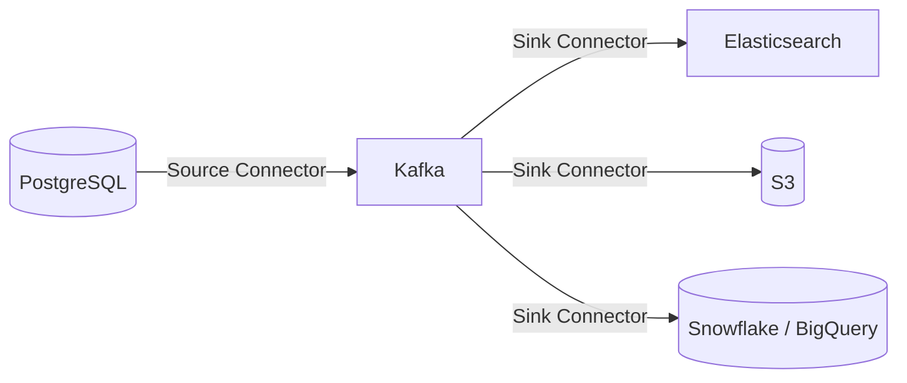
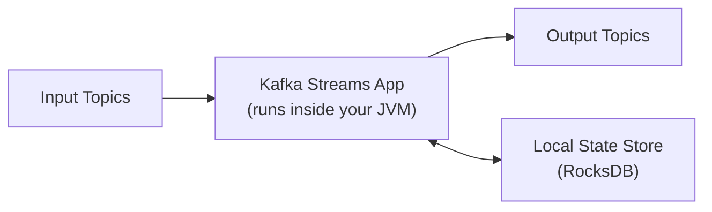
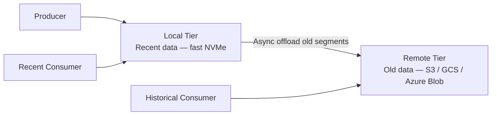

# Advanced

With the fundamentals in place, these four capabilities turn Kafka from a message bus into a full data platform: Connect for moving data in and out of Kafka, Streams for processing it inside your JVM, transactions for exactly-once guarantees, and tiered storage for cost-efficient long-term retention.

---

## Kafka Connect

Kafka Connect is a framework for building scalable, reliable connectors that move data between Kafka and external systems — databases, object stores, search indexes, data warehouses, and anything with a JDBC or HTTP endpoint.



### Source vs Sink connectors

| Type | Direction | Popular examples |
|---|---|---|
| **Source** | External system → Kafka | Debezium (CDC from PostgreSQL, MySQL, MongoDB), JDBC Source, S3 Source |
| **Sink** | Kafka → External system | JDBC Sink, Elasticsearch Sink, S3 Sink, Snowflake Sink, BigQuery Sink |

### Running Connect in distributed mode

Connect runs as a cluster of **workers**. Connectors are distributed across workers as **tasks** — the unit of parallelism. Tasks can be scaled up independently of the Connect worker count.

```properties
# connect-distributed.properties
bootstrap.servers=kafka1:9092,kafka2:9092

group.id=connect-cluster

# Internal topics Connect uses for coordination
offset.storage.topic=connect-offsets
config.storage.topic=connect-configs
status.storage.topic=connect-status

key.converter=org.apache.kafka.connect.json.JsonConverter
value.converter=io.confluent.connect.avro.AvroConverter
value.converter.schema.registry.url=http://schema-registry:8081
```

```bash
# Start a Connect worker
connect-distributed.sh config/connect-distributed.properties
```

### Deploy a connector via REST API

```bash
# Deploy a Debezium PostgreSQL CDC source connector
curl -X POST http://connect:8083/connectors \
  -H "Content-Type: application/json" \
  -d '{
    "name": "pg-orders-source",
    "config": {
      "connector.class": "io.debezium.connector.postgresql.PostgresConnector",
      "database.hostname": "postgres",
      "database.port": "5432",
      "database.user": "debezium",
      "database.password": "dbz",
      "database.dbname": "commerce",
      "table.include.list": "public.orders",
      "topic.prefix": "pg",
      "plugin.name": "pgoutput"
    }
  }'

# Check connector status
curl http://connect:8083/connectors/pg-orders-source/status
```

This produces a topic `pg.public.orders` with every INSERT, UPDATE, and DELETE from the `orders` table as a structured event. This pattern — **Change Data Capture (CDC)** — is one of the most powerful uses of Kafka in production.

### CDC event structure (Debezium)

```json
{
  "before": { "id": "order_99", "status": "pending" },
  "after":  { "id": "order_99", "status": "confirmed" },
  "op": "u",
  "ts_ms": 1750000000000,
  "source": { "db": "commerce", "schema": "public", "table": "orders" }
}
```

`op` values: `c` (create / INSERT), `u` (update), `d` (delete), `r` (snapshot read).

---

## Kafka Streams

Kafka Streams is a **Java library** for building stream processing applications that read from Kafka, transform data in the application's own JVM, and write results back to Kafka. No separate cluster to manage.



### Kafka Streams vs other options

| | Kafka Streams | Apache Flink | Spark Structured Streaming |
|---|---|---|---|
| **Deployment** | Embedded library — runs in your app | Separate cluster required | Separate cluster required |
| **Language** | Java / Scala | Java / Scala / Python | Java / Scala / Python |
| **Latency** | Very low — record by record | Low | Micro-batch — higher latency |
| **State management** | RocksDB local + Kafka changelog backup | Managed state backend | Checkpointed RDD state |
| **Ops overhead** | Minimal — just scale your app | High — cluster to manage | High |
| **Best for** | Simple-to-medium transformations close to Kafka | Complex stateful processing at large scale | Unified batch + streaming |

### DSL example

```java
StreamsBuilder builder = new StreamsBuilder();

// Read from input topic
KStream<String, Order> orders = builder.stream("orders");

// Filter and transform
KStream<String, EnrichedOrder> confirmed = orders
    .filter((key, order) -> "CONFIRMED".equals(order.getStatus()))
    .mapValues(order -> new EnrichedOrder(order, lookupCustomer(order.getUserId())));

// Write to output topic
confirmed.to("confirmed-orders");

// Count orders per user in a 5-minute tumbling window
orders
    .groupByKey()
    .windowedBy(TimeWindows.ofSizeWithNoGrace(Duration.ofMinutes(5)))
    .count()
    .toStream()
    .to("orders-per-user-5m");

KafkaStreams streams = new KafkaStreams(builder.build(), props);
streams.start();
```

### KTable: changelog stream as a table

A **KTable** interprets a stream as a changelog — each record represents the latest value for a key. This enables stream-table joins, a common pattern for enriching events with reference data.

```java
// Load product catalogue from a compacted topic
KTable<String, Product> products = builder.table("products");

// Join real-time order events with product data
KStream<String, EnrichedOrder> enriched = orders.join(
    products,
    (order, product) -> new EnrichedOrder(order, product),
    Joined.with(Serdes.String(), orderSerde, productSerde)
);
```

---

## Exactly-Once Semantics (EOS)

By default Kafka guarantees **at-least-once** delivery — a record may be processed more than once in failure scenarios. Exactly-once semantics (EOS) ensure a record appears in the output topic **exactly once**, even with producer retries and consumer crashes.

> **Important scope:** EOS is a guarantee **within Kafka only**. It does not extend to external side effects like database writes or HTTP calls. Those require your application to handle idempotency separately.

### Transactional producer

```java
Properties props = new Properties();
props.put("bootstrap.servers", "kafka1:9092");
props.put("transactional.id", "order-processor-1"); // must be unique per producer instance
props.put("enable.idempotence", "true");

KafkaProducer<String, String> producer = new KafkaProducer<>(props);
producer.initTransactions();

try {
    producer.beginTransaction();

    // Read from input topic
    ConsumerRecords<String, String> records = consumer.poll(Duration.ofMillis(100));

    for (ConsumerRecord<String, String> record : records) {
        String result = process(record.value());
        producer.send(new ProducerRecord<>("output-topic", record.key(), result));
    }

    // Atomically commit consumer offsets AND the produced output
    producer.sendOffsetsToTransaction(
        currentOffsets(records),
        consumer.groupMetadata()
    );
    producer.commitTransaction();

} catch (Exception e) {
    producer.abortTransaction();   // roll back — output records are invisible to consumers
}
```

### EOS in Kafka Streams

Enable exactly-once with a single property:

```properties
# Kafka 2.5+ — lower latency than the original exactly_once
processing.guarantee=exactly_once_v2
```

Kafka Streams handles all transaction management internally.

### Performance cost of EOS

| Aspect | Impact |
|---|---|
| **Latency** | Transactions add 1–5 ms per transaction commit |
| **Throughput** | 20–40% reduction compared to at-least-once |
| **Broker resources** | Broker maintains transaction state per producer ID |

Use EOS when processing duplicate outputs is genuinely unacceptable: financial calculations, payment deduplication, or any business logic where "process twice" has a real cost.

---

## Tiered Storage

By default Kafka stores all data locally on broker disks. For topics with long retention (weeks to months), this is expensive — you are paying for fast NVMe to hold cold data that is rarely read.

**Tiered storage** (generally available since Kafka 3.6) separates hot and cold data:



### How it works

1. Brokers write to local disk as normal
2. A background thread uploads older log segments to object storage
3. Local segments beyond the **local retention** threshold are deleted from disk after a successful upload
4. Recent consumers read from local disk at full speed
5. Historical consumers are redirected to object storage — higher latency, but functionally correct

### Configuration

```properties
# Enable tiered storage (broker level)
remote.log.storage.system.enable=true
remote.log.storage.manager.class.name=<S3 or GCS plugin class>

# How much to keep on fast local disk
local.retention.ms=86400000         # 1 day locally
local.retention.bytes=5368709120    # or 5 GB locally

# Total retention including remote tier
retention.ms=2592000000             # 30 days total
```

### When to use tiered storage

| Use case | Benefit |
|---|---|
| Compliance or audit topics with 90+ day retention | 80–90% storage cost reduction |
| Event-sourcing topics that are rarely fully replayed | Keep hot path fast, cold path cheap |
| Topics replicated from another cluster for DR | Avoids duplicating large disks |
| Topics consumed by batch analytics jobs | Analytics reads directly from S3 |
