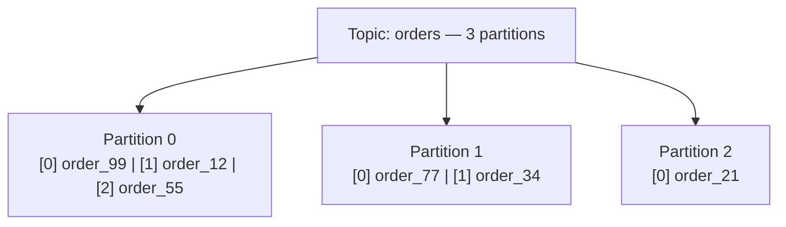
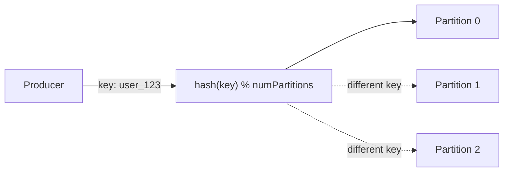
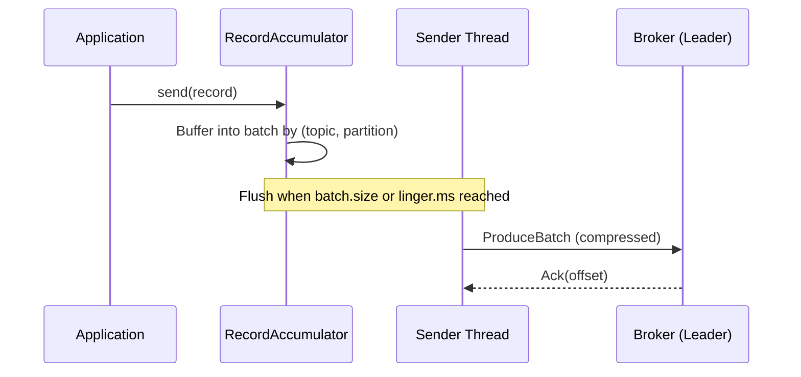
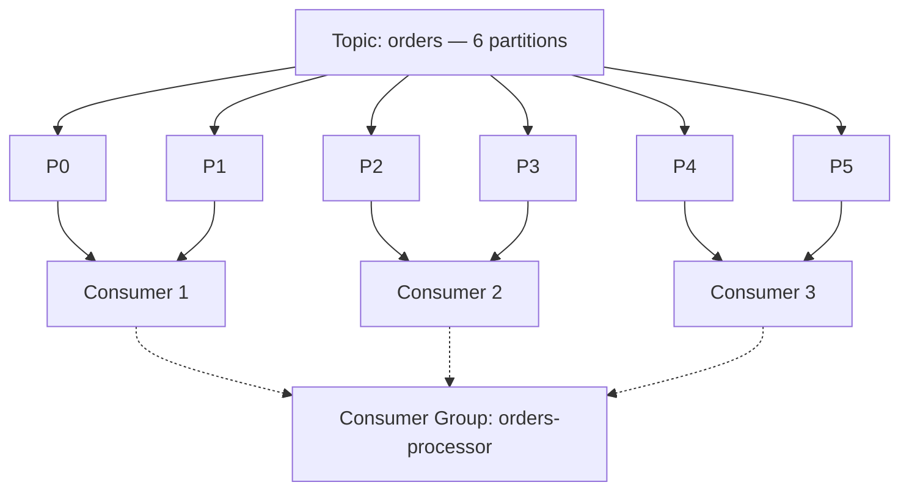
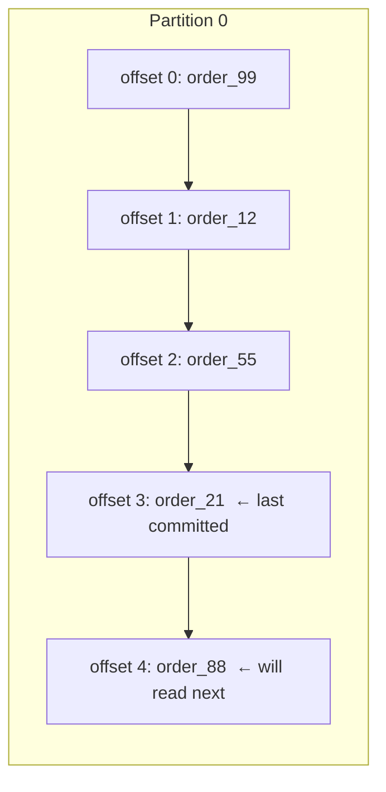
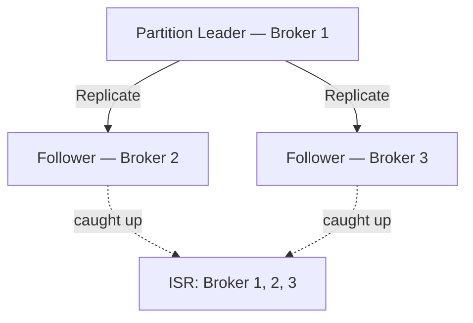
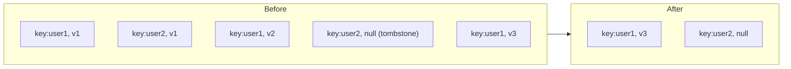

# Core Concepts

Understanding Kafka deeply means understanding a small number of primitives that compose together: the log, the offset, and the group. Everything else is built on these three ideas.

---

## Topics and Partitions

A **topic** is a named, ordered log of records. A **partition** is the unit of parallelism: every topic is split into N partitions, each an independent ordered log stored on a single broker.



### Partition count: the most consequential decision

Partition count is one of the most important choices in a Kafka deployment. **You cannot reduce it later** — only increase.

| More partitions | Fewer partitions |
|---|---|
| More consumer parallelism | Simpler ordering reasoning |
| Higher total throughput | Fewer open file descriptors on brokers |
| More leader election overhead | Faster rebalancing |
| Requires more memory on brokers | |

**Rule of thumb:** `max(target_throughput_MB_per_sec ÷ single_partition_throughput, consumer_count)`. A single partition handles roughly 10–50 MB/s depending on replication, hardware, and consumer pattern. A good default for most topics is **6 to 12 partitions**.

### Partition key: how records are routed



- **Key provided** — `murmur2(key) % numPartitions`. Records with the same key always land in the same partition, guaranteeing order for that key.
- **No key (null)** — Round-robin or sticky partitioning (default since Kafka 2.4). No ordering guarantee.
- **Custom partitioner** — Override the `Partitioner` interface to implement any routing logic.

> **Interview answer:** "How do you guarantee ordering in Kafka?" — Use a partition key. Ordering is guaranteed **within a partition** but not across partitions.

---

## Producers

A producer writes records to topics. Under the hood it batches records, optionally compresses them, and sends the batch to the partition leader.



### The acks setting — most important producer config

| acks | Meaning | Durability | Latency |
|---|---|---|---|
| `0` | Fire and forget — no ack waited | Lowest — data loss possible | Lowest |
| `1` | Leader wrote to its local log | Medium — data loss if leader crashes before replication | Low |
| `all` or `-1` | All ISR replicas have written | Highest — no loss as long as min.insync.replicas is met | Higher |

```properties
# Highest durability — always use for critical data
acks=all
min.insync.replicas=2    # broker/topic config: at least 2 replicas must ack
```

### Idempotent producer

The idempotent producer (`enable.idempotence=true`) guarantees **exactly-once delivery within a single producer session**. The broker deduplicates using a producer ID and per-partition sequence number — retries never produce duplicates.

```properties
# Implicitly enables acks=all and sets retries=MAX_INT
enable.idempotence=true
```

### Compression

Compression happens at the **batch level** — a larger batch gives better compression ratios.

| Codec | Compression ratio | CPU cost | Best for |
|---|---|---|---|
| `none` | — | None | Already-compressed payloads |
| `gzip` | Best | High | Bandwidth-constrained, small batches |
| `snappy` | Good | Low | Balanced — most common choice |
| `lz4` | Good | Very low | Latency-sensitive high-throughput |
| `zstd` | Excellent | Medium | Best overall since Kafka 2.1 |

```properties
compression.type=zstd
```

---

## Consumers and Consumer Groups

A **consumer group** is a set of consumers that cooperate to read a topic. Kafka distributes the partitions across the group members — each partition is assigned to **exactly one** consumer in the group at a time.



### Scaling consumers

| Consumer count vs partitions | Behaviour |
|---|---|
| Consumers < partitions | Some consumers read multiple partitions |
| Consumers = partitions | Perfect parallelism — each consumer owns exactly one partition |
| Consumers > partitions | Extra consumers are idle — they get no partition assigned |

> **Key insight:** To increase consumer throughput, increase both partition count and consumer instances together. You can never have more active consumers than partitions in a group.

### Rebalancing

When a consumer joins, leaves, or crashes, Kafka triggers a **rebalance** — partitions are redistributed among active members.

| Strategy | Behaviour | Since |
|---|---|---|
| **Eager (Range / RoundRobin)** | All consumers drop all partitions, then reassign — causes a full stop-the-world pause | Default before 2.4 |
| **Cooperative incremental** | Only the partitions that need to move are revoked — much smoother | Kafka 2.4+ |

```properties
# Cooperative incremental rebalance (strongly recommended)
partition.assignment.strategy=org.apache.kafka.clients.consumer.CooperativeStickyAssignor
```

**Static membership** avoids rebalances entirely when a consumer restarts quickly:

```properties
group.instance.id=consumer-node-1   # unique per consumer instance
session.timeout.ms=60000
```

A consumer with a known `group.instance.id` that disconnects and reconnects within the session timeout gets its partitions back without triggering a rebalance.

---

## Offsets and Delivery Semantics

The **offset** is a monotonically increasing integer identifying each record's position in a partition. Consumers track their progress by **committing offsets** — either to the Kafka `__consumer_offsets` topic or to an external store.



### Delivery semantics

| Semantic | How to achieve | Risk |
|---|---|---|
| **At-most-once** | Commit offset **before** processing | Message lost if consumer crashes after commit but before processing |
| **At-least-once** | Commit offset **after** processing | Message reprocessed if consumer crashes after processing but before commit |
| **Exactly-once** | Transactional produce + atomic offset commit | Most complex; requires EOS setup (covered in Advanced) |

**At-least-once is the standard production choice.** Design your consumers to be **idempotent** — processing the same message twice must produce the same result.

### Manual vs auto commit

```properties
# Auto commit — simple but dangerous (commits even if processing failed silently)
enable.auto.commit=true
auto.commit.interval.ms=5000

# Manual commit — recommended for production
enable.auto.commit=false
```

```java
// application.properties
// spring.kafka.consumer.group-id=orders-processor
// spring.kafka.consumer.auto-offset-reset=earliest
// spring.kafka.consumer.enable-auto-commit=false
// spring.kafka.listener.ack-mode=manual

@Component
public class OrderConsumer {

    @KafkaListener(topics = "orders", groupId = "orders-processor")
    public void consume(
            ConsumerRecord<String, String> record,
            Acknowledgment ack) {
        process(record.value());   // do the work first
        ack.acknowledge();         // only then commit the offset
    }
}
```

### Consumer lag

**Consumer lag** = `log-end-offset − consumer-committed-offset`. Lag is the single most important consumer health metric. A steadily growing lag means the consumer cannot keep up with the producer.

---

## Replication and ISR

Kafka achieves fault tolerance through replication. Every partition has one **leader** and zero or more **followers**. All client reads and writes go to the leader; followers replicate the log asynchronously.



### In-Sync Replicas (ISR)

The ISR is the set of replicas that are caught up with the leader within `replica.lag.time.max.ms` (default 30 s). A replica falls out of the ISR if it gets too far behind.

- `acks=all` waits only for replicas **currently in the ISR**
- A write is durable as long as at least `min.insync.replicas` brokers are in the ISR

**Standard production configuration:**

```properties
# Topic level
replication.factor=3
min.insync.replicas=2
```

This tolerates one broker failure while still accepting writes. With `acks=all`, a produce request requires acknowledgement from 2 of 3 replicas.

### Unclean leader election

If **all** ISR replicas go down, Kafka must choose: halt the partition (preserve consistency) or elect an out-of-sync replica (preserve availability at the cost of possible data loss).

```properties
# Default: false — refuse to elect an out-of-sync leader
unclean.leader.election.enable=false
```

Only set `true` for topics where availability absolutely outweighs durability (e.g. transient metrics, debug logs).

---

## Retention and Compaction

Kafka retains records based on policy. Unlike a message queue, data is **not deleted when it is consumed** — it is kept until the retention policy expires it.

### Time and size retention

```properties
# Keep records for 7 days
retention.ms=604800000

# Delete segment files older than 7 days
log.retention.hours=168

# Maximum total partition size before deleting old segments
log.retention.bytes=107374182400    # 100 GB
```

Kafka uses **log segments** (default 1 GB each). Retention operates on whole segments, not individual records — a segment is only eligible for deletion once all records in it have passed the retention threshold.

### Log compaction

For topics that represent the **latest state of a key** — user profiles, product inventory, configuration — compaction keeps only the most recent value per key and discards all older ones.



A **tombstone** (null value) marks a key for deletion. After compaction the tombstone is eventually removed too.

```properties
# Enable compaction on a topic
cleanup.policy=compact

# Keep both time-based deletion AND compaction
cleanup.policy=compact,delete
```

**Use compaction when:**
- The topic represents current state of entities (users, orders, config values)
- Consumers need to bootstrap full state by reading the compacted log from the beginning
- You are using Kafka as a changelog or state store (common in Kafka Streams)

**Use time or size deletion when:**
- Events are one-shot (click events, transactions, application logs)
- You only need a recent window, not full history
