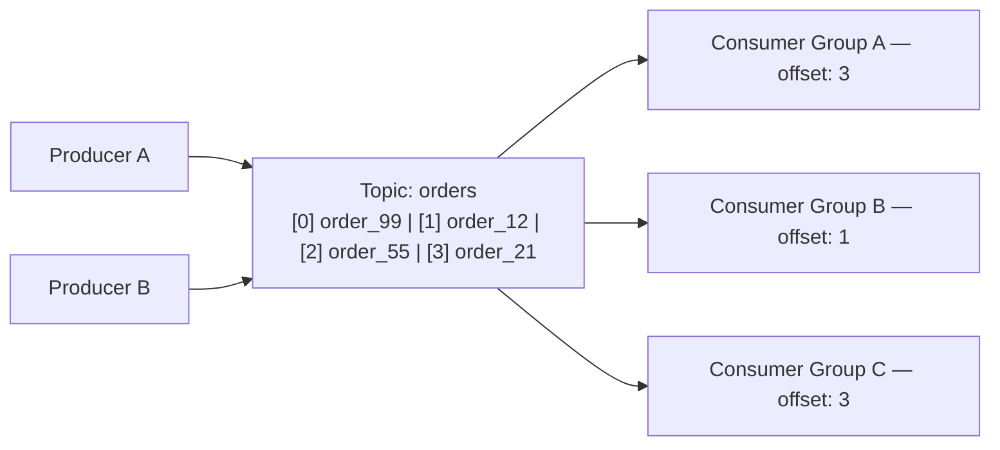
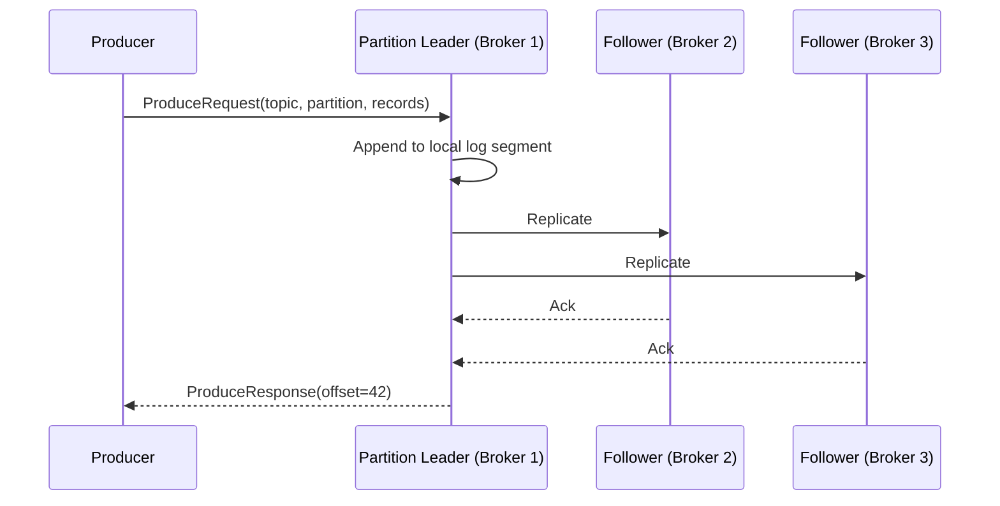
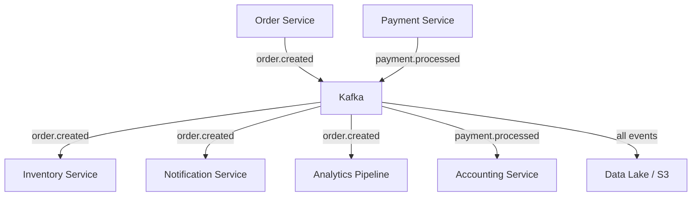

# Kafka Fundamentals

Apache Kafka started as an internal infrastructure project at LinkedIn in 2010, built to solve a problem every fast-growing company hits: you have dozens of services that need to share data, and point-to-point connections between them become an unmanageable web of dependencies. By 2011 it was open-sourced. Today it processes trillions of events per day at Uber, Netflix, Airbnb, and LinkedIn itself.

The name comes from the author Franz Kafka — Jay Kreps, one of Kafka's creators, chose it because the system is optimised for writing.

---

## The Problem Kafka Solves

Before Kafka, the typical approach to inter-service communication was either:

1. **Point-to-point connections** — Service A directly calls Service B. Simple at first, but as services multiply it becomes a spaghetti of dependencies where every service must know about every other.
2. **Traditional message queues** (RabbitMQ, ActiveMQ) — Add a broker in the middle. Services send to queues, consumers read from queues. Better, but with one critical limitation: **once a message is consumed, it is gone**.

The "consumed and deleted" model breaks when you need:
- Multiple teams to independently consume the same event
- Replay events after a bug fix or when a new consumer comes online
- An immutable audit trail of everything that happened in a system
- Long-term event history for analytics or compliance

Kafka's answer was a fundamentally different model: **the commit log**.

---

## The Commit Log Model

A commit log is the simplest data structure imaginable: an append-only, ordered sequence of records. Databases have used commit logs internally for decades — Kafka made the commit log the **primary interface**.

Each consumer group tracks its own position (offset) in the log independently. One group consuming records does not affect another group — there are no locks, no shared state, no queue drain.

| Property | Message Queue | Kafka Commit Log |
|---|---|---|
| **Message lifetime** | Deleted after consumed | Retained by time or size policy |
| **Multiple consumers** | Compete for the same messages | Each group has its own offset cursor |
| **Replay** | Not possible | Seek to any offset and re-read |
| **Ordering** | Per-queue | Guaranteed within a partition |
| **Throughput** | Moderate | Extremely high (sequential disk I/O) |
| **Slow consumer** | Backs up or blocks the queue | No effect on other consumers |

---

## Vocabulary Map

| Term | What it is |
|---|---|
| **Event / Record** | A single piece of data: key, value, timestamp, optional headers |
| **Topic** | A named log — like a database table but append-only |
| **Partition** | A topic is split into N partitions; each is an independent ordered log |
| **Offset** | A monotonically increasing integer — the position of a record in a partition |
| **Producer** | An application that writes records to a topic |
| **Consumer** | An application that reads records from a topic |
| **Consumer Group** | A set of consumers that cooperate to read a topic; each partition goes to exactly one member at a time |
| **Broker** | A Kafka server — a cluster has multiple brokers |
| **Partition Leader** | The broker that handles all reads and writes for a partition |
| **ISR** | In-Sync Replicas — brokers that are fully caught up with the leader |
| **Offset Commit** | A consumer recording how far it has read, stored in the internal `__consumer_offsets` topic |

---

## How a Write Flows End-to-End

The producer gets back the **offset** at which the record was written. This is the receipt — it proves the record landed at a specific, immutable position in the log. Consumers read by requesting records starting at a given offset.

---

## Kafka vs Alternatives

### Kafka vs RabbitMQ

| | Kafka | RabbitMQ |
|---|---|---|
| **Model** | Partitioned commit log | AMQP message broker |
| **Ordering** | Guaranteed within a partition | Per-queue with single consumer |
| **Replay** | Yes — log is retained | No — consumed messages are deleted |
| **Throughput** | Very high — millions/sec | Moderate — tens of thousands/sec |
| **Multiple consumers** | Each group reads independently | Competing consumers share a queue |
| **Routing** | Topic and partition key | Flexible exchanges (fanout, topic, direct, headers) |
| **Ops complexity** | High — partitions, ISR, lag monitoring | Lower for small deployments |
| **Best for** | Event streaming, high volume, audit logs | Task queues, RPC patterns, complex routing logic |

> **Rule of thumb:** If messages are **tasks** to be processed once, use RabbitMQ. If messages are **events** that multiple teams need independently and you might need to replay them, use Kafka.

### Kafka vs AWS SQS / SNS

| | Kafka | SQS + SNS |
|---|---|---|
| **Retention** | Days to months — configurable | SQS: 14 days max |
| **Replay** | Yes | No |
| **Throughput** | Very high | High but throttled per API call |
| **Consumer groups** | Native first-class concept | Simulated: one SQS queue per SNS subscription |
| **Exactly-once** | Yes with transactions | FIFO SQS: effectively once; Standard: at-least-once |
| **Ops burden** | You manage the cluster | Fully managed, zero ops |
| **Cost model** | Fixed cluster cost | Pay per request |
| **Best for** | High volume, replay needed, rich semantics | AWS-native, low-to-moderate volume, no replay needed |

### Kafka vs Apache Pulsar

Pulsar is the most direct architectural alternative to Kafka.

| | Kafka | Pulsar |
|---|---|---|
| **Storage architecture** | Brokers own their partition logs | Compute-storage separation via Apache BookKeeper |
| **Multi-tenancy** | Namespace isolation | Native tenant → namespace → topic hierarchy |
| **Geo-replication** | MirrorMaker 2 (external tool) | Built-in |
| **Queuing model** | Consumer groups — pure streaming | Subscriptions — supports both streaming and queuing |
| **Ecosystem maturity** | 15+ years, massive production track record | Newer, fewer large-scale references |

---

## When to Use Kafka

**Kafka is the right choice when:**
- Multiple systems need the same events independently — order placed → billing, inventory, notifications, analytics all consume without coordinating with each other
- You need replay — a new service goes live and must catch up from the beginning; a bug fix is deployed and affected events need reprocessing
- Throughput is high — millions of events per second where sequential disk writes are fast and predictable
- You are building change data capture (CDC) — Debezium reads the database WAL and streams every row change as a Kafka event
- You need an immutable audit log — time-ordered record of what happened and when, that cannot be altered
- You are building event-sourced systems — Kafka is the source of truth and all derived state is rebuilt from the log

**Kafka is not the right choice when:**
- You need complex routing logic with message priorities, TTLs, and dead-letter queues — use RabbitMQ
- You are on AWS and do not need replay or long retention — SQS and SNS are simpler and far cheaper to operate
- You need request-reply (RPC) patterns — Kafka is one-way; use gRPC or REST
- Your team has no Kafka operations experience and scale is modest — start with managed Kafka (MSK, Confluent Cloud) or SQS

---

## Kafka in a Production Stack

In a typical microservices architecture, Kafka sits in the middle as a durable event bus:

Each consuming service reads at its own pace, independently. The Order Service does not know how many consumers exist. Adding a new consumer requires zero changes to the producer.

This decoupling — **producers and consumers evolve independently** — is Kafka's core value in production systems.
