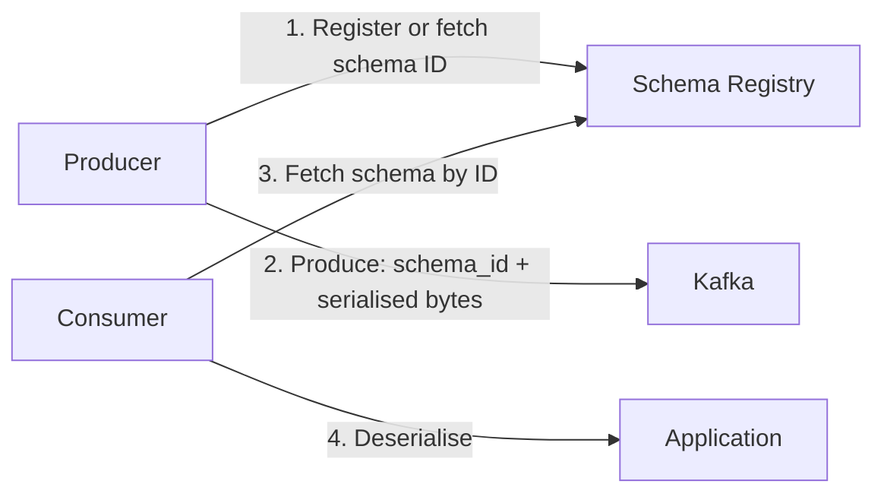

# Operations

Running Kafka in production requires knowing which configuration knobs matter, which CLI tools to reach for when debugging, and which metrics to watch before a problem becomes an incident.

---

## Configuration Reference

Kafka has hundreds of configuration properties. These are the ones that matter in production.

### Broker configuration

```properties
# ── Cluster identity ────────────────────────────────────────────
broker.id=1

# ZooKeeper (legacy) or KRaft (Kafka 3.3+)
zookeeper.connect=zk1:2181,zk2:2181,zk3:2181/kafka
# controller.quorum.voters=1@kafka1:9093,2@kafka2:9093,3@kafka3:9093  # KRaft

# ── Networking ──────────────────────────────────────────────────
listeners=PLAINTEXT://0.0.0.0:9092,SSL://0.0.0.0:9093
advertised.listeners=PLAINTEXT://kafka1.internal:9092,SSL://kafka1.internal:9093
num.network.threads=8
num.io.threads=16

# ── Storage ─────────────────────────────────────────────────────
log.dirs=/data/kafka/logs
num.partitions=6                       # default partition count for auto-created topics
default.replication.factor=3
min.insync.replicas=2
log.retention.hours=168                # 7 days
log.segment.bytes=1073741824           # 1 GB per segment
log.retention.check.interval.ms=300000

# ── Replication ─────────────────────────────────────────────────
num.replica.fetchers=4                 # threads for follower replication
replica.fetch.max.bytes=10485760       # 10 MB max fetch per partition

# ── Socket ──────────────────────────────────────────────────────
socket.send.buffer.bytes=102400
socket.receive.buffer.bytes=102400
socket.request.max.bytes=104857600     # 100 MB max request size
```

### Producer configuration

```properties
bootstrap.servers=kafka1:9092,kafka2:9092,kafka3:9092

# ── Durability ──────────────────────────────────────────────────
acks=all
enable.idempotence=true
max.in.flight.requests.per.connection=5
retries=2147483647                     # retry indefinitely
delivery.timeout.ms=120000             # fail after 2 minutes total
request.timeout.ms=30000

# ── Batching and latency ────────────────────────────────────────
batch.size=65536                       # 64 KB (default: 16384)
linger.ms=10                           # wait up to 10 ms to fill a batch
buffer.memory=67108864                 # 64 MB total producer buffer

# ── Compression ─────────────────────────────────────────────────
compression.type=zstd

# ── Serialisers ─────────────────────────────────────────────────
key.serializer=org.apache.kafka.common.serialization.StringSerializer
value.serializer=org.apache.kafka.common.serialization.ByteArraySerializer
```

### Consumer configuration

```properties
bootstrap.servers=kafka1:9092,kafka2:9092,kafka3:9092
group.id=orders-processor

# ── Offset management ───────────────────────────────────────────
enable.auto.commit=false               # always prefer manual commit in production
auto.offset.reset=earliest             # start from beginning if no committed offset exists
                                       # use 'latest' to skip all existing messages

# ── Fetch tuning ────────────────────────────────────────────────
fetch.min.bytes=1024                   # wait until at least 1 KB is available
fetch.max.wait.ms=500                  # max wait if fetch.min.bytes not met
max.partition.fetch.bytes=1048576      # 1 MB per partition per fetch
max.poll.records=500                   # max records per poll() call

# ── Session and heartbeat ───────────────────────────────────────
session.timeout.ms=45000               # heartbeat timeout
heartbeat.interval.ms=3000             # send heartbeat every 3 s (must be < session.timeout / 3)
max.poll.interval.ms=300000            # max time between poll() calls before kicked out of group

# ── Rebalance strategy ──────────────────────────────────────────
partition.assignment.strategy=org.apache.kafka.clients.consumer.CooperativeStickyAssignor
```

---

## Essential CLI Tools

All Kafka CLI tools live in `$KAFKA_HOME/bin/`. The general pattern is `kafka-<tool>.sh --bootstrap-server <host>:<port> [options]`.

### Topic management

```bash
# Create a topic
kafka-topics.sh \
  --bootstrap-server kafka1:9092 \
  --create \
  --topic orders \
  --partitions 6 \
  --replication-factor 3 \
  --config retention.ms=604800000 \
  --config min.insync.replicas=2

# List all topics
kafka-topics.sh --bootstrap-server kafka1:9092 --list

# Describe a topic — shows partitions, leaders, and ISR
kafka-topics.sh --bootstrap-server kafka1:9092 --describe --topic orders

# Increase partition count (cannot be decreased)
kafka-topics.sh \
  --bootstrap-server kafka1:9092 \
  --alter \
  --topic orders \
  --partitions 12

# Delete a topic
kafka-topics.sh --bootstrap-server kafka1:9092 --delete --topic orders
```

Sample `--describe` output:

```
Topic: orders   PartitionCount: 3   ReplicationFactor: 3
  Partition: 0  Leader: 1  Replicas: 1,2,3  Isr: 1,2,3
  Partition: 1  Leader: 2  Replicas: 2,3,1  Isr: 2,3,1
  Partition: 2  Leader: 3  Replicas: 3,1,2  Isr: 3,1,2
```

`Isr` shows which replicas are in-sync. If `Isr` is shorter than `Replicas`, a replica has fallen behind — investigate immediately.

### Producer console

Useful for testing and manual message injection:

```bash
# Send messages interactively — type a line then press Enter
kafka-console-producer.sh \
  --bootstrap-server kafka1:9092 \
  --topic orders \
  --property "key.separator=:" \
  --property "parse.key=true"

# Input format: key:value
order_99:{"id":"order_99","amount":150}
order_12:{"id":"order_12","amount":75}
```

### Consumer console

```bash
# Read all existing records then continue tailing
kafka-console-consumer.sh \
  --bootstrap-server kafka1:9092 \
  --topic orders \
  --from-beginning \
  --property print.key=true \
  --property key.separator=" | "

# Read exactly 10 messages then exit
kafka-console-consumer.sh \
  --bootstrap-server kafka1:9092 \
  --topic orders \
  --from-beginning \
  --max-messages 10
```

### Consumer group management

```bash
# List all consumer groups
kafka-consumer-groups.sh --bootstrap-server kafka1:9092 --list

# Describe a group — shows lag per partition
kafka-consumer-groups.sh \
  --bootstrap-server kafka1:9092 \
  --describe \
  --group orders-processor
```

Sample output — the `LAG` column is what you watch:

```
GROUP            TOPIC   PARTITION  CURRENT-OFFSET  LOG-END-OFFSET  LAG
orders-processor orders  0          1500            1502            2
orders-processor orders  1          1499            1500            1
orders-processor orders  2          1501            1501            0
```

```bash
# Reset offsets — useful for replay or recovering from a processing bug
kafka-consumer-groups.sh \
  --bootstrap-server kafka1:9092 \
  --group orders-processor \
  --topic orders \
  --reset-offsets \
  --to-earliest \     # or: --to-latest | --to-datetime "2026-01-01T00:00:00.000" | --shift-by -1000
  --execute

# Inspect broker config
kafka-configs.sh \
  --bootstrap-server kafka1:9092 \
  --entity-type brokers \
  --entity-name 1 \
  --describe
```

---

## Monitoring: What to Watch

### Tier 1 — Critical (alert on all of these)

| Metric | Source | What it means | Alert when |
|---|---|---|---|
| **Consumer lag** | `__consumer_offsets` / kafka-consumer-groups | Records pending processing | Trending upward for > 5 min |
| **UnderReplicatedPartitions** | Broker JMX | Partitions with fewer ISR replicas than replication.factor | > 0 |
| **OfflinePartitionsCount** | Broker JMX | Partitions with no elected leader — writes and reads fail | > 0 |
| **ActiveControllerCount** | Broker JMX | Cluster must have exactly one active controller | ≠ 1 |
| **RequestHandlerAvgIdlePercent** | Broker JMX | Fraction of time broker IO threads are idle | < 0.20 (80% busy) |

### Tier 2 — Operational

| Metric | What it tells you |
|---|---|
| `BytesInPerSec` / `BytesOutPerSec` | Network throughput for capacity planning |
| `ProduceLatencyMs` (p99) | Time to acknowledge a produce request |
| `FetchLatencyMs` (p99) | Time to fulfill a consumer fetch |
| `LogFlushRateAndTimeMs` | Disk flush performance |
| `KafkaDataLogsDiskUsed` | Storage pressure per broker |

### Quick lag check via CLI

```bash
kafka-consumer-groups.sh \
  --bootstrap-server kafka1:9092 \
  --describe \
  --group orders-processor \
  | awk 'NR>1 && $6 ~ /^[0-9]+$/ {sum += $6} END {print "Total lag:", sum}'
```

In production, use **Prometheus + kafka_exporter** or **Confluent Control Center** for continuous lag dashboards with alerting.

---

## Schema Registry

Schema Registry (part of Confluent Platform, open-source) stores and enforces schema definitions (Avro, Protobuf, JSON Schema) for Kafka topics. Without it, schema changes silently break consumers.



**Why this matters:** without Schema Registry, if a producer adds a required field, every consumer that does not know about the new field silently breaks or returns nulls. With Schema Registry, compatibility rules prevent breaking changes from reaching Kafka at all.

### Compatibility modes

| Mode | Rule | Allows |
|---|---|---|
| `BACKWARD` (default) | New schema can read old data | Add optional fields; delete fields |
| `FORWARD` | Old schema can read new data | Add fields with defaults |
| `FULL` | Both backward and forward | Only add or remove optional fields |
| `NONE` | No compatibility check | Any schema change |

### Schema Registry REST API

```bash
# Register a schema for a topic value
curl -X POST http://schema-registry:8081/subjects/orders-value/versions \
  -H "Content-Type: application/vnd.schemaregistry.v1+json" \
  -d '{
    "schema": "{
      \"type\": \"record\",
      \"name\": \"Order\",
      \"fields\": [
        {\"name\": \"id\", \"type\": \"string\"},
        {\"name\": \"amount\", \"type\": \"double\"}
      ]
    }"
  }'

# List all registered versions of a schema
curl http://schema-registry:8081/subjects/orders-value/versions

# Check compatibility before registering a new version
curl -X POST http://schema-registry:8081/compatibility/subjects/orders-value/versions/latest \
  -H "Content-Type: application/vnd.schemaregistry.v1+json" \
  -d '{"schema": "..."}'
# Returns: {"is_compatible": true}
```

### Using Schema Registry in a Java producer

```java
Properties props = new Properties();
props.put("bootstrap.servers", "kafka1:9092");
props.put("schema.registry.url", "http://schema-registry:8081");
props.put("key.serializer",   "org.apache.kafka.common.serialization.StringSerializer");
props.put("value.serializer", "io.confluent.kafka.serializers.KafkaAvroSerializer");

KafkaProducer<String, Order> producer = new KafkaProducer<>(props);
producer.send(new ProducerRecord<>("orders", "order_99", order));
// The serialiser automatically registers or fetches the schema,
// embeds the schema ID (4 bytes) in the message, then serialises with Avro.
```
