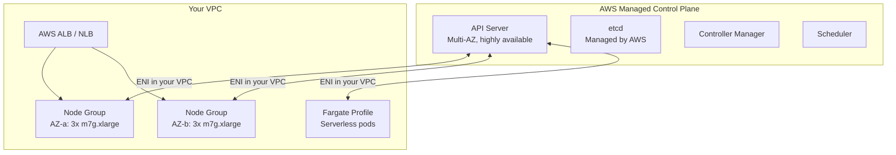
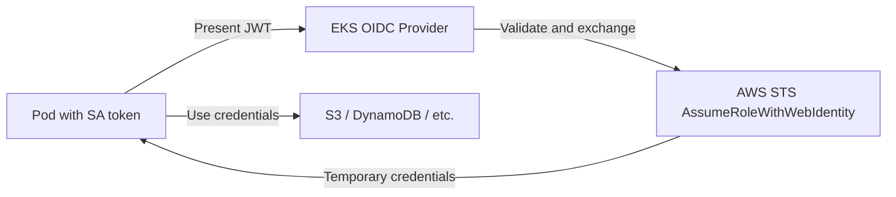

# AWS EKS

Elastic Kubernetes Service (EKS) provides a managed Kubernetes control plane on AWS. The hard parts — API server availability, etcd backups, control plane upgrades, and multi-AZ resilience — are handled by AWS. You focus on worker nodes, workloads, and configuration.

---

## EKS Architecture



The EKS control plane runs in an AWS-managed account. It communicates with your worker nodes via an ENI placed inside your VPC — the control plane never needs a public IP if you set it to private.

---

## Setting Up an EKS Cluster

### With eksctl (recommended for getting started)

```bash
# Install eksctl
brew install eksctl

# Create a cluster with managed node groups
eksctl create cluster \
  --name prod-cluster \
  --region us-east-1 \
  --version 1.30 \
  --nodegroup-name standard-workers \
  --node-type m7g.xlarge \
  --nodes 3 \
  --nodes-min 2 \
  --nodes-max 10 \
  --managed

# Update kubeconfig
aws eks update-kubeconfig --region us-east-1 --name prod-cluster
```

### With Terraform (production)

```hcl
module "eks" {
  source  = "terraform-aws-modules/eks/aws"
  version = "20.0"

  cluster_name    = "prod-cluster"
  cluster_version = "1.30"

  vpc_id     = module.vpc.vpc_id
  subnet_ids = module.vpc.private_subnets

  cluster_endpoint_private_access = true
  cluster_endpoint_public_access  = false   # private-only for production

  eks_managed_node_groups = {
    general = {
      instance_types = ["m7g.xlarge"]
      min_size       = 2
      max_size       = 10
      desired_size   = 3
    }
  }

  enable_cluster_creator_admin_permissions = true
}
```

---

## Node Groups vs Fargate

| | Managed Node Groups | Fargate Profiles |
|---|---|---|
| **Server management** | AWS manages OS patching | No servers at all |
| **Node visibility** | Full access to nodes | No node access |
| **Cost** | Pay for EC2 instances (unused capacity) | Pay per pod CPU/memory per second |
| **Startup time** | Seconds (pod on existing node) | 60–120 seconds (provisions infrastructure) |
| **Scaling** | Cluster Autoscaler or Karpenter | Automatic |
| **GPU / specialised hardware** | Yes | No |
| **Best for** | Stateful workloads, high-density, cost-optimised | Batch jobs, low-traffic APIs, dev environments |

```bash
# Create a Fargate profile
eksctl create fargateprofile \
  --cluster prod-cluster \
  --name default \
  --namespace default \
  --namespace kube-system
```

---

## IRSA — IAM Roles for Service Accounts

IRSA is the EKS-native way to give pods AWS API permissions without hardcoding credentials. A Kubernetes ServiceAccount is annotated with an IAM role ARN. EKS uses the OIDC provider to exchange the SA's JWT token for temporary AWS credentials via STS.



```bash
# Enable OIDC provider for the cluster
eksctl utils associate-iam-oidc-provider --cluster prod-cluster --approve

# Create IAM role for a service account
eksctl create iamserviceaccount \
  --cluster prod-cluster \
  --namespace payments \
  --name payments-api \
  --attach-policy-arn arn:aws:iam::aws:policy/AmazonS3ReadOnlyAccess \
  --approve
```

```yaml
# The service account is annotated automatically
apiVersion: v1
kind: ServiceAccount
metadata:
  name: payments-api
  namespace: payments
  annotations:
    eks.amazonaws.com/role-arn: arn:aws:iam::123456789:role/payments-api-role
```

---

## EKS Networking: VPC CNI

EKS uses the **AWS VPC CNI plugin** by default. Each pod gets a real VPC IP address (not an overlay IP) by attaching ENIs to the worker node and assigning secondary IPs.

**Advantage:** pods are directly routable within your VPC, security groups work at the pod level, no overlay overhead.

**Consideration:** each EC2 instance type has a maximum number of ENIs and IPs per ENI. This limits the number of pods per node. A `m5.xlarge` supports max ~58 pods. Use `--max-pods` and consider **prefix delegation** (assigns /28 CIDR blocks per ENI, dramatically increasing pod density).

```bash
# Enable prefix delegation for higher pod density
kubectl set env daemonset aws-node -n kube-system \
  ENABLE_PREFIX_DELEGATION=true
```

---

## AWS Load Balancer Controller

The AWS Load Balancer Controller replaces the legacy in-tree load balancer provisioner. It creates ALBs for Ingress resources and NLBs for LoadBalancer Services.

```bash
# Install via Helm
helm repo add eks https://aws.github.io/eks-charts
helm install aws-load-balancer-controller eks/aws-load-balancer-controller \
  -n kube-system \
  --set clusterName=prod-cluster \
  --set serviceAccount.annotations."eks\.amazonaws\.com/role-arn"=arn:aws:iam::123:role/alb-controller
```

```yaml
# Ingress creates an ALB
apiVersion: networking.k8s.io/v1
kind: Ingress
metadata:
  annotations:
    kubernetes.io/ingress.class: alb
    alb.ingress.kubernetes.io/scheme: internet-facing
    alb.ingress.kubernetes.io/target-type: ip
    alb.ingress.kubernetes.io/certificate-arn: arn:aws:acm:...
spec:
  rules:
    - host: api.example.com
      http:
        paths:
          - path: /
            pathType: Prefix
            backend:
              service:
                name: api-service
                port:
                  number: 8080
```

---

## EKS vs Self-Hosted Kubernetes

| Dimension | EKS | Self-hosted (kops / kubespray / kubeadm) |
|---|---|---|
| **Control plane ops** | AWS manages it | You manage etcd, API server, upgrades |
| **Upgrade process** | Managed in-place upgrade (15–30 min) | Complex, risky, time-consuming |
| **Cost** | $0.10/hr per cluster ($72/month) + EC2 + data transfer | No control plane fee; higher ops labour |
| **Config flexibility** | Limited to EKS-supported configs | Full kubeadm/etcd access |
| **AWS integration** | Native: IRSA, ALB controller, VPC CNI, Karpenter | Must integrate manually |
| **Multi-cloud** | AWS only | Portable |
| **Time to production** | Hours | Days to weeks |

**Use EKS when:** you are AWS-native, want to minimise ops burden, and can afford the $72/month per cluster fee. For most teams running production on AWS, EKS is the correct choice.

**Self-hosted when:** you need Kubernetes features that EKS does not support yet, you are multi-cloud, or you have on-premise requirements.
