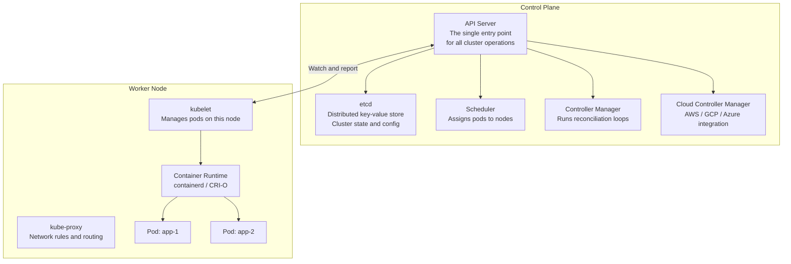

# Fundamentals

At some point, running containers with `docker run` stops scaling. You have a dozen services, each needing multiple replicas, health checks, rolling deployments, service discovery, and configuration management across environments. Doing all of that manually is an operational nightmare. Kubernetes (K8s) is the answer — a platform for automating the deployment, scaling, and operation of containerised applications.

---

## What Problems Kubernetes Solves

| Problem | Without K8s | With K8s |
|---|---|---|
| **Container restarts on failure** | Manual or basic Docker restart policy | Self-healing: replaces failed containers automatically |
| **Scaling out** | Manual `docker run` N more times | `kubectl scale deployment/api --replicas=10` or HPA |
| **Service discovery** | Hardcode IPs or use external DNS | Built-in DNS: `http://api-service` works from any pod |
| **Rolling deployments** | Script it yourself, risk downtime | Native rolling updates with configurable surge/unavailable |
| **Load balancing** | Separate load balancer per service | Built-in load balancing via Services |
| **Config and secrets** | Environment variables in docker-compose | ConfigMaps and Secrets with namespace isolation |
| **Resource management** | Freeform, risk noisy neighbour | Requests and limits per container, QoS classes |
| **Multi-host scheduling** | Manual bin-packing | Scheduler places pods based on resources and constraints |

---

## Architecture

A Kubernetes cluster has two planes: the **control plane** that makes decisions and the **data plane** (worker nodes) that runs workloads.



### Control plane components

**API server** — the front door. Every action in Kubernetes — `kubectl apply`, a controller reconciling state, a node reporting status — goes through the API server. It validates, authenticates, authorises, and persists to etcd.

**etcd** — the source of truth. A distributed key-value store holding the entire cluster state. If you lose etcd without a backup, you lose the cluster. Back it up.

**Scheduler** — watches for unassigned pods and picks the best node based on resource requests, node affinity, taints/tolerations, and topology constraints.

**Controller Manager** — runs a collection of controllers, each watching a resource type and reconciling actual state with desired state. The Deployment controller ensures the right number of ReplicaSet pods are running. The Node controller marks nodes as unready when heartbeats stop.

**Cloud Controller Manager** — integrates with cloud provider APIs. When you create a `LoadBalancer` Service on EKS, the cloud controller manager calls the AWS API to create an ALB or NLB.

### Worker node components

**kubelet** — runs on every worker node. It watches the API server for pods assigned to its node, starts containers via the container runtime, and reports health back.

**kube-proxy** — maintains iptables or IPVS rules on each node to implement Service load balancing and routing.

**Container runtime** — the OCI-compatible runtime (containerd or CRI-O) that actually pulls images and runs containers. Docker Engine is no longer used directly in modern Kubernetes.

---

## The Reconciliation Loop

Kubernetes is declarative. You tell it *what you want*, not *how to get there*. Every controller runs a loop:

```
loop forever:
    actual = observe current state of the cluster
    desired = read desired state from API server
    if actual != desired:
        take action to reconcile
```

This is why Kubernetes is self-healing. If a pod crashes, the actual count drops below desired. The controller reconciles by starting a new pod. If you accidentally delete a Deployment's pod directly, it comes back immediately.

---

## Local Development Options

You do not need a cloud cluster to learn Kubernetes. Three tools let you run a cluster locally:

| Tool | Description | Best for |
|---|---|---|
| **minikube** | Single-node cluster in a VM or container | Beginners, feature exploration, addon experimentation |
| **kind** (K8s in Docker) | Multi-node cluster using Docker containers as nodes | CI pipelines, testing cluster behaviour, fast startup |
| **k3s** | Lightweight K8s with half the memory footprint | Edge, IoT, Raspberry Pi, low-resource environments |

```bash
# minikube
minikube start --driver=docker --cpus=4 --memory=8g
minikube dashboard  # opens browser dashboard

# kind
kind create cluster --name dev --config kind-config.yaml
kubectl cluster-info --context kind-dev

# k3s (installs as a system service)
curl -sfL https://get.k3s.io | sh -
sudo kubectl get nodes
```

```yaml
# kind-config.yaml: 1 control plane + 2 workers
apiVersion: kind.x-k8s.io/v1alpha4
kind: Cluster
nodes:
  - role: control-plane
  - role: worker
  - role: worker
```
