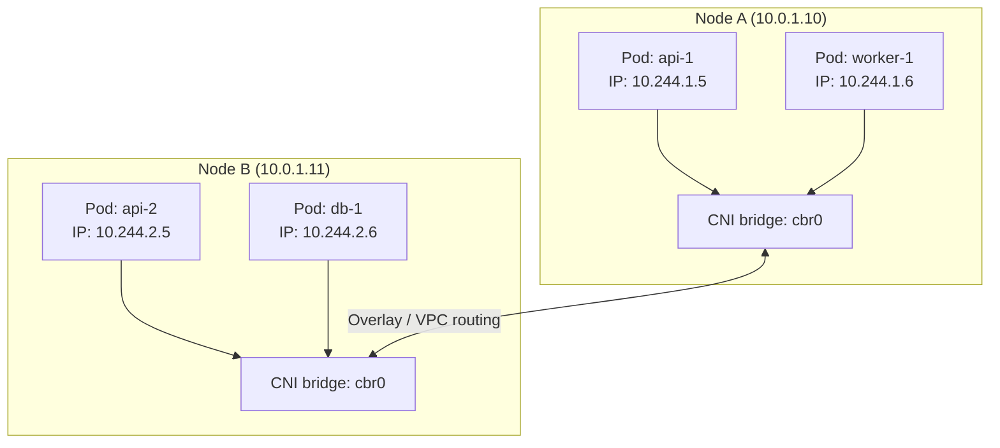
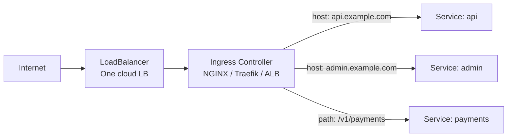

# Networking

Kubernetes networking can feel complex because it solves multiple distinct problems at once: pods need to reach each other, services need stable endpoints, external traffic needs to reach pods, and you need to control which pods can talk to which. Understanding the model makes each piece obvious.

---

## The Cluster Networking Model

Kubernetes mandates a specific networking model with three rules:
1. Every pod gets its own IP address
2. Every pod can communicate with every other pod on any node **without NAT**
3. The IP a pod sees itself as is the same IP other pods use to reach it

This flat network model is implemented by **CNI (Container Network Interface)** plugins:

| CNI Plugin | Best for | Key feature |
|---|---|---|
| **Calico** | Most production clusters | Network policies, BGP routing, eBPF mode |
| **Flannel** | Simple setups, learning | Minimal, easy to operate, no network policies |
| **Cilium** | eBPF-based advanced networking | L7 network policies, observability, high performance |
| **AWS VPC CNI** | EKS | Pods get real VPC IPs — no overlay network |
| **Weave Net** | Multi-cloud, encryption needed | Built-in encryption between nodes |



On EKS with the VPC CNI plugin, each pod gets a real VPC IP from your subnet — no overlay, no encapsulation. This means pods are directly reachable within your VPC, but subnet IP space becomes the scaling limit.

---

## Ingress

Services of type `LoadBalancer` give each service its own load balancer — expensive at scale. **Ingress** provides a single entry point that routes HTTP/HTTPS traffic to multiple services based on host and path rules.



```yaml
apiVersion: networking.k8s.io/v1
kind: Ingress
metadata:
  name: app-ingress
  annotations:
    nginx.ingress.kubernetes.io/rewrite-target: /
    cert-manager.io/cluster-issuer: letsencrypt-prod
spec:
  ingressClassName: nginx
  tls:
    - hosts:
        - api.example.com
      secretName: api-tls-cert
  rules:
    - host: api.example.com
      http:
        paths:
          - path: /
            pathType: Prefix
            backend:
              service:
                name: api-service
                port:
                  number: 80
    - host: admin.example.com
      http:
        paths:
          - path: /
            pathType: Prefix
            backend:
              service:
                name: admin-service
                port:
                  number: 80
```

```bash
# Install NGINX ingress controller on EKS
https://raw.githubusercontent.com/kubernetes/ingress-nginx/main/deploy/static/provider/aws/deploy.yaml
kubectl apply -f deploy.yaml
```

---

## Network Policies

By default, all pods in a cluster can communicate with all other pods. Network Policies restrict this using label selectors and rule sets. They are implemented by the CNI plugin (Calico or Cilium support them; Flannel does not).

### Default-deny pattern

Start with a deny-all policy for a namespace, then explicitly allow what is needed:

```yaml
# Deny all ingress and egress for everything in the payments namespace
apiVersion: networking.k8s.io/v1
kind: NetworkPolicy
metadata:
  name: default-deny-all
  namespace: payments
spec:
  podSelector: {}     # applies to all pods
  policyTypes:
    - Ingress
    - Egress
```

```yaml
# Allow the api pods to receive traffic from the ingress controller
apiVersion: networking.k8s.io/v1
kind: NetworkPolicy
metadata:
  name: allow-ingress-to-api
  namespace: payments
spec:
  podSelector:
    matchLabels:
      app: api
  ingress:
    - from:
        - namespaceSelector:
            matchLabels:
              kubernetes.io/metadata.name: ingress-nginx
      ports:
        - port: 8080
```

```bash
# Debug network policy issues with netshoot
kubectl run netshoot --rm -it --image=nicolaka/netshoot -- /bin/bash
# Inside: curl, nslookup, ping, traceroute all available
```

---

## DNS and Service Discovery

Kubernetes runs **CoreDNS** as a cluster DNS server. Every Service gets a DNS name automatically:

```
<service-name>.<namespace>.svc.cluster.local
```

From a pod in the `payments` namespace:
- `http://api-service` — resolves if in the same namespace
- `http://api-service.payments` — resolves from any namespace  
- `http://api-service.payments.svc.cluster.local` — fully qualified

```bash
# Test DNS from inside a pod
kubectl exec -it api-pod -- nslookup api-service
kubectl exec -it api-pod -- curl http://db-service:5432

# View CoreDNS config
kubectl get configmap coredns -n kube-system -o yaml
```

### Headless services

A headless service (`.spec.clusterIP: None`) has no ClusterIP. DNS returns the individual pod IPs instead of a virtual IP. Used by StatefulSets so clients can connect to specific pods by name (`pod-0.my-service`, `pod-1.my-service`).
