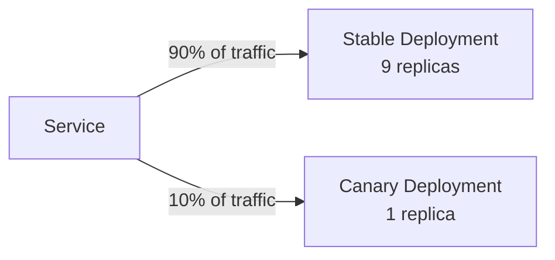

# Production Patterns

Getting to production on Kubernetes is a milestone. Keeping production healthy, secure, and observable is the ongoing work. This page covers the four operational concerns every team running production workloads on Kubernetes faces.

---

## Deployment Strategies

### Rolling update (default)

Kubernetes rolls out a new version by creating new pods and terminating old ones incrementally. The key parameters are `maxSurge` (extra pods created during the rollout) and `maxUnavailable` (how many old pods can be killed before new ones are ready).

```yaml
strategy:
  type: RollingUpdate
  rollingUpdate:
    maxSurge: 1          # create 1 extra pod before killing old ones
    maxUnavailable: 0    # never reduce below desired replicas
```

With `maxUnavailable: 0`, there is always at least the desired number of healthy pods. **Readiness probes are critical here** — Kubernetes will not terminate old pods until the new pod passes its readiness probe.

### Blue-green deployment

Maintain two complete deployments (blue = current, green = new). Switch traffic by updating the Service selector:

```yaml
# During deployment: green is live, blue is idle
apiVersion: v1
kind: Service
metadata:
  name: api-service
spec:
  selector:
    app: api
    version: green     # change to 'blue' to roll back instantly
```

```bash
# Switch traffic to green
kubectl patch service api-service -p '{"spec":{"selector":{"version":"green"}}}'

# Roll back immediately by switching back to blue
kubectl patch service api-service -p '{"spec":{"selector":{"version":"blue"}}}'
```

The trade-off: you need double the resources during the transition.

### Canary deployment

Route a small percentage of traffic to the new version, monitor error rates, then gradually shift more traffic:



In plain Kubernetes, control traffic split by the replica ratio. For fine-grained percentage-based control (without changing replicas), use **Argo Rollouts** or an Ingress controller that supports traffic weighting (NGINX, Istio).

---

## Security Hardening

### Pod Security Standards

Kubernetes 1.23+ enforces Pod Security Standards at the namespace level (replacing the deprecated PodSecurityPolicy):

| Level | Restrictions |
|---|---|
| **Privileged** | No restrictions — avoid in production |
| **Baseline** | Prevents known privilege escalations |
| **Restricted** | Enforces security best practices: non-root, no privilege escalation, seccomp |

```bash
# Label a namespace to enforce restricted policy
kubectl label namespace payments \
  pod-security.kubernetes.io/enforce=restricted \
  pod-security.kubernetes.io/warn=restricted
```

### securityContext best practices

```yaml
spec:
  securityContext:
    runAsNonRoot: true
    runAsUser: 1000
    fsGroup: 2000
    seccompProfile:
      type: RuntimeDefault
  containers:
    - name: api
      securityContext:
        allowPrivilegeEscalation: false
        readOnlyRootFilesystem: true
        capabilities:
          drop: ["ALL"]    # drop all Linux capabilities
```

### Image scanning in CI

```bash
# Scan before pushing (block on HIGH/CRITICAL)
trivy image --exit-code 1 --severity HIGH,CRITICAL myapp:v1.2.3

# Continuous scanning with Trivy Operator (scans all cluster images)
helm install trivy-operator aqua/trivy-operator -n trivy-system
kubectl get vulnerabilityreports -A
```

---

## Observability

### Metrics with Prometheus and Grafana

**kube-prometheus-stack** deploys Prometheus, Grafana, Alertmanager, and kube-state-metrics in one Helm chart:

```bash
helm repo add prometheus-community https://prometheus-community.github.io/helm-charts
helm install monitoring prometheus-community/kube-prometheus-stack \
  -n monitoring --create-namespace

# Access Grafana
kubectl port-forward svc/monitoring-grafana 3000:80 -n monitoring
```

Key dashboards out-of-the-box: node resource usage, pod CPU/memory, Kubernetes API server, deployment rollout status.

For application metrics, expose a `/metrics` endpoint in Prometheus format and add a `ServiceMonitor`:

```yaml
apiVersion: monitoring.coreos.com/v1
kind: ServiceMonitor
metadata:
  name: api-metrics
spec:
  selector:
    matchLabels:
      app: api
  endpoints:
    - port: http
      path: /actuator/prometheus
      interval: 15s
```

### Logs with Loki

```bash
https://grafana.com/docs/loki/latest/setup/install/helm/
helm install loki grafana/loki-stack \
  --set promtail.enabled=true \
  --set grafana.enabled=false   # use existing Grafana
```

Loki collects logs from all pods via Promtail (a DaemonSet). Query logs in Grafana using LogQL alongside your Prometheus metrics for correlated incident investigation.

---

## Debugging: Common Failure Modes

### kubectl debugging cheatsheet

```bash
# Pod not starting
kubectl describe pod <pod-name>          # events section shows the root cause
kubectl logs <pod-name> --previous       # logs from last crash
kubectl get events --sort-by=.metadata.creationTimestamp

# Debug a running pod
kubectl exec -it <pod-name> -- /bin/sh
kubectl port-forward <pod-name> 8080:8080  # access without a Service

# Check resource usage
kubectl top nodes
kubectl top pods -A

# Check API server and controller state
kubectl get componentstatuses
```

### CrashLoopBackOff

The container starts, crashes, restarts, crashes again. Kubernetes backs off exponentially (10s, 20s, 40s... up to 5 minutes).

**Diagnosis:**
```bash
kubectl logs <pod> --previous   # logs from the crashed instance
kubectl describe pod <pod>      # look at Exit Code and Reason
```

**Common causes:** application error on startup, missing environment variable, incorrect entrypoint, OOM kill (exit code 137).

### ImagePullBackOff / ErrImagePull

Kubernetes cannot pull the container image.

**Causes:** image name or tag typo, registry authentication failure, image does not exist.

```bash
kubectl describe pod <pod>   # ImagePull error details are in Events

# For private registries, create an imagePullSecret
kubectl create secret docker-registry ecr-secret \
  --docker-server=123.dkr.ecr.us-east-1.amazonaws.com \
  --docker-username=AWS \
  --docker-password=$(aws ecr get-login-password)
```

### Pending pods (never scheduled)

```bash
kubectl describe pod <pod>   # Events section explains why scheduling failed
```

Common reasons: insufficient CPU or memory on all nodes (scale the cluster), node selector / affinity constraints that no node satisfies, taints without matching tolerations, PVC in a different AZ than available nodes.

### OOMKilled

Container exceeded its memory limit and was killed by the kernel.

```bash
kubectl describe pod <pod>  # shows OOMKilled in container state
# Solution: increase memory limits, or fix the memory leak
```
