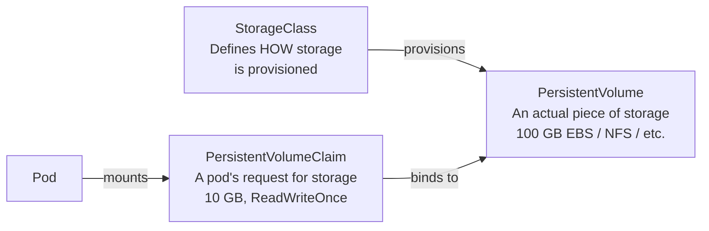

# Storage

Container filesystems are ephemeral. Kubernetes storage abstractions decouple the lifecycle of storage from the lifecycle of pods, enabling data to persist across pod restarts, node failures, and rolling deployments.

---

## PersistentVolumes, PVCs, and StorageClasses

Kubernetes storage uses a three-layer abstraction:



**PersistentVolume (PV)** — a piece of storage in the cluster, provisioned by an admin or dynamically by a StorageClass. It has a lifecycle independent of any pod.

**PersistentVolumeClaim (PVC)** — a request for storage by a user. Specifies size and access mode. Kubernetes binds it to a matching PV.

**StorageClass** — defines a "class" of storage with a provisioner, parameters, and reclaim policy. Enables **dynamic provisioning** — PVs are created automatically when a PVC is submitted.

### Access modes

| Mode | Abbreviation | Meaning |
|---|---|---|
| `ReadWriteOnce` | RWO | Mounted read-write by a single node |
| `ReadOnlyMany` | ROX | Mounted read-only by many nodes |
| `ReadWriteMany` | RWX | Mounted read-write by many nodes (requires NFS or EFS) |

### Dynamic provisioning with StorageClass

```yaml
# StorageClass for AWS EBS gp3
apiVersion: storage.k8s.io/v1
kind: StorageClass
metadata:
  name: gp3
provisioner: ebs.csi.aws.com
parameters:
  type: gp3
  encrypted: "true"
reclaimPolicy: Retain        # Delete or Retain when PVC is deleted
volumeBindingMode: WaitForFirstConsumer  # wait until pod is scheduled to pick AZ
allowVolumeExpansion: true
```

```yaml
# PVC that triggers dynamic provisioning
apiVersion: v1
kind: PersistentVolumeClaim
metadata:
  name: postgres-data
spec:
  storageClassName: gp3
  accessModes:
    - ReadWriteOnce
  resources:
    requests:
      storage: 100Gi
```

```yaml
# Mount the PVC in a pod
spec:
  containers:
    - name: postgres
      image: postgres:16
      volumeMounts:
        - name: data
          mountPath: /var/lib/postgresql/data
  volumes:
    - name: data
      persistentVolumeClaim:
        claimName: postgres-data
```

### Reclaim policies

| Policy | What happens when PVC is deleted |
|---|---|
| `Delete` | PV and underlying storage (EBS volume) are deleted |
| `Retain` | PV is kept; data survives; must be manually reclaimed |
| `Recycle` | Deprecated; basic scrub then make available again |

> **Use `Retain` for production databases**. `Delete` is convenient but means a `kubectl delete pvc` destroys your data instantly. `Retain` gives you a recovery window.

---

## StatefulSets with Storage

StatefulSets use `volumeClaimTemplates` to automatically create a dedicated PVC for each pod. Pod `pod-0` gets `data-pod-0`, `pod-1` gets `data-pod-1`.

```yaml
apiVersion: apps/v1
kind: StatefulSet
metadata:
  name: postgres
spec:
  serviceName: postgres-headless   # required: headless service for DNS
  replicas: 3
  selector:
    matchLabels:
      app: postgres
  template:
    metadata:
      labels:
        app: postgres
    spec:
      containers:
        - name: postgres
          image: postgres:16
          env:
            - name: POSTGRES_PASSWORD
              valueFrom:
                secretKeyRef:
                  name: postgres-secret
                  key: password
          volumeMounts:
            - name: data
              mountPath: /var/lib/postgresql/data
  volumeClaimTemplates:
    - metadata:
        name: data
      spec:
        storageClassName: gp3
        accessModes: [ReadWriteOnce]
        resources:
          requests:
            storage: 100Gi
```

### What StatefulSet guarantees you get

- `postgres-0` is always the first to start and last to stop
- `postgres-0.postgres-headless.default.svc.cluster.local` is always the same pod
- If `postgres-0` dies, it comes back as `postgres-0` with the same `data-postgres-0` volume
- Scale down removes the highest-numbered pod first (`postgres-2` before `postgres-1`)

```bash
# Check PVC status
kubectl get pvc

# Expand a PVC (StorageClass must support allowVolumeExpansion)
kubectl patch pvc postgres-data -p '{"spec":{"resources":{"requests":{"storage":"200Gi"}}}}'
```
