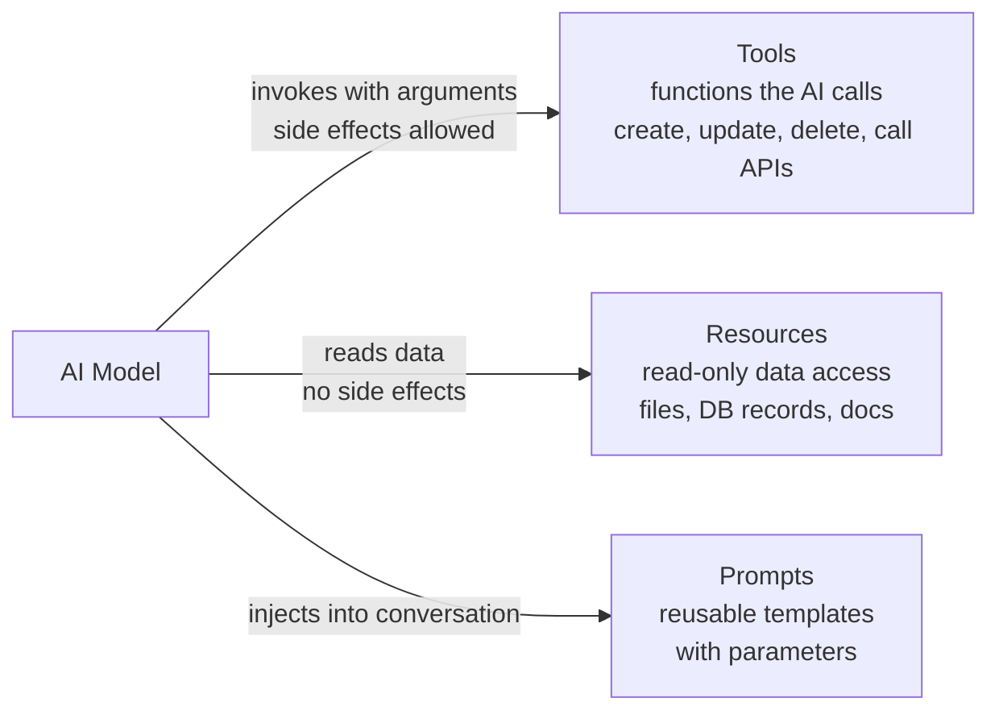
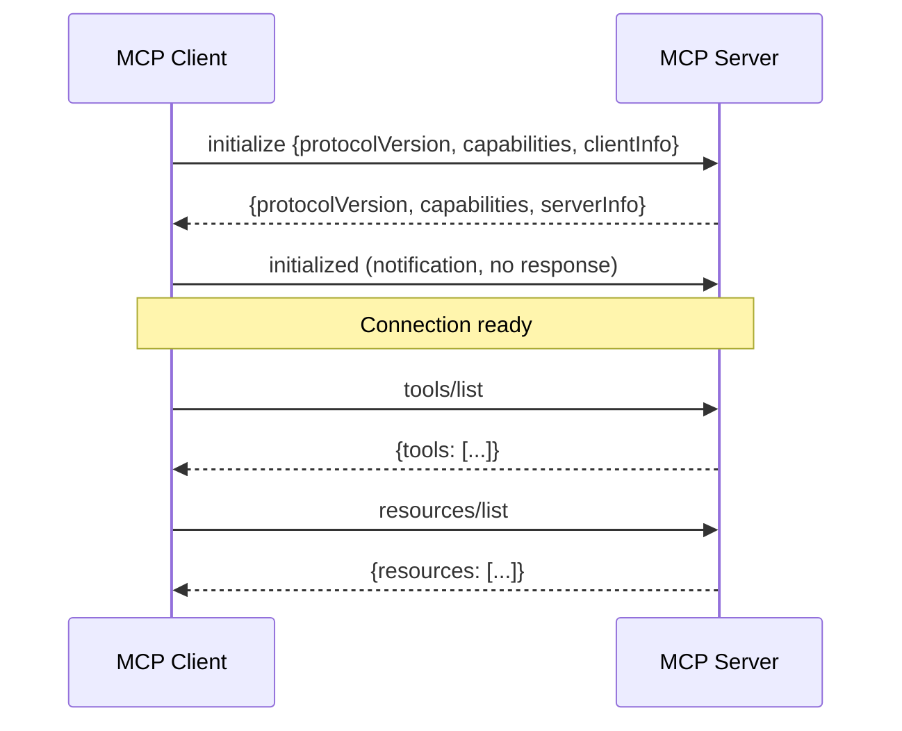
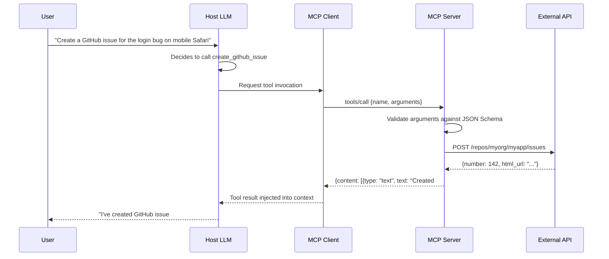

# Core Concepts

MCP is built on three primitives — Tools, Resources, and Prompts — and a JSON-RPC 2.0 wire protocol. Understanding these precisely is the foundation for building servers that are correct, secure, and work well across all MCP hosts.

---

## The Three Primitives



---

## Tools

Tools are **functions the AI can call**. They can have side effects. The AI decides when to call a tool based on the conversation context and the tool's description. You define the input schema; the server implements the logic.

Think of Tools as POST endpoints: they take structured input, do work, and return content.

```typescript
// Tool definition object
{
  name: "create_github_issue",
  description:
    "Creates a new GitHub issue. Use when the user wants to report a bug, " +
    "request a feature, or track a task in a repository. " +
    "Always confirm the repository and title before calling. " +
    "Returns the created issue URL and number.",
  inputSchema: {
    type: "object",
    properties: {
      repo: {
        type: "string",
        description: "Repository in 'owner/repo' format, e.g. 'myorg/myapp'"
      },
      title: {
        type: "string",
        description: "Short, descriptive issue title"
      },
      body: {
        type: "string",
        description: "Issue description in GitHub-flavored Markdown"
      },
      labels: {
        type: "array",
        items: { type: "string" },
        description: "Optional list of label names to apply"
      }
    },
    required: ["repo", "title"]
  }
}
```

### Writing effective tool descriptions

The description is read by the LLM to decide whether to call the tool. It is the single most important part of your server design. Be specific:

```typescript
// BAD — vague, the AI doesn't know when to use this
{ name: "query", description: "Queries the database" }

// GOOD — specific, includes what it returns, what it doesn't do
{
  name: "search_orders",
  description:
    "Search the orders database by customer, status, date range, or amount. " +
    "Returns order IDs, status, total, and creation date. " +
    "Use for questions about order history, revenue, or delivery status. " +
    "Does NOT modify any data. Use create_order to place new orders."
}
```

---

## Resources

Resources are **read-only data** the AI can access on demand. They have URIs that uniquely identify them. Think of Resources as GET endpoints: they return data without side effects.

```typescript
// Static resource — fixed URI, same content each request
{
  uri: "file:///project/README.md",
  name: "Project README",
  description: "Main project documentation and getting started guide",
  mimeType: "text/markdown"
}

// Dynamic resource template — parameterized URI
{
  uriTemplate: "postgres://orders/{orderId}",
  name: "Order Record",
  description: "Retrieve a single order from the database by ID",
  mimeType: "application/json"
}
```

### Resource content types

```typescript
// Text resource (the most common)
{
  uri: "file:///docs/api.md",
  contents: [{
    type: "text",
    text: "# API Reference\n\n## POST /orders\n..."
  }]
}

// Binary resource (images, PDFs, etc.)
{
  uri: "file:///assets/diagram.png",
  contents: [{
    type: "blob",
    blob: "<base64-encoded-data>",
    mimeType: "image/png"
  }]
}
```

### Resource subscriptions

Servers that declare `resources.subscribe: true` can push updates to the client when a resource changes, enabling real-time data refresh without polling.

---

## Prompts

Prompts are **reusable, parameterised templates** that the host can surface to users. They help standardise common workflows across a team or project. Unlike Tools (AI-invoked) and Resources (AI-read), Prompts are typically user-invoked via the host's UI.

```typescript
{
  name: "code_review",
  description:
    "Generate a thorough code review covering security, performance, " +
    "correctness, and style",
  arguments: [
    {
      name: "language",
      description: "Programming language (typescript, python, java, go, etc.)",
      required: true
    },
    {
      name: "focus",
      description: "Focus area: 'security', 'performance', 'style', or 'all'",
      required: false
    }
  ]
}
```

When a user invokes `code_review` with `language=typescript, focus=security`, the server generates a fully-formed prompt message (with context, instructions, and any relevant resource content) that the host injects into the conversation.

---

## Protocol: JSON-RPC 2.0

All MCP communication uses JSON-RPC 2.0 messages, newline-delimited on stdio or as SSE events on HTTP.

### The handshake



### Message format

```json
// Request: client asks server to call a tool
{
  "jsonrpc": "2.0",
  "id": 42,
  "method": "tools/call",
  "params": {
    "name": "create_github_issue",
    "arguments": {
      "repo": "myorg/myapp",
      "title": "Login broken on mobile Safari",
      "body": "## Steps to reproduce\n1. Open on iPhone...\n",
      "labels": ["bug", "mobile"]
    }
  }
}

// Success response
{
  "jsonrpc": "2.0",
  "id": 42,
  "result": {
    "content": [
      {
        "type": "text",
        "text": "Created issue #142: https://github.com/myorg/myapp/issues/142"
      }
    ],
    "isError": false
  }
}

// Error response
{
  "jsonrpc": "2.0",
  "id": 42,
  "error": {
    "code": -32602,
    "message": "Invalid params",
    "data": { "field": "repo", "reason": "Repository 'myorg/myapp' not found or no access" }
  }
}
```

### Notification (no response expected)

```json
{
  "jsonrpc": "2.0",
  "method": "notifications/tools/list_changed"
  // no "id" field — this is a notification, not a request
}
```

---

## Capability Negotiation

During the `initialize` handshake, both sides declare what they support:

```json
// Client capabilities sent in initialize
{
  "capabilities": {
    "sampling": {},
    "roots": { "listChanged": true }
  }
}

// Server capabilities returned in initialize response
{
  "capabilities": {
    "tools":     { "listChanged": true },
    "resources": { "subscribe": true, "listChanged": true },
    "prompts":   { "listChanged": true },
    "logging":   {}
  },
  "serverInfo": {
    "name": "my-database-server",
    "version": "1.2.0"
  }
}
```

Servers only implement the capabilities they declare. Clients ignore capabilities they don't understand. This allows the protocol to evolve without breaking existing implementations.

---

## Sampling

Sampling is an **advanced capability** where an MCP server asks the host to run LLM inference on its behalf. This enables servers to use AI to classify, summarise, or transform data before returning results to the main conversation.

```json
// Server requests LLM inference from the host
{
  "method": "sampling/createMessage",
  "params": {
    "messages": [
      {
        "role": "user",
        "content": {
          "type": "text",
          "text": "Summarise this query result in one sentence for a non-technical user: {rows}"
        }
      }
    ],
    "maxTokens": 150,
    "systemPrompt": "You are a helpful data analyst. Be concise and clear."
  }
}
```

> **Human-in-the-loop by design.** Hosts MUST show users what is being sent to the LLM and get approval before completing a sampling request. This is a core protocol requirement, not an optional courtesy. It prevents MCP servers from silently exfiltrating context through AI inference.

---

## Roots

Roots are workspace-scope indicators the host sends to the server. A root tells the server which directories or URIs the user has in scope:

```json
{
  "roots": [
    { "uri": "file:///home/alice/projects/my-app", "name": "my-app" },
    { "uri": "file:///home/alice/projects/shared-lib", "name": "shared-lib" }
  ]
}
```

A well-behaved file system server uses roots to restrict operations to the declared scope, preventing access to files outside the user's workspace.

---

## Complete Tool Call Lifecycle


