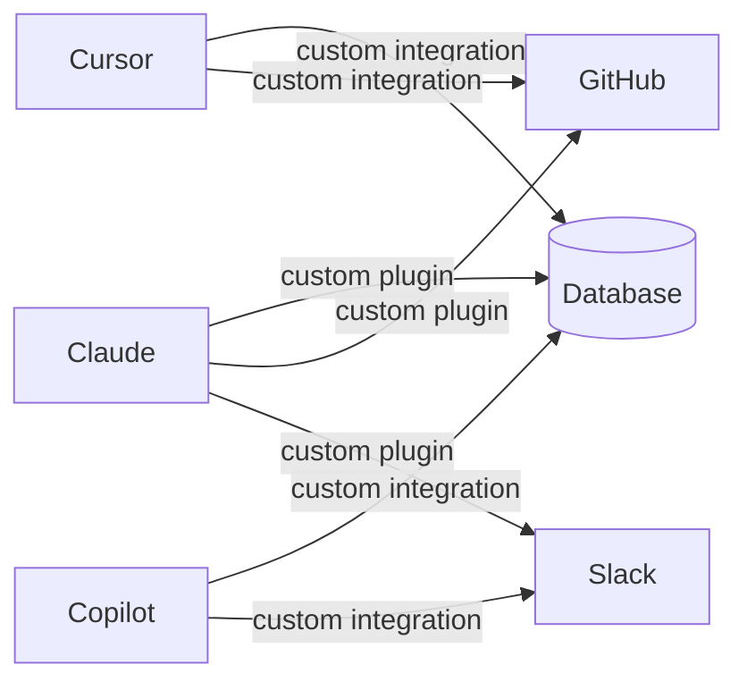
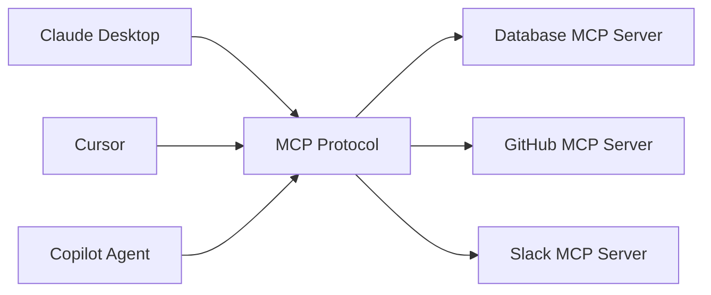
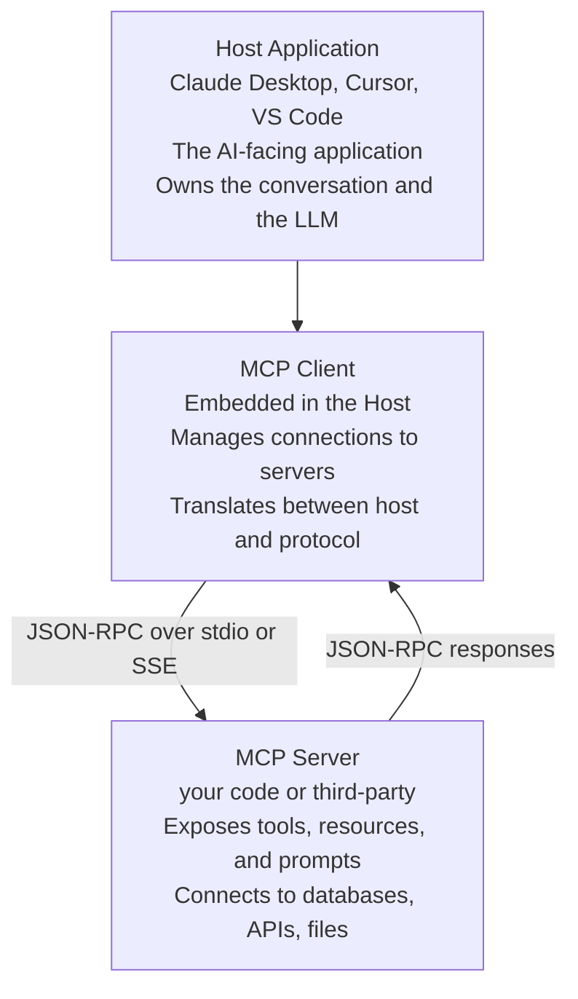

# Fundamentals

Model Context Protocol (MCP) is an open standard published by Anthropic in November 2024 that defines how AI assistants connect to external data sources, tools, and services. Before MCP, every AI tool had its own proprietary way of integrating with the world — custom plugins, bespoke APIs, vendor-specific formats. MCP ended that fragmentation by giving the ecosystem a shared language.

If you have ever used a Language Server Protocol (LSP) extension in VS Code, you understand the pattern. LSP standardised how editors talk to language intelligence servers. One server works in any LSP-compatible editor. MCP does the same for AI and data: build one MCP server and it works in Claude Desktop, Cursor, GitHub Copilot, Zed, and any future MCP host.

---

## The Problem: N × M Integrations

Before MCP, connecting AI to data looked like this:



N AI tools × M data sources = N×M custom integrations. Each is built and maintained independently. When a data source changes its API, every AI tool breaks. When a new AI tool launches, it must re-implement every integration from scratch.

---

## MCP's Solution: N + M Integrations



N AI tools + M MCP servers = N + M integrations. Build one MCP server for your database and every MCP-compatible AI tool can use it immediately. This is the same economics that made LSP, HTTP, and USB successful: a single standard creates a network effect where every participant benefits from every other participant's work.

---

## The Three-Layer Architecture

MCP has three roles:



**Host** — the application the user interacts with. It holds the conversation context, calls the LLM, and decides when to invoke MCP capabilities. Examples: Claude Desktop, Cursor, VS Code with Copilot agent mode.

**MCP Client** — a component embedded inside the host that manages connections to MCP servers. It speaks the MCP wire protocol. Most users never see this layer directly.

**MCP Server** — a process you build and run. It exposes capabilities (tools, resources, prompts) to any host that connects. **This is what you write when you "build an MCP server."**

---

## Transport Protocols

### stdio (Standard I/O) — local processes

The client spawns the server as a child process and communicates over stdin/stdout. JSON-RPC messages are newline-delimited on stdin/stdout.

```
Host process                      Server process
        |--- JSON-RPC on stdin ------->|
        |<-- JSON-RPC on stdout --------|
```

- **Use case:** local developer tools, servers accessing local files or databases
- **Deployment:** the user installs and runs the server locally; the host spawns it
- **Credentials:** passed via environment variables
- **Security:** inherits the user's environment; no network exposure

### HTTP + SSE (Server-Sent Events) — remote servers

The client connects to an HTTP endpoint. The server pushes messages via SSE; the client sends messages via HTTP POST.

```
Client                            HTTP Server
  |--- GET /sse (keep-alive) ----->|
  |<-- SSE: notification ----------|
  |--- POST /messages ------------>|
  |<-- 200 OK or SSE response -----|
```

- **Use case:** shared team servers, cloud-hosted integrations, multi-user deployments
- **Deployment:** runs on a remote host; clients connect by URL
- **Auth:** bearer tokens, API keys, OAuth

| | stdio | HTTP + SSE |
|---|---|---|
| **Server location** | Local machine | Any URL |
| **Spawning** | Host spawns the process | Server runs independently |
| **Sharing** | Single user | Multiple users |
| **Auth** | Environment variables | Bearer tokens / OAuth |
| **Best for** | Developer tools, local data | Team servers, SaaS integrations |

---

## The MCP Ecosystem (2025)

Since its November 2024 launch, MCP adoption has been rapid:

| Host / Tool | MCP Support |
|---|---|
| **Claude Desktop** | Native, built-in |
| **Cursor** | Built-in (workspace + global) |
| **VS Code + GitHub Copilot** | Agent mode |
| **Zed** | Built-in |
| **Continue** | Plugin |
| **Windsurf** | Built-in |
| **JetBrains AI** | Available |

Anthropic maintains a registry of community servers at [modelcontextprotocol.io](https://modelcontextprotocol.io). Notable community servers include integrations for GitHub, GitLab, Slack, PostgreSQL, SQLite, Google Drive, AWS, Brave Search, and dozens more.

---

## MCP vs Raw Function Calling

LLMs already support custom function calling (tool use) without MCP. So why does MCP matter?

| | Raw Function Calling | MCP |
|---|---|---|
| **Portability** | Tool definitions tied to one LLM API | Works across any MCP host |
| **Discovery** | Tools hardcoded at prompt time | Server advertises at runtime |
| **Lifecycle** | No server management | Full server startup/shutdown |
| **Resource model** | No concept of readable data | Resources are a first-class primitive |
| **Reusability** | Rewrite for each AI tool | Build once, use everywhere |
| **Ecosystem** | No shared registry | Growing community of open servers |

Raw function calling is correct for app-specific tools tightly coupled to one product. MCP is the right choice when you want a tool integration to work across the entire AI ecosystem today and in the future.

---

## When to Build an MCP Server

Build an MCP server when you want AI assistants to:
- Query your PostgreSQL or MongoDB database in natural language
- Read, search, and write files in a project directory
- Create GitHub issues, review PRs, check CI status
- Post to Slack, read messages, manage channels
- Call your internal REST APIs with business logic
- Monitor infrastructure, parse logs, read metrics
- Manage any system that has an API or a filesystem representation

If you can write a script that does something useful, you can wrap it in an MCP server and give every AI tool in your environment instant, standardised access to it.
