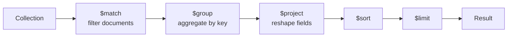

# Aggregation

The aggregation pipeline processes documents through a sequence of stages. Each stage transforms the data and passes results to the next. It is MongoDB's answer to SQL's GROUP BY, JOIN, HAVING, and window functions — all in one composable framework.

---

## Pipeline Concept



---

## Core Stages

```javascript
db.collection('orders').aggregate([

  // $match — filter (always put early to reduce pipeline input)
  { $match: { status: 'confirmed', createdAt: { $gte: new Date('2026-01-01') } } },

  // $group — aggregate by key
  { $group: {
    _id: '$customerId',                      // group by customerId
    orderCount:   { $sum: 1 },
    totalRevenue: { $sum: '$total' },
    avgOrderValue: { $avg: '$total' },
    maxOrder:     { $max: '$total' },
    firstOrder:   { $min: '$createdAt' },
    allStatuses:  { $addToSet: '$status' }   // unique array
  }},

  // $project — include/exclude/transform fields
  { $project: {
    customerId: '$_id',
    _id: 0,
    orderCount: 1,
    totalRevenue: { $round: ['$totalRevenue', 2] },
    avgOrderValue: { $round: ['$avgOrderValue', 2] },
    isHighValue: { $gt: ['$totalRevenue', 1000] }  // computed boolean
  }},

  // $sort
  { $sort: { totalRevenue: -1 } },

  // $limit
  { $limit: 10 }
])
```

---

## `$lookup` — Join Collections

```javascript
// Get orders with full customer info (left outer join)
db.collection('orders').aggregate([
  { $match: { status: 'confirmed' } },

  // Simple lookup
  { $lookup: {
    from:         'customers',
    localField:   'customerId',
    foreignField: '_id',
    as:           'customer'
  }},

  // $lookup returns an array; $unwind flattens to single object
  { $unwind: { path: '$customer', preserveNullAndEmpty: true } },

  { $project: {
    orderId: '$_id',
    status: 1,
    total: 1,
    'customer.email': 1,
    'customer.name': 1
  }}
])

// Advanced lookup with pipeline (sub-pipeline with conditions)
db.collection('orders').aggregate([
  { $lookup: {
    from: 'products',
    let: { itemIds: '$items.productId' },
    pipeline: [
      { $match: { $expr: { $in: ['$_id', '$$itemIds'] } } },
      { $project: { name: 1, price: 1 } }
    ],
    as: 'productDetails'
  }}
])
```

---

## `$unwind` — Deconstruct Arrays

```javascript
// Explode items array — one document per item
db.collection('orders').aggregate([
  { $unwind: '$items' },
  { $group: {
    _id: '$items.productId',
    totalQuantitySold: { $sum: '$items.quantity' },
    totalRevenue: {
      $sum: { $multiply: ['$items.quantity', '$items.unitPrice'] }
    }
  }},
  { $sort: { totalRevenue: -1 } },
  { $limit: 10 }
])
// Result: top 10 products by revenue
```

---

## `$facet` — Multi-Faceted Results

`$facet` runs multiple sub-pipelines on the same input in one query — perfect for search pages with filters and counts:

```javascript
db.collection('products').aggregate([
  { $match: { $text: { $search: 'wireless' } } },

  { $facet: {
    // Facet 1: paginated results
    results: [
      { $sort: { score: { $meta: 'textScore' }, _id: 1 } },
      { $skip: 0 },
      { $limit: 20 }
    ],
    // Facet 2: total count
    totalCount: [
      { $count: 'count' }
    ],
    // Facet 3: category breakdown
    byCategory: [
      { $group: { _id: '$category', count: { $sum: 1 } } },
      { $sort: { count: -1 } }
    ],
    // Facet 4: price histogram
    priceRanges: [
      { $bucket: {
        groupBy: '$price',
        boundaries: [0, 25, 50, 100, 250, 500],
        default: '500+'
      }}
    ]
  }}
])
```

---

## Date Operations

```javascript
db.collection('orders').aggregate([
  { $match: { createdAt: { $gte: new Date('2026-01-01') } } },
  { $group: {
    _id: {
      year:  { $year: '$createdAt' },
      month: { $month: '$createdAt' },
      week:  { $isoWeek: '$createdAt' }
    },
    orders: { $sum: 1 },
    revenue: { $sum: '$total' }
  }},
  { $sort: { '_id.year': 1, '_id.month': 1 } }
])
```

---

## Pipeline Optimisation

```javascript
// ALWAYS put $match early to reduce documents in pipeline
// ALWAYS put $project early to reduce document size

// Use $explain to understand execution
db.collection('orders').explain('executionStats').aggregate([
  { $match: { status: 'confirmed' } },
  { $group: { _id: '$customerId', total: { $sum: '$total' } } }
])

// Index hint for aggregation
db.collection('orders').aggregate(
  [{ $match: { status: 'confirmed' } }],
  { hint: { status: 1, createdAt: -1 } }
)
```

| Tip | Why |
|---|---|
| `$match` before `$group` | Reduces number of documents to aggregate |
| `$project` early | Reduces document size carried through pipeline |
| Use covered indexes | If `$match` fields are indexed, no document fetch needed |
| Avoid `$unwind` then `$group` when possible | Can often use `$reduce` or `$map` instead |
