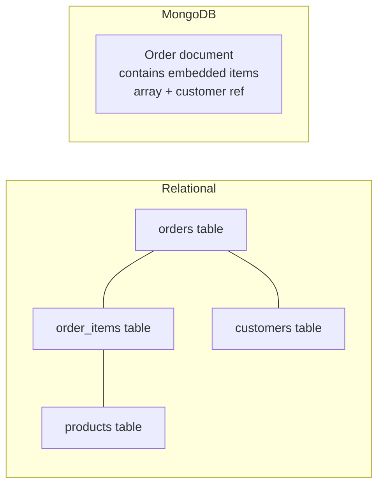

# Fundamentals

MongoDB stores data as BSON documents — JSON-like objects that can have nested documents and arrays. There are no tables, no rows, no fixed schema, no JOINs at the storage layer. This model fits naturally with how application objects are structured in code, eliminating the "impedance mismatch" between objects and relational tables.

---

## Document Model vs Relational



```json
{
  "_id": "order-uuid-123",
  "customerId": "cust-456",
  "status": "confirmed",
  "total": 149.99,
  "items": [
    {
      "productId": "prod-789",
      "productName": "Wireless Headphones",
      "quantity": 2,
      "unitPrice": 74.99
    }
  ],
  "shippingAddress": {
    "street": "123 Main St",
    "city": "New York",
    "zip": "10001"
  },
  "createdAt": { "$date": "2026-06-20T10:00:00Z" }
}
```

The entire order, its items, and the shipping address live in one document. Fetching an order requires a single database read — no JOINs.

---

## BSON Data Types

| Type | Example | Notes |
|---|---|---|
| `String` | `"Alice"` | UTF-8 |
| `Int32` / `Int64` | `42`, `NumberLong(9999999999)` | Default number is `Double` in JS |
| `Double` | `3.14` | Never use for money |
| `Decimal128` | `NumberDecimal("149.99")` | Exact decimal — use for money |
| `Boolean` | `true` / `false` | |
| `Date` | `ISODate("2026-06-20")` | Always store in UTC |
| `ObjectId` | `ObjectId("6679ab...")` | 12-byte default _id: 4-byte ts + 5-byte random + 3-byte counter |
| `Array` | `["tag1", "tag2"]` | Any mixed types allowed |
| `Object` | `{ city: "NY" }` | Embedded sub-document |
| `Null` | `null` | |
| `Binary` | `BinData(0, "...")` | Files, UUIDs |

---

## When to Choose MongoDB

**MongoDB fits well when:**
- Data is naturally hierarchical or document-shaped (orders with items, blog posts with comments, user profiles with preferences)
- Schema evolves rapidly — adding fields to documents requires no migrations
- You need flexible, semi-structured data per entity (product attributes vary by category)
- High-write throughput with horizontal sharding is a requirement
- You need geospatial queries, full-text search, or graph-adjacent operations

**SQL is the better choice when:**
- Data is highly relational with many cross-entity joins
- You need multi-document ACID transactions as the primary consistency model
- Reporting, analytics, and ad-hoc aggregate queries dominate the workload
- Your team is more SQL-proficient and operational tooling matters
- Strict schema enforcement is required (financial, compliance)

---

## mongosh Basics

```javascript
// Connect
mongosh "mongodb://localhost:27017/orders"

// Switch database
use orders

// List collections
show collections

// Insert
db.orders.insertOne({ status: 'pending', total: 49.99 })

// Find all
db.orders.find()
db.orders.find({ status: 'confirmed' }).pretty()

// Find one
db.orders.findOne({ _id: ObjectId('...')})

// Count
db.orders.countDocuments({ status: 'pending' })

// Index inspection
db.orders.getIndexes()
db.orders.explain('executionStats').find({ customerId: 'cust-123' })
```

---

## Index Overview

```javascript
// Single field index
db.orders.createIndex({ customerId: 1 });           // 1 = ascending, -1 = descending

// Compound index
db.orders.createIndex({ status: 1, createdAt: -1 }); // status equality + date sort

// Unique index
db.customers.createIndex({ email: 1 }, { unique: true });

// TTL index — auto-delete documents after N seconds
db.sessions.createIndex({ createdAt: 1 }, { expireAfterSeconds: 86400 }); // 24h

// Text index for full-text search
db.products.createIndex({ name: 'text', description: 'text' });
db.products.find({ $text: { $search: 'wireless headphones' } });

// Partial index — only index documents matching a filter
db.orders.createIndex(
    { createdAt: 1 },
    { partialFilterExpression: { status: 'pending' } }
);
```
