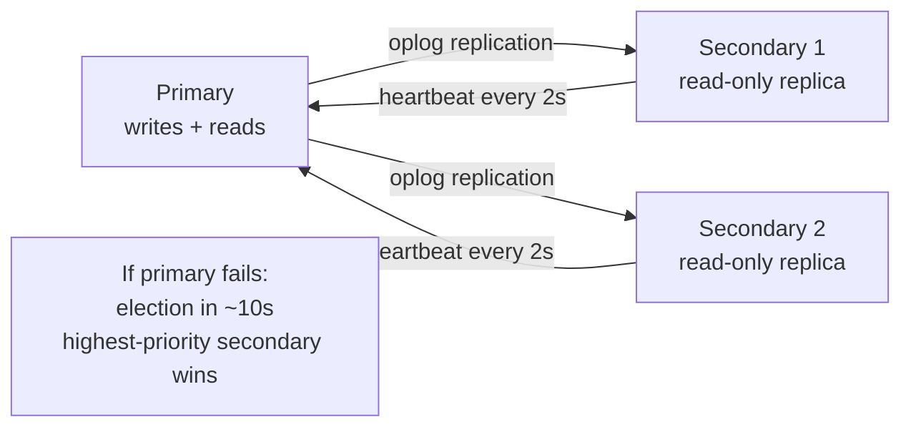

# Production Patterns

Running MongoDB in production involves more than CRUD operations. This page covers transactions for multi-document consistency, replica sets for high availability, read preferences for scaling, change streams for real-time integrations, and what Atlas adds on top.

---

## Multi-Document Transactions

Since MongoDB 4.0, ACID transactions span multiple documents and collections. Use them sparingly — single-document operations are atomic by default and much cheaper.

```javascript
const session = client.startSession();

try {
  await session.withTransaction(async () => {
    // All operations in this callback share the same transaction
    const product = await db.collection('products').findOneAndUpdate(
      { _id: productId, stock: { $gte: quantity } },
      { $inc: { stock: -quantity } },
      { session, returnDocument: 'after' }
    );

    if (!product) throw new Error('Insufficient stock');

    await db.collection('orders').insertOne({
      customerId,
      productId,
      quantity,
      status: 'confirmed',
      createdAt: new Date()
    }, { session });

    await db.collection('audit_log').insertOne({
      action: 'order_placed',
      productId,
      quantity,
      at: new Date()
    }, { session });
    // Commit happens automatically on success
    // Rollback happens automatically on any error
  });
} finally {
  await session.endSession();
}
```

> **When to use transactions:** only when you absolutely need atomicity across multiple documents that cannot be restructured as a single document. Transactions have overhead (two-phase commit protocol). Design your schema to avoid needing them.

---

## Replica Sets

A replica set is a group of MongoDB instances maintaining the same data. One node is the primary (handles writes); others are secondaries (replicate from primary, can serve reads).



### Read preferences

```javascript
// Connect with read preference
const client = new MongoClient(uri, {
  readPreference: 'secondaryPreferred'  // read from secondary if available
});

// Per-operation read preference
const orders = await db.collection('orders')
  .find({ status: 'confirmed' })
  .withReadPreference('secondary')  // offload analytics to secondary
  .toArray();
```

| Read Preference | Routes to | Use when |
|---|---|---|
| `primary` (default) | Primary only | Strict consistency required |
| `primaryPreferred` | Primary; secondary if primary unavailable | High availability for reads |
| `secondary` | Secondaries only | Analytics, reports (accepts replication lag) |
| `secondaryPreferred` | Secondary; primary if no secondary | Read scaling |
| `nearest` | Lowest latency node | Geographically distributed deployments |

---

## Change Streams

Change streams provide a real-time stream of data changes. Built on the replica set oplog, they support resumption after reconnect:

```javascript
// Watch all changes to the orders collection
const changeStream = db.collection('orders').watch(
  [
    { $match: { 'fullDocument.status': 'confirmed' } }  // filter pipeline
  ],
  { fullDocument: 'updateLookup' }  // include full document on updates
);

changeStream.on('change', async (change) => {
  const { operationType, fullDocument, documentKey } = change;

  switch (operationType) {
    case 'insert':
      await notificationService.sendOrderConfirmation(fullDocument);
      break;
    case 'update':
      await searchIndex.update(fullDocument);
      break;
    case 'delete':
      await searchIndex.remove(documentKey._id);
      break;
  }

  // Save resume token to restart from this point after a restart
  await saveResumeToken(change._id);
});

// Resume after restart
const resumeToken = await loadResumeToken();
const resumedStream = db.collection('orders').watch([], {
  resumeAfter: resumeToken
});
```

---

## Atlas Essentials

MongoDB Atlas is the fully managed cloud service. Beyond hosting, it adds:

**Atlas Search** — Lucene-based full-text search directly on your collection:

```javascript
db.collection('products').aggregate([
  { $search: {
    index: 'products_search',
    text: {
      query: 'wireless bluetooth headphones',
      path: ['name', 'description'],
      fuzzy: { maxEdits: 1 }   // typo tolerance
    }
  }},
  { $project: { name: 1, price: 1, score: { $meta: 'searchScore' } } },
  { $sort: { score: -1 } },
  { $limit: 10 }
])
```

**Atlas App Services** — serverless functions, triggers (run code on DB changes), and GraphQL API.

**Atlas Performance Advisor** — automatically suggests indexes based on slow query patterns.

**Atlas Online Archive** — automatically tiers old data to S3-backed cold storage while keeping it queryable.

| Atlas tier | Monthly cost | Best for |
|---|---|---|
| M0 (Free) | $0 | Development, learning |
| M10 | ~$57 | Small production workloads |
| M30 | ~$230 | Mid-size production |
| Serverless | Per operation | Highly variable traffic |
