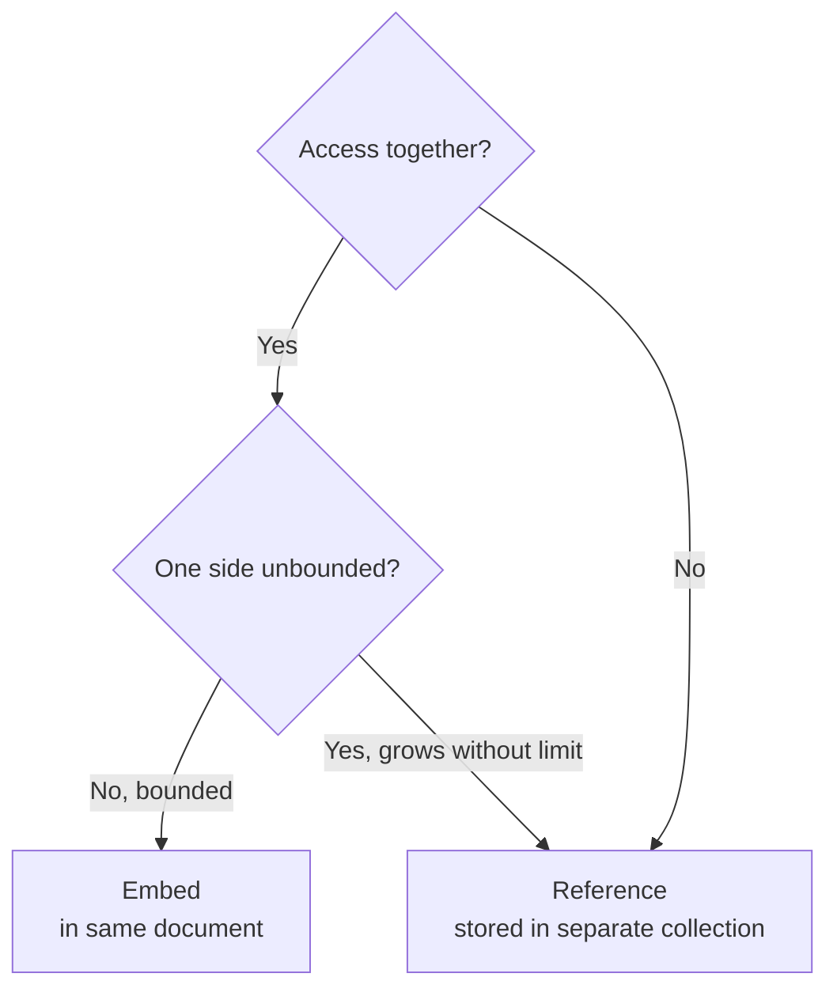

# Schema Design

MongoDB's flexible schema is a feature, not an invitation to store everything without structure. The biggest driver of MongoDB performance is schema design — specifically the embedding vs referencing decision. Get it right and queries are fast single-document reads. Get it wrong and you are emulating a relational database badly.

---

## The Core Decision: Embed or Reference?



| Embed when | Reference when |
|---|---|
| Data is always accessed with the parent | Data is sometimes accessed independently |
| One-to-few relationship (order items) | One-to-many or many-to-many |
| Data rarely changes | Frequently updated independently |
| Sub-document does not need its own identity | Sub-document needs its own lifecycle |

### Example: Order items are embedded (correct)

```json
// Good: items always loaded with the order
{
  "_id": "order-123",
  "items": [
    { "productId": "prod-1", "quantity": 2, "unitPrice": 29.99 }
  ]
}
```

### Example: Products are referenced (correct)

```json
// Good: products exist independently, have their own lifecycle
{
  "_id": "order-123",
  "items": [
    { "productId": "prod-1", "quantity": 2 }  // just the ref + quantity
  ]
}
// Products collection has full product documents
```

---

## Schema Design Patterns

### Bucket Pattern — time-series data

Instead of one document per event (millions of tiny documents), group events into time buckets:

```json
// WITHOUT bucket: one document per temperature reading
{ "sensorId": "s-1", "value": 22.5, "timestamp": "2026-06-20T10:00:00Z" }
{ "sensorId": "s-1", "value": 22.8, "timestamp": "2026-06-20T10:01:00Z" }
// ... 1440 documents per sensor per day

// WITH bucket: one document per hour bucket
{
  "sensorId": "s-1",
  "hour": "2026-06-20T10:00:00Z",
  "count": 60,
  "sum": 1356.0,
  "min": 22.3,
  "max": 23.1,
  "readings": [22.5, 22.8, 22.6, ...]
  // 60 readings per document instead of 60 documents
}
```

Benefits: fewer documents, faster range queries, pre-computed aggregates (sum, min, max).

### Computed Pattern — pre-calculate expensive values

```javascript
// Instead of summing order items on every read:
// Maintain total in the parent document, update on writes

// On item add:
db.orders.updateOne(
  { _id: orderId },
  {
    $push: { items: newItem },
    $inc:  { total: newItem.quantity * newItem.unitPrice }
  }
);

// Reads are instant: total is pre-computed
db.orders.findOne({ _id: orderId }, { total: 1 })
```

### Extended Reference Pattern — include a small snapshot

Avoids lookups by embedding frequently-needed fields from referenced documents:

```json
// Instead of referencing only the customerId and doing a separate lookup:
{
  "_id": "order-123",
  "customer": {
    "_id": "cust-456",
    "name": "Alice Chen",       // snapshot at time of order
    "email": "alice@example.com"  // useful for order history without join
  },
  "items": [
    {
      "productId": "prod-789",
      "productName": "Widget",   // snapshot at time of order
      "quantity": 2,
      "unitPrice": 29.99
    }
  ]
}
```

> **The snapshot is intentional.** Order history should show what the customer's name and product price were at the time of purchase, not the current values. This is a feature, not a bug.

### Outlier Pattern — handle the unusually large

```javascript
// Most posts have < 100 comments — embedded
// A viral post might have 100,000 comments — this would bust the 16MB doc limit

// Solution: embed up to N, overflow to separate collection
{
  "_id": "post-123",
  "title": "Hello World",
  "comments": [ /* first 100 */ ],
  "hasOverflow": true,        // flag: more comments exist in overflow collection
  "commentCount": 125000
}
// Overflow collection:
{ "postId": "post-123", "comments": [ /* next 100 */ ], "page": 2 }
```

---

## Polymorphic Pattern

Store different but related entity types in the same collection, differentiated by a `type` field:

```json
// Payments collection with multiple payment method types
{ "_id": "pay-1", "type": "credit_card", "last4": "4242", "brand": "Visa", "expiry": "12/28" }
{ "_id": "pay-2", "type": "bank_transfer", "bankCode": "021000021", "accountLast4": "9876" }
{ "_id": "pay-3", "type": "paypal", "email": "user@example.com" }
```

All have `_id`, `type`, and `orderId`. Beyond that, schema varies per type. Index on `orderId` works for all.

---

## Schema Anti-Patterns

| Anti-pattern | Problem | Fix |
|---|---|---|
| **Massive arrays** | Unbounded array grows document past 16 MB limit | Use bucket or overflow pattern |
| **Bloated documents** | Storing everything in one document hurts memory efficiency | Separate rarely-accessed data |
| **Unnecessary indexes** | Every index slows writes and uses RAM | Remove unused indexes; check with `$indexStats` |
| **Case-sensitive equality** | `{ email: 'Alice@Test.com' }` misses `'alice@test.com'` | Store normalised (lowercase), use collation |
| **Using `_id` for lookups by business key** | ObjectId is opaque; querying by generated ID is fine | Create unique index on business key (email, sku) |
| **No schema validation** | Invalid data enters the collection silently | Use `$jsonSchema` validator or application-layer validation |
