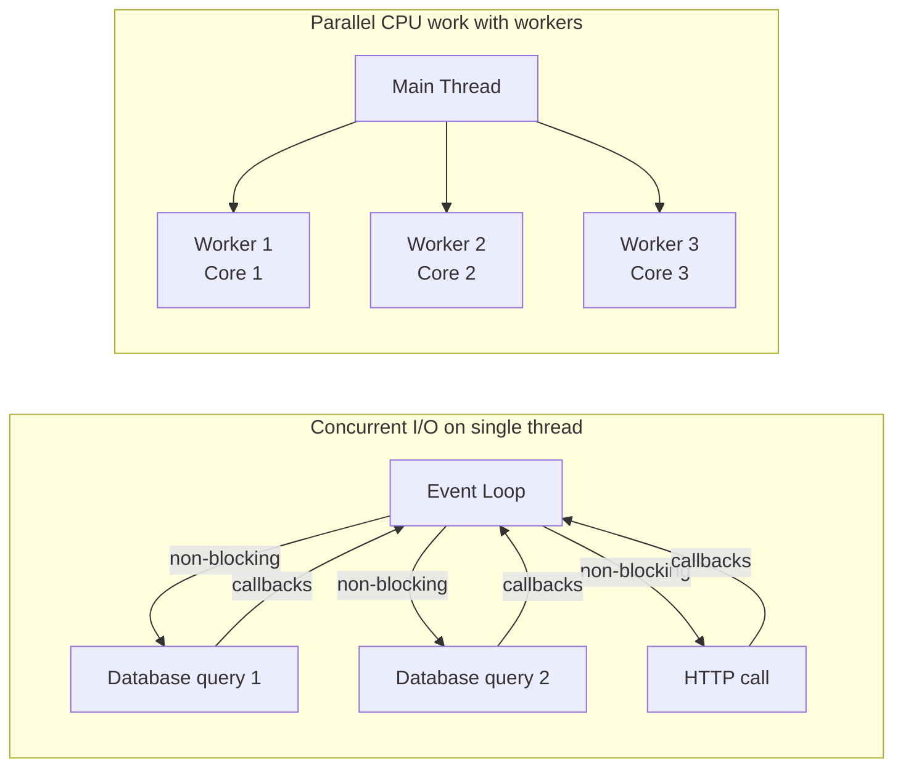
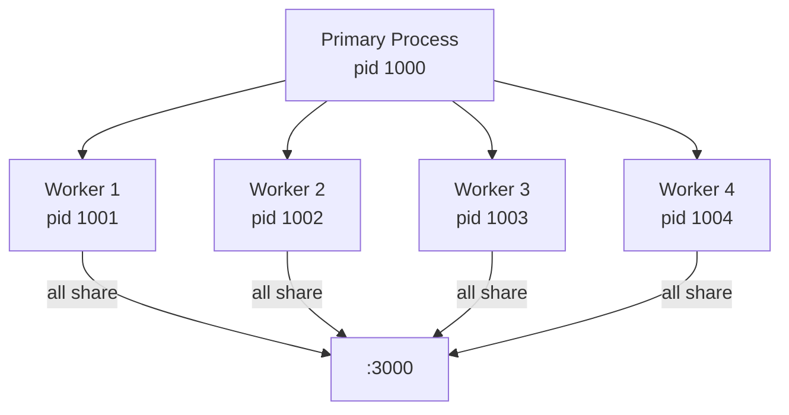

# Concurrency

Node.js is **concurrent but not parallel** by default. The event loop handles thousands of I/O operations concurrently on a single thread — but it cannot run JavaScript in parallel. When you need true parallelism (CPU-intensive work, taking advantage of multiple cores), you reach for worker threads or the cluster module.

---

## Concurrency vs Parallelism in Node.js



**The rule:** if it involves waiting (network, disk, database), the event loop handles it concurrently with no extra work. If it involves computing (parsing, compression, encryption), it blocks the event loop and must be moved to a worker thread.

---

## Promise Combinators

```javascript
// Promise.all — all must succeed, fail fast on first rejection
const [user, orders, preferences] = await Promise.all([
    userRepo.findById(userId),
    orderRepo.findByUser(userId),
    prefRepo.findByUser(userId)
]);
// If ANY rejects, the whole thing rejects

// Promise.allSettled — wait for all regardless of outcome
const results = await Promise.allSettled([
    enrichWithPrice(product),
    enrichWithReviews(product),
    enrichWithInventory(product)
]);
const enriched = results
    .filter(r => r.status === 'fulfilled')
    .reduce((acc, r) => ({ ...acc, ...r.value }), product);
// Partial enrichment — continues even if some services are down

// Promise.race — first to settle wins
const withTimeout = (promise, ms) => Promise.race([
    promise,
    new Promise((_, reject) =>
        setTimeout(() => reject(new Error('Timeout')), ms))
]);

// Promise.any — first to FULFILL wins (ignores rejections)
const fastestRegion = await Promise.any([
    fetchFromUSEast(),
    fetchFromEUWest(),
    fetchFromAPSoutheast()
]);
```

---

## Worker Threads in Depth

Worker threads share memory via `SharedArrayBuffer` and communicate via `postMessage`. Use a worker pool to avoid creating/destroying threads per request:

```javascript
// worker-pool.js — reusable pool of workers
import { Worker } from 'worker_threads';
import { cpus } from 'os';

const POOL_SIZE = cpus().length - 1; // leave one core for the event loop

class WorkerPool {
    #workers = [];
    #queue   = [];
    #taskQueue = [];

    constructor(workerFile) {
        for (let i = 0; i < POOL_SIZE; i++) {
            this.#addWorker(workerFile);
        }
    }

    #addWorker(file) {
        const worker = new Worker(file);
        worker.on('message', ({ id, result, error }) => {
            const task = this.#taskQueue.find(t => t.id === id);
            if (!task) return;
            this.#taskQueue = this.#taskQueue.filter(t => t.id !== id);
            error ? task.reject(new Error(error)) : task.resolve(result);
            this.#processQueue(worker);
        });
        this.#workers.push({ worker, busy: false });
    }

    run(data) {
        return new Promise((resolve, reject) => {
            const id = Math.random().toString(36).slice(2);
            this.#taskQueue.push({ id, resolve, reject });
            const freeWorker = this.#workers.find(w => !w.busy);
            if (freeWorker) {
                freeWorker.busy = true;
                freeWorker.worker.postMessage({ id, data });
            } else {
                this.#queue.push({ id, data });
            }
        });
    }

    #processQueue(workerEntry) {
        const next = this.#queue.shift();
        if (next) {
            workerEntry.worker.postMessage(next);
        } else {
            workerEntry.busy = false;
        }
    }
}

export const reportPool = new WorkerPool('./workers/report-generator.js');

// In your route:
app.get('/reports/:id', async (req, res) => {
    const report = await reportPool.run({ reportId: req.params.id });
    res.json(report);
});
```

---

## The Cluster Module

Cluster creates multiple Node.js processes sharing the same port. Each worker process has its own event loop and memory — true parallel execution across CPU cores:

```javascript
import cluster from 'cluster';
import { cpus } from 'os';
import { createServer } from './app.js';

if (cluster.isPrimary) {
    const numCPUs = cpus().length;
    console.log(`Primary ${process.pid} starting ${numCPUs} workers`);

    for (let i = 0; i < numCPUs; i++) {
        cluster.fork();
    }

    cluster.on('exit', (worker, code) => {
        console.log(`Worker ${worker.process.pid} died (${code}), restarting`);
        cluster.fork();  // auto-restart crashed workers
    });

} else {
    // Worker process — each runs its own Express/Fastify instance
    const app = await createServer();
    app.listen(3000, () =>
        console.log(`Worker ${process.pid} listening on :3000`));
}
```



> **Cluster vs Worker Threads:** Cluster = multiple processes, no shared memory, each has full Node.js instance. Worker Threads = threads within one process, can share memory via SharedArrayBuffer. Use Cluster for I/O-bound web servers. Use Worker Threads for CPU-bound computation within one server.

---

## Async Iterators

Async iterators are ideal for streaming large datasets without loading everything into memory:

```javascript
// Stream rows from PostgreSQL without loading all into memory
async function* getOrdersStream(customerId) {
    const cursor = db.query(
        'SELECT * FROM orders WHERE customer_id = $1 ORDER BY created_at',
        [customerId]
    ).cursor(100);  // 100 rows at a time

    for await (const rows of cursor) {
        for (const row of rows) {
            yield row;
        }
    }
}

// Consume the stream
for await (const order of getOrdersStream(customerId)) {
    await processOrder(order);  // never holds more than 100 rows in memory
}

// Transform with async generator pipeline
async function* enrichOrders(orders) {
    for await (const order of orders) {
        const product = await productCache.get(order.productId);
        yield { ...order, productName: product.name };
    }
}

async function* batchOrders(orders, size = 100) {
    let batch = [];
    for await (const order of orders) {
        batch.push(order);
        if (batch.length >= size) {
            yield batch;
            batch = [];
        }
    }
    if (batch.length > 0) yield batch;
}
```

---

## AsyncLocalStorage — Request-Scoped Context

`AsyncLocalStorage` is the Node.js equivalent of Java's `ThreadLocal` — it stores context that is automatically propagated through async call chains:

```javascript
import { AsyncLocalStorage } from 'async_hooks';

export const requestContext = new AsyncLocalStorage();

// Middleware: start a new context for each request
app.use((req, res, next) => {
    requestContext.run({
        requestId: req.headers['x-request-id'] ?? crypto.randomUUID(),
        userId:    req.user?.id,
        startTime: Date.now()
    }, next);
});

// Logger utility: reads context without threading it through every function
export const logger = {
    info(msg, data = {}) {
        const ctx = requestContext.getStore();
        console.log(JSON.stringify({
            level: 'info',
            msg,
            requestId: ctx?.requestId,
            userId:    ctx?.userId,
            ...data
        }));
    }
};

// Works automatically across await chains
async function processOrder(orderId) {
    logger.info('Processing order', { orderId });  // requestId automatically included
    const items = await itemRepo.findByOrder(orderId);
    logger.info('Items loaded', { count: items.length }); // same requestId
}
```
