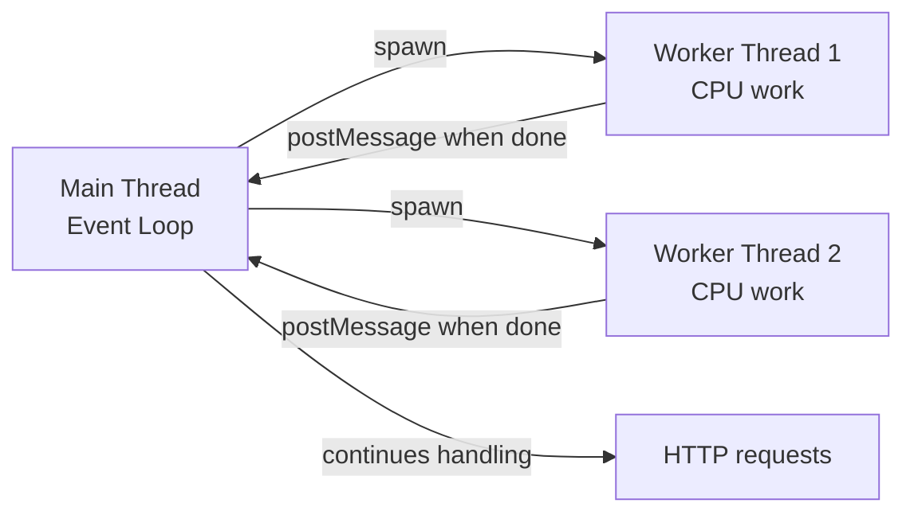

# Core Concepts

Mastering Node.js means understanding the primitives that all higher-level abstractions are built on: streams for handling data flow, EventEmitter for decoupled event-driven communication, and the async/await model that makes non-blocking code readable.

---

## Streams

Streams are the right abstraction for any data that arrives or is produced incrementally. Reading a 10 GB file with `fs.readFile` loads it all into memory. Reading it as a stream processes it chunk by chunk with constant memory:


### Four stream types

| Type | Direction | Examples |
|---|---|---|
| **Readable** | Source of data | `fs.createReadStream`, `http.IncomingMessage`, `process.stdin` |
| **Writable** | Sink for data | `fs.createWriteStream`, `http.ServerResponse`, `process.stdout` |
| **Transform** | Read + modify + write | `zlib.createGzip()`, `crypto.createCipheriv()` |
| **Duplex** | Bidirectional | TCP sockets, WebSocket connections |

```javascript
import { createReadStream, createWriteStream } from 'fs';
import { createGzip } from 'zlib';
import { pipeline } from 'stream/promises';

// pipeline handles backpressure and error propagation automatically
await pipeline(
    createReadStream('large-file.csv'),
    createGzip(),
    createWriteStream('large-file.csv.gz')
);

// Custom transform stream
import { Transform } from 'stream';

const csvToJson = new Transform({
    objectMode: true,
    transform(chunk, encoding, callback) {
        const line = chunk.toString();
        const [id, name, amount] = line.split(',');
        this.push({ id, name, amount: parseFloat(amount) });
        callback();
    }
});
```

---

## EventEmitter

`EventEmitter` is the backbone of Node.js's event-driven model. HTTP servers, streams, and the process object all extend it:

```javascript
import { EventEmitter } from 'events';

class OrderQueue extends EventEmitter {
    #orders = [];

    enqueue(order) {
        this.#orders.push(order);
        this.emit('order:added', order);     // notify all listeners
    }

    process() {
        if (this.#orders.length === 0) {
            this.emit('queue:empty');
            return;
        }
        const order = this.#orders.shift();
        this.emit('order:processing', order);
        // ... process ...
        this.emit('order:completed', order);
    }
}

const queue = new OrderQueue();

queue.on('order:added',     order => console.log('New order:', order.id));
queue.on('order:completed', order => notifyCustomer(order));
queue.once('queue:empty',   ()    => console.log('All orders done'));

// ALWAYS handle the 'error' event — unhandled emitter errors crash the process
queue.on('error', err => console.error('Queue error:', err));
```

---

## Async/Await Patterns

### Sequential vs parallel execution

```javascript
// SEQUENTIAL: waits for each before starting next (slow)
async function loadOrderData(orderId) {
    const order    = await orderRepo.findById(orderId);    // 100ms
    const customer = await customerRepo.findById(order.customerId); // 100ms
    const items    = await itemRepo.findByOrderId(orderId); // 100ms
    return { order, customer, items }; // total: ~300ms
}

// PARALLEL: all fire at once (fast)
async function loadOrderData(orderId) {
    const order = await orderRepo.findById(orderId);
    const [customer, items] = await Promise.all([
        customerRepo.findById(order.customerId),
        itemRepo.findByOrderId(orderId)
    ]);
    return { order, customer, items }; // total: ~100ms
}

// Promise.allSettled — wait for all, even if some fail
const results = await Promise.allSettled([
    enrichWithPrice(product),
    enrichWithStock(product)
]);
const prices = results.filter(r => r.status === 'fulfilled').map(r => r.value);
const errors = results.filter(r => r.status === 'rejected').map(r => r.reason);
```

### Error handling patterns

```javascript
// try/catch for async/await
async function createOrder(req, res) {
    try {
        const order = await orderService.create(req.body);
        res.status(201).json(order);
    } catch (err) {
        if (err.code === 'VALIDATION_ERROR') {
            res.status(400).json({ error: err.message });
        } else {
            res.status(500).json({ error: 'Internal server error' });
        }
    }
}

// Result pattern — avoids try/catch nesting
async function safeCreateOrder(data) {
    try {
        const order = await orderService.create(data);
        return { ok: true, value: order };
    } catch (err) {
        return { ok: false, error: err };
    }
}

const result = await safeCreateOrder(data);
if (!result.ok) {
    logger.error('Order creation failed', result.error);
    return;
}
// result.value is the order

// Global unhandled rejection handler — always add this
process.on('unhandledRejection', (reason, promise) => {
    logger.error('Unhandled rejection', { reason, promise });
    process.exit(1); // fail fast — do not continue with unknown state
});
```

---

## Worker Threads

For CPU-bound work, run it in a worker thread to avoid blocking the event loop:

```javascript
// main.js
import { Worker } from 'worker_threads';

function runInWorker(data) {
    return new Promise((resolve, reject) => {
        const worker = new Worker('./heavy-computation.js', {
            workerData: data
        });
        worker.on('message', resolve);
        worker.on('error',   reject);
        worker.on('exit', code => {
            if (code !== 0) reject(new Error(`Worker exited with code ${code}`));
        });
    });
}

// In your route handler
app.get('/report', async (req, res) => {
    const result = await runInWorker({ startDate: req.query.from });
    res.json(result);
});

// heavy-computation.js
import { workerData, parentPort } from 'worker_threads';

function computeReport(data) {
    // CPU-intensive work — runs on separate thread, doesn't block event loop
    return processMillionsOfRecords(data);
}

parentPort.postMessage(computeReport(workerData));
```


